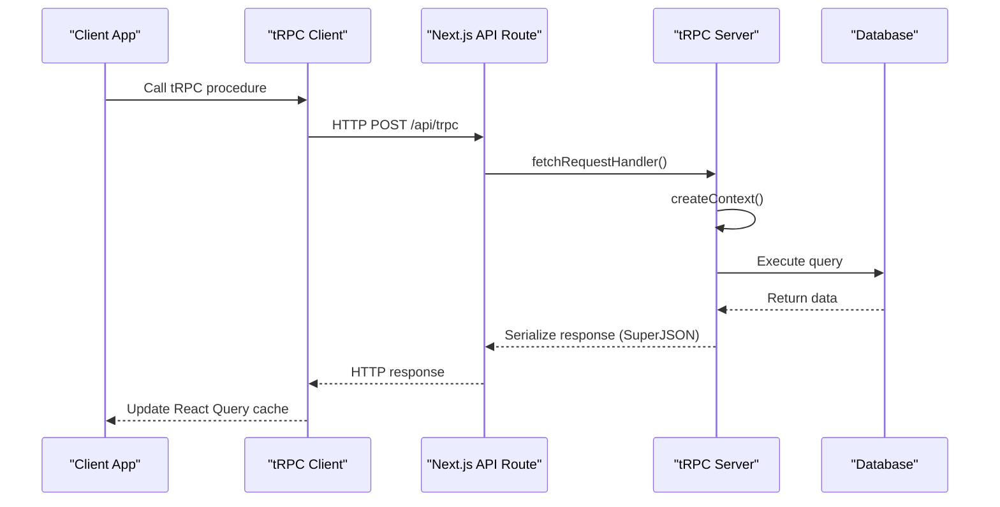
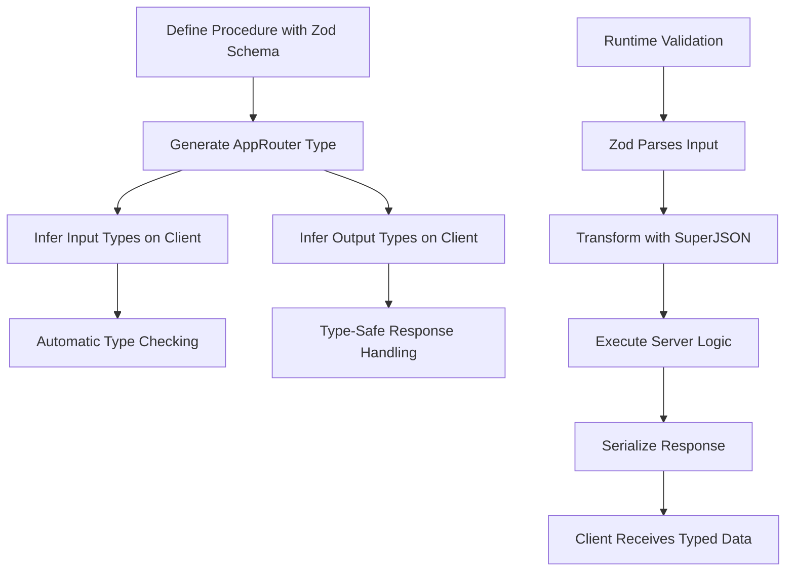
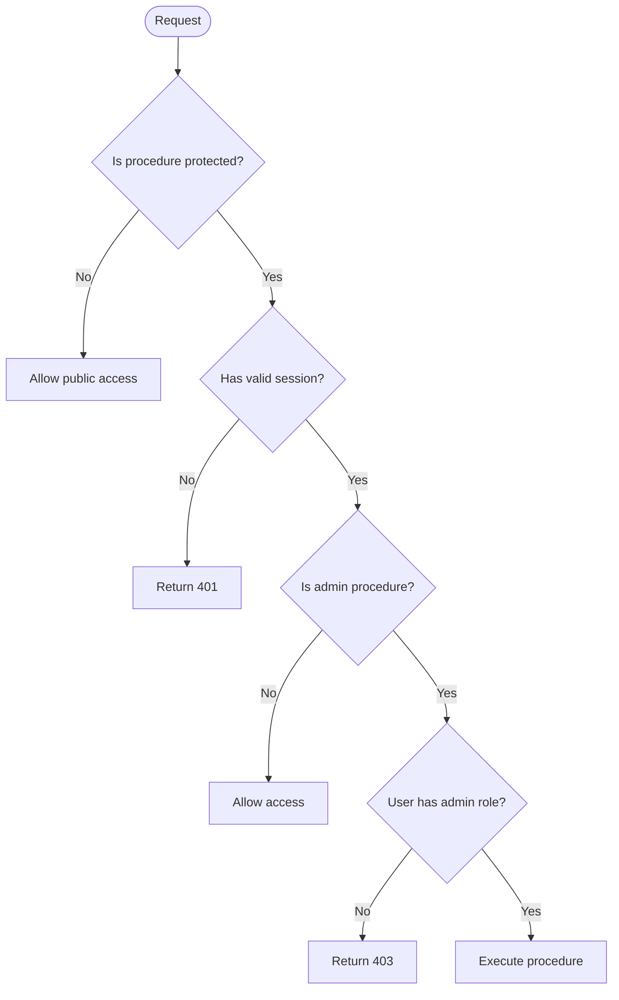
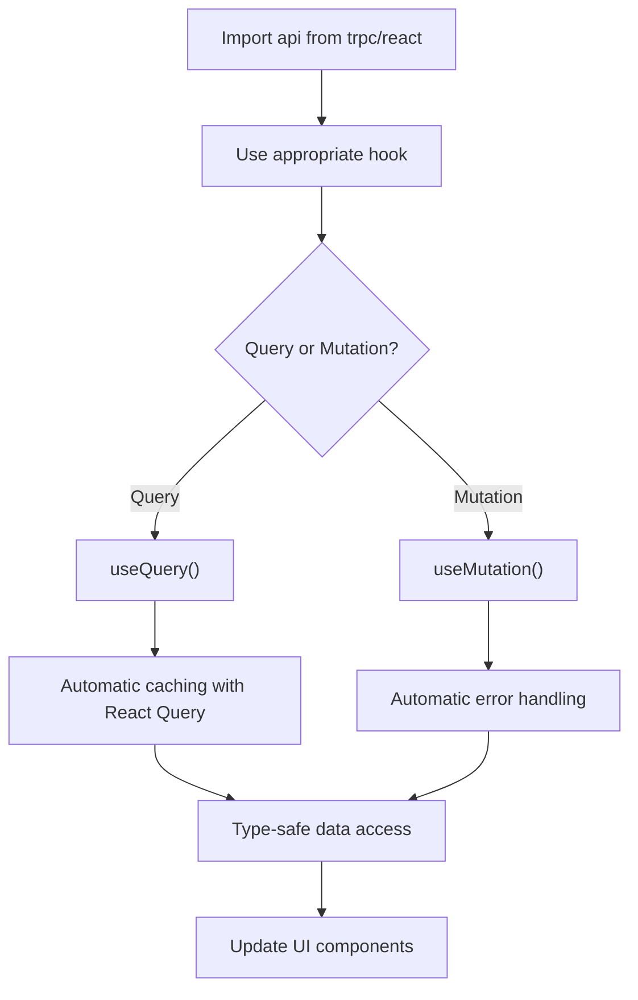
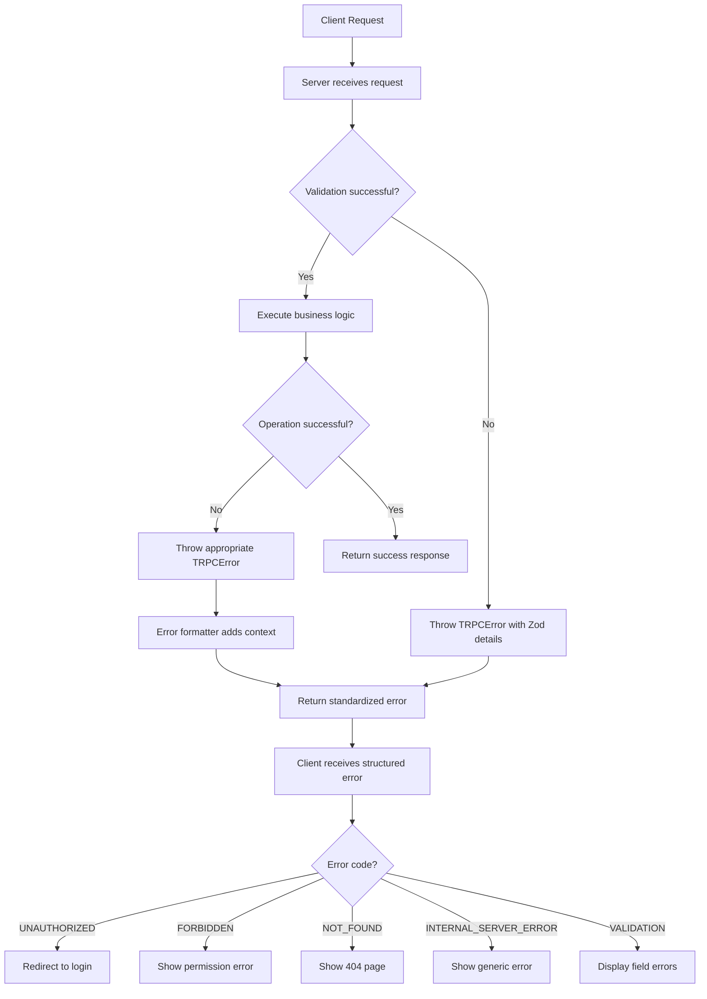
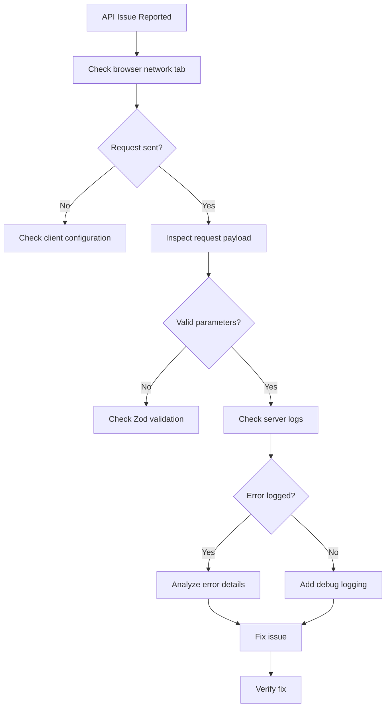

# API Reference

<cite>
**Referenced Files in This Document**   
- [districts.ts](file://src/server/api/routers/districts.ts)
- [organizations.ts](file://src/server/api/routers/organizations.ts)
- [root.ts](file://src/server/api/root.ts)
- [trpc.ts](file://src/server/api/trpc.ts)
- [react.tsx](file://src/trpc/react.tsx)
- [server.ts](file://src/trpc/server.ts)
- [route.ts](file://src/app/api/trpc/[trpc]/route.ts)
</cite>

## Table of Contents
1. [Introduction](#introduction)
2. [tRPC Request/Response Cycle](#trpc-requestresponse-cycle)
3. [Type Safety Benefits](#type-safety-benefits)
4. [Authentication Requirements](#authentication-requirements)
5. [Router: Districts](#router-districts)
6. [Router: Organizations](#router-organizations)
7. [Client-Side Invocation with tRPC Hooks](#client-side-invocation-with-trpc-hooks)
8. [Error Handling Patterns](#error-handling-patterns)
9. [Rate Limiting Considerations](#rate-limiting-considerations)
10. [Versioning Strategy](#versioning-strategy)
11. [Extending the API](#extending-the-api)
12. [Debugging Techniques](#debugging-techniques)
13. [Monitoring Approaches](#monitoring-approaches)

## Introduction
This document provides comprehensive API documentation for the tRPC endpoints in the pukpara application. The API is built using tRPC, a type-safe API framework for TypeScript that enables end-to-end typesafety between clients and servers. The primary routers documented are `districts` and `organizations`, which expose procedures for retrieving geographical and organizational data respectively. This documentation covers request parameters, response types, authentication requirements, client usage patterns, error handling, and operational considerations.

**Section sources**
- [root.ts](file://src/server/api/root.ts#L1-L38)
- [trpc.ts](file://src/server/api/trpc.ts#L1-L72)

## tRPC Request/Response Cycle
The tRPC request/response cycle in pukpara follows a standardized flow from client to server and back. On the client side, tRPC hooks initiate requests through the configured tRPC client. These requests are routed via the Next.js API route handler at `/api/trpc/[trpc]/route.ts`, which uses `fetchRequestHandler` to process incoming tRPC calls. The handler creates a context using `createTRPCContext`, which includes database access and session information. Procedures are then executed on the server, with responses serialized using SuperJSON (which supports complex types like dates and BigInts). The response travels back through the same HTTP adapter and is handled by React Query for caching and state management on the client.



**Diagram sources**
- [route.ts](file://src/app/api/trpc/[trpc]/route.ts#L1-L33)
- [trpc.ts](file://src/server/api/trpc.ts#L1-L72)
- [react.tsx](file://src/trpc/react.tsx#L1-L84)

**Section sources**
- [route.ts](file://src/app/api/trpc/[trpc]/route.ts#L1-L33)
- [trpc.ts](file://src/server/api/trpc.ts#L1-L72)
- [react.tsx](file://src/trpc/react.tsx#L1-L84)

## Type Safety Benefits
The tRPC implementation in pukpara provides comprehensive type safety across the entire stack. By defining procedures with Zod validation schemas, the system ensures that input parameters are validated at runtime while providing compile-time type inference. The `AppRouter` type exported from `root.ts` serves as a single source of truth for all API endpoints, enabling full end-to-end typesafety. Client code can use `inferRouterInputs` and `inferRouterOutputs` to automatically derive parameter and return types, eliminating the need for manual type definitions and preventing type mismatches between client and server. The SuperJSON transformer extends this type safety to complex JavaScript types that are not natively supported by JSON.



**Diagram sources**
- [root.ts](file://src/server/api/root.ts#L1-L38)
- [trpc.ts](file://src/server/api/trpc.ts#L1-L72)
- [react.tsx](file://src/trpc/react.tsx#L1-L84)

**Section sources**
- [root.ts](file://src/server/api/root.ts#L1-L38)
- [trpc.ts](file://src/server/api/trpc.ts#L1-L72)
- [react.tsx](file://src/trpc/react.tsx#L1-L84)

## Authentication Requirements
The API implements two authentication levels through procedure wrappers: `publicProcedure` and `protectedProcedure`. Public procedures, such as the districts list endpoint, require no authentication and are accessible to all users. Protected procedures require an authenticated session and are enforced by the `protectedProcedure` middleware, which validates the presence of a session user. For administrative operations on organizations, additional role-based access control is implemented within the procedure logic using the `ensurePlatformAdmin` function, which checks for specific admin roles ("admin", "supportAdmin", "userAc") in the session user's role set.



**Diagram sources**
- [trpc.ts](file://src/server/api/trpc.ts#L53-L70)
- [organizations.ts](file://src/server/api/routers/organizations.ts#L1-L419)

**Section sources**
- [trpc.ts](file://src/server/api/trpc.ts#L53-L70)
- [organizations.ts](file://src/server/api/routers/organizations.ts#L1-L419)

## Router: Districts
The districts router provides geographical data about regions and districts. It contains a single public procedure for listing all districts grouped by region.

### list Procedure
Retrieves all districts grouped by region with hierarchical organization.

**Request Parameters**
- None (no input required)

**Response Type**
```typescript
{
  regions: Array<{
    code: string;
    name: string;
    districts: Array<{
      id: string;
      name: string;
      code: string | null;
    }>;
  }>
}
```

The response is sorted alphabetically by region name and district name. Districts are nested within their respective regions, providing a hierarchical view of geographical data.

**Authentication**: Public (no authentication required)

**Section sources**
- [districts.ts](file://src/server/api/routers/districts.ts#L1-L67)

## Router: Organizations
The organizations router provides administrative functionality for managing organizations within the platform. All procedures in this router require authentication, and most require platform admin privileges.

### list Procedure
Retrieves a paginated list of organizations with summary information.

**Request Parameters**
- `page`: number (optional, default: 1) - Page number (1-indexed)
- `pageSize`: number (optional, default: 20, max: 100) - Number of items per page

**Response Type**
```typescript
{
  data: Array<{
    id: string;
    name: string;
    slug: string;
    status: string;
    kycStatus: string;
    type: string;
    createdAt: Date;
    contactEmail: string | null;
    contactPhone: string | null;
    regionName: string | null;
    districtName: string | null;
    memberCount: number;
    owner: {
      id: string;
      name: string | null;
      email: string | null;
    } | null;
    logo: null;
    subType: null;
    maxUsers: null;
    subscriptionType: null;
    licenseStatus: null;
  }>;
  page: number;
  pageSize: number;
  total: number;
}
```

**Authentication**: Protected (requires authenticated user with admin privileges)

### approve Procedure
Approves one or more organizations, updating their status to active and triggering approval emails to owners and admins.

**Request Parameters**
- `organizationIds`: string[] (required, min: 1) - Array of organization IDs to approve

**Response Type**
```typescript
{
  updated: number;
}
```

Returns the count of successfully updated organizations.

**Authentication**: Protected (requires authenticated user with admin privileges)

### delete Procedure
Deletes one or more organizations from the system.

**Request Parameters**
- `organizationIds`: string[] (required, min: 1) - Array of organization IDs to delete

**Response Type**
```typescript
{
  deleted: number;
}
```

Returns the count of successfully deleted organizations.

**Authentication**: Protected (requires authenticated user with admin privileges)

### detail Procedure
Retrieves detailed information about a specific organization including leadership members.

**Request Parameters**
- `organizationId`: string (required) - ID of the organization to retrieve

**Response Type**
```typescript
{
  organization: {
    id: string;
    name: string;
    slug: string;
    status: string;
    kycStatus: string;
    licenseStatus: string;
    subscriptionType: string | null;
    organizationType: string;
    organizationSubType: string | null;
    contactEmail: string | null;
    contactPhone: string | null;
    address: string | null;
    districtId: string | null;
    regionId: string;
    defaultCurrency: string | null;
    timezone: string | null;
    planRenewsAt: Date | null;
    maxUsers: number | null;
    createdAt: Date;
    metadata: unknown;
  };
  stats: {
    memberCount: number;
  };
  leadership: Array<{
    id: string;
    name: string | null;
    email: string | null;
    role: string;
  }>;
}
```

**Authentication**: Protected (requires authenticated user with admin privileges)

### subscriptions Procedure
Retrieves subscription statistics across all organizations.

**Request Parameters**
- None (no input required)

**Response Type**
```typescript
{
  totals: Array<{
    type: string;
    count: number;
  }>;
}
```

Returns a breakdown of organization counts by subscription type.

**Authentication**: Protected (requires authenticated user with admin privileges)

**Section sources**
- [organizations.ts](file://src/server/api/routers/organizations.ts#L1-L419)

## Client-Side Invocation with tRPC Hooks
Client-side invocation of tRPC procedures is facilitated through the `api` object exported from `src/trpc/react.tsx`. This object provides React hooks for each procedure, enabling seamless integration with React's component lifecycle and React Query's caching mechanisms.

### Setup Provider
The `TRPCReactProvider` component must wrap the application to provide the tRPC client context:

```tsx
<TRPCReactProvider>
  <App />
</TRPCReactProvider>
```

### Query Examples
```typescript
// Using districts list procedure
const { data, isLoading, error } = api.districts.list.useQuery();

// Using organizations list with parameters
const { data, isLoading } = api.organizations.list.useQuery({
  page: 1,
  pageSize: 20,
});

// Using organization detail
const { data, isLoading } = api.organizations.detail.useQuery({
  organizationId: "org_123",
});
```

### Mutation Examples
```typescript
// Approve organizations
const approveMutation = api.organizations.approve.useMutation();

approveMutation.mutate(
  { organizationIds: ["org_123", "org_456"] },
  {
    onSuccess: (result) => {
      console.log(`${result.updated} organizations approved`);
    },
    onError: (error) => {
      console.error("Approval failed:", error);
    },
  }
);

// Delete organizations
const deleteMutation = api.organizations.delete.useMutation();
deleteMutation.mutate({ organizationIds: ["org_123"] });
```

The hooks automatically handle loading states, error states, and caching, with built-in type safety ensuring that parameters and response data are correctly typed.



**Diagram sources**
- [react.tsx](file://src/trpc/react.tsx#L1-L84)

**Section sources**
- [react.tsx](file://src/trpc/react.tsx#L1-L84)

## Error Handling Patterns
The API implements comprehensive error handling patterns using tRPC's built-in error system and custom error formatting. All errors are standardized through the `errorFormatter` in the tRPC initialization, which includes Zod validation errors in the response payload when applicable. The system uses TRPCError with appropriate codes (e.g., "UNAUTHORIZED", "FORBIDDEN", "NOT_FOUND", "INTERNAL_SERVER_ERROR") to communicate error conditions to clients. Server-side procedures wrap database operations in try-catch blocks to prevent unhandled exceptions from crashing the server. The error formatter also includes flattened Zod errors for validation failures, enabling clients to display specific field-level validation messages.



**Diagram sources**
- [trpc.ts](file://src/server/api/trpc.ts#L1-L72)
- [organizations.ts](file://src/server/api/routers/organizations.ts#L1-L419)

**Section sources**
- [trpc.ts](file://src/server/api/trpc.ts#L1-L72)
- [organizations.ts](file://src/server/api/routers/organizations.ts#L1-L419)

## Rate Limiting Considerations
While the current implementation does not include explicit rate limiting, the architecture provides several opportunities for implementing rate limiting strategies. The tRPC middleware system could be extended to include rate limiting based on IP address or authentication token. Given that administrative operations on organizations are particularly sensitive, rate limiting should be prioritized for mutation procedures like `approve` and `delete`. A potential implementation could use Redis to track request counts per user or IP address, with sliding window or token bucket algorithms. Rate limiting headers (RateLimit-Limit, RateLimit-Remaining, RateLimit-Reset) should be included in responses when rate limiting is implemented to provide clients with clear feedback.

**Section sources**
- [trpc.ts](file://src/server/api/trpc.ts#L1-L72)

## Versioning Strategy
The current implementation does not include explicit API versioning. All endpoints are exposed under the same route without version prefixes. This approach simplifies the API surface but requires careful backward compatibility management when making changes. Future versioning could be implemented by introducing versioned routers (e.g., `v1OrganizationsRouter`, `v2OrganizationsRouter`) and including version information in the AppRouter. Alternatively, content negotiation via Accept headers could be used to serve different response formats or structures. For breaking changes, a parallel versioning approach is recommended, maintaining both old and new versions for a migration period before deprecating the older version.

**Section sources**
- [root.ts](file://src/server/api/root.ts#L1-L38)

## Extending the API
To extend the API with new endpoints, follow these steps:

1. Create a new router file in `src/server/api/routers/`
2. Define procedures using `publicProcedure` or `protectedProcedure` with appropriate input validation using Zod
3. Export the router from the file
4. Import and register the router in `src/server/api/root.ts` within the `appRouter` definition

When creating new endpoints, maintain type consistency by:
- Using existing type definitions and constants where possible
- Creating shared Zod schemas for common data structures
- Following consistent naming conventions for procedures and parameters
- Ensuring response structures are predictable and well-documented

For new entity types, consider creating corresponding input and output type definitions using `inferRouterInputs` and `inferRouterOutputs` to ensure type safety across the application.

**Section sources**
- [root.ts](file://src/server/api/root.ts#L1-L38)
- [trpc.ts](file://src/server/api/trpc.ts#L1-L72)

## Debugging Techniques
Effective debugging of API issues involves several techniques:

1. **Server-Side Logging**: The timing middleware in `trpc.ts` logs the execution time of each procedure, helping identify performance bottlenecks.

2. **Error Monitoring**: In development, the `onError` handler in the API route logs detailed error information, including the path and error message.

3. **tRPC Logger Link**: The client-side loggerLink provides visibility into tRPC operations, logging failed operations in development.

4. **Database Query Inspection**: Use database logging or query inspection tools to verify that generated SQL queries match expectations.

5. **Input Validation Debugging**: When validation fails, examine the `zodError` field in the response data to identify which fields failed validation and why.

6. **Network Inspection**: Use browser developer tools to inspect the actual HTTP requests and responses, including headers and payload structure.

7. **Type Checking**: Leverage TypeScript's type checking to catch potential issues before runtime.



**Diagram sources**
- [trpc.ts](file://src/server/api/trpc.ts#L1-L72)
- [route.ts](file://src/app/api/trpc/[trpc]/route.ts#L1-L33)

**Section sources**
- [trpc.ts](file://src/server/api/trpc.ts#L1-L72)
- [route.ts](file://src/app/api/trpc/[trpc]/route.ts#L1-L33)

## Monitoring Approaches
The current implementation includes basic monitoring through console logging of procedure execution times. For production monitoring, consider implementing:

1. **Structured Logging**: Replace console.log with a structured logging solution that can be ingested by monitoring platforms.

2. **Application Performance Monitoring (APM)**: Integrate with APM tools to track procedure execution times, error rates, and database query performance.

3. **Error Tracking**: Implement error tracking services to capture and aggregate TRPCError instances.

4. **Health Checks**: Create dedicated health check endpoints to monitor API availability.

5. **Metrics Collection**: Collect metrics on procedure invocation rates, success/failure ratios, and response times.

6. **Audit Logging**: For administrative operations like organization approval and deletion, implement audit logging to track who performed what action and when.

The existing timing middleware provides a foundation for performance monitoring, but should be enhanced to export metrics to external monitoring systems in production environments.

**Section sources**
- [trpc.ts](file://src/server/api/trpc.ts#L1-L72)