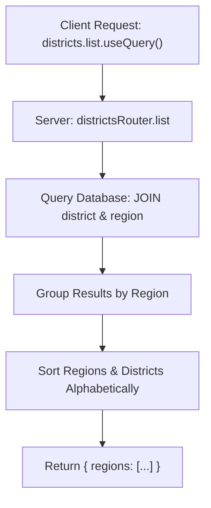
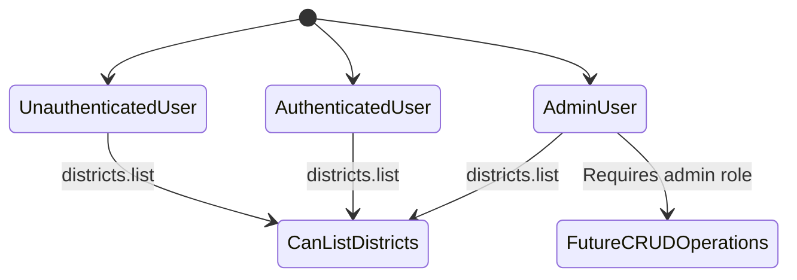
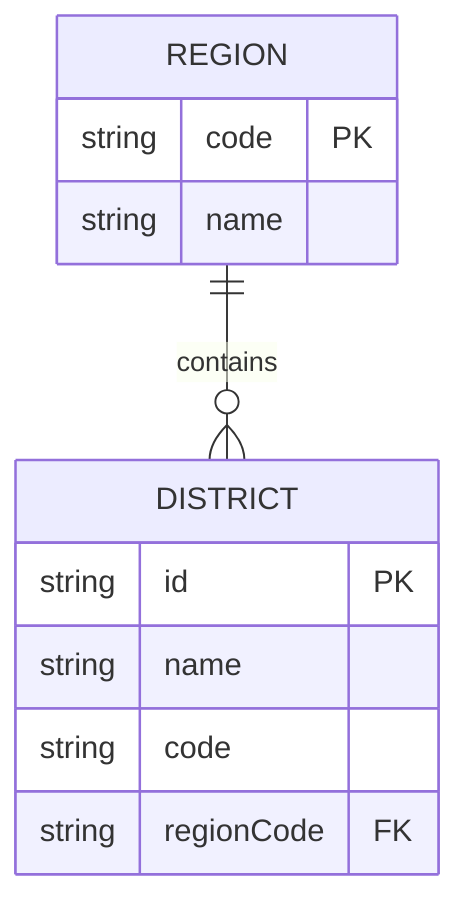
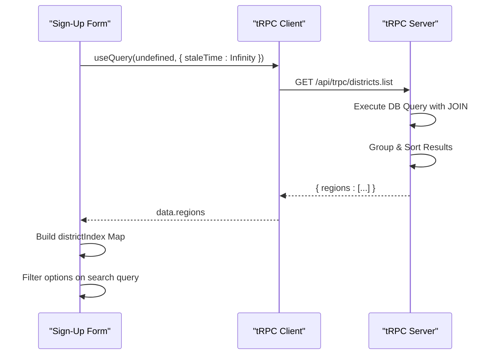
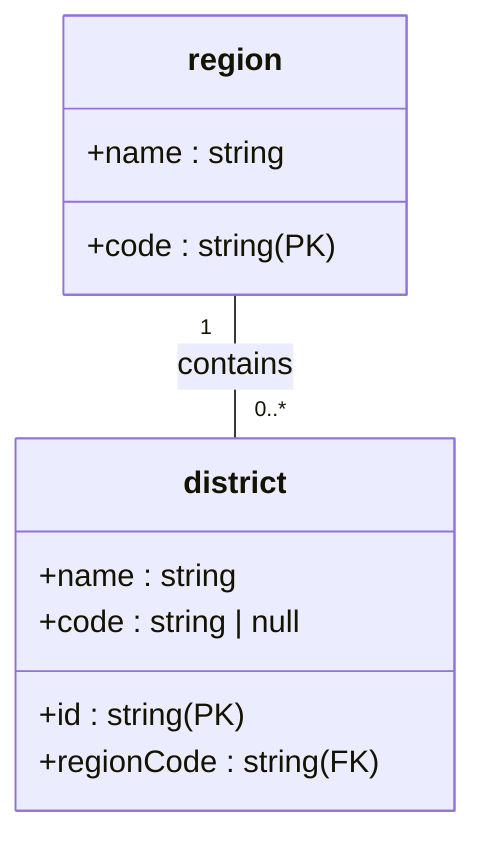

# Districts API

<cite>
**Referenced Files in This Document**   
- [districts.ts](file://src/server/api/routers/districts.ts)
- [schema.ts](file://src/server/db/schema.ts)
- [seed-districts.ts](file://scripts/seed-districts.ts)
- [step-two-form.tsx](file://src/features/auth/components/sign-up/step-two-form.tsx)
- [admin-permissions.ts](file://src/lib/admin-permissions.ts)
- [page.tsx](file://src/app/(admin)/admin/settings/reference/districts/page.tsx)
- [root.ts](file://src/server/api/root.ts)
</cite>

## Table of Contents
1. [Introduction](#introduction)
2. [Available Procedures](#available-procedures)
3. [Request Parameters and Response Schemas](#request-parameters-and-response-schemas)
4. [Authentication and Authorization](#authentication-and-authorization)
5. [Integration with Reference Data Management](#integration-with-reference-data-management)
6. [Client-Side Usage with tRPC Hooks](#client-side-usage-with-trpc-hooks)
7. [Use Cases in Organization Setup and Farmer Registration](#use-cases-in-organization-setup-and-farmer-registration)
8. [Error Handling Scenarios](#error-handling-scenarios)
9. [Extending the Router](#extending-the-router)
10. [Database Schema and Performance Optimization](#database-schema-and-performance-optimization)

## Introduction
The Districts tRPC router in pukpara provides a centralized API for accessing hierarchical geographic reference data used across the platform. It enables clients to retrieve structured lists of districts grouped by their parent regions, which are essential for organization setup, farmer registration, and location-based data entry. The API is designed to support efficient client-side filtering and selection while maintaining consistency with the underlying reference data model.

**Section sources**
- [districts.ts](file://src/server/api/routers/districts.ts#L1-L65)
- [page.tsx](file://src/app/(admin)/admin/settings/reference/districts/page.tsx#L1-L29)

## Available Procedures
The `districtsRouter` currently exposes a single public procedure:

- **list**: Retrieves all districts grouped by their parent regions, sorted alphabetically. The response includes district IDs, names, codes, and associated region information.

No CRUD operations (create, update, delete) are currently exposed through this router. All district data is managed via administrative interfaces or seeding scripts.



**Diagram sources**
- [districts.ts](file://src/server/api/routers/districts.ts#L10-L65)

**Section sources**
- [districts.ts](file://src/server/api/routers/districts.ts#L10-L65)

## Request Parameters and Response Schemas
### Request Parameters
The `list` procedure accepts no input parameters.

### Response Schema
The successful response follows this structure:
```json
{
  "regions": [
    {
      "code": "string",
      "name": "string",
      "districts": [
        {
          "id": "string",
          "name": "string",
          "code": "string | null"
        }
      ]
    }
  ]
}
```

Each region contains its code and name, with an array of associated districts. District codes may be null. The entire result set is sorted first by region name, then by district name within each region.

**Section sources**
- [districts.ts](file://src/server/api/routers/districts.ts#L10-L65)

## Authentication and Authorization
The `list` procedure uses `publicProcedure`, meaning it does **not** require authentication. This allows unauthenticated users to access district data during sign-up flows and public-facing forms.

However, administrative management of district data (creation, updates, deletion) is restricted to users with the **admin** role. This is enforced through the access control system defined in `admin-permissions.ts`. While the current API does not expose write operations, any future extensions would require proper role-based access checks.



**Diagram sources**
- [districts.ts](file://src/server/api/routers/districts.ts#L10-L65)
- [admin-permissions.ts](file://src/lib/admin-permissions.ts#L1-L57)

**Section sources**
- [districts.ts](file://src/server/api/routers/districts.ts#L10-L65)
- [admin-permissions.ts](file://src/lib/admin-permissions.ts#L1-L57)

## Integration with Reference Data Management
The Districts router integrates with the reference data management system in the admin settings under **Settings > Reference > Districts**. The admin interface at `/admin/settings/reference/districts` provides a placeholder for managing district entries, though full CRUD functionality is not yet implemented.

District data is seeded during initialization via `seed-districts.ts`, which populates both the `region` and `district` tables using predefined Ghanaian administrative divisions. The data model establishes a foreign key relationship from `district.regionCode` to `region.code` with cascade deletion, ensuring referential integrity.



**Diagram sources**
- [schema.ts](file://src/server/db/schema.ts#L1-L39)
- [seed-districts.ts](file://scripts/seed-districts.ts#L1-L410)

**Section sources**
- [schema.ts](file://src/server/db/schema.ts#L1-L39)
- [seed-districts.ts](file://scripts/seed-districts.ts#L1-L410)
- [page.tsx](file://src/app/(admin)/admin/settings/reference/districts/page.tsx#L1-L29)

## Client-Side Usage with tRPC Hooks
The `list` procedure is consumed client-side using the tRPC hook `api.districts.list.useQuery()`. A primary use case is in the user sign-up flow, specifically in `step-two-form.tsx`, where district data is fetched to populate a searchable dropdown.

The query uses `staleTime: Number.POSITIVE_INFINITY` because district data is static and rarely changes, making it safe to cache indefinitely. The component processes the response to create a flat index of district options for efficient searching by both district and region names.



**Diagram sources**
- [step-two-form.tsx](file://src/features/auth/components/sign-up/step-two-form.tsx#L132-L182)
- [districts.ts](file://src/server/api/routers/districts.ts#L10-L65)

**Section sources**
- [step-two-form.tsx](file://src/features/auth/components/sign-up/step-two-form.tsx#L132-L182)

## Use Cases in Organization Setup and Farmer Registration
District data plays a critical role in two key workflows:

1. **Farmer Registration**: During sign-up, users select their district, which is stored in the `user.districtId` field. This enables location-based segmentation, reporting, and service delivery.

2. **Organization Setup**: Organizations are associated with a district via `organization.districtId` and region via `organization.regionId`. This linkage supports regional analytics, compliance, and operational planning.

The hierarchical structure (Region > District) ensures consistent geographic categorization across the platform, enabling features like regional dashboards and territory-based access controls.

**Section sources**
- [schema.ts](file://src/server/db/schema.ts#L1-L39)
- [step-two-form.tsx](file://src/features/auth/components/sign-up/step-two-form.tsx#L132-L182)

## Error Handling Scenarios
While the current implementation does not explicitly handle error cases in the `list` procedure, potential scenarios include:

- **Database Connection Failure**: Would result in a 500 Internal Server Error
- **Invalid District ID References**: Prevented by foreign key constraints; orphaned references would return null
- **Permission Denied**: Not applicable to `list` (public), but would apply to any future admin-only procedures

Client components should handle `isError` and `isLoading` states appropriately, as demonstrated in `step-two-form.tsx` where loading states disable the selector and errors are captured in component state.

**Section sources**
- [step-two-form.tsx](file://src/features/auth/components/sign-up/step-two-form.tsx#L132-L182)
- [districts.ts](file://src/server/api/routers/districts.ts#L10-L65)

## Extending the Router
To extend the router with new procedures (e.g., `create`, `update`, `delete`), follow these guidelines:

1. **Authentication**: Use `protectedProcedure` and enforce `admin` role using the access control system.
2. **Type Safety**: Leverage Zod for input validation and Drizzle ORM types for database operations.
3. **Performance**: Ensure proper indexing on frequently queried fields (`district.regionCode`, `district.name`).
4. **Consistency**: Maintain the same response structure and sorting behavior.

Example extension pattern:
```ts
create: protectedProcedure
  .input(z.object({ name: z.string(), code: z.string(), regionCode: z.string() }))
  .mutation(async ({ input, ctx }) => {
    // Check admin role
    // Insert into DB
    // Return created record
  })
```

**Section sources**
- [districts.ts](file://src/server/api/routers/districts.ts#L10-L65)
- [admin-permissions.ts](file://src/lib/admin-permissions.ts#L1-L57)

## Database Schema and Performance Optimization
The district data model is defined in `schema.ts` with the following key aspects:

- **Primary Keys**: `district.id` (text) and `region.code` (text)
- **Foreign Key**: `district.regionCode` references `region.code` with `ON DELETE CASCADE`
- **Indexes**: Implied by primary and foreign key constraints

For performance optimization:
- Ensure `district.regionCode` is indexed (already enforced by FK)
- Consider adding a composite index on `(region_code, name)` for faster sorting
- Use `staleTime: Infinity` on client queries for static reference data

The current query performs a JOIN between `district` and `region`, ordered by region and district names, which benefits from appropriate indexing on the `name` fields.



**Diagram sources**
- [schema.ts](file://src/server/db/schema.ts#L1-L39)

**Section sources**
- [schema.ts](file://src/server/db/schema.ts#L1-L39)
- [districts.ts](file://src/server/api/routers/districts.ts#L10-L65)