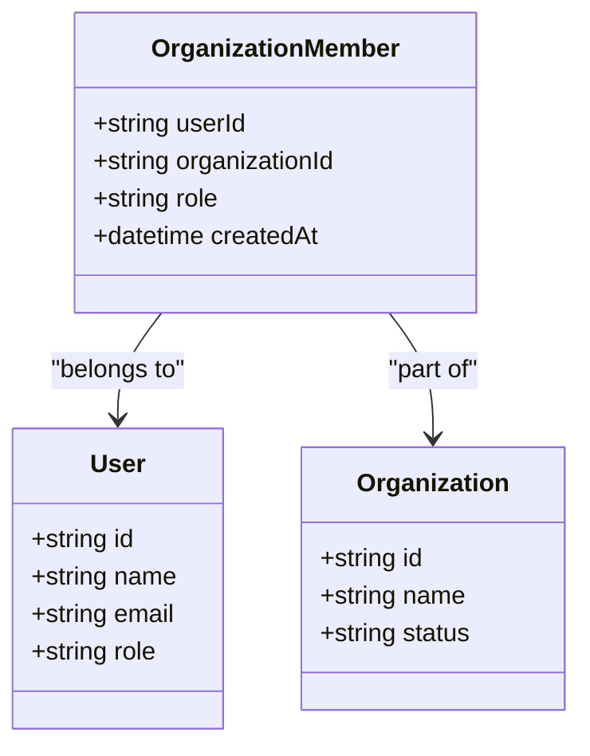
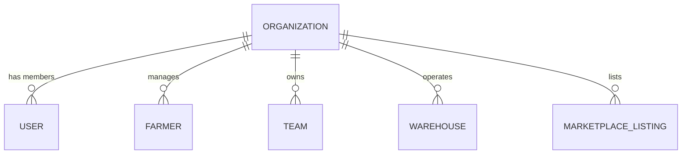
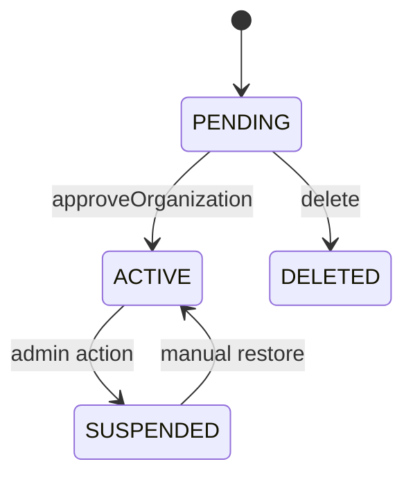
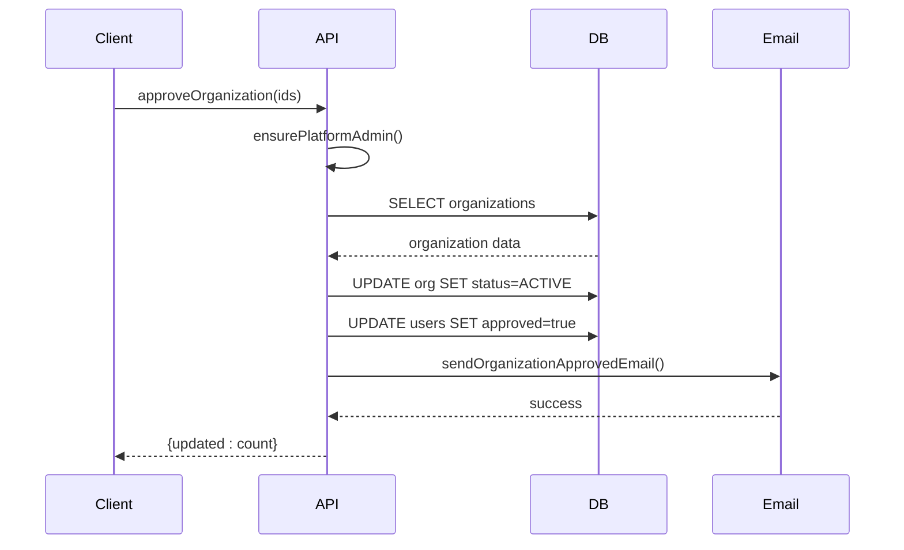

# Organizations API

<cite>
**Referenced Files in This Document**   
- [organizations.ts](file://src/server/api/routers/organizations.ts)
- [org-permissions.ts](file://src/lib/org-permissions.ts)
- [auth-organization-utils.ts](file://src/lib/auth-organization-utils.ts)
- [schema.ts](file://src/server/db/schema.ts)
</cite>

## Table of Contents
1. [Introduction](#introduction)
2. [Core Endpoints](#core-endpoints)
3. [Membership Management](#membership-management)
4. [Multi-Tenancy and Data Isolation](#multi-tenancy-and-data-isolation)
5. [Approval Workflow](#approval-workflow)
6. [Error Conditions](#error-conditions)
7. [Client Usage Examples](#client-usage-examples)
8. [Best Practices](#best-practices)

## Introduction
The Organizations tRPC router in pukpara provides a secure, role-based API for managing tenant organizations within a multi-tenant SaaS platform. It supports full lifecycle operations including creation, listing, updating, and deletion of organizations, with strict access control enforced through platform admin and organization-level permissions. The API integrates with a robust approval workflow to ensure compliance and data integrity before organizations become active. This documentation details all available procedures, their parameters, response types, permission requirements, and implementation patterns.

**Section sources**
- [organizations.ts](file://src/server/api/routers/organizations.ts#L1-L418)

## Core Endpoints

### createOrganization
Creates a new organization with associated metadata and initializes the owner membership.

**Request Parameters**
- `name`: string, required, must be unique
- `slug`: string, optional, URL-friendly identifier
- `organizationType`: string, required, from `ORGANIZATION_TYPE` enum
- `contactEmail`, `contactPhone`, `address`, `districtId`, `regionId`: optional metadata

**Validation Rules**
- Name must not be empty and must be unique across organizations
- Slug must be URL-safe; auto-generated if not provided
- Organization type must be valid per system constants
- Contact email must be a valid email format

**Response Type**
```ts
{
  organization: Organization;
  stats: { memberCount: number };
  leadership: Array<{ id: string; name: string; email: string; role: string }>;
}
```

**Required Permissions**
Platform admin access required (`admin`, `supportAdmin`, or `userAc` roles).

**Section sources**
- [organizations.ts](file://src/server/api/routers/organizations.ts#L1-L418)
- [auth-organization-utils.ts](file://src/lib/auth-organization-utils.ts#L1-L216)

### getOrganizationById
Retrieves detailed information about a specific organization by ID.

**Request Parameters**
- `organizationId`: string, required, must be valid UUID

**Response Type**
Returns organization details including metadata, stats, and leadership team.

**Required Permissions**
Platform admin access required.

**Section sources**
- [organizations.ts](file://src/server/api/routers/organizations.ts#L230-L298)

### updateOrganization
Updates organization details such as contact information, address, and subscription settings.

**Request Parameters**
- `organizationId`: string, required
- Any subset of organization fields to update

**Validation Rules**
- Organization must exist
- Fields must pass schema validation
- Updates to status/license require special permissions

**Required Permissions**
Organization owner or admin, plus platform admin for sensitive fields.

### listOrganizations
Retrieves paginated list of all organizations with summary information.

**Request Parameters**
- `page`: number, default 1
- `pageSize`: number, default 20, max 100

**Response Type**
```ts
{
  data: Array<OrganizationSummary>;
  page: number;
  pageSize: number;
  total: number;
}
```

**Required Permissions**
Platform admin access required.

**Section sources**
- [organizations.ts](file://src/server/api/routers/organizations.ts#L50-L114)

### approveOrganization
Activates pending organizations and triggers onboarding emails.

**Request Parameters**
- `organizationIds`: string[], required, non-empty array

**Workflow**
1. Validates all organizations exist and are in PENDING status
2. Updates status to ACTIVE
3. Approves all member users
4. Sends onboarding emails to owners and admins
5. Returns count of updated organizations

**Required Permissions**
Platform admin access required.

**Section sources**
- [organizations.ts](file://src/server/api/routers/organizations.ts#L116-L228)

## Membership Management

### Roles and Permissions
The system implements a role-based access control (RBAC) model with predefined roles:



**Diagram sources**
- [schema.ts](file://src/server/db/schema.ts#L200-L250)

**Available Roles**
- `owner`: Full organization control
- `admin`: Administrative privileges
- `member`: Basic access
- `fieldAgent`: Limited field operations

**Permission Matrix**
| Feature | Owner | Admin | Member | Field Agent |
|-------|-------|-------|--------|-------------|
| Update Org | ✅ | ✅ | ❌ | ❌ |
| Manage Users | ✅ | ✅ | ❌ | ❌ |
| View Farmers | ✅ | ✅ | ✅ | ✅ |
| Record Savings | ✅ | ✅ | ❌ | ✅ |

**Section sources**
- [org-permissions.ts](file://src/lib/org-permissions.ts#L1-L85)

## Multi-Tenancy and Data Isolation

### Data Isolation Model
The system enforces strict data isolation using organizationId as a tenant identifier across all domain entities.



**Diagram sources**
- [schema.ts](file://src/server/db/schema.ts#L200-L800)

### Enforcement Mechanism
- All queries must include organizationId in WHERE clauses
- Row-level security policies enforce tenant boundaries
- Foreign keys reference organization.id across related tables
- API procedures validate organizationId against session context

**Section sources**
- [schema.ts](file://src/server/db/schema.ts#L200-L800)

## Approval Workflow

### Status Transitions


**Diagram sources**
- [organizations.ts](file://src/server/api/routers/organizations.ts#L116-L228)

### Integration Points
1. **User Approval**: All member users are approved when organization is approved
2. **Email Notifications**: Onboarding emails sent to owners and admins
3. **Session Initialization**: Active organization set in user session
4. **Audit Logging**: All status changes are recorded

**Section sources**
- [organizations.ts](file://src/server/api/routers/organizations.ts#L116-L228)

## Error Conditions

### Common Error Cases
| Error | Cause | Resolution |
|------|------|------------|
| Duplicate name | Organization name already exists | Choose unique name |
| Invalid license | License status not permitted | Verify license credentials |
| Quota exceeded | Max users limit reached | Upgrade subscription or remove users |
| Not found | Invalid organizationId | Verify ID exists |
| Forbidden | Insufficient permissions | Check user role |

### Validation Rules
- Names must be 1-100 characters
- Slugs must be URL-safe (a-z, 0-9, hyphens)
- Contact emails must be valid format
- District/region IDs must reference valid entries

**Section sources**
- [organizations.ts](file://src/server/api/routers/organizations.ts#L1-L418)
- [schema.ts](file://src/server/db/schema.ts#L200-L250)

## Client Usage Examples

### Server-Side Logic


**Diagram sources**
- [organizations.ts](file://src/server/api/routers/organizations.ts#L116-L228)

### tRPC Client Usage
```ts
// List organizations
const { data } = trpc.organizations.list.useQuery({ page: 1 });

// Approve multiple organizations
const approve = trpc.organizations.approve.useMutation();
await approve.mutate({ organizationIds: [id1, id2] });
```

**Section sources**
- [organizations.ts](file://src/server/api/routers/organizations.ts#L1-L418)

## Best Practices

### Secure API Extension
1. **Always validate input** using zod schemas
2. **Enforce permission checks** at procedure entry
3. **Use transactions** for multi-table operations
4. **Log sensitive operations** for audit purposes
5. **Validate organizationId** against session context
6. **Implement rate limiting** for public endpoints
7. **Sanitize output** to prevent information leakage

### Compliance Requirements
- Maintain audit trail of all organization changes
- Log approval actions with user context
- Retain records for minimum 7 years
- Implement soft deletes for data recovery
- Ensure GDPR/CCPA compliance for user data

**Section sources**
- [organizations.ts](file://src/server/api/routers/organizations.ts#L1-L418)
- [org-permissions.ts](file://src/lib/org-permissions.ts#L1-L85)