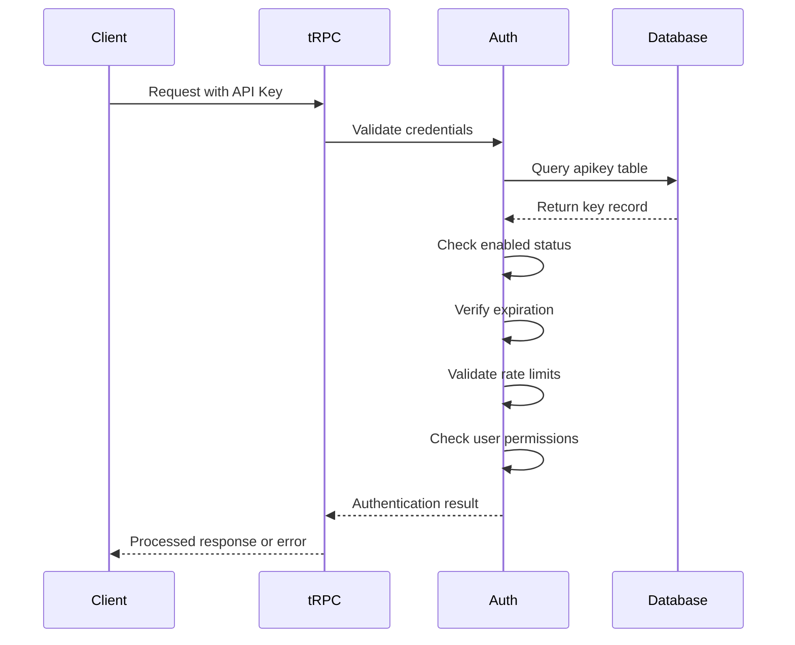
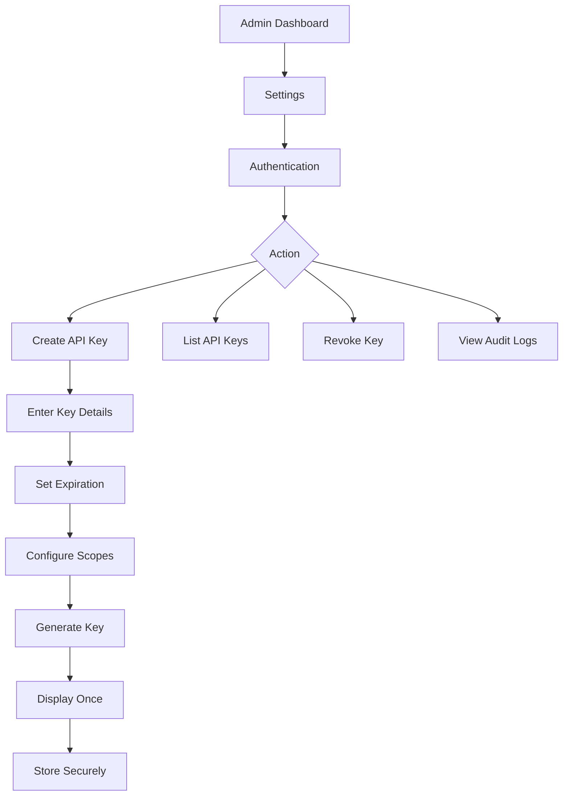
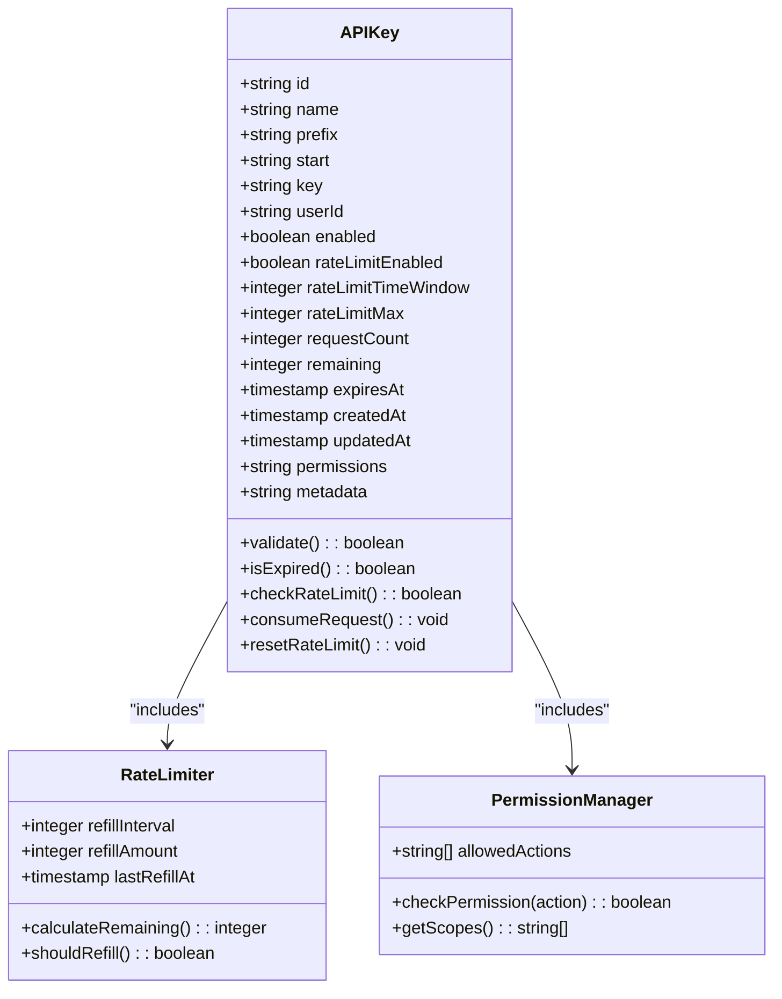

# API Key Management

<cite>
**Referenced Files in This Document**   
- [auth-admin-client.ts](file://src/lib/auth-admin-client.ts)
- [organizations.ts](file://src/server/api/routers/organizations.ts)
- [auth.ts](file://src/lib/auth.ts)
- [schema.ts](file://src/server/db/schema.ts)
- [page.tsx](file://src/app/(admin)/admin/settings/auth/page.tsx)
</cite>

## Table of Contents
1. [Introduction](#introduction)
2. [API Key Generation and Storage](#api-key-generation-and-storage)
3. [Backend Validation Logic](#backend-validation-logic)
4. [Admin UI Flow for API Key Management](#admin-ui-flow-for-api-key-management)
5. [Key Expiration, Scopes, and Rate Limiting](#key-expiration-scopes-and-rate-limiting)
6. [Usage Examples and Security Best Practices](#usage-examples-and-security-best-practices)
7. [Common Issues and Rotation Strategies](#common-issues-and-rotation-strategies)
8. [Conclusion](#conclusion)

## Introduction
The pukpara platform implements a robust API key management system to enable secure programmatic access to its tRPC endpoints. This system supports generation, validation, and lifecycle management of API keys with comprehensive security controls including encryption at rest, audit logging, rate limiting, and scoped permissions. The implementation leverages Better-Auth's apiKey plugin and integrates with the organization-based permission model to ensure least-privilege access.

**Section sources**
- [auth.ts](file://src/lib/auth.ts#L0-L52)
- [schema.ts](file://src/server/db/schema.ts#L226-L252)

## API Key Generation and Storage
API keys in pukpara are generated through the Better-Auth framework's apiKey plugin, which is configured during the authentication initialization process. When enabled, the system automatically handles key creation, hashing, and secure storage.

Keys are stored in the `apikey` table with sensitive data encrypted at rest. The schema includes fields for key identification (id, name, prefix, start), ownership (userId), status controls (enabled), and metadata for audit purposes. The actual key value is stored in the `key` field and is never exposed in plaintext after creation.

Key generation follows security best practices by using cryptographically secure random generators and storing only hashed versions in the database. Each key contains a prefix for identification and a randomized secret portion that is combined to form the complete credential.

```mermaid
erDiagram
apikey {
string id PK
string name
string start
string prefix
string key NOT NULL
string user_id FK
integer refill_interval
integer refill_amount
timestamp last_refill_at
boolean enabled DEFAULT true
boolean rate_limit_enabled DEFAULT true
integer rate_limit_time_window DEFAULT 86400000
integer rate_limit_max DEFAULT 10
integer request_count DEFAULT 0
integer remaining
timestamp last_request
timestamp expires_at
timestamp created_at NOT NULL
timestamp updated_at NOT NULL
string permissions
string metadata
}
user ||--o{ apikey : "owns"
```

**Diagram sources**
- [schema.ts](file://src/server/db/schema.ts#L226-L252)

**Section sources**
- [auth.ts](file://src/lib/auth.ts#L0-L52)
- [schema.ts](file://src/server/db/schema.ts#L226-L252)

## Backend Validation Logic
API key validation occurs at the tRPC middleware level through the authentication system. When a request is received, the auth middleware extracts the API key from the authorization header and validates it against the stored credentials in the database.

The validation process includes checking:
- Key existence and active status (enabled = true)
- Expiration status (expiresAt > current time)
- Rate limiting constraints (requestCount within limits)
- User account status and permissions

The system uses the protectedProcedure middleware which ensures that only authenticated requests proceed to the organization routers. This middleware integrates with the Better-Auth session system to provide consistent authentication across both user sessions and API key access.



**Diagram sources**
- [auth.ts](file://src/lib/auth.ts#L0-L52)
- [organizations.ts](file://src/server/api/routers/organizations.ts#L0-L415)
- [trpc.ts](file://src/server/api/trpc.ts#L0-L70)

**Section sources**
- [auth.ts](file://src/lib/auth.ts#L0-L52)
- [organizations.ts](file://src/server/api/routers/organizations.ts#L0-L415)

## Admin UI Flow for API Key Management
The administrative interface for API key management is accessible through the admin settings section of the application. While the current implementation shows a placeholder for authentication settings, the underlying capability exists through the Better-Auth admin plugin and organization router.

The intended UI flow allows platform administrators to:
1. Navigate to Admin Settings > Authentication
2. View existing API keys with metadata and usage statistics
3. Create new API keys with custom names and expiration policies
4. Revoke compromised or outdated keys
5. Audit key usage and access patterns

The system supports comprehensive audit logging of all key management operations, including creation, revocation, and usage events. These logs are stored with timestamps and user context for security review and compliance purposes.



**Diagram sources**
- [page.tsx](file://src/app/(admin)/admin/settings/auth/page.tsx#L0-L29)
- [auth-admin-client.ts](file://src/lib/auth-admin-client.ts#L0-L18)

**Section sources**
- [page.tsx](file://src/app/(admin)/admin/settings/auth/page.tsx#L0-L29)
- [auth-admin-client.ts](file://src/lib/auth-admin-client.ts#L0-L18)

## Key Expiration, Scopes, and Rate Limiting
The API key system implements multiple security and operational controls to prevent abuse and ensure system stability.

### Expiration Policies
Keys can be configured with expiration dates through the `expiresAt` field in the database. This ensures that credentials have a limited lifespan and must be rotated periodically. The system automatically disables expired keys during validation.

### Scope Limitations
The `permissions` field in the apikey table stores JSON-encoded permission scopes that define what operations the key can perform. These scopes integrate with the organization permission system (org-permissions.ts) to enforce least-privilege access based on predefined roles and actions.

### Rate Limiting Considerations
The system includes built-in rate limiting with the following configurable parameters:
- `rateLimitEnabled`: Toggles rate limiting for the key
- `rateLimitTimeWindow`: Duration in milliseconds (default 86400000 = 24 hours)
- `rateLimitMax`: Maximum number of requests allowed per window
- `requestCount`: Current count of requests in the current window
- `remaining`: Remaining requests available
- `lastRefillAt`: Timestamp of last rate limit refill

The refill mechanism can be configured with `refillInterval` and `refillAmount` to support different throttling strategies, from strict limits to token bucket algorithms.



**Diagram sources**
- [schema.ts](file://src/server/db/schema.ts#L226-L252)
- [org-permissions.ts](file://src/lib/org-permissions.ts#L0-L34)

**Section sources**
- [schema.ts](file://src/server/db/schema.ts#L226-L252)
- [org-permissions.ts](file://src/lib/org-permissions.ts#L0-L34)

## Usage Examples and Security Best Practices
### External Integration Example
```typescript
// Client-side integration using auth-admin-client
import { authClient } from "@/lib/auth-admin-client";

// Use admin API to manage users (requires appropriate permissions)
await authClient.admin.listUsers();
await authClient.admin.createUser(userData);
```

### Security Best Practices
1. **Encryption at Rest**: All API keys are stored with cryptographic hashing in the database
2. **Access Logging**: Every key usage is logged with timestamp, IP address, and endpoint information
3. **Secure Transmission**: Keys are transmitted over HTTPS only and never exposed in URLs
4. **Principle of Least Privilege**: Keys should be created with minimal required permissions
5. **Regular Rotation**: Implement automated key rotation policies based on expiration dates
6. **Audit Monitoring**: Regularly review audit logs for suspicious activity patterns

The system follows security best practices by never displaying the full key after creation (showing only the prefix and start characters), enforcing HTTPS for all API communications, and providing detailed audit trails for compliance.

**Section sources**
- [auth-admin-client.ts](file://src/lib/auth-admin-client.ts#L0-L18)
- [auth.ts](file://src/lib/auth.ts#L0-L52)
- [schema.ts](file://src/server/db/schema.ts#L226-L252)

## Common Issues and Rotation Strategies
### Key Leakage Prevention
To address key leakage:
- Implement immediate revocation capabilities
- Use short expiration periods for high-privilege keys
- Monitor for unusual access patterns (geolocation, frequency)
- Restrict keys to specific IP ranges when possible
- Never commit keys to version control

### Rotation Strategies
Effective key rotation strategies include:
1. **Automated Rotation**: Schedule regular key regeneration through administrative scripts
2. **Dual-Key Approach**: Maintain active and standby keys during rotation
3. **Grace Periods**: Allow overlap between old and new keys for smooth transition
4. **Notification System**: Alert integrators before key expiration
5. **Versioned Keys**: Use key prefixes to identify generations and track usage

The system supports these strategies through its comprehensive API key management capabilities, allowing administrators to maintain security without disrupting legitimate integrations.

**Section sources**
- [auth-admin-client.ts](file://src/lib/auth-admin-client.ts#L0-L18)
- [organizations.ts](file://src/server/api/routers/organizations.ts#L0-L415)

## Conclusion
The API key management system in pukpara provides a secure and flexible solution for programmatic access to the platform's tRPC endpoints. By leveraging the Better-Auth framework's apiKey plugin and integrating with the organization-based permission model, the system offers robust security controls including encryption at rest, rate limiting, scoped permissions, and comprehensive audit logging. The administrative interface enables full lifecycle management of API keys, from creation and rotation to revocation and auditing. This implementation ensures that external integrations can securely access platform functionality while maintaining strong security posture and compliance with best practices.