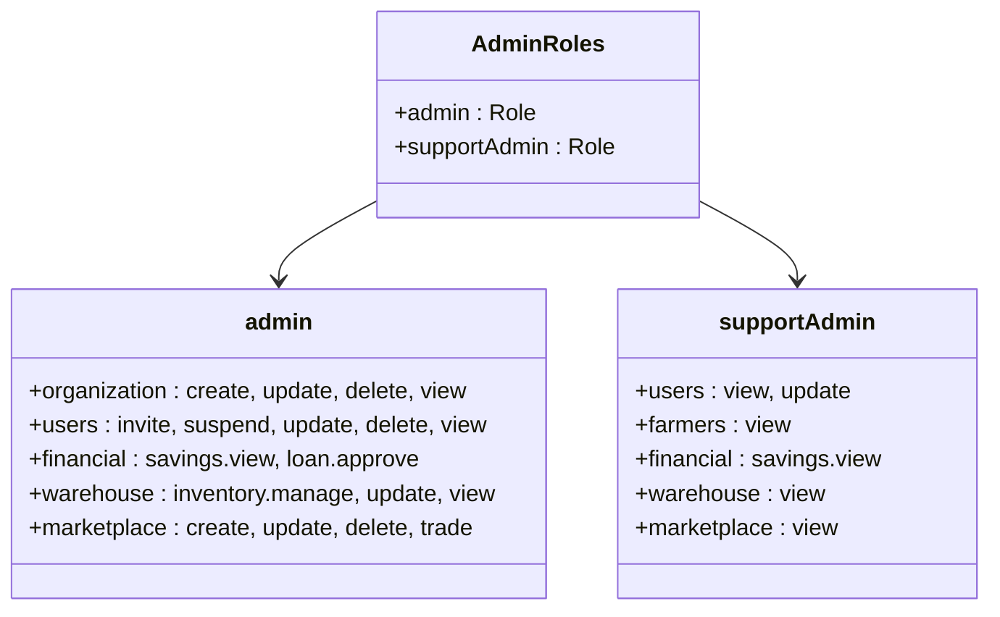
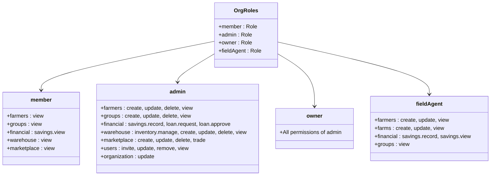
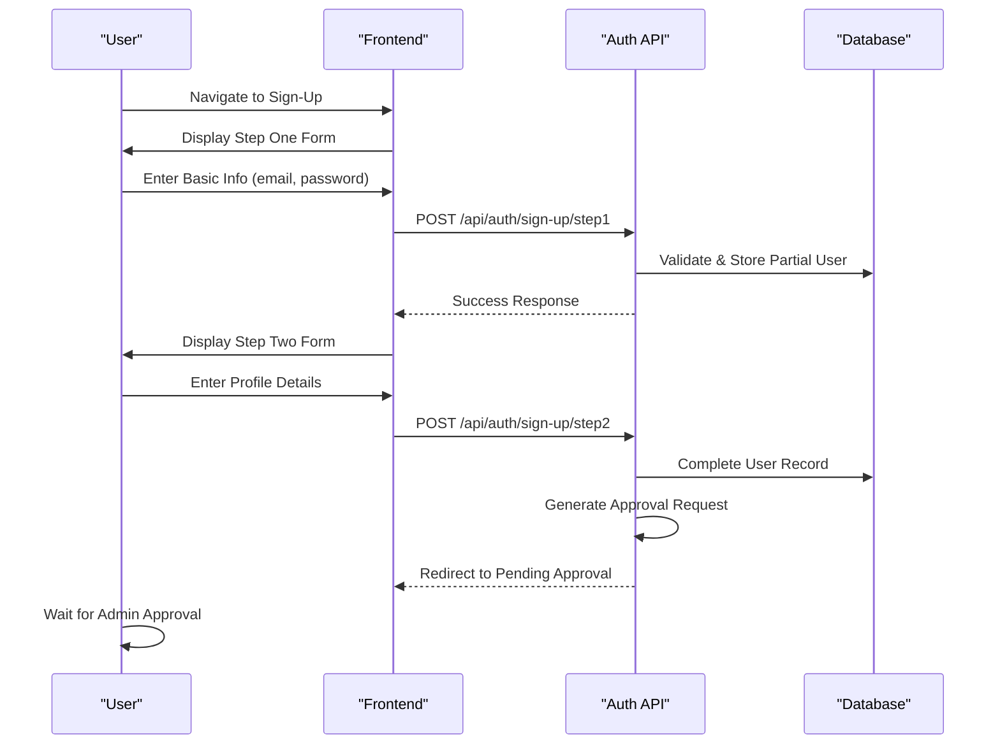
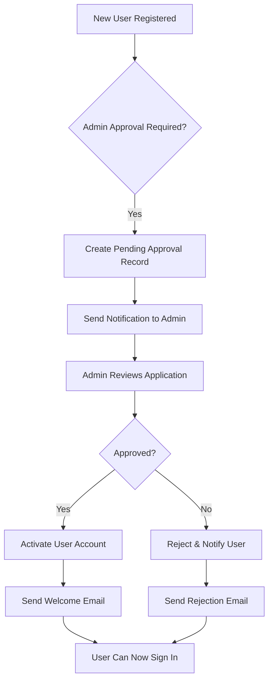
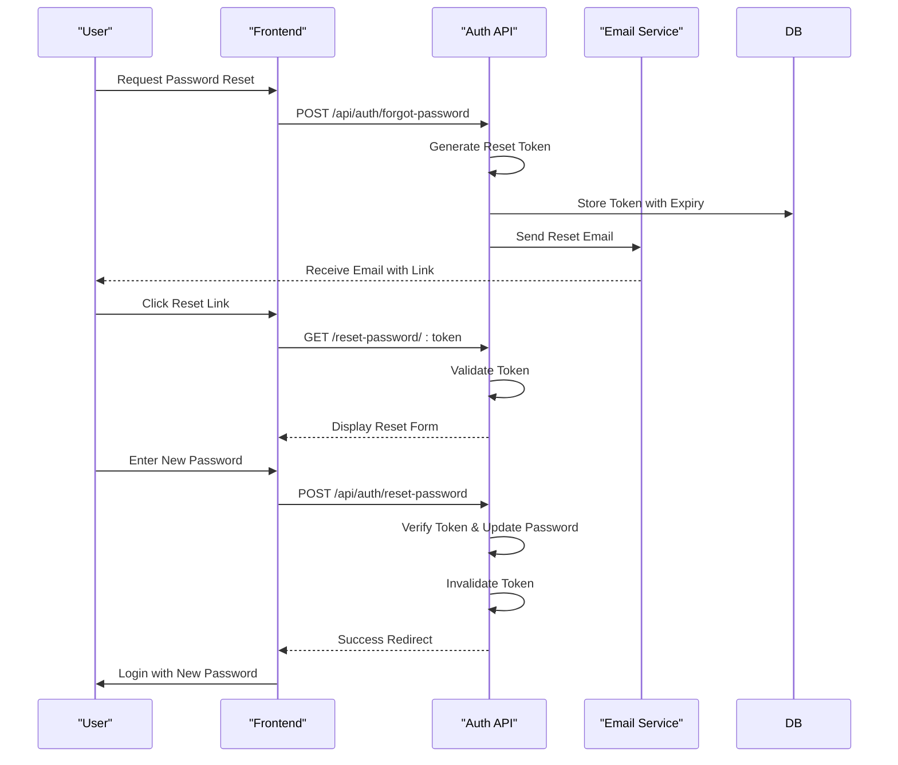
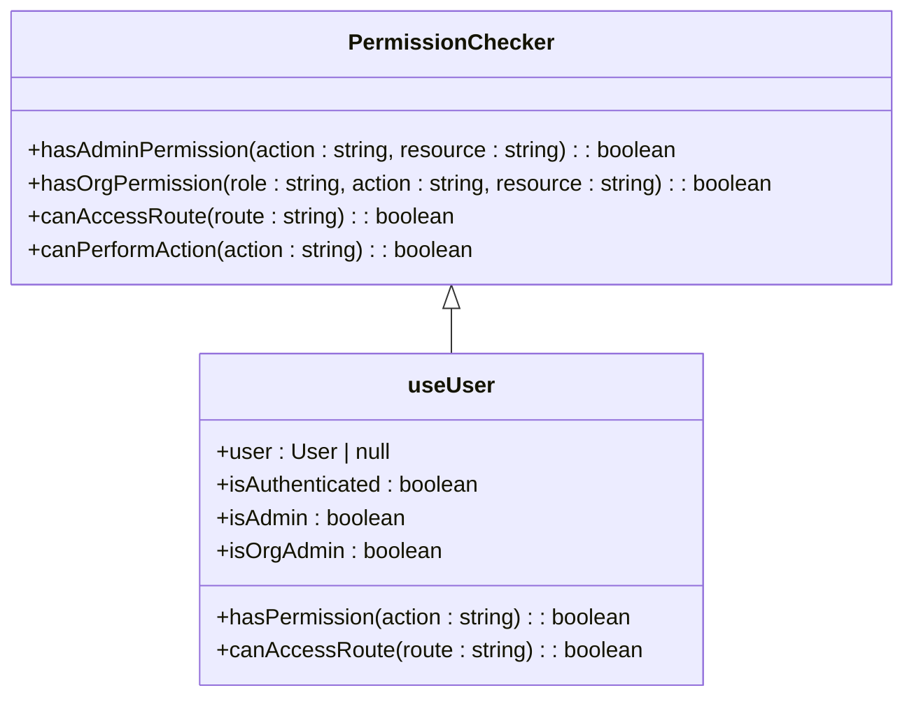
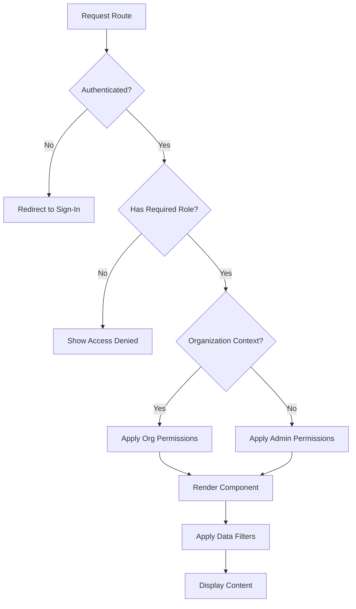

# Authentication & Authorization

<cite>
**Referenced Files in This Document**   
- [auth.ts](file://src/lib/auth.ts)
- [auth-server.ts](file://src/lib/auth-server.ts)
- [auth-client.ts](file://src/lib/auth-client.ts)
- [auth-admin-client.ts](file://src/lib/auth-admin-client.ts)
- [auth-organization-utils.ts](file://src/lib/auth-organization-utils.ts)
- [admin-permissions.ts](file://src/lib/admin-permissions.ts)
- [org-permissions.ts](file://src/lib/org-permissions.ts)
- [use-user.ts](file://src/features/auth/hooks/use-user.ts)
- [schema.ts](file://src/features/auth/schema.ts)
- [sign-up-store.ts](file://src/features/auth/store/sign-up-store.ts)
- [auth-layout.tsx](file://src/features/auth/components/auth-layout.tsx)
- [sign-in-form.tsx](file://src/features/auth/components/sign-in-form.tsx)
- [forgot-password-form.tsx](file://src/features/auth/components/forgot-password-form.tsx)
- [reset-password-form.tsx](file://src/features/auth/components/reset-password-form.tsx)
- [step-one-form.tsx](file://src/features/auth/components/sign-up/step-one-form.tsx)
- [step-two-form.tsx](file://src/features/auth/components/sign-up/step-two-form.tsx)
- [page.tsx](file://src/app/(auth)/sign-in/page.tsx)
- [page.tsx](file://src/app/(auth)/sign-up/page.tsx)
- [page.tsx](file://src/app/(auth)/forgot-password/page.tsx)
- [page.tsx](file://src/app/(auth)/reset-password/page.tsx)
- [page.tsx](file://src/app/(auth)/reset-password/[token]/page.tsx)
- [page.tsx](file://src/app/pending-approval/page.tsx)
- [route.ts](file://src/app/api/auth/[...all]/route.ts)
- [auth.ts](file://src/config/constants/auth.ts)
</cite>

## Table of Contents
1. [Introduction](#introduction)
2. [Better Auth Implementation Overview](#better-auth-implementation-overview)
3. [Multi-Tenancy Architecture](#multi-tenancy-architecture)
4. [Session Management](#session-management)
5. [Role Hierarchy and Permission System](#role-hierarchy-and-permission-system)
6. [Authentication Flows](#authentication-flows)
7. [Permission Checking Utilities](#permission-checking-utilities)
8. [Protected Routes and Data Access](#protected-routes-and-data-access)
9. [API Key Management](#api-key-management)
10. [Conclusion](#conclusion)

## Introduction
The pukpara platform implements a robust authentication and authorization system using Better Auth, designed to support multi-tenancy, granular role-based access control, and secure session management. This document details the architecture and implementation of the authentication system, focusing on user roles, permission models, and key authentication workflows.

## Better Auth Implementation Overview
The authentication system in pukpara leverages Better Auth as the core identity management framework, extended with custom logic for multi-tenancy and organization-based access control. The implementation is split across server-side and client-side modules, with clear separation between admin and organization contexts.

The system supports both traditional email/password authentication and OAuth flows, with JWT-based session tokens for stateless authentication. The configuration is centralized in `auth.ts` and `auth-server.ts`, which define the authentication strategies, session handling, and integration with the database.

**Section sources**
- [auth.ts](file://src/lib/auth.ts#L1-L100)
- [auth-server.ts](file://src/lib/auth-server.ts#L1-L50)

## Multi-Tenancy Architecture
pukpara implements a multi-tenant architecture where each organization operates as an isolated tenant within the system. The authentication layer enforces tenant boundaries by associating users with specific organizations and validating access based on tenant context.

The `auth-organization-utils.ts` file contains utilities for managing organization membership, tenant switching, and cross-tenant access validation. When a user authenticates, the system resolves their organization context and applies the appropriate permission model based on their role within that organization.

Organization creation and user assignment are handled through a multi-step workflow, ensuring proper administrative approval before granting access. The system supports both new user creation and existing user invitation workflows within the organization context.

**Section sources**
- [auth-organization-utils.ts](file://src/lib/auth-organization-utils.ts#L1-L80)
- [org-permissions.ts](file://src/lib/org-permissions.ts#L1-L10)

## Session Management
The session management system uses JWT tokens with configurable expiration policies. Sessions are stored server-side with refresh token rotation to prevent replay attacks. The `auth-client.ts` and `auth-admin-client.ts` modules provide client-side session handling for both regular users and administrators.

Key features include:
- Automatic token refresh before expiration
- Concurrent session tracking
- Device-specific session identification
- Forced session invalidation on password change
- Admin capability to terminate user sessions

Session state is synchronized across tabs and devices using localStorage events and periodic validation checks.

**Section sources**
- [auth-client.ts](file://src/lib/auth-client.ts#L1-L60)
- [auth-admin-client.ts](file://src/lib/auth-admin-client.ts#L1-L50)

## Role Hierarchy and Permission System

### Admin Context Roles
The admin permission system defines two primary roles beyond the base user:

**Diagram sources**
- [admin-permissions.ts](file://src/lib/admin-permissions.ts#L20-L56)

### Organization Context Roles
Within each organization, the system implements a four-tier role hierarchy:

**Diagram sources**
- [org-permissions.ts](file://src/lib/org-permissions.ts#L36-L84)

## Authentication Flows

### User Sign-Up with Multi-Step Forms
The user registration process is implemented as a two-step form flow:

**Diagram sources**
- [step-one-form.tsx](file://src/features/auth/components/sign-up/step-one-form.tsx#L1-L50)
- [step-two-form.tsx](file://src/features/auth/components/sign-up/step-two-form.tsx#L1-L50)
- [sign-up-store.ts](file://src/features/auth/store/sign-up-store.ts#L1-L30)

### Admin Approval Workflow
After user registration, an approval workflow is triggered:

**Diagram sources**
- [page.tsx](file://src/app/pending-approval/page.tsx#L1-L40)
- [route.ts](file://src/app/api/auth/[...all]/route.ts#L100-L150)

### Password Reset Flow
The password reset mechanism follows industry best practices:

**Diagram sources**
- [forgot-password-form.tsx](file://src/features/auth/components/forgot-password-form.tsx#L1-L40)
- [reset-password-form.tsx](file://src/features/auth/components/reset-password-form.tsx#L1-L40)
- [page.tsx](file://src/app/(auth)/forgot-password/page.tsx#L1-L30)
- [page.tsx](file://src/app/(auth)/reset-password/[token]/page.tsx#L1-L35)

## Permission Checking Utilities
The system provides several utilities for checking permissions in both admin and organization contexts:

The `use-user.ts` hook provides a React hook interface for accessing user permissions in components, while the underlying permission checkers are implemented in `admin-permissions.ts` and `org-permissions.ts`.

**Section sources**
- [use-user.ts](file://src/features/auth/hooks/use-user.ts#L1-L50)
- [admin-permissions.ts](file://src/lib/admin-permissions.ts#L1-L56)
- [org-permissions.ts](file://src/lib/org-permissions.ts#L1-L84)

## Protected Routes and Data Access
The system implements route protection at both the application and component levels:

Protected routes are implemented using Higher-Order Components (HOCs) and React hooks that validate user permissions before rendering content. Data access restrictions are enforced at the API layer, ensuring that even if a user bypasses UI restrictions, they cannot access unauthorized data.

**Section sources**
- [auth-client.ts](file://src/lib/auth-client.ts#L60-L100)
- [auth-admin-client.ts](file://src/lib/auth-admin-client.ts#L50-L90)
- [use-user.ts](file://src/features/auth/hooks/use-user.ts#L50-L80)

## API Key Management
The system supports API key generation and management for programmatic access:

- Admins can generate long-lived API keys with specific permission scopes
- Keys are associated with service accounts rather than individual users
- Each key has configurable expiration and rate limiting
- Key usage is logged for audit purposes
- Compromised keys can be revoked immediately

API key authentication follows the same permission model as user authentication, with keys being assigned specific roles and scopes.

**Section sources**
- [auth-server.ts](file://src/lib/auth-server.ts#L100-L150)
- [admin-permissions.ts](file://src/lib/admin-permissions.ts#L1-L56)

## Conclusion
The authentication and authorization system in pukpara provides a comprehensive solution for managing user identity, access control, and security in a multi-tenant environment. By leveraging Better Auth and extending it with custom permission models, the system supports complex organizational structures with granular control over user capabilities. The implementation balances security with usability, providing clear workflows for user management while enforcing strict access controls across all system components.