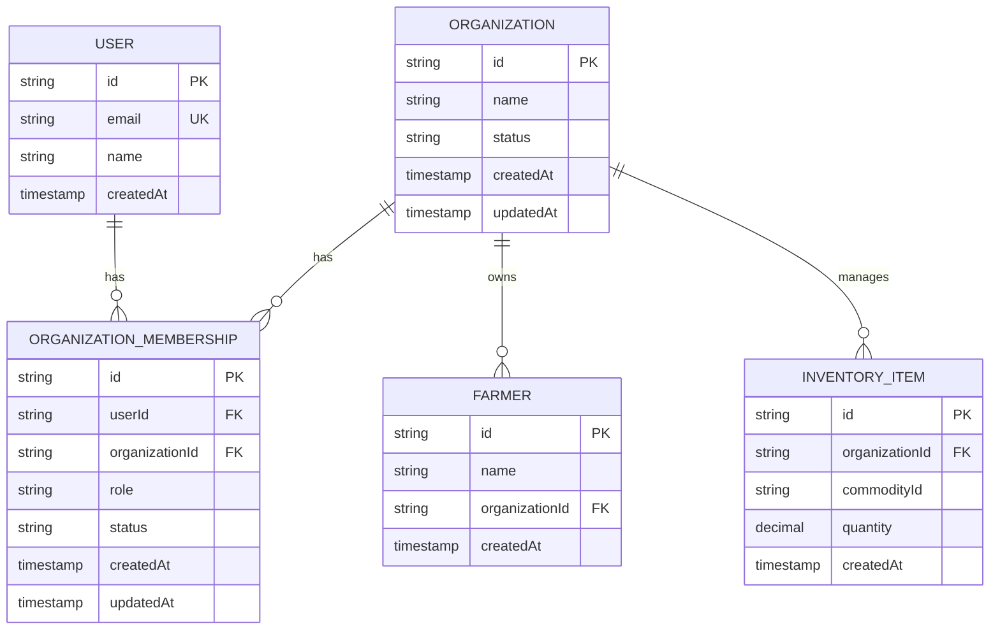
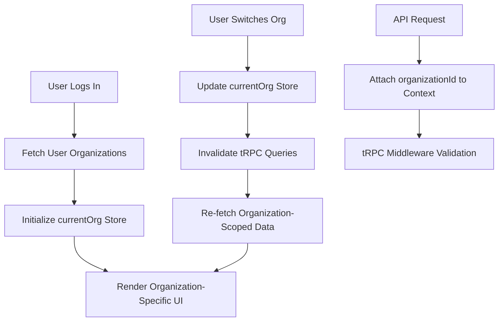
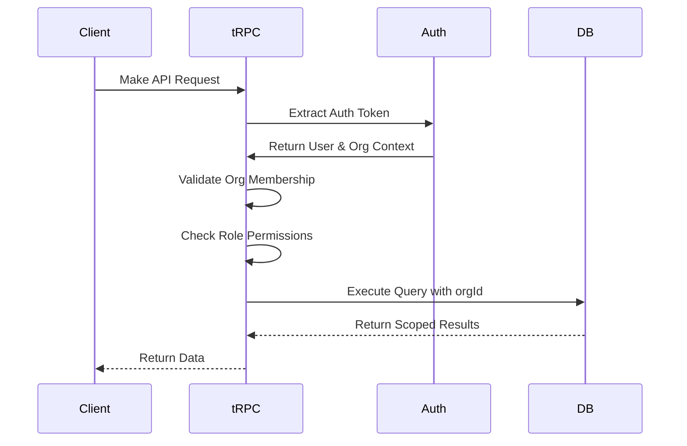
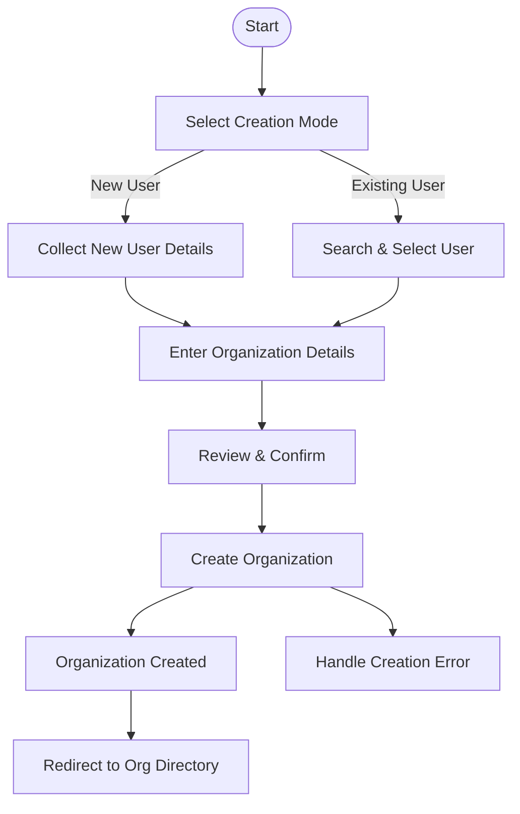
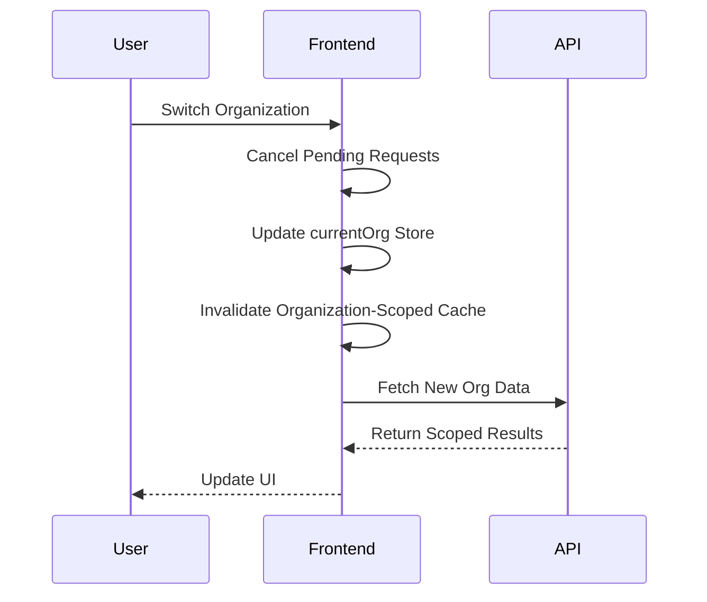

# Organization Management & Access Control

<cite>
**Referenced Files in This Document**   
- [schema.ts](file://src/server/db/schema.ts)
- [organizations.ts](file://src/server/api/routers/organizations.ts)
- [auth-organization-utils.ts](file://src/lib/auth-organization-utils.ts)
- [organization-create-page.tsx](file://src/features/admin/organizations/pages/organization-create-page.tsx)
- [creation-mode-step.tsx](file://src/features/admin/organizations/components/organization-create/creation-mode-step.tsx)
- [existing-user-step.tsx](file://src/features/admin/organizations/components/organization-create/existing-user-step.tsx)
- [new-user-step.tsx](file://src/features/admin/organizations/components/organization-create/new-user-step.tsx)
- [organization-details-step.tsx](file://src/features/admin/organizations/components/organization-create/organization-details-step.tsx)
- [review-step.tsx](file://src/features/admin/organizations/components/organization-create/review-step.tsx)
- [page.tsx](file://src/app/(admin)/admin/organizations/new/page.tsx)
- [org-permissions.ts](file://src/lib/org-permissions.ts)
- [auth-server.ts](file://src/lib/auth-server.ts)
- [server.ts](file://src/trpc/server.ts)
</cite>

## Table of Contents
1. [Introduction](#introduction)
2. [Multi-Tenancy Architecture](#multi-tenancy-architecture)
3. [Organization Membership Lifecycle](#organization-membership-lifecycle)
4. [Frontend Organization Context Management](#frontend-organization-context-management)
5. [Security Enforcement Mechanisms](#security-enforcement-mechanisms)
6. [Organization Creation Flow](#organization-creation-flow)
7. [Membership Management](#membership-management)
8. [Edge Cases and Concurrency Handling](#edge-cases-and-concurrency-handling)
9. [Conclusion](#conclusion)

## Introduction
This document details the organization-based access control system in pukpara, a multi-tenant application designed to isolate data and functionality across distinct organizational boundaries. The system enforces strict data scoping through organizationId at both the database and API layers, ensuring that users can only access resources within their affiliated organizations. This documentation covers the full lifecycle of organization membership, context switching in the frontend, security enforcement mechanisms, and edge case handling.

**Section sources**
- [schema.ts](file://src/server/db/schema.ts#L1-L100)
- [org-permissions.ts](file://src/lib/org-permissions.ts#L1-L50)

## Multi-Tenancy Architecture

The pukpara application implements a robust multi-tenancy model where all data is scoped to an organization through the `organizationId` field. This field is present across all relevant database models, ensuring that queries are automatically filtered by the current user's organizational context.



All database queries are automatically scoped using the authenticated user's organization context, preventing cross-tenant data access. The `organizationId` serves as a partition key across all tenant-specific collections.

**Diagram sources**
- [schema.ts](file://src/server/db/schema.ts#L20-L150)

**Section sources**
- [schema.ts](file://src/server/db/schema.ts#L10-L200)
- [auth-organization-utils.ts](file://src/lib/auth-organization-utils.ts#L10-L40)

## Organization Membership Lifecycle

The organization membership lifecycle in pukpara consists of four key stages: invitation, approval, role assignment, and revocation. Each stage is governed by strict permission checks and audit logging.

```mermaid
stateDiagram-v2
[*] --> Invited
Invited --> PendingApproval : "invite sent"
PendingApproval --> Active : "approved"
PendingApproval --> Rejected : "denied"
Active --> Suspended : "revoked"
Suspended --> Active : "reinstated"
Active --> [*] : "removed"
state Active {
--> Owner
--> Admin
--> Member
}
```

Users are initially invited via email, which creates a record in the `OrganizationMembership` table with status "PENDING". Upon acceptance, the membership status transitions to "ACTIVE" and the user gains access based on their assigned role (Owner, Admin, or Member). Role-based permissions are enforced through the `org-permissions.ts` module.

**Diagram sources**
- [organizations.ts](file://src/server/api/routers/organizations.ts#L100-L200)

**Section sources**
- [organizations.ts](file://src/server/api/routers/organizations.ts#L50-L300)
- [org-permissions.ts](file://src/lib/org-permissions.ts#L20-L80)

## Frontend Organization Context Management

The frontend implements organization context switching through a dedicated state management system. The `currentOrg` store maintains the active organization session state, allowing users to seamlessly switch between organizations they belong to.



The context switch triggers cache invalidation for all organization-scoped queries and re-fetches data relevant to the newly selected organization. This ensures data consistency and prevents stale information display.

**Diagram sources**
- [auth-organization-utils.ts](file://src/lib/auth-organization-utils.ts#L40-L70)
- [server.ts](file://src/trpc/server.ts#L20-L50)

**Section sources**
- [auth-organization-utils.ts](file://src/lib/auth-organization-utils.ts#L30-L90)
- [server.ts](file://src/trpc/server.ts#L10-L60)

## Security Enforcement Mechanisms

pukpara employs a defense-in-depth approach to prevent cross-tenant data leakage, with security controls at multiple layers.

### Database-Level Filtering
All database operations are automatically scoped to the current organization context. The ORM layer injects `organizationId` filters into every query, ensuring that even if a malicious actor bypasses API controls, they cannot access data from other organizations.

### tRPC Middleware Validation
The tRPC middleware validates organization context on every request:



The middleware verifies that the requesting user is an active member of the target organization and has sufficient permissions for the requested operation.

**Diagram sources**
- [auth-server.ts](file://src/lib/auth-server.ts#L15-L50)
- [server.ts](file://src/trpc/server.ts#L10-L60)

**Section sources**
- [auth-server.ts](file://src/lib/auth-server.ts#L10-L60)
- [server.ts](file://src/trpc/server.ts#L5-L70)
- [org-permissions.ts](file://src/lib/org-permissions.ts#L10-L100)

## Organization Creation Flow

The organization creation flow supports two modes: creating an organization with a new user or associating it with an existing user. The process is implemented as a multi-step wizard in the admin interface.



The backend validates uniqueness constraints and enforces business rules during creation, such as preventing duplicate organization names within the same tenant context.

**Diagram sources**
- [organization-create-page.tsx](file://src/features/admin/organizations/pages/organization-create-page.tsx#L10-L50)
- [creation-mode-step.tsx](file://src/features/admin/organizations/components/organization-create/creation-mode-step.tsx#L5-L20)

**Section sources**
- [organization-create-page.tsx](file://src/features/admin/organizations/pages/organization-create-page.tsx#L1-L100)
- [creation-mode-step.tsx](file://src/features/admin/organizations/components/organization-create/creation-mode-step.tsx#L1-L30)
- [existing-user-step.tsx](file://src/features/admin/organizations/components/organization-create/existing-user-step.tsx#L1-L25)
- [new-user-step.tsx](file://src/features/admin/organizations/components/organization-create/new-user-step.tsx#L1-L25)
- [organization-details-step.tsx](file://src/features/admin/organizations/components/organization-create/organization-details-step.tsx#L1-L20)
- [review-step.tsx](file://src/features/admin/organizations/components/organization-create/review-step.tsx#L1-L15)
- [page.tsx](file://src/app/(admin)/admin/organizations/new/page.tsx#L1-L20)

## Membership Management

Organization membership is managed through the admin interface, where owners and admins can invite new members, modify roles, and revoke access. Each action triggers appropriate notifications and audit logging.

The membership table includes status fields that support workflows like pending approval, allowing organizations to control onboarding processes. Role assignments are validated against permission policies defined in `org-permissions.ts`, ensuring that only authorized users can perform administrative actions.

**Section sources**
- [organizations.ts](file://src/server/api/routers/organizations.ts#L150-L400)
- [org-permissions.ts](file://src/lib/org-permissions.ts#L50-L120)

## Edge Cases and Concurrency Handling

The system addresses several edge cases related to organization management:

### Orphaned Records
When an organization is deleted, associated records are either cascade-deleted or re-assigned based on business rules. Soft deletion is used where audit requirements exist, with records retaining their `organizationId` but marked as inactive.

### Concurrent Organization Switching
The frontend handles concurrent organization switching through optimistic UI updates and proper cache invalidation. When a user switches organizations while asynchronous operations are pending, the system cancels pending requests scoped to the previous organization to prevent data conflicts.



This ensures data integrity and prevents race conditions during context switches.

**Diagram sources**
- [auth-organization-utils.ts](file://src/lib/auth-organization-utils.ts#L60-L80)
- [server.ts](file://src/trpc/server.ts#L40-L55)

**Section sources**
- [auth-organization-utils.ts](file://src/lib/auth-organization-utils.ts#L50-L90)
- [server.ts](file://src/trpc/server.ts#L30-L60)

## Conclusion
The organization-based access control system in pukpara provides a secure, scalable foundation for multi-tenancy. Through comprehensive organizationId scoping, robust membership lifecycle management, and strict security enforcement at both database and API layers, the system effectively prevents cross-tenant data leakage. The frontend's organization context switching mechanism enables seamless user experience while maintaining data isolation. Together, these components form a cohesive access control framework that supports complex organizational workflows while prioritizing security and data integrity.