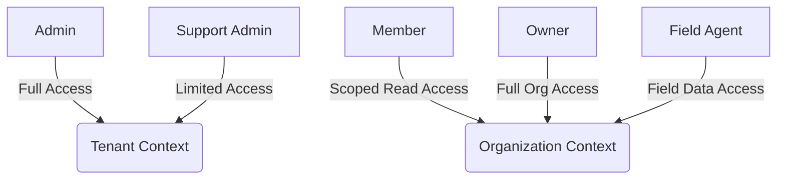
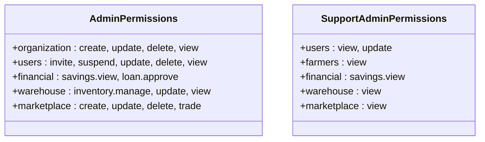
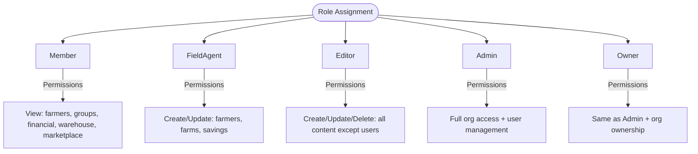
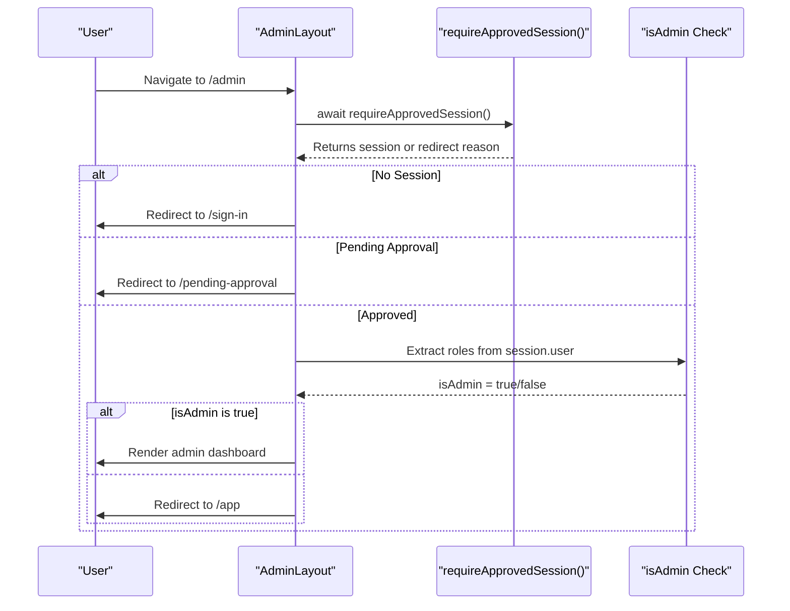
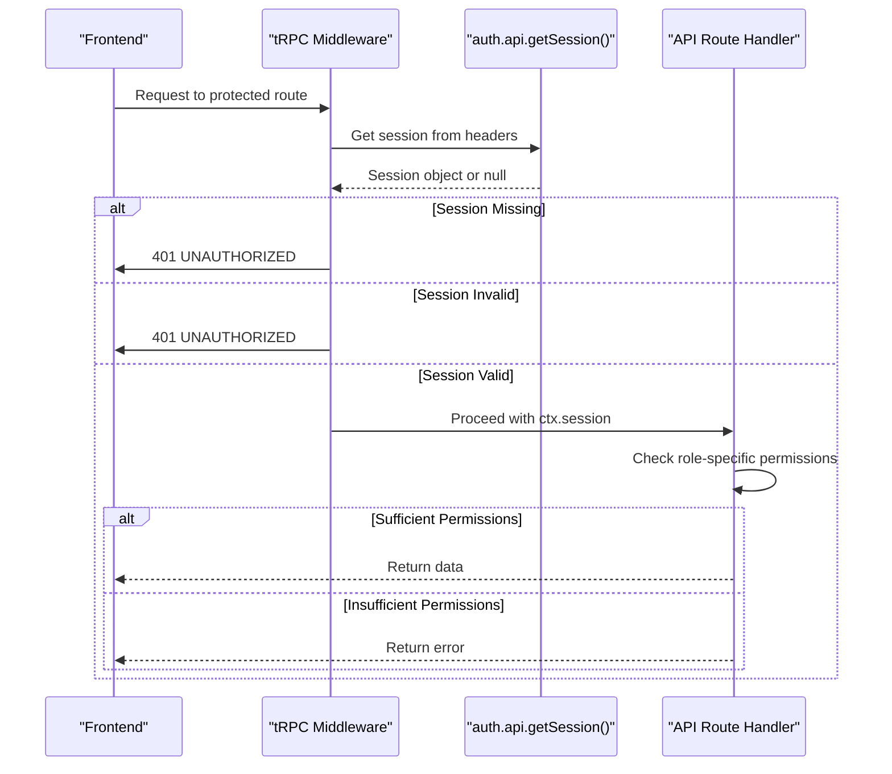

# User Roles & Permissions

<cite>
**Referenced Files in This Document**   
- [admin-permissions.ts](file://src/lib/admin-permissions.ts)
- [org-permissions.ts](file://src/lib/org-permissions.ts)
- [admin/layout.tsx](file://src/app/(admin)/admin/layout.tsx)
- [auth-server.ts](file://src/lib/auth-server.ts)
- [trpc.ts](file://src/server/api/trpc.ts)
</cite>

## Table of Contents
1. [Introduction](#introduction)
2. [Three-Tier Role Hierarchy](#three-tier-role-hierarchy)
3. [Admin-Level Permissions](#admin-level-permissions)
4. [Organization-Level Roles](#organization-level-roles)
5. [Permission Implementation](#permission-implementation)
6. [UI Integration](#ui-integration)
7. [API Access Control](#api-access-control)
8. [Common Issues and Debugging](#common-issues-and-debugging)
9. [Conclusion](#conclusion)

## Introduction
The pukpara application implements a robust role-based access control (RBAC) system to manage user permissions across tenant and organization contexts. This document details the three-tier role hierarchy—Admin, Support Admin, and Member—and explains how permissions are enforced through utility functions, UI components, and API middleware. The system leverages Better-Auth’s access control plugins to define fine-grained permissions for administrative and organizational operations.

**Section sources**
- [admin-permissions.ts](file://src/lib/admin-permissions.ts#L1-L57)
- [org-permissions.ts](file://src/lib/org-permissions.ts#L1-L85)

## Three-Tier Role Hierarchy
The permission system in pukpara is structured around three primary role tiers:
- **Admin**: Full access to tenant-level resources including user management, organization lifecycle, and financial approvals.
- **Support Admin**: Limited administrative access focused on user and data visibility with restricted modification rights.
- **Member**: Basic access within an organization context, primarily read-only with limited creation capabilities.

These roles are defined separately for tenant-level (admin) and organization-level (member) contexts, enabling granular control over both global and scoped operations.

**Diagram sources**
- [admin-permissions.ts](file://src/lib/admin-permissions.ts#L20-L50)
- [org-permissions.ts](file://src/lib/org-permissions.ts#L35-L75)

## Admin-Level Permissions
Tenant-level permissions are managed through `admin-permissions.ts`, which defines a comprehensive set of actions across key resources such as organizations, users, farmers, financial systems, warehouses, and marketplace features.

The `admin` role has full control over:
- Organization lifecycle (create, update, delete, view)
- User management (invite, suspend, update, delete)
- Financial operations (view savings, approve loans)
- Warehouse inventory management
- Marketplace trading and listing controls

The `supportAdmin` role is restricted to viewing and limited updates:
- Can view users, farmers, financial data, warehouse status, and marketplace listings
- May update user profiles but cannot invite or suspend users

**Diagram sources**
- [admin-permissions.ts](file://src/lib/admin-permissions.ts#L10-L50)

**Section sources**
- [admin-permissions.ts](file://src/lib/admin-permissions.ts#L1-L57)

## Organization-Level Roles
Organization-specific roles are defined in `org-permissions.ts` and apply within the scope of a single organization. These roles include:
- **Owner**: Full administrative rights within the organization
- **Admin**: Similar to owner but without special ownership privileges
- **Member**: Read-only access to core resources
- **Field Agent**: Custom role for field officers with data entry and viewing rights

Each role grants specific permissions on resources like farmers, groups, farms, financial records, warehouse operations, and marketplace activities.

**Diagram sources**
- [org-permissions.ts](file://src/lib/org-permissions.ts#L35-L75)

**Section sources**
- [org-permissions.ts](file://src/lib/org-permissions.ts#L1-L85)

## Permission Implementation
Permissions are implemented using the `better-auth/plugins/access` module, which provides a declarative way to define roles and statements. The `createAccessControl` function initializes the access controller with a vocabulary of resources and actions.

Helper functions such as `isSuperAdmin`, `isSupportAdmin`, and `hasOrgPermission` are derived from the role definitions and used throughout the application. These utilities abstract the complexity of role checking and provide a consistent interface for permission validation.

The system supports both direct role assignment and plugin-based roles (e.g., via `admin.roles`), allowing flexible integration with authentication providers.

**Section sources**
- [admin-permissions.ts](file://src/lib/admin-permissions.ts#L1-L57)
- [org-permissions.ts](file://src/lib/org-permissions.ts#L1-L85)

## UI Integration
Permissions are integrated into UI components to conditionally render features based on user roles. For example, the admin layout checks for membership in any of the admin roles (`admin`, `supportAdmin`, `userAc`) before granting access.

In organization tables and directory cards, action buttons (Approve, Suspend, Delete) are only rendered if the current user has the appropriate permissions. Selection toolbars and bulk action controls also respect role-based visibility.

**Diagram sources**
- [admin/layout.tsx](file://src/app/(admin)/admin/layout.tsx#L1-L47)
- [auth-server.ts](file://src/lib/auth-server.ts#L30-L52)

**Section sources**
- [admin/layout.tsx](file://src/app/(admin)/admin/layout.tsx#L1-L47)

## API Access Control
On the server side, tRPC procedures enforce data access control using middleware. The `protectedProcedure` ensures that only authenticated users can access protected routes, while additional checks validate role-specific permissions.

For organization-scoped operations, the backend evaluates the user’s role within the target organization before allowing modifications. This prevents unauthorized access even if a user is authenticated at the tenant level.

**Diagram sources**
- [trpc.ts](file://src/server/api/trpc.ts#L53-L70)
- [auth-server.ts](file://src/lib/auth-server.ts#L30-L52)

**Section sources**
- [trpc.ts](file://src/server/api/trpc.ts#L53-L70)
- [auth-server.ts](file://src/lib/auth-server.ts#L30-L52)

## Common Issues and Debugging
### Permission Escalation Risks
Improper role assignment or missing permission checks can lead to privilege escalation. Always validate roles on the server side—even if UI elements are hidden, API endpoints must enforce access control.

### Debugging Access Denials
When users report denied access:
1. Verify the session contains the expected role(s) via `session.user`
2. Check if roles are stored in `role`, `roles`, or `admin.roles` fields
3. Confirm the permission check logic matches the intended role requirements
4. Use logging in middleware to trace role evaluation

Use the `requireApprovedSession()` utility to inspect session state and redirection reasons during debugging.

**Section sources**
- [auth-server.ts](file://src/lib/auth-server.ts#L30-L52)
- [admin/layout.tsx](file://src/app/(admin)/admin/layout.tsx#L1-L47)

## Conclusion
The pukpara permission system provides a secure, scalable framework for managing user access across tenant and organization boundaries. By leveraging declarative role definitions and consistent enforcement across UI and API layers, the system ensures that users only access functionality appropriate to their roles. Proper implementation of helper functions and middleware safeguards against unauthorized access while supporting flexible role configurations.