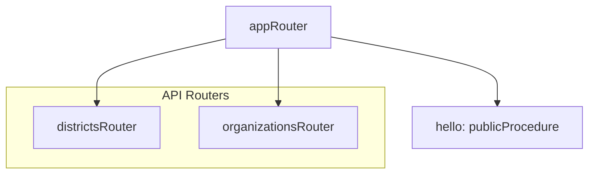
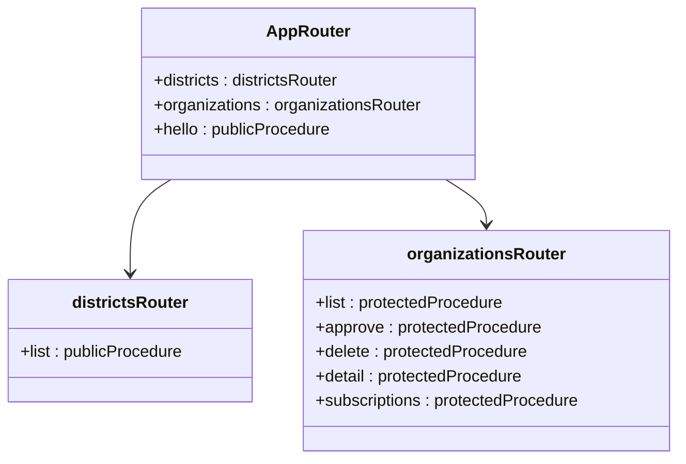
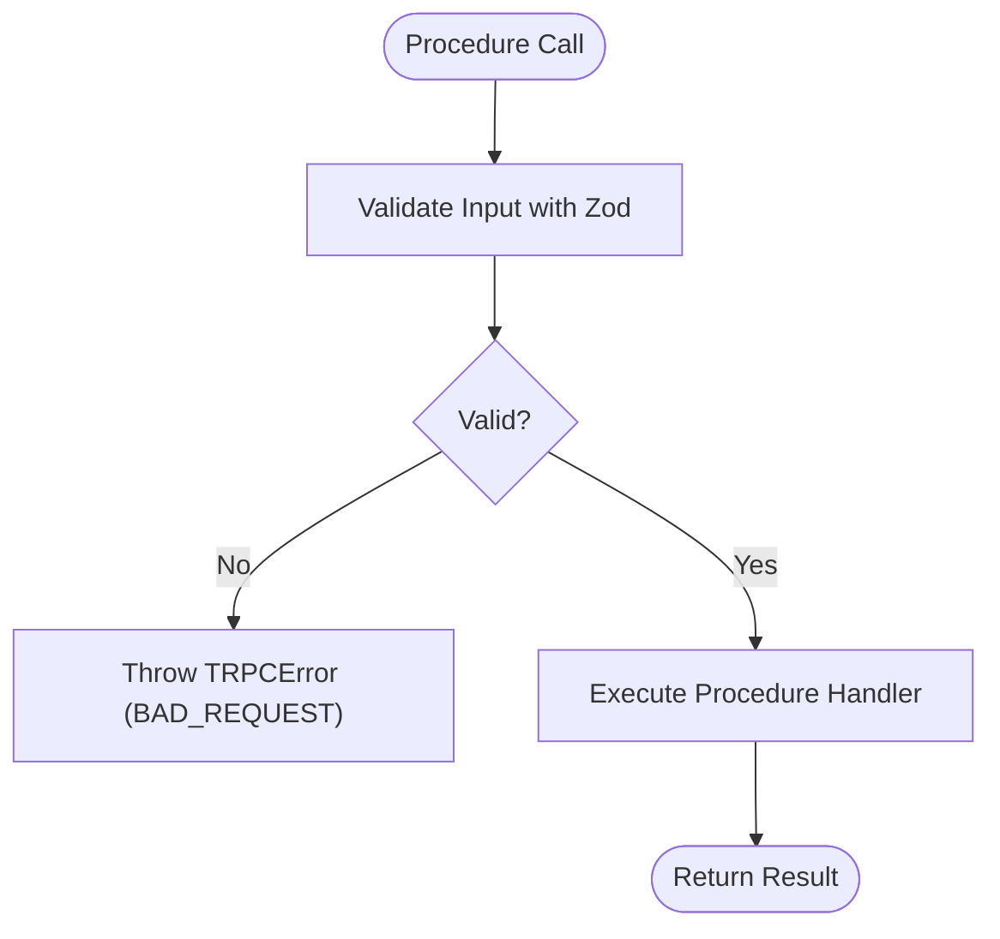
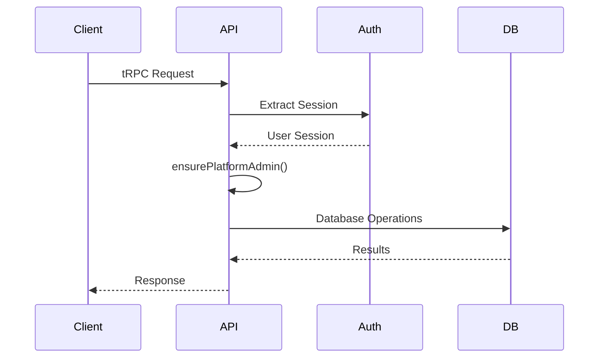
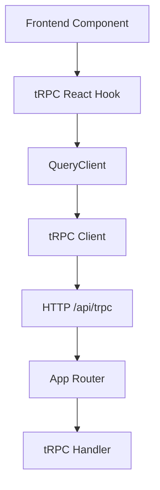

# API Endpoints

<cite>
**Referenced Files in This Document**  
- [root.ts](file://src/server/api/root.ts)
- [districts.ts](file://src/server/api/routers/districts.ts)
- [organizations.ts](file://src/server/api/routers/organizations.ts)
- [server.ts](file://src/trpc/server.ts)
- [react.tsx](file://src/trpc/react.tsx)
</cite>

## Table of Contents
1. [Introduction](#introduction)
2. [tRPC Routing Structure](#trpc-routing-structure)
3. [Root Router Composition](#root-router-composition)
4. [Procedure Definitions and Type Safety](#procedure-definitions-and-type-safety)
5. [Input Validation with Zod](#input-validation-with-zod)
6. [Error Handling and Formatting](#error-handling-and-formatting)
7. [Context Propagation and Authentication](#context-propagation-and-authentication)
8. [Frontend Integration with tRPC React Hooks](#frontend-integration-with-trpc-react-hooks)
9. [Security Considerations](#security-considerations)
10. [Rate Limiting and Performance](#rate-limiting-and-performance)
11. [Versioning Strategy](#versioning-strategy)
12. [Adding New Endpoints](#adding-new-endpoints)
13. [Conclusion](#conclusion)

## Introduction
This document provides comprehensive documentation for the tRPC-based API endpoints in the pukpara application. It details the routing architecture, procedure definitions, type-safe contracts, validation mechanisms, and integration patterns used throughout the system. The API is built using tRPC with Next.js App Router, enabling end-to-end type safety and seamless server-client communication.

## tRPC Routing Structure
The API uses a modular router structure organized under the `src/server/api/routers` directory. Each router encapsulates related procedures for a specific domain:

- **Districts Router**: Handles geographic data retrieval
- **Organizations Router**: Manages organization lifecycle, approval, and administrative operations

These routers are composed into a single application router via `root.ts`, which serves as the entry point for all tRPC calls.



**Diagram sources**
- [root.ts](file://src/server/api/root.ts#L1-L38)
- [districts.ts](file://src/server/api/routers/districts.ts#L1-L67)
- [organizations.ts](file://src/server/api/routers/organizations.ts#L1-L419)

**Section sources**
- [root.ts](file://src/server/api/root.ts#L1-L38)
- [districts.ts](file://src/server/api/routers/districts.ts#L1-L67)
- [organizations.ts](file://src/server/api/routers/organizations.ts#L1-L419)

## Root Router Composition
The primary router is defined in `root.ts` using `createTRPCRouter`. It composes individual routers and standalone procedures:



**Diagram sources**
- [root.ts](file://src/server/api/root.ts#L1-L38)

**Section sources**
- [root.ts](file://src/server/api/root.ts#L1-L38)

## Procedure Definitions and Type Safety
All procedures are defined using tRPC's procedure builders (`publicProcedure`, `protectedProcedure`) and leverage TypeScript inference for end-to-end type safety. The `AppRouter` type export enables automatic inference of input and output types across the application.

Key characteristics:
- Query procedures for data retrieval
- Mutation procedures for state changes
- Input/output types automatically inferred
- Full IDE support and compile-time checking

**Section sources**
- [root.ts](file://src/server/api/root.ts#L1-L38)
- [organizations.ts](file://src/server/api/routers/organizations.ts#L1-L419)

## Input Validation with Zod
Input validation is implemented using Zod schemas directly within procedure definitions:

- **Organizations List**: Validates pagination parameters (`page`, `pageSize`) with defaults and bounds
- **Approve/Delete Organizations**: Validates array of organization IDs with minimum length requirement
- **Organization Detail**: Validates required organization ID string

All inputs are type-safe and automatically parsed/validated at runtime.



**Diagram sources**
- [organizations.ts](file://src/server/api/routers/organizations.ts#L1-L419)

**Section sources**
- [organizations.ts](file://src/server/api/routers/organizations.ts#L1-L419)

## Error Handling and Formatting
The API uses tRPC's `TRPCError` for consistent error formatting:

- **FORBIDDEN**: Authentication/authorization failures
- **NOT_FOUND**: Resource not found
- **INTERNAL_SERVER_ERROR**: Database or system failures
- **BAD_REQUEST**: Invalid input (automatically thrown by Zod)

Custom error handling is implemented in transactional mutations to ensure data consistency.

**Section sources**
- [organizations.ts](file://src/server/api/routers/organizations.ts#L1-L419)

## Context Propagation and Authentication
Authentication state is propagated through the request context:

- `protectedProcedure` ensures authenticated access
- `ensurePlatformAdmin` helper validates admin roles from session data
- Role checking inspects multiple role sources (direct, array, plugin)
- Context includes database client and session information



**Diagram sources**
- [organizations.ts](file://src/server/api/routers/organizations.ts#L1-L419)
- [server.ts](file://src/trpc/server.ts#L1-L30)

**Section sources**
- [organizations.ts](file://src/server/api/routers/organizations.ts#L1-L419)
- [server.ts](file://src/trpc/server.ts#L1-L30)

## Frontend Integration with tRPC React Hooks
The frontend consumes tRPC endpoints using the `api` client from `src/trpc/react.tsx`:

- `TRPCReactProvider` sets up the tRPC and React Query clients
- Automatic batching via `httpBatchStreamLink`
- SuperJSON transformer for complex data types
- Logger link for development debugging
- Singleton query client pattern on the client

Consumption example:
```tsx
const { data } = api.organizations.list.useQuery({ page: 1 });
```



**Diagram sources**
- [react.tsx](file://src/trpc/react.tsx#L1-L84)
- [server.ts](file://src/trpc/server.ts#L1-L30)

**Section sources**
- [react.tsx](file://src/trpc/react.tsx#L1-L84)
- [server.ts](file://src/trpc/server.ts#L1-L30)

## Security Considerations
The API implements multiple security layers:

- **Authentication**: Protected procedures require valid sessions
- **Authorization**: `ensurePlatformAdmin` enforces admin role requirements
- **Input Sanitization**: Zod validation prevents injection attacks
- **Transaction Safety**: Database operations wrapped in transactions
- **Rate Limiting**: Not explicitly implemented (consider adding)

Sensitive operations (approve, delete) require elevated privileges and perform comprehensive validation.

**Section sources**
- [organizations.ts](file://src/server/api/routers/organizations.ts#L1-L419)

## Rate Limiting and Performance
Current considerations:
- Pagination with configurable page size (default: 20, max: 100)
- Database indexing recommended for frequently queried fields
- No explicit rate limiting implemented
- Future recommendations:
  - Implement rate limiting for public endpoints
  - Add caching for frequently accessed read operations
  - Optimize database queries with proper indexing

**Section sources**
- [organizations.ts](file://src/server/api/routers/organizations.ts#L1-L419)

## Versioning Strategy
The current implementation does not include explicit versioning. Recommended approach:

- Use URL-based versioning: `/api/v1/trpc`
- Maintain backward compatibility
- Deprecate endpoints with clear timelines
- Leverage tRPC's type safety to manage breaking changes
- Consider router composition for versioned modules

**Section sources**
- [root.ts](file://src/server/api/root.ts#L1-L38)

## Adding New Endpoints
Guidelines for adding new endpoints:

1. Create a new router in `src/server/api/routers/`
2. Define procedures with appropriate authentication
3. Use Zod for input validation
4. Implement proper error handling
5. Add to `appRouter` in `root.ts`
6. Ensure type safety throughout
7. Maintain separation of concerns

Example pattern:
```ts
export const newRouter = createTRPCRouter({
  // procedures...
});
```

**Section sources**
- [root.ts](file://src/server/api/root.ts#L1-L38)
- [organizations.ts](file://src/server/api/routers/organizations.ts#L1-L419)

## Conclusion
The tRPC API in pukpara provides a robust, type-safe foundation for server-client communication. Key strengths include end-to-end typing, modular router composition, and integrated authentication. The architecture supports secure administrative operations while maintaining scalability. Future improvements should focus on rate limiting, caching, and versioning strategies to enhance production readiness.