# Districts API

<cite>
**Referenced Files in This Document**   
- [districts.ts](file://src/server/api/routers/districts.ts)
- [org-permissions.ts](file://src/lib/org-permissions.ts)
- [page.tsx](file://src/app/(admin)/admin/settings/reference/districts/page.tsx)
- [step-two-form.tsx](file://src/features/auth/components/sign-up/step-two-form.tsx)
- [schema.ts](file://src/server/db/schema.ts)
</cite>

## Table of Contents
1. [Introduction](#introduction)
2. [API Procedures](#api-procedures)
3. [Input Validation and Authentication](#input-validation-and-authentication)
4. [Role-Based Access Control](#role-based-access-control)
5. [Database Interaction via Drizzle ORM](#database-interaction-via-drizzle-orm)
6. [Frontend Invocation with tRPC React Hooks](#frontend-invocation-with-trpc-react-hooks)
7. [Error Handling and Response Formats](#error-handling-and-response-formats)
8. [Usage in Organization Onboarding](#usage-in-organization-onboarding)
9. [Performance and Caching Strategies](#performance-and-caching-strategies)
10. [Appendices](#appendices)

## Introduction
The Districts API in pukpara provides a centralized reference data service for geographical district entities, primarily used during user registration and organizational setup. It enables retrieval of hierarchical region-district data for accurate location referencing across farms, organizations, and users. This document details the tRPC procedures, access controls, database integration, frontend usage, and performance considerations for the Districts API.

**Section sources**
- [districts.ts](file://src/server/api/routers/districts.ts#L7-L65)

## API Procedures
The Districts API exposes a single public tRPC procedure for retrieving hierarchical region and district data.

### list Procedure
Retrieves all regions with their associated districts in a structured format, sorted alphabetically.

**Request**
- Method: `query`
- Path: `districts.list`

**Response Format**
```json
{
  "regions": [
    {
      "code": "AR",
      "name": "Ashanti Region",
      "districts": [
        {
          "id": "string",
          "name": "string",
          "code": "string | null"
        }
      ]
    }
  ]
}
```

The response groups districts by their parent region, providing a hierarchical structure optimized for UI rendering in dropdowns and reference displays.


**Diagram sources**
- [districts.ts](file://src/server/api/routers/districts.ts#L7-L65)

**Section sources**
- [districts.ts](file://src/server/api/routers/districts.ts#L7-L65)

## Input Validation and Authentication
The Districts API currently implements a public procedure without input parameters, thus no input validation schema is required. The `list` procedure is accessible without authentication, as district reference data is considered public information necessary for user registration and onboarding workflows.

The procedure uses `publicProcedure` from the tRPC framework, which applies timing middleware but does not enforce session-based authentication, allowing unauthenticated access to geographical reference data.

**Section sources**
- [districts.ts](file://src/server/api/routers/districts.ts#L7-L65)
- [trpc.ts](file://src/server/api/trpc.ts#L53-L56)

## Role-Based Access Control
While the Districts API itself does not enforce role-based access control for read operations, it integrates with the broader `org-permissions` system for administrative functions. The current implementation only exposes read-only access via the `list` procedure.

The `org-permissions.ts` file defines roles such as `admin`, `owner`, and `fieldAgent`, but these are not currently applied to district operations. Future implementations may incorporate these roles for create, update, and delete operations on district entities, aligning with the permission vocabulary defined for organization-level features.


**Diagram sources**
- [org-permissions.ts](file://src/lib/org-permissions.ts#L1-L85)

**Section sources**
- [org-permissions.ts](file://src/lib/org-permissions.ts#L1-L85)

## Database Interaction via Drizzle ORM
The Districts API utilizes Drizzle ORM for database interactions, implementing a clean and type-safe query pattern to retrieve region-district relationships.

### Data Model
The database schema defines two related tables:
- `region`: Contains region code and name
- `district`: Contains district details with foreign key to region

### Query Implementation
The API performs an inner join between `district` and `region` tables, selecting specific fields and ordering results by region and district names. The raw SQL equivalent would be:
```sql
SELECT d.id, d.code, d.name, r.code as regionCode, r.name as regionName
FROM district d
INNER JOIN region r ON d.regionCode = r.code
ORDER BY r.name, d.name
```

### Data Transformation
After retrieval, the API transforms the flat result set into a hierarchical structure using JavaScript Map and Array operations, grouping districts by their parent region and applying alphabetical sorting.


**Diagram sources**
- [schema.ts](file://src/server/db/schema.ts#L1-L799)
- [districts.ts](file://src/server/api/routers/districts.ts#L7-L65)

**Section sources**
- [schema.ts](file://src/server/db/schema.ts#L1-L799)
- [districts.ts](file://src/server/api/routers/districts.ts#L7-L65)

## Frontend Invocation with tRPC React Hooks
The Districts API is consumed on the frontend using tRPC React hooks, particularly in the user registration workflow and administrative settings.

### Usage in User Registration
The `step-two-form.tsx` component uses the `api.districts.list.useQuery()` hook to populate a searchable dropdown for district selection during user signup. The query is configured with `staleTime: Number.POSITIVE_INFINITY` indicating that district data is treated as static and not frequently updated.

```mermaid
sequenceDiagram
participant Form as "SignUp Step 2 Form"
participant tRPC as "tRPC Client"
participant API as "Districts API"
participant DB as "Database"
Form->>tRPC : useQuery(undefined, {staleTime : ∞})
tRPC->>API : HTTP GET /api/trpc/districts.list
API->>DB : SELECT with JOIN
DB-->>API : Region-District Data
API-->>tRPC : Transformed Hierarchical Data
tRPC-->>Form : {regions : [...]}
Form->>Form : Build Searchable Dropdown
```



**Diagram sources**
- [step-two-form.tsx](file://src/features/auth/components/sign-up/step-two-form.tsx#L132-L182)

**Section sources**
- [step-two-form.tsx](file://src/features/auth/components/sign-up/step-two-form.tsx#L132-L182)

## Error Handling and Response Formats
The Districts API inherits error handling from the tRPC framework and implements structured response formatting.

### Error Handling
- Uses tRPC's built-in error formatting with Zod error flattening
- Inherits timing middleware that logs execution duration
- No custom error handling implemented for the `list` procedure
- Framework-level errors are formatted with shape data including zodError details when applicable

### Response Format
The API returns a consistent JSON structure with regions as the top-level array, each containing:
- Region code and name
- Array of districts with id, name, and optional code
- Hierarchical grouping that reflects the geographical relationship
- Alphabetically sorted entries for both regions and districts

The response is designed for direct consumption by UI components, particularly dropdowns and reference displays in administrative interfaces.

**Section sources**
- [districts.ts](file://src/server/api/routers/districts.ts#L7-L65)
- [trpc.ts](file://src/server/api/trpc.ts#L0-L56)

## Usage in Organization Onboarding
The Districts API plays a critical role in the organization onboarding workflow by providing geographical reference data for accurate location specification.

### Administrative Settings Integration
The administrative settings page for districts (`page.tsx`) serves as the management interface, though currently implemented as a placeholder. This indicates a future capability for CRUD operations on district entities.

### User Registration Context
During user registration, the district data is essential for:
- Geographical targeting of services
- Organizational hierarchy establishment
- Farm and user location referencing
- Reporting and analytics by region

The API ensures data consistency across the platform by serving as the single source of truth for district reference data.


**Diagram sources**
- [page.tsx](file://src/app/(admin)/admin/settings/reference/districts/page.tsx#L0-L29)
- [step-two-form.tsx](file://src/features/auth/components/sign-up/step-two-form.tsx#L132-L182)

**Section sources**
- [page.tsx](file://src/app/(admin)/admin/settings/reference/districts/page.tsx#L0-L29)
- [step-two-form.tsx](file://src/features/auth/components/sign-up/step-two-form.tsx#L132-L182)

## Performance and Caching Strategies
The Districts API implements several performance optimizations for efficient geo-reference data loading.

### Client-Side Caching
- Uses `staleTime: Number.POSITIVE_INFINITY` in the tRPC query configuration
- Treats district data as static reference information that rarely changes
- Eliminates unnecessary network requests after initial load
- Reduces API load and improves user experience in registration flows

### Data Loading Optimization
- Performs single database query with JOIN operation
- Retrieves only necessary fields (id, name, code) to minimize payload
- Implements server-side sorting to reduce client processing
- Transforms data into hierarchical structure server-side

### Future Caching Considerations
Potential enhancements could include:
- Redis or in-memory caching for high-frequency access
- CDN caching for static reference data
- Background refresh mechanisms for data updates
- Versioned endpoints to handle data changes without breaking clients

The current implementation prioritizes simplicity and consistency, treating district data as immutable reference information.

**Section sources**
- [step-two-form.tsx](file://src/features/auth/components/sign-up/step-two-form.tsx#L132-L182)
- [districts.ts](file://src/server/api/routers/districts.ts#L7-L65)

## Appendices

### Appendix A: Database Schema Reference
**region table**
- code (text, PK)
- name (text, NOT NULL)

**district table**
- id (text, PK)
- name (text, NOT NULL)
- code (text)
- regionCode (text, FK to region.code, ON DELETE CASCADE)

### Appendix B: tRPC Configuration
The API uses the following tRPC configuration:
- Context: `createTRPCContext` with database and session
- Transformer: SuperJSON for data serialization
- Error formatter: Includes Zod error details in development
- Middleware: Timing middleware for performance monitoring

### Appendix C: Seed Data Structure
The `seed-districts.ts` script demonstrates the data structure with Ghana regions and their districts, showing the hierarchical relationship between regions and districts that the API serves.

**Section sources**
- [schema.ts](file://src/server/db/schema.ts#L1-L799)
- [seed-districts.ts](file://scripts/seed-districts.ts#L0-L41)
- [trpc.ts](file://src/server/api/trpc.ts#L0-L56)