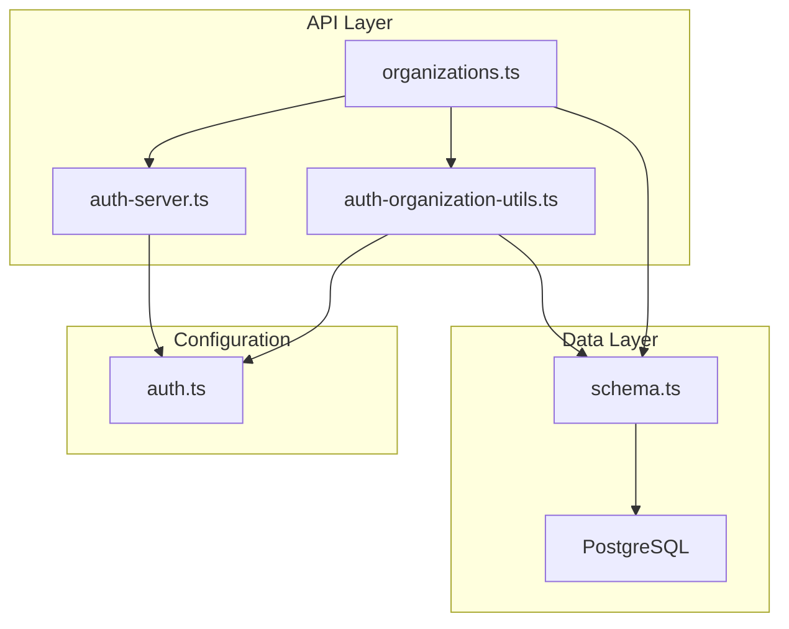
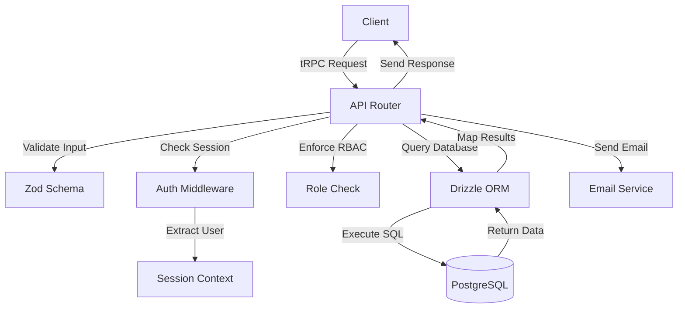
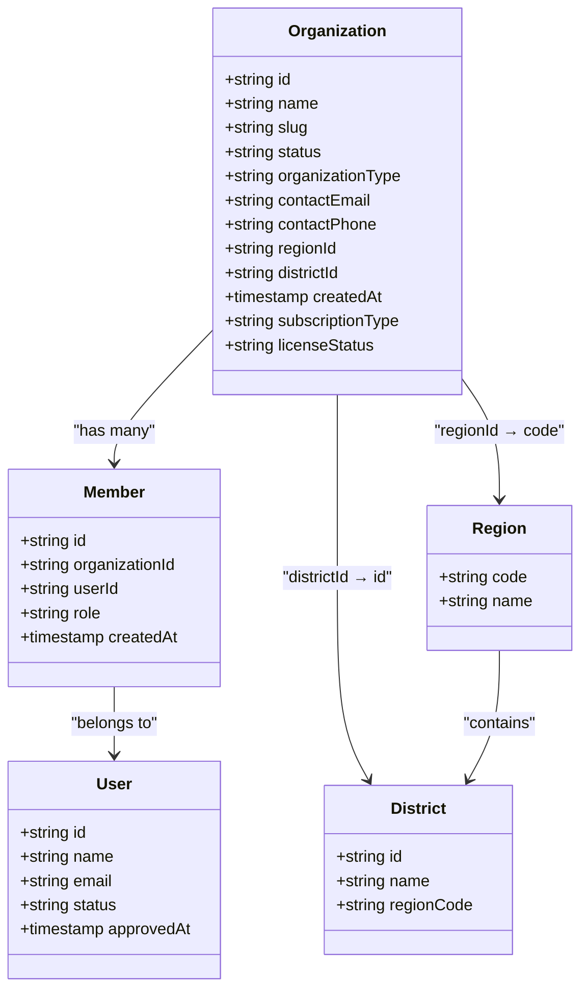
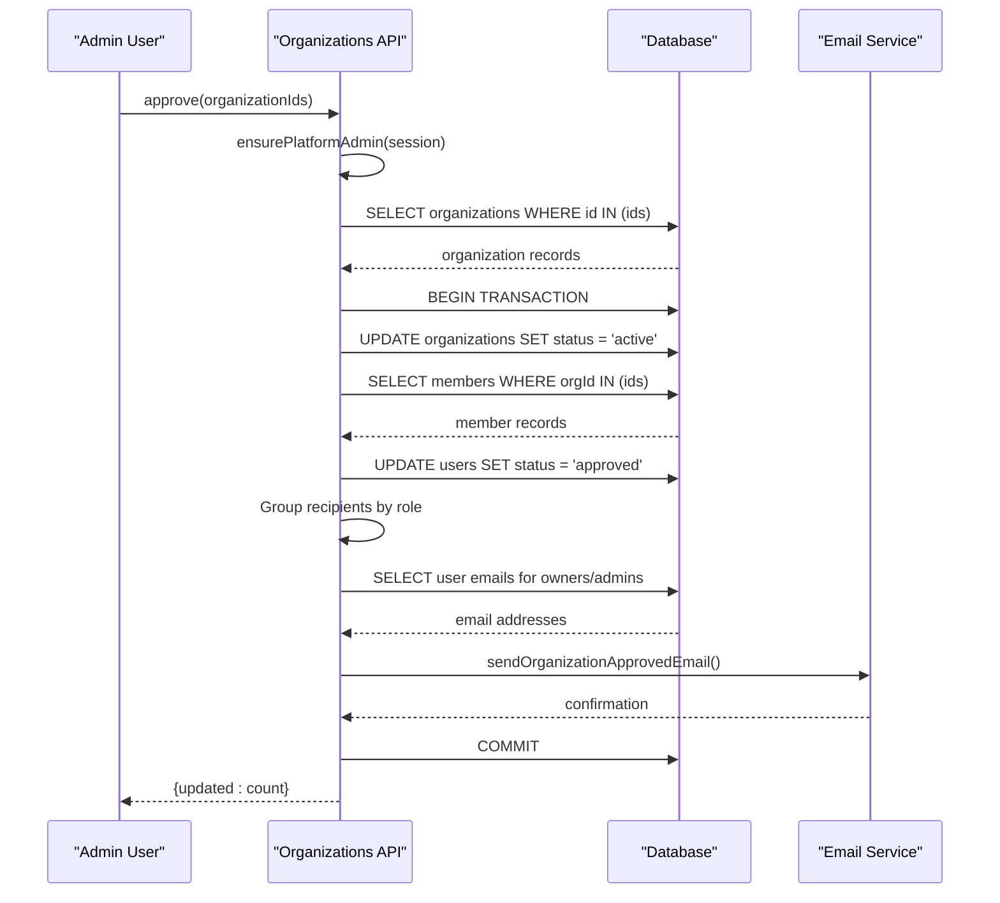
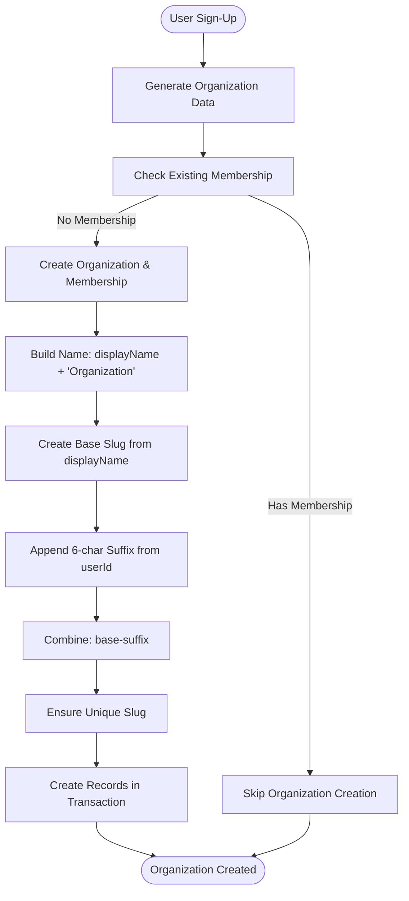
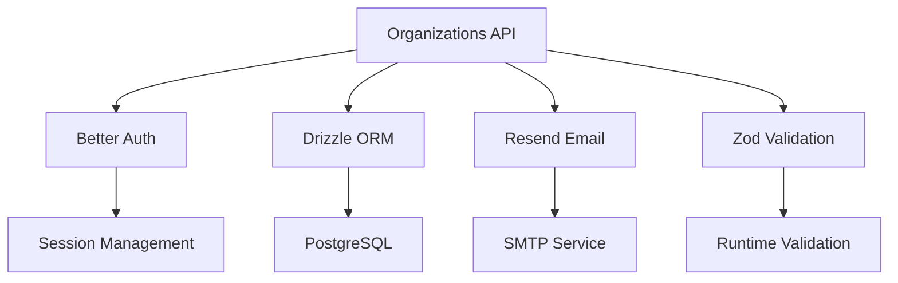

# Organizations API

<cite>
**Referenced Files in This Document**   
- [organizations.ts](file://src/server/api/routers/organizations.ts)
- [auth-organization-utils.ts](file://src/lib/auth-organization-utils.ts)
- [auth-server.ts](file://src/lib/auth-server.ts)
- [schema.ts](file://src/server/db/schema.ts)
- [auth.ts](file://src/config/constants/auth.ts)
</cite>

## Table of Contents
1. [Introduction](#introduction)
2. [Project Structure](#project-structure)
3. [Core Components](#core-components)
4. [Architecture Overview](#architecture-overview)
5. [Detailed Component Analysis](#detailed-component-analysis)
6. [Dependency Analysis](#dependency-analysis)
7. [Performance Considerations](#performance-considerations)
8. [Troubleshooting Guide](#troubleshooting-guide)
9. [Conclusion](#conclusion)

## Introduction
The Organizations API in pukpara provides a comprehensive set of tRPC procedures for managing the lifecycle of tenant organizations within a multi-tenant SaaS platform. This API supports both administrative management and self-service sign-up flows, integrating tightly with Better Auth for secure session handling and tenant isolation. The system enables creation, retrieval, update, approval, and deletion of organizations, with robust workflows for membership management, subscription tracking, and audit logging. Designed with extensibility in mind, it supports various organization types including farmer groups, suppliers, financial institutions, and buyers, each with distinct operational characteristics and compliance requirements.

## Project Structure
The Organizations API is implemented as a modular tRPC router within the server-side API layer of the Next.js application. It interacts with the database through Drizzle ORM and leverages Zod for input validation. The core logic is distributed across several key directories: `src/server/api/routers/` contains the tRPC router definition, `src/lib/` houses utility functions for organization creation and session management, `src/server/db/` defines the database schema, and `src/config/constants/` maintains enumerated types for status and role management.

**Diagram sources**
- [organizations.ts](file://src/server/api/routers/organizations.ts)
- [auth-organization-utils.ts](file://src/lib/auth-organization-utils.ts)
- [auth-server.ts](file://src/lib/auth-server.ts)
- [schema.ts](file://src/server/db/schema.ts)
- [auth.ts](file://src/config/constants/auth.ts)

**Section sources**
- [organizations.ts](file://src/server/api/routers/organizations.ts)
- [schema.ts](file://src/server/db/schema.ts)

## Core Components
The Organizations API consists of five primary tRPC procedures: `list`, `approve`, `delete`, `detail`, and `subscriptions`. These procedures are protected by authentication middleware and enforce role-based access control, ensuring that only platform administrators can perform sensitive operations. The API integrates with Better Auth for session validation and tenant context propagation, maintaining strict data isolation between organizations. Organization creation is handled through utility functions that generate unique slugs and establish initial ownership relationships, while approval workflows trigger email notifications to organization leaders.

**Section sources**
- [organizations.ts](file://src/server/api/routers/organizations.ts#L45-L415)
- [auth-organization-utils.ts](file://src/lib/auth-organization-utils.ts#L1-L217)

## Architecture Overview
The Organizations API follows a clean architecture pattern with clear separation between routing, business logic, and data access layers. tRPC procedures serve as entry points that validate input using Zod schemas, enforce authorization policies, and orchestrate database operations through Drizzle ORM. The system maintains referential integrity through foreign key constraints and uses transactional updates to ensure consistency during approval workflows. Multi-tenancy is enforced at the database level through organization-scoped queries and membership relationships.

**Diagram sources**
- [organizations.ts](file://src/server/api/routers/organizations.ts)
- [auth-server.ts](file://src/lib/auth-server.ts)
- [schema.ts](file://src/server/db/schema.ts)

## Detailed Component Analysis

### Organization Lifecycle Management
The Organizations API provides comprehensive CRUD operations for managing organization records throughout their lifecycle. Creation occurs during user sign-up or administrative provisioning, retrieval is supported through paginated listing and detailed lookup, updates are performed via approval workflows, and deletion allows for cleanup of inactive tenants. Each operation enforces data integrity through database constraints and application-level validation.

#### For Object-Oriented Components:

**Diagram sources**
- [schema.ts](file://src/server/db/schema.ts#L200-L250)
- [auth.ts](file://src/config/constants/auth.ts#L1-L75)

**Section sources**
- [organizations.ts](file://src/server/api/routers/organizations.ts#L45-L415)
- [schema.ts](file://src/server/db/schema.ts#L200-L250)

### Approval Workflow
The approval workflow is a critical component of the organization lifecycle, transitioning organizations from pending to active status. This process involves updating the organization status, approving associated user accounts, and notifying leadership members via email. The workflow is transactional, ensuring that all related updates succeed or fail together, maintaining system consistency.

#### For API/Service Components:

**Diagram sources**
- [organizations.ts](file://src/server/api/routers/organizations.ts#L100-L180)
- [auth-organization-utils.ts](file://src/lib/auth-organization-utils.ts#L100-L150)

### Self-Service Sign-Up Flow
The self-service sign-up flow enables new users to create their own organizations during registration. This process uses utility functions to generate default organization data, including name, slug, and type. The system ensures uniqueness through slug generation algorithms and establishes the signing user as the initial owner of the organization.

#### For Complex Logic Components:

**Diagram sources**
- [auth-organization-utils.ts](file://src/lib/auth-organization-utils.ts#L50-L150)

**Section sources**
- [auth-organization-utils.ts](file://src/lib/auth-organization-utils.ts#L1-L217)

## Dependency Analysis
The Organizations API has well-defined dependencies on authentication, database, and email services. It depends on Better Auth for session management and role validation, Drizzle ORM for database interactions, and Resend for email notifications. The system maintains loose coupling through interface abstraction, allowing for replacement of underlying implementations without affecting core logic.

**Diagram sources**
- [organizations.ts](file://src/server/api/routers/organizations.ts)
- [auth-server.ts](file://src/lib/auth-server.ts)
- [auth-organization-utils.ts](file://src/lib/auth-organization-utils.ts)

**Section sources**
- [organizations.ts](file://src/server/api/routers/organizations.ts#L1-L415)
- [auth-server.ts](file://src/lib/auth-server.ts#L1-L54)
- [auth-organization-utils.ts](file://src/lib/auth-organization-utils.ts#L1-L217)

## Performance Considerations
The Organizations API is designed with performance in mind, using efficient database queries with proper indexing and pagination. The list endpoint supports configurable page sizes with a maximum limit to prevent excessive resource consumption. Database operations use batch processing where appropriate, and the approval workflow processes multiple organizations in a single transaction when possible. Indexes on frequently queried fields such as organization status, region, and district ensure fast lookup performance.

## Troubleshooting Guide
Common issues with the Organizations API include duplicate organization names, approval status inconsistencies, and email delivery failures. When organizations fail to appear in listings, verify the organization status and ensure the querying user has appropriate permissions. For approval workflow issues, check transaction boundaries and email service connectivity. If slug conflicts occur, verify the uniqueness constraint enforcement in the database. Monitor audit logs for unauthorized access attempts and validate that session context is properly propagated through the middleware chain.

**Section sources**
- [organizations.ts](file://src/server/api/routers/organizations.ts#L100-L180)
- [auth-server.ts](file://src/lib/auth-server.ts#L40-L54)
- [schema.ts](file://src/server/db/schema.ts#L200-L250)

## Conclusion
The Organizations API in pukpara provides a robust foundation for multi-tenant organization management, with comprehensive lifecycle controls, secure authentication integration, and scalable architecture. By leveraging tRPC for type-safe APIs, Drizzle ORM for database interactions, and Zod for input validation, the system ensures reliability and maintainability. The separation of concerns between routing, business logic, and data access enables independent evolution of components while maintaining system integrity. Future enhancements could include webhook notifications for state changes, enhanced audit logging, and more granular permission controls for organization management.