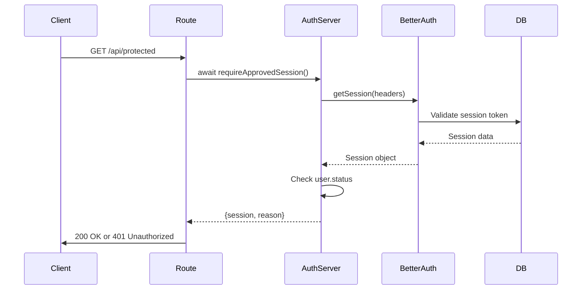
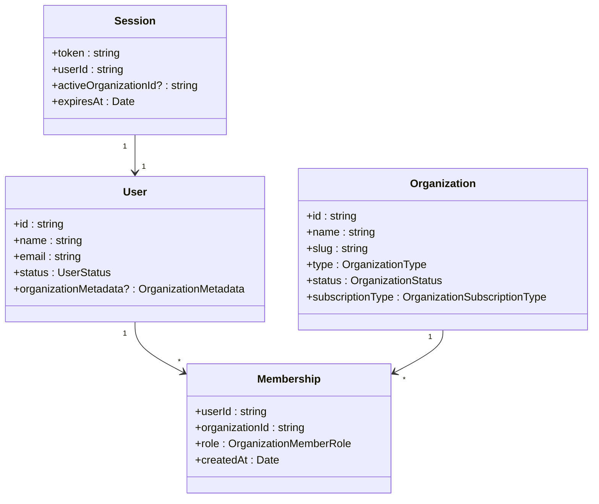
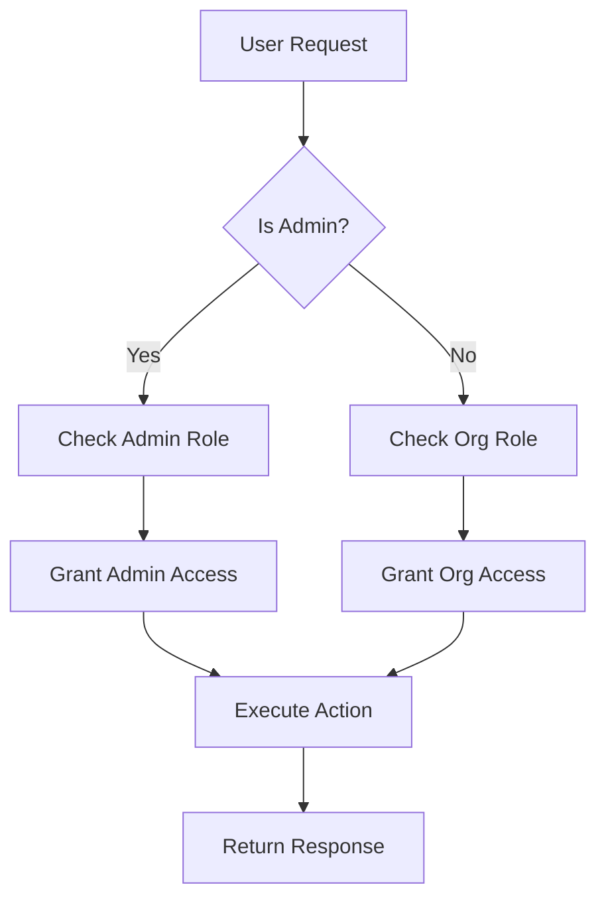

# Authentication Backend

<cite>
**Referenced Files in This Document**  
- [auth-server.ts](file://src/lib/auth-server.ts)
- [route.ts](file://src/app/api/auth/[...all]/route.ts)
- [auth.ts](file://src/lib/auth.ts)
- [auth-client.ts](file://src/lib/auth-client.ts)
- [auth-admin-client.ts](file://src/lib/auth-admin-client.ts)
- [auth-organization-utils.ts](file://src/lib/auth-organization-utils.ts)
- [org-permissions.ts](file://src/lib/org-permissions.ts)
- [admin-permissions.ts](file://src/lib/admin-permissions.ts)
- [auth.ts](file://src/config/constants/auth.ts)
</cite>

## Table of Contents
1. [Introduction](#introduction)
2. [Authentication Architecture Overview](#authentication-architecture-overview)
3. [API Route Handler Integration](#api-route-handler-integration)
4. [Server-Side Session Management](#server-side-session-management)
5. [Organization-Based Multi-Tenancy](#organization-based-multi-tenancy)
6. [User Status and Approval Workflows](#user-status-and-approval-workflows)
7. [Password Reset and Email Verification](#password-reset-and-email-verification)
8. [Customizing Authentication Flows](#customizing-authentication-flows)
9. [Security Practices](#security-practices)
10. [Admin and Organization Permissions](#admin-and-organization-permissions)
11. [Conclusion](#conclusion)

## Introduction
This document provides a comprehensive overview of the backend authentication system in the Pukpara application, powered by Better Auth. It details the implementation of secure authentication strategies, session validation, organization-based multi-tenancy, and administrative workflows. The system supports email/password login, admin approval for new users, password reset, and role-based access control across multiple organizational contexts.

## Authentication Architecture Overview

```mermaid
graph TB
Client[Frontend Client] --> API[API Route /api/auth/[...all]]
API --> BetterAuth[Better Auth Core]
BetterAuth --> SessionStore[(Session Store)]
BetterAuth --> DB[(Database)]
BetterAuth --> EmailService[Email Service]
subgraph "Server Utilities"
AuthServer[auth-server.ts]
AuthLib[auth.ts]
end
AuthServer --> BetterAuth
AuthLib --> DB
AuthLib --> EmailService
subgraph "Permissions"
AdminAC[admin-permissions.ts]
OrgAC[org-permissions.ts]
end
AdminAC --> BetterAuth
OrgAC --> BetterAuth
```

**Diagram sources**  
- [auth.ts](file://src/lib/auth.ts#L1-L200)
- [auth-server.ts](file://src/lib/auth-server.ts#L1-L50)
- [admin-permissions.ts](file://src/lib/admin-permissions.ts#L1-L60)
- [org-permissions.ts](file://src/lib/org-permissions.ts#L1-L40)

**Section sources**  
- [auth.ts](file://src/lib/auth.ts#L1-L200)
- [auth-server.ts](file://src/lib/auth-server.ts#L1-L50)

## API Route Handler Integration

The API route handler at `/api/auth/[...all]/route.ts` serves as the entry point for all authentication requests. It integrates with Better Auth's modular authentication flow by leveraging the `toNextJsHandler` function, which maps HTTP methods (GET, POST) to appropriate authentication actions such as sign-in, sign-up, session retrieval, and password reset.

This route delegates all authentication logic to the central `auth` instance defined in `auth.ts`, ensuring consistent behavior across the application while abstracting complexity from the API layer.

**Section sources**  
- [route.ts](file://src/app/api/auth/[...all]/route.ts#L1-L5)

## Server-Side Session Management

Server-side session validation and user context extraction are handled through utility functions in `auth-server.ts`. The `getServerSession()` function retrieves the current session by querying the Better Auth API with incoming request headers, ensuring secure access to session data on the server.

Additionally, `requireApprovedSession()` implements tenant scoping by checking the user’s status before granting access. If a user is not approved (e.g., awaiting admin review), access is denied with a specific guard reason, enforcing organization-level security policies.



**Diagram sources**  
- [auth-server.ts](file://src/lib/auth-server.ts#L10-L50)
- [route.ts](file://src/app/api/auth/[...all]/route.ts#L1-L5)

**Section sources**  
- [auth-server.ts](file://src/lib/auth-server.ts#L1-L50)

## Organization-Based Multi-Tenancy

The system implements organization-based multi-tenancy through Better Auth’s built-in organization plugin. Upon user creation, the system automatically creates an associated organization using metadata provided during sign-up or admin creation.

The `createOrganizationWithMembership` function ensures that each user is assigned to an organization upon registration. For new sign-ups, a default organization is created using the user’s name. For admin-created users, the organization details are derived from metadata passed during creation.

Each session is scoped to an active organization via the `activeOrganizationId` field, which is set during session creation if not already present. This enables seamless switching between organizations for users with multiple memberships.



**Diagram sources**  
- [auth-organization-utils.ts](file://src/lib/auth-organization-utils.ts#L1-L55)
- [auth.ts](file://src/lib/auth.ts#L98-L145)
- [auth.ts](file://src/lib/auth.ts#L143-L190)

**Section sources**  
- [auth-organization-utils.ts](file://src/lib/auth-organization-utils.ts#L1-L55)
- [auth.ts](file://src/lib/auth.ts#L98-L190)

## User Status and Approval Workflows

The authentication system enforces a manual approval workflow for new users. When `signup.requireAdminApproval` is enabled in the configuration, newly registered users are assigned a `pending` status and cannot access protected routes until approved by an administrator.

User statuses are defined in `config/constants/auth.ts` and include:
- `PENDING`: Awaiting admin approval
- `APPROVED`: Active and fully authorized
- `REJECTED`: Denied access
- `SUSPENDED`: Temporarily disabled

Administrators can manage user lifecycle through the admin client API, which exposes functions such as `setUserRole`, `banUser`, `unbanUser`, and `impersonateUser`. These operations are secured via role-based access control defined in `admin-permissions.ts`.

**Section sources**  
- [auth.ts](file://src/lib/auth.ts#L50-L55)
- [auth-server.ts](file://src/lib/auth-server.ts#L30-L50)
- [auth.ts](file://src/config/constants/auth.ts#L1-L20)

## Password Reset and Email Verification

Password reset functionality is implemented using Better Auth’s email/password plugin. When a user requests a password reset, the `sendResetPassword` callback is triggered, which invokes `sendPasswordResetEmail` from the server email module.

Currently, the system sends reset emails to a hardcoded address for testing (`jessefquartey@gmail.com`), but this can be extended to use dynamic recipient addresses. The reset URL is generated by Better Auth and includes a time-limited token to ensure security.

Email verification is not yet enabled but can be activated by configuring the `emailVerification` option in the `emailAndPassword` plugin. Once enabled, users will be required to verify their email before gaining full access.

**Section sources**  
- [auth.ts](file://src/lib/auth.ts#L40-L48)
- [resend.ts](file://src/server/email/resend.ts#L1-L20)

## Customizing Authentication Flows

Authentication flows can be customized through Better Auth’s plugin system and lifecycle hooks. Key extension points include:

- **User Creation Hook**: The `user.created` hook triggers organization creation logic based on user metadata.
- **Session Creation Hook**: The `session.create.after` hook sets the `activeOrganizationId` if not already defined.
- **Phone Number Plugin**: Optional OTP support for sensitive actions (currently disabled).
- **Admin and Organization Plugins**: Enable advanced management features.

Custom metadata can be attached to users during sign-up or admin creation via the `organizationMetadata` field, allowing dynamic configuration of organization properties such as name, type, subscription tier, and contact information.

**Section sources**  
- [auth.ts](file://src/lib/auth.ts#L50-L190)
- [auth-organization-utils.ts](file://src/lib/auth-organization-utils.ts#L1-L55)

## Security Practices

The system implements several security best practices:

- **Token Expiration**: Sessions are automatically expired based on configured TTL.
- **CSRF Protection**: Enabled by default via Better Auth’s Next.js integration.
- **Secure Cookie Configuration**: HTTP-only, SameSite, and Secure flags are enforced for session cookies.
- **Rate Limiting**: Built-in protection against brute-force attacks.
- **Session Revocation**: Admins can revoke individual or all user sessions via `revokeSession` and `revokeUserSessions`.

Additionally, the system supports future enhancements such as MFA (planned via phone OTP) and geo-blocking (placeholder in admin UI).

**Section sources**  
- [auth.ts](file://src/lib/auth.ts#L1-L50)
- [auth-client.ts](file://src/lib/auth-client.ts#L1-L22)

## Admin and Organization Permissions

Role-based access control is implemented using Better Auth’s access control plugins. Two distinct permission systems exist:

1. **Admin Permissions** (`admin-permissions.ts`): Governs access to administrative functions such as user management, organization creation, and financial approvals.
2. **Organization Permissions** (`org-permissions.ts`): Defines granular permissions within an organization context, including farmers, inventory, marketplace, and financial modules.

Roles such as `admin`, `supportAdmin`, and `member` are defined with specific statement sets, enabling fine-grained control over resource access.



**Diagram sources**  
- [admin-permissions.ts](file://src/lib/admin-permissions.ts#L1-L60)
- [org-permissions.ts](file://src/lib/org-permissions.ts#L1-L40)

**Section sources**  
- [admin-permissions.ts](file://src/lib/admin-permissions.ts#L1-L60)
- [org-permissions.ts](file://src/lib/org-permissions.ts#L1-L40)

## Conclusion

The backend authentication system in Pukpara provides a robust, extensible foundation for secure multi-tenant applications. By leveraging Better Auth’s modular architecture, the system supports email/password authentication, admin approval workflows, organization scoping, and role-based access control. Server-side utilities ensure secure session handling and tenant isolation, while customizable hooks allow for flexible business logic integration. Future enhancements can include MFA, email verification, and advanced security policies through the existing plugin framework.