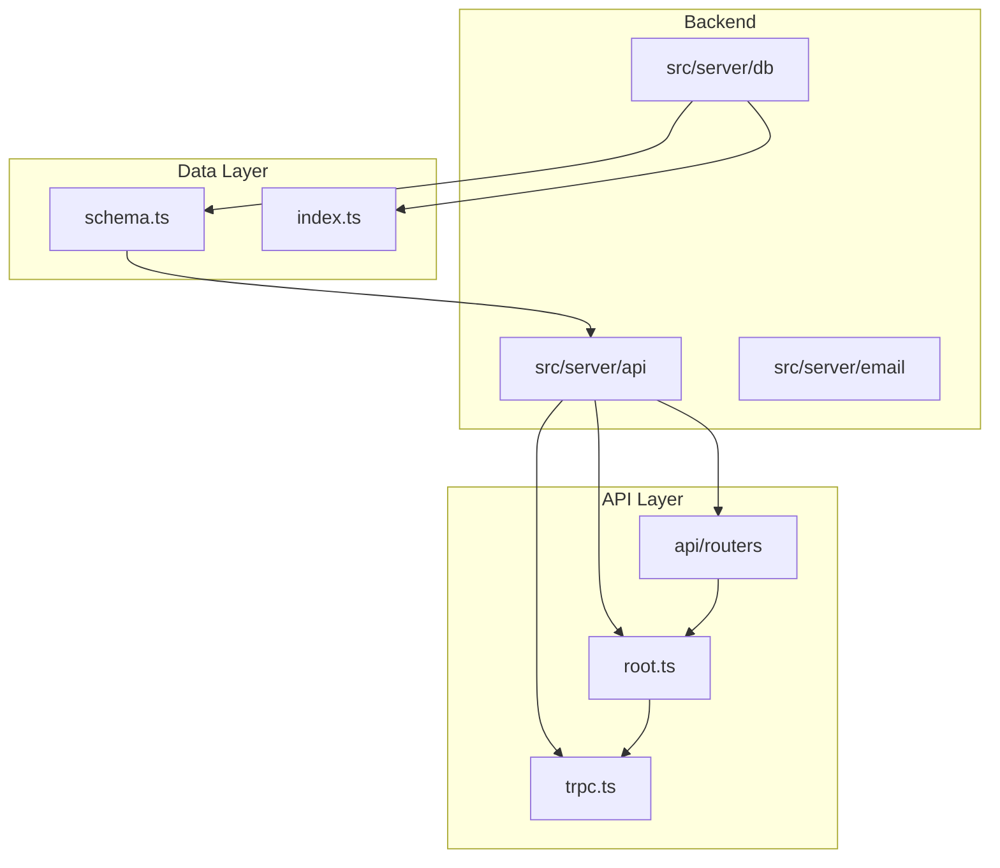
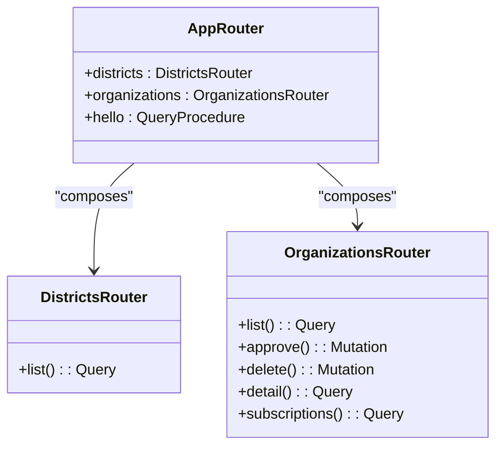
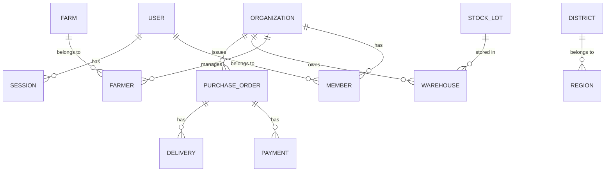
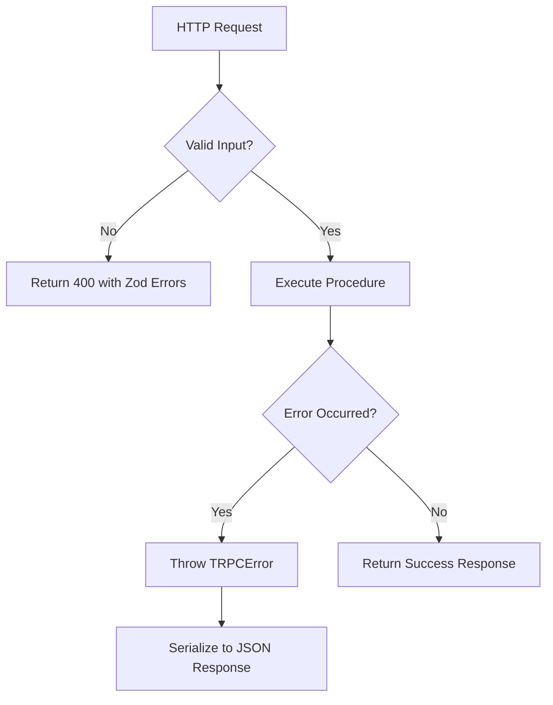
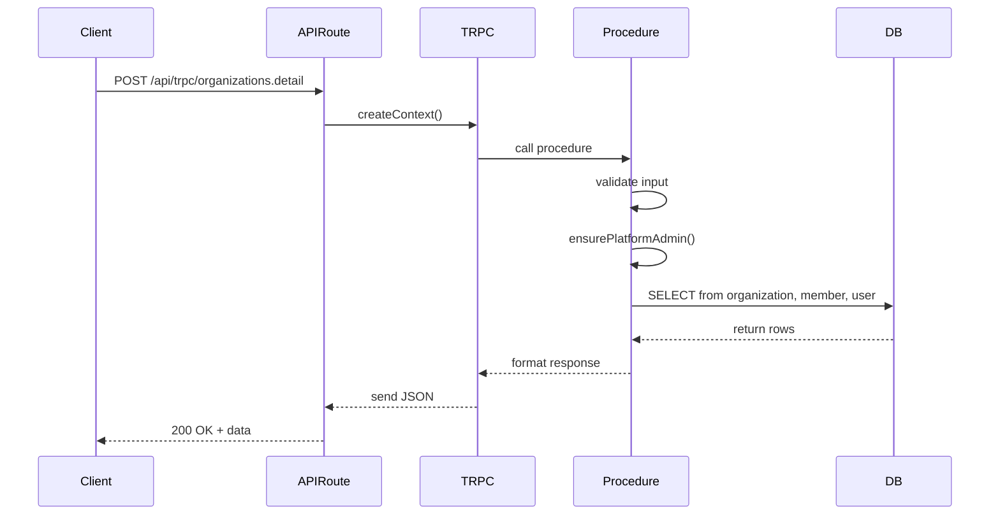

# Backend Architecture

<cite>
**Referenced Files in This Document**   
- [root.ts](file://src/server/api/root.ts)
- [districts.ts](file://src/server/api/routers/districts.ts)
- [organizations.ts](file://src/server/api/routers/organizations.ts)
- [schema.ts](file://src/server/db/schema.ts)
- [route.ts](file://src/app/api/trpc/[trpc]/route.ts)
</cite>

## Table of Contents
1. [Introduction](#introduction)
2. [Project Structure](#project-structure)
3. [tRPC API Design and Router Composition](#trpc-api-design-and-router-composition)
4. [Request Handling via App Router API Route](#request-handling-via-app-router-api-route)
5. [Server-Side Data Access Layer](#server-side-data-access-layer)
6. [Separation of Concerns](#separation-of-concerns)
7. [Error Handling and Input Validation](#error-handling-and-input-validation)
8. [Security Measures at API Layer](#security-measures-at-api-layer)
9. [Data Flow from HTTP Request to Database](#data-flow-from-http-request-to-database)
10. [Conclusion](#conclusion)

## Introduction
The backend architecture of pukpara is built on a robust foundation of end-to-end type safety, modular API design, and secure data access. This document details the implementation of a tRPC-based API layer that ensures type consistency across client and server, leverages router composition for scalability, and integrates with Next.js App Router for server-side request handling. The data persistence layer uses Drizzle ORM for type-safe database interactions, while maintaining clear separation between API endpoints, business logic, and data access. Security, validation, and error handling are enforced at multiple levels to ensure reliability and integrity.

## Project Structure
The project follows a clean architectural separation with distinct directories for server-side logic, database definitions, API routes, and application features. The backend components reside primarily under `src/server`, where the API layer is organized into routers, the database schema is defined, and business logic is encapsulated.

**Diagram sources**
- [root.ts](file://src/server/api/root.ts#L1-L38)
- [schema.ts](file://src/server/db/schema.ts#L1-L799)

**Section sources**
- [root.ts](file://src/server/api/root.ts#L1-L38)
- [schema.ts](file://src/server/db/schema.ts#L1-L799)

## tRPC API Design and Router Composition
The tRPC framework is used to create a strongly-typed API with end-to-end type safety. The primary router is defined in `root.ts` and composes multiple sub-routers such as `districtsRouter` and `organizationsRouter`. This modular approach allows for scalable API development by grouping related endpoints.

Each router exports procedures that define query and mutation operations. Input validation is performed using Zod schemas, ensuring runtime type checking and automatic TypeScript inference. The `createTRPCRouter` utility combines individual routers into a single `appRouter` instance, which serves as the entry point for all API calls.

**Diagram sources**
- [root.ts](file://src/server/api/root.ts#L1-L38)
- [districts.ts](file://src/server/api/routers/districts.ts#L1-L67)
- [organizations.ts](file://src/server/api/routers/organizations.ts#L1-L419)

**Section sources**
- [root.ts](file://src/server/api/root.ts#L1-L38)
- [districts.ts](file://src/server/api/routers/districts.ts#L1-L67)
- [organizations.ts](file://src/server/api/routers/organizations.ts#L1-L419)

## Request Handling via App Router API Route
API requests are handled through the Next.js App Router via the `route.ts` file located at `src/app/api/trpc/[trpc]/route.ts`. This file acts as the HTTP endpoint that bridges incoming requests with the tRPC router. It initializes the tRPC context, including database access and authentication state, before delegating to the appropriate procedure.

The route handler uses `createContext` to provide session and database instances to each tRPC call, enabling authenticated access control and transactional database operations. This integration ensures that all API endpoints benefit from Next.js's server-side rendering capabilities and middleware support.

**Section sources**
- [route.ts](file://src/app/api/trpc/[trpc]/route.ts#L1-L50)

## Server-Side Data Access Layer
Data access is implemented using Drizzle ORM, which provides a type-safe query builder for PostgreSQL. The database schema is defined in `schema.ts`, where tables like `organization`, `user`, `district`, and `region` are declared with explicit relationships and constraints.

Queries are executed through the `db` instance injected into each tRPC procedure's context. Complex joins and aggregations are expressed using Drizzle's fluent API, ensuring both readability and compile-time type checking. For example, the `districtsRouter.list` query performs an inner join between `district` and `region` tables to return hierarchical geographic data.

**Diagram sources**
- [schema.ts](file://src/server/db/schema.ts#L1-L799)
- [organizations.ts](file://src/server/api/routers/organizations.ts#L1-L419)

**Section sources**
- [schema.ts](file://src/server/db/schema.ts#L1-L799)
- [organizations.ts](file://src/server/api/routers/organizations.ts#L1-L419)

## Separation of Concerns
The architecture enforces a clear separation between API endpoints, business logic, and data persistence:

- **API Endpoints**: Defined in tRPC routers, responsible for input validation, authentication, and response formatting.
- **Business Logic**: Encapsulated within procedure implementations, handling workflows such as organization approval, email notifications, and access control.
- **Data Persistence**: Managed by Drizzle ORM queries, abstracted behind the `ctx.db` interface.

For example, the `organizationsRouter.approve` mutation verifies admin privileges, updates organization and user statuses within a transaction, and triggers email notifications—all while maintaining separation between the API contract and implementation details.

**Section sources**
- [organizations.ts](file://src/server/api/routers/organizations.ts#L1-L419)
- [root.ts](file://src/server/api/root.ts#L1-L38)

## Error Handling and Input Validation
Input validation is implemented using Zod schemas attached to each tRPC procedure. These schemas define expected input structures and automatically generate TypeScript types. Invalid inputs result in structured error responses with descriptive messages.

Error handling is centralized using tRPC's `TRPCError` class. Business logic throws `TRPCError` instances with appropriate codes (e.g., `FORBIDDEN`, `NOT_FOUND`, `INTERNAL_SERVER_ERROR`), which are serialized into standardized JSON responses. The `ensurePlatformAdmin` function demonstrates custom authorization logic that throws `FORBIDDEN` errors when access checks fail.

**Diagram sources**
- [organizations.ts](file://src/server/api/routers/organizations.ts#L1-L419)
- [districts.ts](file://src/server/api/routers/districts.ts#L1-L67)

**Section sources**
- [organizations.ts](file://src/server/api/routers/organizations.ts#L1-L419)
- [districts.ts](file://src/server/api/routers/districts.ts#L1-L67)

## Security Measures at API Layer
Security is enforced through multiple mechanisms:

- **Authentication**: Session-based authentication is integrated via `ctx.session.user`, which is validated before critical operations.
- **Authorization**: Role-based access control is implemented using the `ensurePlatformAdmin` function, which checks user roles against an allowed set.
- **Input Sanitization**: Zod validation prevents injection and malformed data.
- **Transaction Safety**: Database operations that affect multiple records (e.g., approving organizations) are wrapped in transactions to ensure atomicity.
- **Rate Limiting & Idempotency**: While not shown in current snippets, the presence of `idempotencyKey` in the `payment` table suggests idempotent operations are supported.

These measures ensure that only authorized users can perform sensitive actions, and that data integrity is maintained during complex operations.

**Section sources**
- [organizations.ts](file://src/server/api/routers/organizations.ts#L1-L419)
- [schema.ts](file://src/server/db/schema.ts#L1-L799)

## Data Flow from HTTP Request to Database
The end-to-end data flow begins with an HTTP request to `/api/trpc/[trpc]`, which is routed to the appropriate tRPC procedure. The request passes through the following stages:

1. **Routing**: The App Router directs the request to the tRPC handler.
2. **Context Creation**: Authentication and database connections are established.
3. **Validation**: Input is validated against Zod schema.
4. **Authorization**: User roles are checked (if required).
5. **Business Logic Execution**: The procedure performs its intended operation.
6. **Database Interaction**: Drizzle ORM queries read/write data.
7. **Response Generation**: Results are returned as JSON.

For example, fetching organization details involves:
- Client calling `trpc.organizations.detail({ organizationId })`
- Server validating input and checking admin role
- Querying `organization`, `member`, and `user` tables
- Returning structured response with organization metadata and leadership info

**Diagram sources**
- [route.ts](file://src/app/api/trpc/[trpc]/route.ts#L1-L50)
- [organizations.ts](file://src/server/api/routers/organizations.ts#L1-L419)
- [schema.ts](file://src/server/db/schema.ts#L1-L799)

**Section sources**
- [route.ts](file://src/app/api/trpc/[trpc]/route.ts#L1-L50)
- [organizations.ts](file://src/server/api/routers/organizations.ts#L1-L419)

## Conclusion
The backend architecture of pukpara exemplifies modern full-stack development practices with a strong emphasis on type safety, modularity, and security. By leveraging tRPC for end-to-end typing, Drizzle ORM for type-safe database access, and Next.js App Router for seamless API integration, the system achieves high developer productivity and runtime reliability. The clear separation of concerns, robust error handling, and layered security model make this architecture scalable and maintainable for complex enterprise applications.