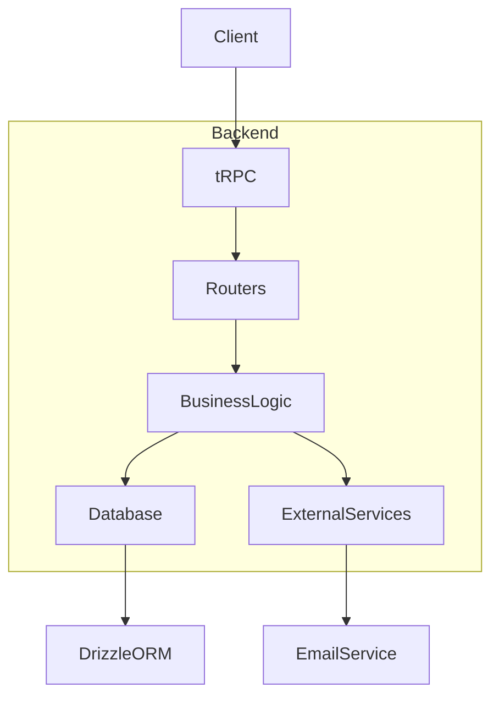
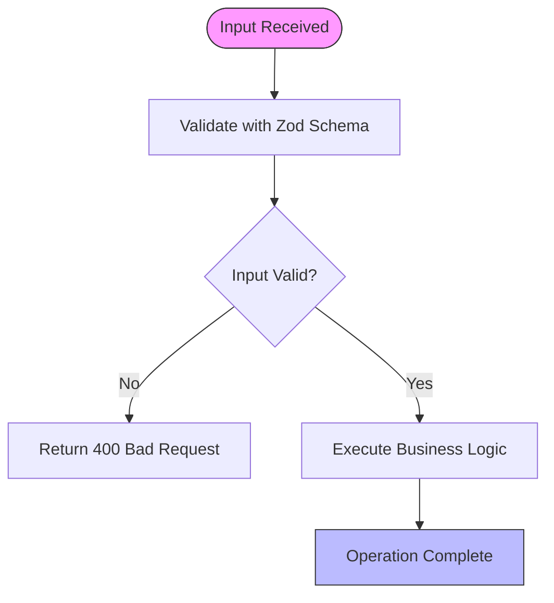
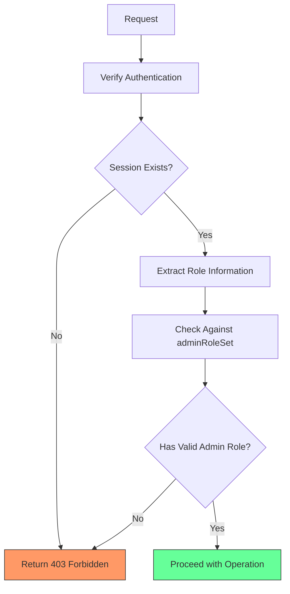
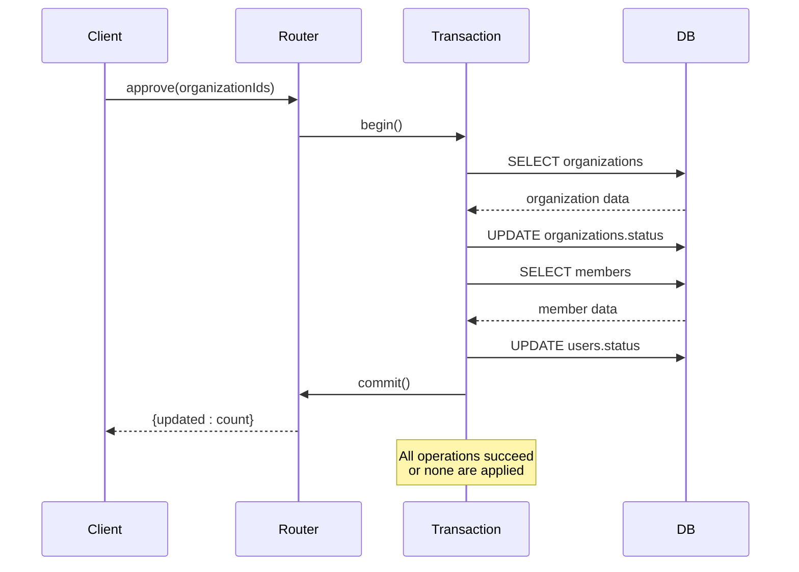
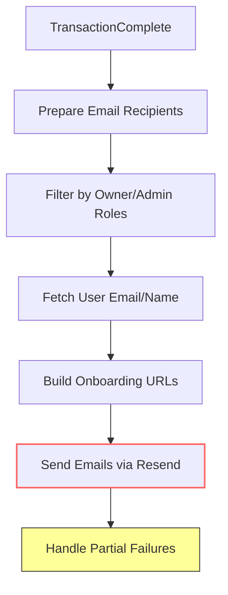

# Business Logic Layer

<cite>
**Referenced Files in This Document**   
- [districts.ts](file://src/server/api/routers/districts.ts)
- [organizations.ts](file://src/server/api/routers/organizations.ts)
- [utils.ts](file://src/lib/utils.ts)
</cite>

## Table of Contents
1. [Introduction](#introduction)
2. [Business Logic Architecture](#business-logic-architecture)
3. [Service Patterns and Separation of Concerns](#service-patterns-and-separation-of-concerns)
4. [Data Validation and Input Sanitization](#data-validation-and-input-sanitization)
5. [Access Control and Authorization](#access-control-and-authorization)
6. [Transaction Handling and Data Integrity](#transaction-handling-and-data-integrity)
7. [Domain-Specific Workflows](#domain-specific-workflows)
8. [Side Effects and External Integrations](#side-effects-and-external-integrations)
9. [Error Handling and Logging](#error-handling-and-logging)
10. [Utility Functions and Shared Logic](#utility-functions-and-shared-logic)

## Introduction
The business logic layer in pukpara's backend implements core domain rules and workflows through tRPC routers, particularly for entities like districts and organizations. This document details how business rules are structured, validated, and executed within the system, focusing on service patterns, data integrity, access control, and integration with external systems. The implementation emphasizes separation of concerns, transactional safety, and maintainable code organization.

## Business Logic Architecture
The business logic is organized within tRPC routers located in the `src/server/api/routers` directory. These routers serve as the primary interface between API endpoints and underlying business operations. The architecture follows a clear separation pattern where routing concerns are decoupled from business logic implementation, allowing for reusable and testable code.



**Diagram sources**
- [organizations.ts](file://src/server/api/routers/organizations.ts#L0-L415)
- [districts.ts](file://src/server/api/routers/districts.ts#L0-L66)

**Section sources**
- [organizations.ts](file://src/server/api/routers/organizations.ts#L0-L415)
- [districts.ts](file://src/server/api/routers/districts.ts#L0-L66)

## Service Patterns and Separation of Concerns
The system employs a service-oriented pattern within tRPC routers to separate business logic from API routing concerns. Each router method encapsulates specific business operations while leveraging shared utilities and database access patterns. The `protectedProcedure` and `publicProcedure` abstractions provide consistent context (ctx) access to the database and session information, enabling clean separation between authentication concerns and business operations.

Business logic is implemented directly within router methods, with complex operations broken down into logical steps. For example, the organization approval workflow combines database transactions with external email notifications, all orchestrated within a single mutation while maintaining clear separation between data manipulation and side effects.

**Section sources**
- [organizations.ts](file://src/server/api/routers/organizations.ts#L0-L415)

## Data Validation and Input Sanitization
Data validation is implemented using Zod schemas directly within tRPC procedure definitions. Input validation occurs at the procedure level, ensuring that all incoming data meets specified requirements before business logic execution. The system validates array lengths, string minimums, and numerical constraints to prevent invalid data from entering the system.

For example, the organization approval mutation validates that the `organizationIds` array contains at least one non-empty string. Similarly, pagination parameters in the list operation enforce minimum and maximum page size limits, preventing resource exhaustion attacks.



**Diagram sources**
- [organizations.ts](file://src/server/api/routers/organizations.ts#L78-L84)
- [organizations.ts](file://src/server/api/routers/organizations.ts#L162-L168)

**Section sources**
- [organizations.ts](file://src/server/api/routers/organizations.ts#L78-L84)
- [organizations.ts](file://src/server/api/routers/organizations.ts#L162-L168)

## Access Control and Authorization
Access control is implemented through the `ensurePlatformAdmin` function, which validates that the authenticated user has appropriate administrative privileges. This function examines multiple role properties in the session object, including direct roles, array roles, and plugin-specific roles, providing flexibility in identity management.

The authorization system uses a whitelist approach with the `adminRoleSet` containing permitted roles ("admin", "supportAdmin", "userAc"). Any user without at least one matching role receives a FORBIDDEN error. This check is applied consistently across administrative operations, ensuring that only authorized personnel can perform sensitive actions like organization approval or deletion.



**Diagram sources**
- [organizations.ts](file://src/server/api/routers/organizations.ts#L16-L60)

**Section sources**
- [organizations.ts](file://src/server/api/routers/organizations.ts#L16-L60)

## Transaction Handling and Data Integrity
The system uses database transactions to ensure data integrity during complex operations. The organization approval process exemplifies this pattern by wrapping multiple database operations in a single transaction, guaranteeing atomicity. If any part of the operation fails, all changes are rolled back, preventing partial updates that could lead to data inconsistency.

Within the transaction, the system first verifies the existence of target organizations, then updates their status to ACTIVE, and finally updates the status of associated users to APPROVED. This sequence ensures that user activation only occurs when the organization has been successfully approved, maintaining referential integrity between related entities.



**Diagram sources**
- [organizations.ts](file://src/server/api/routers/organizations.ts#L185-L205)

**Section sources**
- [organizations.ts](file://src/server/api/routers/organizations.ts#L185-L205)

## Domain-Specific Workflows
The organization approval workflow represents a key domain-specific process in the system. This workflow combines several business rules: organizations must be explicitly approved by platform administrators, approval triggers user activation, and relevant stakeholders receive notification emails. The workflow handles bulk operations efficiently by processing multiple organizations in a single request while eliminating duplicates through Set operations.

The districts listing workflow demonstrates read-oriented business logic, retrieving district data joined with region information and grouping results hierarchically by region. The system sorts results alphabetically while preserving case-insensitive comparison through locale-aware sorting, ensuring consistent presentation across different locales.

**Section sources**
- [organizations.ts](file://src/server/api/routers/organizations.ts#L162-L290)
- [districts.ts](file://src/server/api/routers/districts.ts#L10-L60)

## Side Effects and External Integrations
Side effects are implemented as post-transaction operations, ensuring that business data is committed before triggering external systems. The organization approval process sends email notifications to owners and administrators after successfully updating the database. The system uses a filtered recipient list, only notifying users with OWNER or ADMIN roles, and constructs personalized onboarding URLs for each organization.

Email integration is abstracted through the `sendOrganizationApprovedEmail` function imported from the email service. The system handles email delivery asynchronously using `Promise.allSettled`, ensuring that failures in sending individual emails do not affect the overall approval operation or database transaction.



**Diagram sources**
- [organizations.ts](file://src/server/api/routers/organizations.ts#L225-L290)

**Section sources**
- [organizations.ts](file://src/server/api/routers/organizations.ts#L225-L290)

## Error Handling and Logging
Error handling follows a structured approach using TRPCError for consistent client responses. The system distinguishes between client errors (FORBIDDEN, NOT_FOUND) and server errors (INTERNAL_SERVER_ERROR), providing appropriate HTTP status codes and messages. Validation errors are automatically handled by tRPC based on Zod schemas, while business logic errors are explicitly thrown with descriptive codes.

The organization listing operation wraps database queries in try-catch blocks, converting potential database errors into INTERNAL_SERVER_ERROR responses. This prevents raw database exceptions from leaking to clients while maintaining operational visibility. The system does not implement explicit logging within the business logic layer, relying on external monitoring and error tracking systems.

**Section sources**
- [organizations.ts](file://src/server/api/routers/organizations.ts#L95-L105)
- [organizations.ts](file://src/server/api/routers/organizations.ts#L40-L45)

## Utility Functions and Shared Logic
Utility functions in `src/lib/utils.ts` provide shared logic across the application. The `toSlug` function implements string normalization for URL-safe identifiers, converting text to lowercase, replacing non-alphanumeric characters with hyphens, and removing leading/trailing hyphens. This utility supports consistent slug generation across different entities.

The `cn` function combines class names using `clsx` and `tailwind-merge`, enabling conditional CSS class application while resolving Tailwind CSS conflicts. These utilities are designed to be pure functions without side effects, making them easily testable and reusable across both client and server components.

```mermaid
classDiagram
class Utils {
+cn(...inputs : ClassValue[]) : string
+toSlug(value : string) : string
}
class StringUtility {
+trim() : string
+toLowerCase() : string
+replace(pattern : RegExp, replacement : string) : string
}
class CSSUtility {
+clsx(inputs : ClassValue[]) : string
+twMerge(classes : string) : string
}
Utils --> StringUtility : implements
Utils --> CSSUtility : implements
note right of Utils
Shared utilities used across<br/>both client and server components<br/>Pure functions with no side effects
end note
```

**Diagram sources**
- [utils.ts](file://src/lib/utils.ts#L0-L14)

**Section sources**
- [utils.ts](file://src/lib/utils.ts#L0-L14)