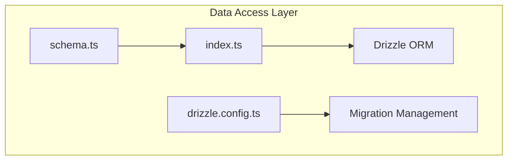
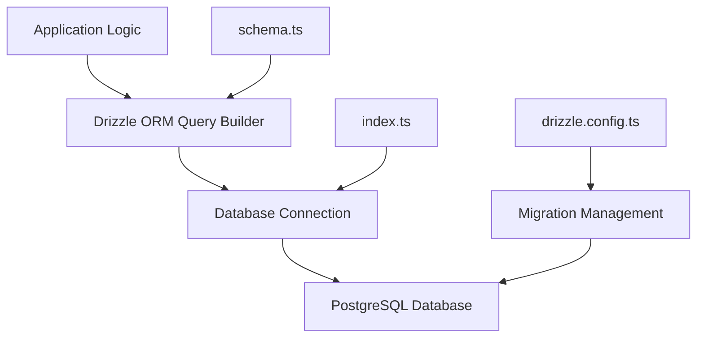
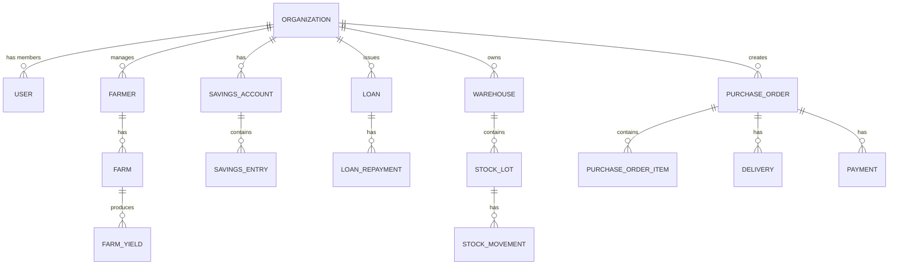
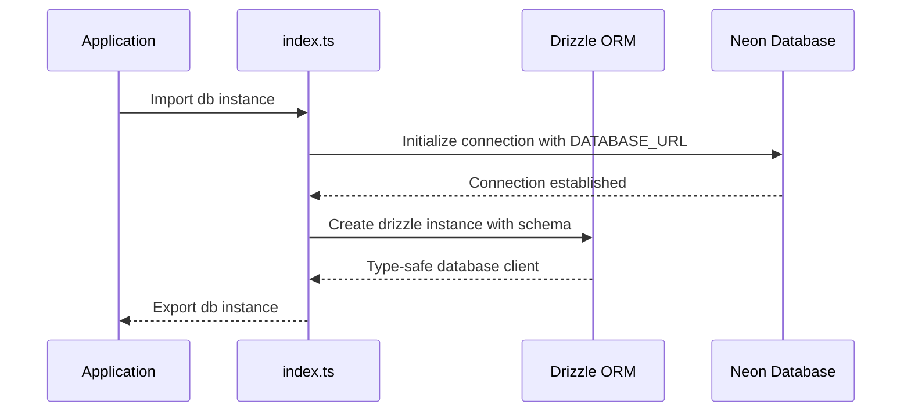
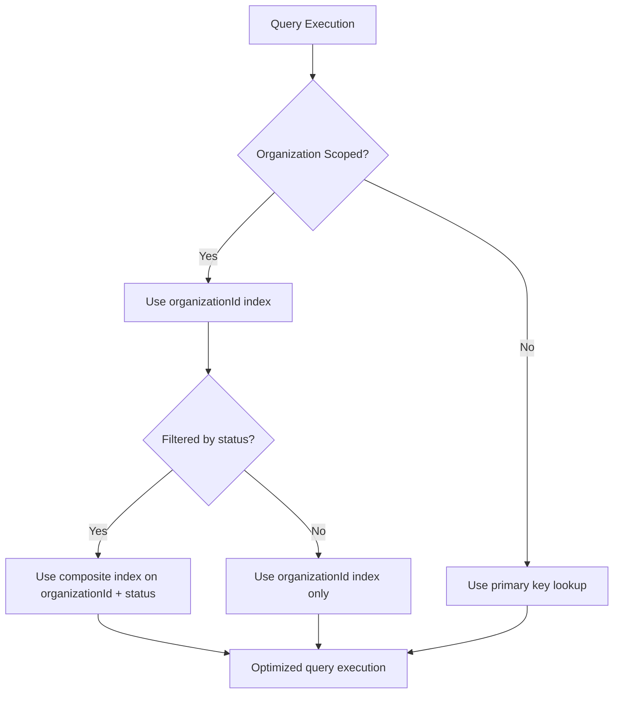

# Data Access Layer

<cite>
**Referenced Files in This Document**   
- [schema.ts](file://src/server/db/schema.ts)
- [index.ts](file://src/server/db/index.ts)
- [drizzle.config.ts](file://drizzle.config.ts)
</cite>

## Table of Contents
1. [Introduction](#introduction)
2. [Project Structure](#project-structure)
3. [Core Components](#core-components)
4. [Architecture Overview](#architecture-overview)
5. [Detailed Component Analysis](#detailed-component-analysis)
6. [Dependency Analysis](#dependency-analysis)
7. [Performance Considerations](#performance-considerations)
8. [Troubleshooting Guide](#troubleshooting-guide)
9. [Conclusion](#conclusion)

## Introduction
This document provides comprehensive documentation for the Data Access Layer of the Pukpara application, which utilizes Drizzle ORM for type-safe database operations. The system is designed to manage agricultural data across multiple domains including farmers, organizations, financial records, and inventory. The documentation covers the database schema definition, connection setup, query patterns, and performance optimization strategies.

## Project Structure
The Data Access Layer is organized within the `src/server/db` directory and consists of two primary files: `schema.ts` for defining the database schema and `index.ts` for establishing the database connection. The schema is structured into logical domains including reference data, farmer management, financial operations, inventory, and marketplace transactions. Drizzle Kit is configured through `drizzle.config.ts` to manage migrations and generate migration files in the `drizzle` directory.



**Diagram sources**
- [schema.ts](file://src/server/db/schema.ts)
- [index.ts](file://src/server/db/index.ts)
- [drizzle.config.ts](file://drizzle.config.ts)

**Section sources**
- [schema.ts](file://src/server/db/schema.ts)
- [index.ts](file://src/server/db/index.ts)
- [drizzle.config.ts](file://drizzle.config.ts)

## Core Components
The Data Access Layer comprises three core components: the database schema definition in `schema.ts`, the connection interface in `index.ts`, and the migration configuration in `drizzle.config.ts`. These components work together to provide a type-safe, efficient, and maintainable interface to the PostgreSQL database. The schema defines over 30 tables organized into coherent domains with proper relationships and constraints.

**Section sources**
- [schema.ts](file://src/server/db/schema.ts#L0-L1318)
- [index.ts](file://src/server/db/index.ts#L0-L12)
- [drizzle.config.ts](file://drizzle.config.ts#L0-L9)

## Architecture Overview
The Data Access Layer architecture is built on Drizzle ORM, providing a type-safe query builder interface to PostgreSQL. The architecture follows a layered approach with clear separation between schema definition, connection management, and migration operations. The system is designed to work in edge environments with support for WebSocket connections through Neon Database.



**Diagram sources**
- [schema.ts](file://src/server/db/schema.ts)
- [index.ts](file://src/server/db/index.ts)
- [drizzle.config.ts](file://drizzle.config.ts)

## Detailed Component Analysis

### Database Schema Definition
The database schema is defined in `schema.ts` using Drizzle ORM's fluent API. The schema is organized into several domains including reference data (region, district), user management (user, session, account), organization management (organization, member, team), farmer domain (farmer, farm, farmCoordinate), financial operations (savingsAccount, loan, loanRepayment), inventory management (commodity, warehouse, stockLot), and marketplace transactions (purchaseOrder, delivery, payment).



**Diagram sources**
- [schema.ts](file://src/server/db/schema.ts#L0-L1318)

**Section sources**
- [schema.ts](file://src/server/db/schema.ts#L0-L1318)

### Database Connection Setup
The database connection is established in `index.ts` using Neon Database's serverless driver with Drizzle ORM. The connection configuration includes WebSocket support for efficient communication and is designed to work in edge environments. The connection pool is configured with the database URL from environment variables.



**Diagram sources**
- [index.ts](file://src/server/db/index.ts#L0-L12)

**Section sources**
- [index.ts](file://src/server/db/index.ts#L0-L12)

### Database Migration Management
Database migrations are managed using Drizzle Kit as configured in `drizzle.config.ts`. The configuration specifies PostgreSQL as the dialect, points to the schema file, and designates the output directory for migration files. This setup enables version control of database schema changes and facilitates team collaboration.

**Section sources**
- [drizzle.config.ts](file://drizzle.config.ts#L0-L9)

## Dependency Analysis
The Data Access Layer has dependencies on several external packages including Drizzle ORM for database operations, Neon Database serverless driver for connection management, and WebSocket for efficient communication in edge environments. The layer provides a clean interface to the rest of the application while encapsulating all database-specific concerns.

```mermaid
graph TD
A[Data Access Layer] --> B[drizzle-orm@0.44.5]
A --> C[@neondatabase/serverless@1.0.1]
A --> D[ws]
B --> E[PostgreSQL]
C --> E
F[Application] --> A
```

**Diagram sources**
- [package.json](file://package.json)
- [pnpm-lock.yaml](file://pnpm-lock.yaml)

**Section sources**
- [index.ts](file://src/server/db/index.ts#L0-L12)
- [drizzle.config.ts](file://drizzle.config.ts#L0-L9)

## Performance Considerations
The Data Access Layer incorporates several performance optimizations including strategically placed indexes, efficient query patterns, and connection pooling. Indexes are defined on frequently queried fields such as organization-scoped records and status fields. The use of Drizzle ORM's type-safe query builder helps prevent N+1 query problems and enables efficient data loading through proper joins.

### Indexing Strategy
The schema includes multiple indexes to optimize query performance, particularly for organization-scoped data access patterns. These include indexes on foreign keys, status fields, and commonly filtered combinations of fields.



**Diagram sources**
- [schema.ts](file://src/server/db/schema.ts)

**Section sources**
- [schema.ts](file://src/server/db/schema.ts)

## Troubleshooting Guide
Common issues with the Data Access Layer typically relate to database connection problems, migration errors, or query performance issues. Connection issues are often caused by incorrect DATABASE_URL configuration or network connectivity problems. Migration issues may arise from schema conflicts or version mismatches between Drizzle ORM and Drizzle Kit.

**Section sources**
- [index.ts](file://src/server/db/index.ts#L0-L12)
- [drizzle.config.ts](file://drizzle.config.ts#L0-L9)

## Conclusion
The Data Access Layer provides a robust, type-safe interface to the PostgreSQL database using Drizzle ORM. The architecture supports efficient data access patterns, proper relationship management, and reliable migration workflows. The layer is well-structured with clear separation of concerns between schema definition, connection management, and migration configuration, making it maintainable and scalable for the agricultural data management needs of the Pukpara application.