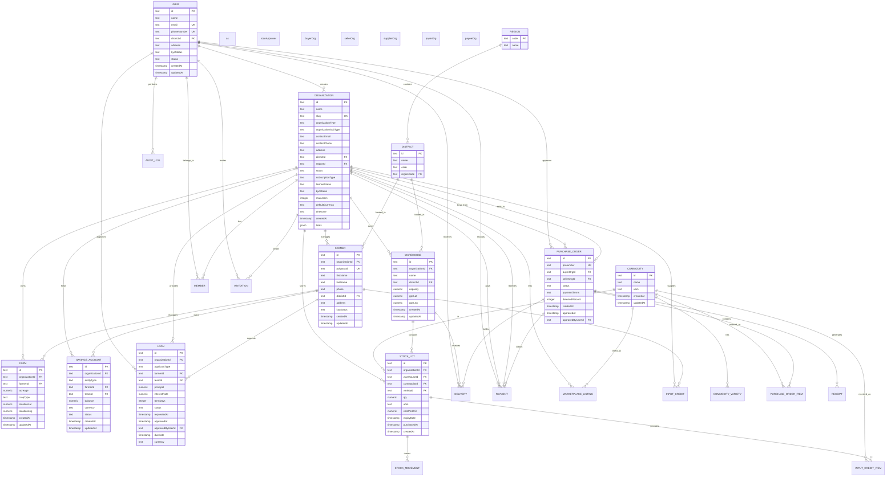
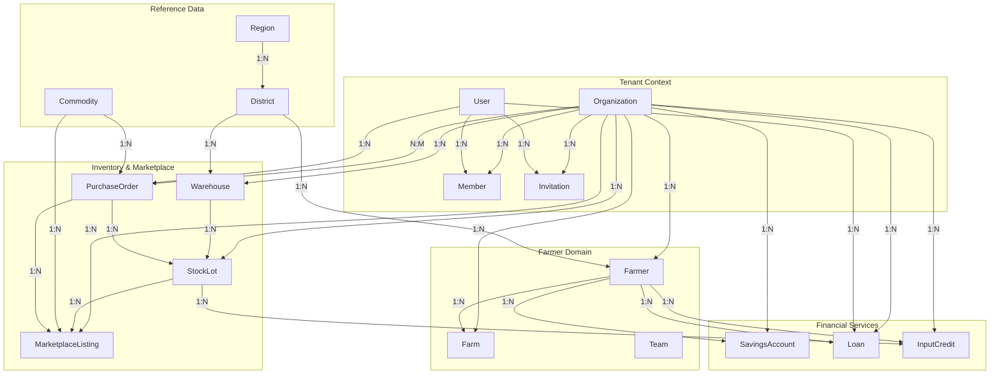

# Data Model & Database Schema

<cite>
**Referenced Files in This Document**   
- [schema.ts](file://src/server/db/schema.ts)
- [auth.ts](file://src/config/constants/auth.ts)
</cite>

## Table of Contents
1. [Introduction](#introduction)
2. [Core Entities](#core-entities)
3. [Multi-Tenancy Implementation](#multi-tenancy-implementation)
4. [Entity Relationships](#entity-relationships)
5. [Database Schema Diagram](#database-schema-diagram)
6. [Data Access Patterns](#data-access-patterns)
7. [Query Performance Considerations](#query-performance-considerations)
8. [Transactional Boundaries](#transactional-boundaries)
9. [Data Validation Rules](#data-validation-rules)
10. [Business Logic Enforcement](#business-logic-enforcement)

## Introduction
The pukpara database schema is designed to support a comprehensive agricultural platform with multi-tenancy capabilities. The system manages farmers, organizations, financial transactions, inventory, and marketplace operations. This document details the primary entities, their relationships, field definitions, constraints, and implementation patterns that enable the platform's functionality.

## Core Entities

### User
The User entity represents platform users with authentication and profile information.

**Fields:**
- `id`: text, primary key
- `name`: text, not null
- `email`: text, not null, unique
- `emailVerified`: boolean, default false
- `phoneNumber`: text, unique
- `districtId`: text, foreign key to district.id
- `address`: text, not null
- `kycStatus`: text, default USER_KYC_STATUS.PENDING
- `status`: text, default USER_STATUS.PENDING
- `role`: text
- `banned`: boolean, default false
- `createdAt`: timestamp, default now
- `updatedAt`: timestamp, default now, auto-updated

**Constraints:**
- Unique constraint on email
- Foreign key constraint on districtId (onDelete: "restrict")

**Section sources**
- [schema.ts](file://src/server/db/schema.ts#L30-L80)

### Organization
The Organization entity serves as the tenant in the multi-tenancy architecture, representing agricultural organizations, suppliers, or financial institutions.

**Fields:**
- `id`: text, primary key
- `name`: text, not null
- `slug`: text, unique
- `organizationType`: text, not null (FARMER_ORG, SUPPLIER, FINANCIAL, BUYER)
- `organizationSubType`: text
- `contactEmail`: text
- `contactPhone`: text
- `address`: text
- `districtId`: text, foreign key to district.id
- `regionId`: text, foreign key to region.code
- `status`: text, default ORGANIZATION_STATUS.PENDING
- `subscriptionType`: text, default ORGANIZATION_SUBSCRIPTION_TYPE.FREEMIUM
- `licenseStatus`: text, default ORGANIZATION_LICENSE_STATUS.ISSUED
- `kycStatus`: text, default ORGANIZATION_KYC_STATUS.PENDING
- `maxUsers`: integer, default 100
- `defaultCurrency`: text, default "GHS"
- `timezone`: text, default "Africa/Accra"
- `createdAt`: timestamp, not null
- `limits`: jsonb

**Constraints:**
- Unique constraint on slug
- Check constraints for status, subscriptionType, licenseStatus, kycStatus
- Foreign key constraints on districtId (onDelete: "set null") and regionId (onDelete: "set null")

**Section sources**
- [schema.ts](file://src/server/db/schema.ts#L153-L188)
- [auth.ts](file://src/config/constants/auth.ts#L52-L74)

### Farmer
The Farmer entity represents individual farmers within an organization, serving as the primary agricultural participant.

**Fields:**
- `id`: text, primary key
- `organizationId`: text, not null, foreign key to organization.id
- `pukparaId`: text, unique (business code)
- `firstName`: text, not null
- `lastName`: text, not null
- `gender`: text
- `dateOfBirth`: timestamp
- `phone`: text
- `isPhoneSmart`: boolean, default false
- `idNumber`: text
- `idType`: text
- `address`: text
- `districtId`: text, foreign key to district.id
- `community`: text
- `householdSize`: integer
- `isLeader`: boolean, default false
- `kycStatus`: text, default "pending"
- `createdAt`: timestamp, default now
- `updatedAt`: timestamp, auto-updated
- `isDeleted`: boolean, default false

**Constraints:**
- Unique constraint on organizationId + phone
- Index on organizationId + lastName
- Foreign key constraint on organizationId (onDelete: "cascade")
- Foreign key constraint on districtId (onDelete: "set null")

**Section sources**
- [schema.ts](file://src/server/db/schema.ts#L240-L279)

### Farm
The Farm entity represents agricultural land managed by a farmer, with geographical and agricultural characteristics.

**Fields:**
- `id`: text, primary key
- `organizationId`: text, not null, foreign key to organization.id
- `farmerId`: text, not null, foreign key to farmer.id
- `name`: text
- `acreage`: numeric(12,2)
- `cropType`: text
- `soilType`: text
- `locationLat`: numeric(10,6)
- `locationLng`: numeric(10,6)
- `status`: text, default "active"
- `createdAt`: timestamp, default now
- `updatedAt`: timestamp, auto-updated
- `isDeleted`: boolean, default false

**Constraints:**
- Foreign key constraint on organizationId (onDelete: "cascade")
- Foreign key constraint on farmerId (onDelete: "cascade")

**Section sources**
- [schema.ts](file://src/server/db/schema.ts#L281-L304)

### SavingsAccount
The SavingsAccount entity represents financial accounts for farmers or teams, enabling savings and microfinance operations.

**Fields:**
- `id`: text, primary key
- `organizationId`: text, not null, foreign key to organization.id
- `entityType`: text, not null ("farmer" | "team")
- `farmerId`: text, foreign key to farmer.id
- `teamId`: text, foreign key to team.id
- `balance`: numeric(14,2), default "0"
- `currency`: text, default "GHS"
- `status`: text, default "active"
- `createdAt`: timestamp, default now
- `updatedAt`: timestamp, auto-updated

**Constraints:**
- Unique constraint on organizationId + entityType + farmerId
- Unique constraint on organizationId + entityType + teamId
- Foreign key constraint on organizationId (onDelete: "cascade")
- Foreign key constraint on farmerId (onDelete: "set null")
- Foreign key constraint on teamId (onDelete: "set null")

**Section sources**
- [schema.ts](file://src/server/db/schema.ts#L360-L382)

### Loan
The Loan entity represents financial loans provided to farmers or teams, with detailed terms and status tracking.

**Fields:**
- `id`: text, primary key
- `organizationId`: text, not null, foreign key to organization.id
- `applicantType`: text, not null ("farmer" | "team")
- `farmerId`: text, foreign key to farmer.id
- `teamId`: text, foreign key to team.id
- `principal`: numeric(14,2), not null
- `interestRate`: numeric(5,2), not null (%)
- `termDays`: integer, not null
- `status`: text, default "pending"
- `requestedAt`: timestamp, default now
- `approvedAt`: timestamp
- `approvedByUserId`: text, foreign key to user.id
- `disbursedAt`: timestamp
- `dueDate`: timestamp
- `currency`: text, default "GHS"
- `source`: text
- `metadata`: jsonb

**Constraints:**
- Check constraint: principal > 0
- Check constraint: interestRate >= 0 AND interestRate <= 100
- Check constraint: termDays > 0
- Check constraint: applicantType IN ('farmer', 'team')
- Check constraint: status IN ('pending', 'approved', 'rejected', 'active', 'repaid', 'defaulted')
- Index on organizationId + status + dueDate

**Section sources**
- [schema.ts](file://src/server/db/schema.ts#L416-L470)

### Commodity
The Commodity entity represents agricultural products that can be traded, stored, or processed.

**Fields:**
- `id`: text, primary key
- `name`: text, not null
- `uom`: text, default "kg"
- `imgUrl`: text
- `createdAt`: timestamp, default now
- `updatedAt`: timestamp, auto-updated

**Constraints:**
- No additional constraints beyond primary key

**Section sources**
- [schema.ts](file://src/server/db/schema.ts#L496-L503)

### Warehouse
The Warehouse entity represents storage facilities owned by organizations for agricultural commodities.

**Fields:**
- `id`: text, primary key
- `organizationId`: text, not null, foreign key to organization.id
- `name`: text, not null
- `description`: text
- `districtId`: text, foreign key to district.id
- `community`: text
- `capacity`: numeric(14,2)
- `gpsLat`: numeric(10,6)
- `gpsLng`: numeric(10,6)
- `createdAt`: timestamp, default now
- `updatedAt`: timestamp, auto-updated

**Constraints:**
- Foreign key constraint on organizationId (onDelete: "cascade")
- Foreign key constraint on districtId (onDelete: "set null")

**Section sources**
- [schema.ts](file://src/server/db/schema.ts#L515-L531)

### StockLot
The StockLot entity represents batches of commodities stored in warehouses, with detailed inventory tracking.

**Fields:**
- `id`: text, primary key
- `organizationId`: text, not null, foreign key to organization.id
- `warehouseId`: text, not null, foreign key to warehouse.id
- `commodityId`: text, not null, foreign key to commodity.id
- `varietyId`: text, foreign key to commodityVariety.id
- `batchNumber`: text
- `qty`: numeric(14,2), not null
- `uom`: text, default "kg"
- `costPerUnit`: numeric(14,2)
- `expiryDate`: timestamp
- `supplierName`: text
- `purchasedAt`: timestamp
- `createdAt`: timestamp, default now

**Constraints:**
- Foreign key constraint on organizationId (onDelete: "cascade")
- Foreign key constraint on warehouseId (onDelete: "cascade")
- Foreign key constraint on commodityId (onDelete: "cascade")
- Foreign key constraint on varietyId (onDelete: "set null")

**Section sources**
- [schema.ts](file://src/server/db/schema.ts#L533-L555)

### PurchaseOrder
The PurchaseOrder entity represents agreements between buyer and seller organizations for commodity transactions.

**Fields:**
- `id`: text, primary key
- `poNumber`: text, not null (human-friendly)
- `buyerOrgId`: text, not null, foreign key to organization.id
- `sellerOrgId`: text, not null, foreign key to organization.id
- `status`: text, default "pending"
- `paymentTerms`: text, default "net7"
- `deferredPercent`: integer
- `createdAt`: timestamp, default now
- `approvedAt`: timestamp
- `approvedByUserId`: text, foreign key to user.id
- `metadata`: jsonb

**Constraints:**
- Unique constraint on poNumber
- Check constraint: status IN ('pending', 'confirmed', 'fulfilled', 'cancelled')
- Check constraint: paymentTerms IN ('net7', 'net30', 'immediate')
- Check constraint: deferredPercent >= 0 AND deferredPercent <= 100
- Index on buyerOrgId + status
- Index on sellerOrgId + status

**Section sources**
- [schema.ts](file://src/server/db/schema.ts#L624-L662)

## Multi-Tenancy Implementation

The pukpara platform implements a multi-tenancy architecture using the organizationId foreign key pattern across all tenant-specific entities. This approach ensures data isolation between organizations while maintaining a shared database infrastructure.

**Key Implementation Details:**

1. **Tenant Identification**: Each organization is assigned a unique identifier (id) that serves as the primary tenant identifier.

2. **Data Isolation**: All tenant-specific entities include an organizationId field that references the organization table, ensuring that data belongs to exactly one organization.

3. **Cascade Deletion**: When an organization is deleted, all associated records are automatically removed through onDelete: "cascade" constraints, maintaining referential integrity.

4. **Indexing Strategy**: Most tenant-specific tables include indexes that begin with organizationId, optimizing queries that filter by tenant.

5. **Cross-Tenant Relationships**: Some entities like PurchaseOrder reference organization twice (buyer and seller), enabling transactions between different organizations.

**Tenant-Specific Entities:**
- Farmer
- Farm
- SavingsAccount
- Loan
- Warehouse
- StockLot
- MarketplaceListing
- PurchaseOrder (via buyer/seller relationships)

**Section sources**
- [schema.ts](file://src/server/db/schema.ts#L153-L188)
- [schema.ts](file://src/server/db/schema.ts#L240-L279)
- [schema.ts](file://src/server/db/schema.ts#L281-L304)

## Entity Relationships



**Diagram sources**
- [schema.ts](file://src/server/db/schema.ts)
- [auth.ts](file://src/config/constants/auth.ts)

## Database Schema Diagram



**Diagram sources**
- [schema.ts](file://src/server/db/schema.ts)

## Data Access Patterns

The pukpara database schema supports several key data access patterns that reflect the platform's business operations:

### Tenant-Scoped Queries
Most queries are scoped to a specific organization, leveraging the organizationId field as the primary filter. This pattern ensures data isolation and enables efficient indexing.

```sql
-- Example: Get all farmers for an organization
SELECT * FROM farmer WHERE organization_id = 'org_123';
```

### Hierarchical Data Retrieval
The system supports hierarchical data retrieval, particularly in the farmer domain where organizations contain farmers who manage farms.

```sql
-- Example: Get organization with its farmers and their farms
SELECT o.name, f.first_name, f.last_name, fm.name, fm.acreage
FROM organization o
JOIN farmer f ON f.organization_id = o.id
JOIN farm fm ON fm.farmer_id = f.id
WHERE o.id = 'org_123';
```

### Financial Aggregation
The schema supports financial aggregations across various entities, particularly for savings accounts and loans.

```sql
-- Example: Get total loan portfolio by status
SELECT status, SUM(principal) as total
FROM loan
WHERE organization_id = 'org_123'
GROUP BY status;
```

### Inventory Tracking
The inventory system supports tracking stock lots through their lifecycle with movement records.

```sql
-- Example: Get current stock levels by commodity
SELECT c.name, SUM(sl.qty) as total_qty
FROM stock_lot sl
JOIN commodity c ON c.id = sl.commodity_id
WHERE sl.organization_id = 'org_123'
GROUP BY c.name;
```

### Marketplace Operations
The marketplace supports listing and purchase order operations that connect buyers and sellers.

```sql
-- Example: Find available listings for a commodity
SELECT ml.id, ml.quantity, ml.price, o.name as seller_name
FROM marketplace_listing ml
JOIN organization o ON o.id = ml.organization_id
JOIN commodity c ON c.id = ml.commodity_id
WHERE c.name = 'Maize' AND ml.status = 'available';
```

**Section sources**
- [schema.ts](file://src/server/db/schema.ts)

## Query Performance Considerations

The pukpara database schema includes several performance optimizations to ensure efficient query execution:

### Indexing Strategy
The schema implements a comprehensive indexing strategy focused on common query patterns:

1. **Organization-Scoped Indexes**: Most tables include indexes that begin with organizationId, followed by other commonly filtered fields:
   - `idx_farmer_org_lastname` on (organizationId, lastName)
   - `idx_loan_org_status_due` on (organizationId, status, dueDate)
   - `idx_po_buyer_status` on (buyerOrgId, status)
   - `idx_po_seller_status` on (sellerOrgId, status)

2. **Unique Constraints**: Critical fields have unique constraints to ensure data integrity and provide indexing:
   - User email
   - Organization slug
   - Purchase order number
   - Farmer phone per organization

3. **Composite Indexes**: Tables with multiple filtering criteria have composite indexes:
   - Savings entries: (organizationId, createdAt)
   - Stock movements: (stockLotId, createdAt)

### Query Optimization Recommendations

1. **Always Filter by Organization**: When querying tenant-specific data, always include the organizationId filter to leverage partitioning and indexing.

2. **Use Covering Indexes**: The existing indexes are designed to cover common query patterns. For example, the loan status index includes dueDate, enabling efficient due date filtering within status groups.

3. **Avoid N+1 Queries**: Use JOINs or batch queries to retrieve related data rather than making multiple round trips.

4. **Leverage Materialized Views**: For complex aggregations (e.g., financial reports), consider creating materialized views to improve performance.

5. **Pagination**: Use cursor-based pagination with indexed fields rather than OFFSET/LIMIT for large datasets.

**Section sources**
- [schema.ts](file://src/server/db/schema.ts)

## Transactional Boundaries

The pukpara system defines clear transactional boundaries to ensure data consistency across related operations:

### Financial Transactions
Financial operations that affect multiple entities are wrapped in transactions to maintain consistency:

```typescript
// Example: Loan disbursement transaction
async function disburseLoan(loanId, disbursementDetails) {
  return await db.transaction(async (tx) => {
    // Update loan status and disbursement details
    await tx.update(loan)
      .set({
        status: 'active',
        disbursedAt: new Date(),
        ...disbursementDetails
      })
      .where(eq(loan.id, loanId));
    
    // Create initial repayment schedule
    const repayments = generateRepaymentSchedule(loan);
    await tx.insert(loanRepayment).values(repayments);
    
    // Update audit log
    await tx.insert(auditLog).values({
      action: 'loan.disburse',
      entity: `loan:${loanId}`,
      actorUserId: currentUser.id
    });
  });
}
```

### Inventory Operations
Inventory movements that affect stock levels are transactional to prevent inconsistencies:

```typescript
// Example: Stock receipt transaction
async function receiveStock(stockLotId, quantity, details) {
  return await db.transaction(async (tx) => {
    // Create stock movement record
    await tx.insert(stockMovement).values({
      stockLotId,
      type: 'in',
      qty: quantity,
      ...details
    });
    
    // Update stock lot quantity
    await tx.update(stockLot)
      .set({
        qty: sql`${stockLot.qty} + ${quantity}`
      })
      .where(eq(stockLot.id, stockLotId));
  });
}
```

### Purchase Order Fulfillment
Purchase order fulfillment involves multiple steps that must be consistent:

```typescript
// Example: PO fulfillment transaction
async function fulfillPurchaseOrder(poId, deliveryDetails) {
  return await db.transaction(async (tx) => {
    // Create delivery record
    const delivery = await tx.insert(delivery).values({
      purchaseOrderId: poId,
      ...deliveryDetails
    }).returning();
    
    // Update PO status if fully delivered
    const items = await tx.select().from(purchaseOrderItem)
      .where(eq(purchaseOrderItem.purchaseOrderId, poId));
    
    const totalOrdered = items.reduce((sum, item) => sum + item.qty, 0);
    const totalDelivered = delivery.deliveredQty || 0;
    
    if (totalDelivered >= totalOrdered) {
      await tx.update(purchaseOrder)
        .set({ status: 'fulfilled' })
        .where(eq(purchaseOrder.id, poId));
    }
    
    return delivery;
  });
}
```

**Section sources**
- [schema.ts](file://src/server/db/schema.ts)

## Data Validation Rules

The pukpara database schema implements comprehensive data validation rules at the database level to ensure data integrity:

### Check Constraints
The schema uses check constraints to enforce business rules:

1. **Savings Entry**: Amount cannot be zero
   ```sql
   CHECK (amount != 0)
   ```

2. **Savings Entry Type**: Must be valid type
   ```sql
   CHECK (type IN ('contribution', 'withdrawal', 'adjustment'))
   ```

3. **Loan Principal**: Must be positive
   ```sql
   CHECK (principal > 0)
   ```

4. **Loan Interest Rate**: Must be between 0 and 100
   ```sql
   CHECK (interestRate >= 0 AND interestRate <= 100)
   ```

5. **Loan Term Days**: Must be positive
   ```sql
   CHECK (termDays > 0)
   ```

6. **Loan Status**: Must be valid status
   ```sql
   CHECK (status IN ('pending', 'approved', 'rejected', 'active', 'repaid', 'defaulted'))
   ```

7. **Stock Movement Quantity**: Cannot be zero
   ```sql
   CHECK (qty != 0)
   ```

8. **Stock Movement Type**: Must be valid type
   ```sql
   CHECK (type IN ('in', 'out', 'adjustment', 'reserve', 'release'))
   ```

9. **Purchase Order Status**: Must be valid status
   ```sql
   CHECK (status IN ('pending', 'confirmed', 'fulfilled', 'cancelled'))
   ```

10. **Purchase Order Payment Terms**: Must be valid terms
    ```sql
    CHECK (paymentTerms IN ('net7', 'net30', 'immediate'))
    ```

11. **Purchase Order Deferred Percent**: Must be between 0 and 100
    ```sql
    CHECK (deferredPercent >= 0 AND deferredPercent <= 100)
    ```

12. **Receipt Total Amount**: Must be positive
    ```sql
    CHECK (totalAmount > 0)
    ```

13. **Payment Amount**: Must be positive
    ```sql
    CHECK (amount > 0)
    ```

14. **Payment Fee**: Must be non-negative
    ```sql
    CHECK (feeAmount >= 0)
    ```

15. **Payment Status**: Must be valid status
    ```sql
    CHECK (status IN ('pending', 'completed', 'failed', 'cancelled'))
    ```

### Foreign Key Constraints
The schema uses foreign key constraints with appropriate onDelete behaviors:

1. **Cascade Deletion**: When a parent record is deleted, related records are automatically deleted:
   - Organization → Farmer, Farm, Loan, etc.
   - Loan → LoanRepayment
   - StockLot → StockMovement

2. **Set Null**: When a referenced record is deleted, the foreign key is set to null:
   - Farmer → SavingsAccount, Loan
   - Team → SavingsAccount, Loan
   - User → Loan approval, PurchaseOrder approval

3. **Restrict Deletion**: Prevent deletion of referenced records:
   - District → Farmer (restrict)

**Section sources**
- [schema.ts](file://src/server/db/schema.ts)

## Business Logic Enforcement

The pukpara database schema enforces key business logic at the database level to ensure consistency and integrity:

### Multi-Tenancy Enforcement
The organizationId foreign key pattern ensures that all tenant-specific data is properly scoped and isolated. This prevents cross-tenant data access and ensures that queries are automatically scoped to the current organization.

### Financial Integrity
The financial system enforces several critical business rules:

1. **Positive Amounts**: All monetary amounts must be positive (except adjustments which can be negative but not zero).

2. **Status Transitions**: The system enforces valid status transitions through application logic, with database constraints ensuring only valid statuses are stored.

3. **Approval Workflows**: Key operations like loan approval and purchase order approval require explicit approval by authorized users, with audit trails maintained.

### Inventory Management
The inventory system enforces business rules for stock management:

1. **Stock Movement Tracking**: All changes to stock levels are recorded as movements, maintaining a complete audit trail.

2. **Batch Management**: Stock lots are tracked by batch, enabling traceability from supplier to final sale.

3. **Expiry Management**: Stock lots include expiry dates, enabling proactive management of perishable goods.

### Marketplace Operations
The marketplace enforces business rules for trading:

1. **Listing Availability**: Listings have explicit status (available, reserved, sold, withdrawn) to manage inventory availability.

2. **Purchase Order Lifecycle**: Purchase orders follow a defined lifecycle from pending to fulfilled or cancelled.

3. **Delivery Tracking**: Deliveries are linked to purchase orders, ensuring that shipments are properly documented.

### Audit and Compliance
The system maintains comprehensive audit trails:

1. **Audit Logs**: All significant actions are recorded in the audit_log table with actor, action, and context.

2. **KYC Status**: Both users and organizations have KYC status tracking to ensure compliance.

3. **Approval Timestamps**: Key operations include approval timestamps and approver references.

**Section sources**
- [schema.ts](file://src/server/db/schema.ts)