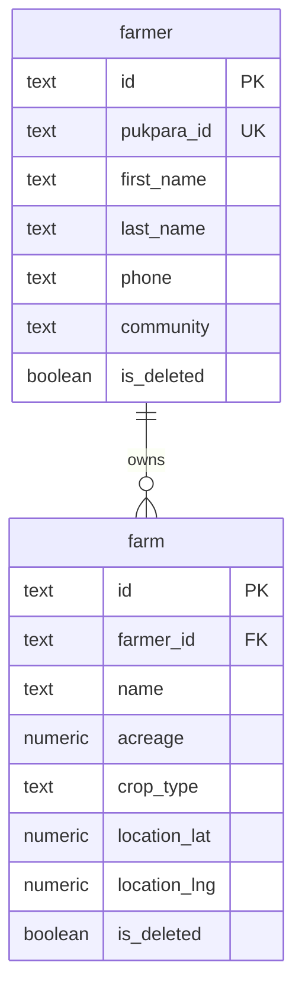
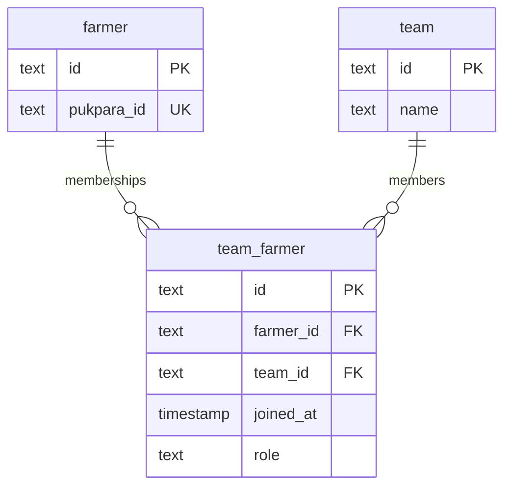
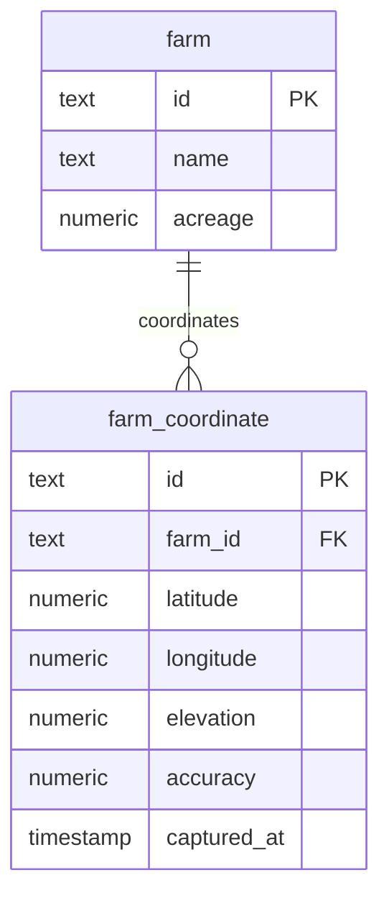
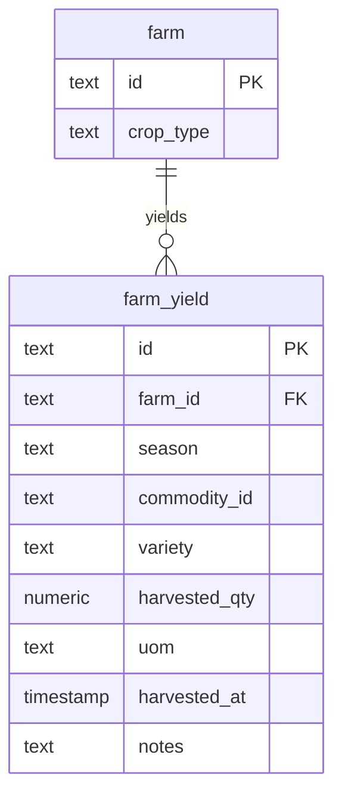

# Farmer & Farm Model

<cite>
**Referenced Files in This Document**   
- [schema.ts](file://src/server/db/schema.ts#L252-L358)
- [page.tsx](file://src/app/(app)/farmers/[farmerId]/farms/[farmId]/page.tsx)
- [page.tsx](file://src/app/(app)/farmers/[farmerId]/farms/page.tsx)
- [create/page.tsx](file://src/app/(app)/farmers/[farmerId]/farms/create/page.tsx)
- [farms-list-placeholder.tsx](file://src/features/farms/components/farms-list-placeholder.tsx)
</cite>

## Table of Contents
1. [Farmer Data Model](#farmer-data-model)
2. [Farm Data Model](#farm-data-model)
3. [Relationships Between Farmer and Farm](#relationships-between-farmer-and-farm)
4. [Team Affiliation and Group Management](#team-affiliation-and-group-management)
5. [Geospatial Data and Precision Mapping](#geospatial-data-and-precision-mapping)
6. [Agricultural Production and Yield Tracking](#agricultural-production-and-yield-tracking)
7. [Data Validation and Soft Delete Patterns](#data-validation-and-soft-delete-patterns)
8. [Query Examples and Business Logic](#query-examples-and-business-logic)

## Farmer Data Model

The `farmer` entity represents an individual agricultural producer within the system. It contains personal, identification, and community-level attributes essential for identity management, compliance, and operational coordination.

Key attributes include:
- **Personal Information**: `firstName`, `lastName`, `gender`, `dateOfBirth`, `phone`, and `imgUrl` for identity and contact purposes
- **Identification Data**: `idNumber` and `idType` to support formal verification processes
- **Residential and Community Details**: `address`, `districtId`, and `community` to establish geographic context and administrative jurisdiction
- **Household and Leadership Status**: `householdSize` and `isLeader` to capture socio-economic context and leadership roles within farmer groups
- **Business Identifier**: `pukparaId` serves as a unique business code for the farmer, enabling consistent identification across systems and transactions
- **Compliance and Verification**: `kycStatus` tracks the Know Your Customer status (e.g., pending, verified), while `isDeleted` supports soft deletion for auditability

The model enforces tenant isolation via `organizationId`, ensuring data belongs to a specific organization (tenant), and includes temporal tracking with `createdAt` and `updatedAt`.

**Section sources**
- [schema.ts](file://src/server/db/schema.ts#L252-L291)

## Farm Data Model

The `farm` entity captures agricultural land holdings associated with a farmer. It includes geographic, agronomic, and operational metadata necessary for farm management, monitoring, and yield forecasting.

Core attributes include:
- **Ownership and Context**: `farmerId` and `organizationId` establish ownership and tenant context
- **Descriptive Metadata**: `name` for human-readable identification of the farm
- **Agricultural Characteristics**: `acreage` (with precision 12, scale 2) for land size, `cropType` for primary cultivation, and `soilType` for soil classification
- **Geographic Coordinates**: `locationLat` and `locationLng` provide centroid coordinates for the farm
- **Lifecycle and Status**: `status` defaults to "active" and tracks farm operational state
- **Temporal Tracking**: `createdAt` and `updatedAt` timestamps with automatic updates
- **Soft Deletion**: `isDeleted` flag enables logical deletion while preserving historical data

This model supports precision agriculture workflows by combining spatial data with crop and soil information.

**Section sources**
- [schema.ts](file://src/server/db/schema.ts#L293-L329)

## Relationships Between Farmer and Farm

A one-to-many relationship exists between the `farmer` and `farm` entities, where a single farmer can own or manage multiple farms. This relationship is enforced through the `farmerId` foreign key in the `farm` table, which references the `id` in the `farmer` table with cascade deletion.

The relationship is formally defined in the Drizzle ORM schema via `farmRelations`, which specifies:
- One `farmer` to many `farm` records
- Each `farm` belongs to exactly one `farmer`

This structure enables efficient querying of all farms belonging to a specific farmer and supports aggregation operations such as total cultivated area calculation.



**Diagram sources**
- [schema.ts](file://src/server/db/schema.ts#L252-L329)
- [schema.ts](file://src/server/db/schema.ts#L976-L1028)

**Section sources**
- [schema.ts](file://src/server/db/schema.ts#L252-L329)
- [schema.ts](file://src/server/db/schema.ts#L976-L1028)

## Team Affiliation and Group Management

Farmers can be affiliated with groups such as VSLAs (Village Savings and Loan Associations), cooperatives, or Farmer-Based Organizations (FBOs) through the `teamFarmer` junction table. This enables collective farming, financial inclusion, and group-based agricultural programs.

The `teamFarmer` table includes:
- `teamId`: References the `team` entity representing the group
- `farmerId`: References the individual `farmer`
- `joinedAt`: Timestamp of membership start
- `role`: Optional role within the group (e.g., chair, secretary)

This design supports flexible group affiliations and allows farmers to belong to multiple teams. The relationship is accessible via the `teamFarmers` field in the `farmerRelations` definition.



**Diagram sources**
- [schema.ts](file://src/server/db/schema.ts#L293-L299)
- [schema.ts](file://src/server/db/schema.ts#L976-L1028)

**Section sources**
- [schema.ts](file://src/server/db/schema.ts#L293-L299)

## Geospatial Data and Precision Mapping

Farm boundaries and precise locations are captured using the `farmCoordinate` entity, which stores GPS coordinates that define the perimeter or key points of a farm. This enables precision agriculture, satellite monitoring, and field verification.

The `farmCoordinate` table includes:
- `farmId`: Foreign key to the parent `farm`
- `latitude` and `longitude`: High-precision coordinates (precision 10, scale 6)
- `elevation`: Terrain height in meters
- `accuracy`: GPS accuracy in meters
- `capturedAt`: Timestamp of coordinate capture

Multiple coordinates can be associated with a single farm via the `coordinates` relation in `farmRelations`, allowing for polygonal boundary definitions. This supports GIS integration and mobile data collection with GPS-enabled devices.



**Diagram sources**
- [schema.ts](file://src/server/db/schema.ts#L331-L342)
- [schema.ts](file://src/server/db/schema.ts#L976-L1028)

**Section sources**
- [schema.ts](file://src/server/db/schema.ts#L331-L342)

## Agricultural Production and Yield Tracking

Crop production and harvest history are managed through the `farmYield` entity, which records yield data by season and crop variety. This enables historical analysis, forecasting, and performance benchmarking.

Key fields in `farmYield`:
- `farmId`: Links yield to a specific farm
- `season`: Descriptive season identifier (e.g., "Main 2025")
- `commodityId` and `variety`: Crop type and cultivar
- `harvestedQty`: Quantity harvested with high precision (14,2)
- `uom`: Unit of measure (kg, tons, bags)
- `harvestedAt`: Harvest date
- `notes`: Additional observations

The `yields` relation in `farmRelations` enables retrieval of all yield records for a farm. This data supports agricultural extension services, input planning, and market linkage programs.



**Diagram sources**
- [schema.ts](file://src/server/db/schema.ts#L344-L358)
- [schema.ts](file://src/server/db/schema.ts#L976-L1028)

**Section sources**
- [schema.ts](file://src/server/db/schema.ts#L344-L358)

## Data Validation and Soft Delete Patterns

The system implements data integrity through database constraints and application-level patterns:

- **Unique Constraints**: The `pukparaId` is unique across farmers, ensuring no duplicate business identifiers
- **Foreign Key Enforcement**: All relationships use referential integrity with appropriate delete behaviors (cascade or set null)
- **Check Constraints**: While not explicitly shown, domain validation is enforced through application logic and schema definitions
- **Soft Deletion**: Both `farmer` and `farm` entities include an `isDeleted` boolean flag (default: false), allowing records to be logically deleted without data loss. This supports audit trails, compliance, and potential restoration.

Temporal fields (`createdAt`, `updatedAt`) are automatically managed, with `updatedAt` triggered on modification. This pattern ensures data provenance and change tracking.

**Section sources**
- [schema.ts](file://src/server/db/schema.ts#L282)
- [schema.ts](file://src/server/db/schema.ts#L328)

## Query Examples and Business Logic

Common operations and queries include:

### Retrieve All Farms for a Farmer
Use the `farms` relation on the `farmer` entity to fetch all active farms:
```sql
SELECT * FROM farm WHERE farmerId = 'farmer-123' AND isDeleted = false;
```

### Calculate Total Cultivated Area
Aggregate acreage across all non-deleted farms:
```sql
SELECT SUM(acreage) as total_acreage FROM farm 
WHERE farmerId = 'farmer-123' AND isDeleted = false;
```

### Retrieve Yield History by Season
Query farm yields filtered by season and farm:
```sql
SELECT fy.*, f.name as farm_name, c.name as commodity_name 
FROM farm_yield fy
JOIN farm f ON fy.farmId = f.id
JOIN commodity c ON fy.commodityId = c.id
WHERE f.farmerId = 'farmer-123' AND fy.season = 'Main 2025'
ORDER BY fy.harvestedAt;
```

These queries are supported by indexes such as `idxOrgLastName` on farmer and temporal indexes on yield records, ensuring performance at scale.

**Section sources**
- [schema.ts](file://src/server/db/schema.ts#L252-L358)
- [page.tsx](file://src/app/(app)/farmers/[farmerId]/farms/page.tsx)
- [page.tsx](file://src/app/(app)/farmers/[farmerId]/farms/[farmId]/page.tsx)