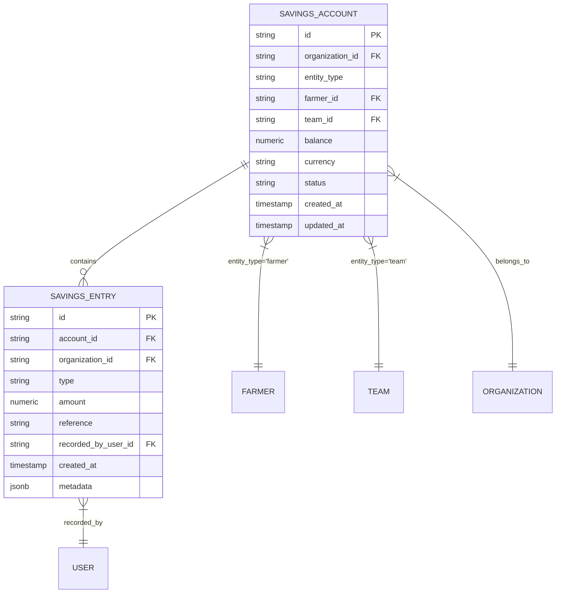
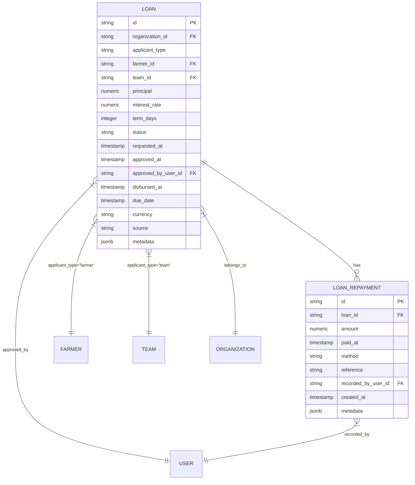
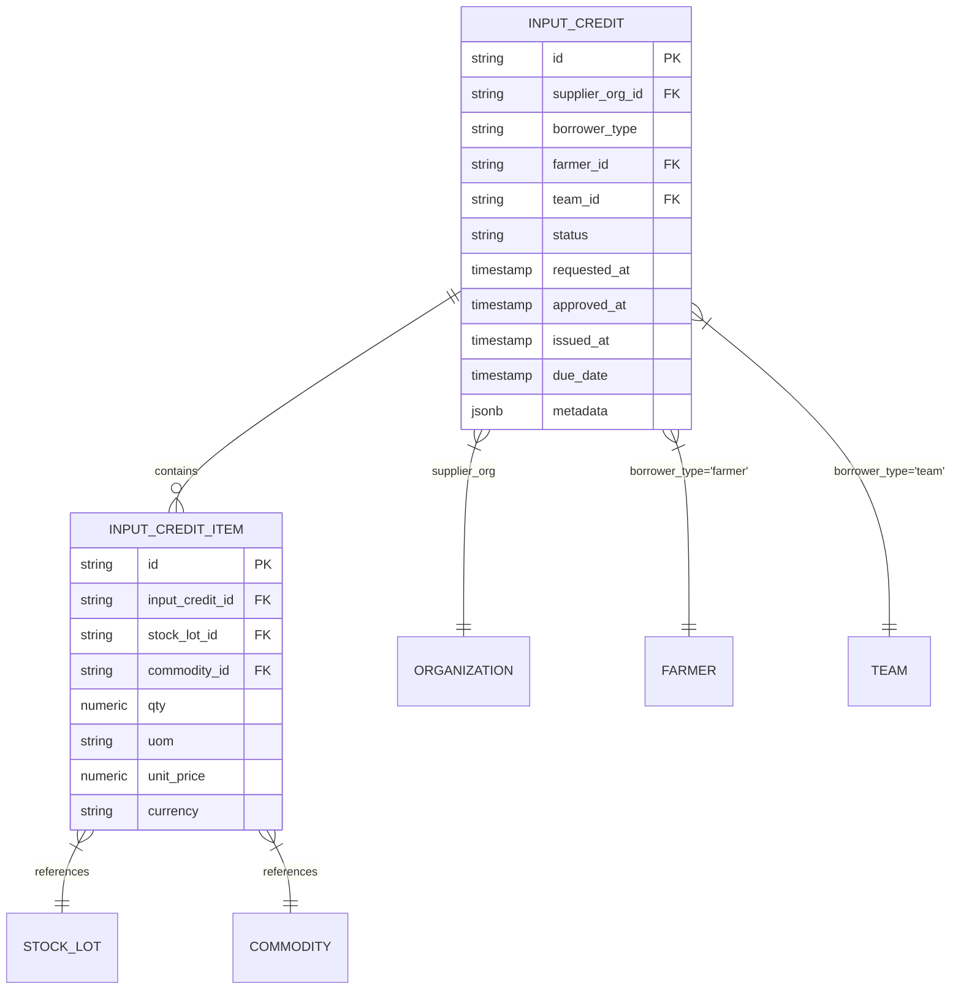
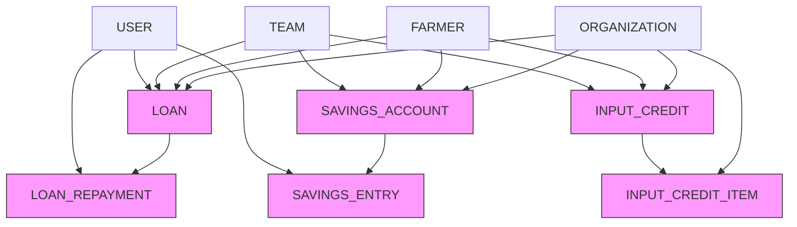

# Financial Operations Model

<cite>
**Referenced Files in This Document**   
- [schema.ts](file://src/server/db/schema.ts)
</cite>

## Table of Contents
1. [Introduction](#introduction)
2. [Savings Accounts and Entries](#savings-accounts-and-entries)
3. [Loan Lifecycle Management](#loan-lifecycle-management)
4. [Input Credit System](#input-credit-system)
5. [Data Model Relationships](#data-model-relationships)
6. [Database Constraints and Validation](#database-constraints-and-validation)
7. [Financial Calculations and Examples](#financial-calculations-and-examples)
8. [Transaction Auditing](#transaction-auditing)

## Introduction
This document provides comprehensive documentation of the financial operations model in pukpara, focusing on savings accounts, loans, and input credit systems. The model supports both individual farmers and teams (such as VSLA groups, cooperatives, or farmer-based organizations) with robust financial tracking capabilities. The system enables balance tracking, contribution history, loan lifecycle management from request to repayment, and supplier-issued credit for agricultural inputs. All financial entities are tenant-isolated by organization and include comprehensive audit trails.

## Savings Accounts and Entries

The savings account system supports both individual farmers and teams, enabling contribution-based savings with full transaction history. Each savings account maintains a current balance and tracks all financial activities through savings entries.



**Diagram sources**
- [schema.ts](file://src/server/db/schema.ts#L360-L382)
- [schema.ts](file://src/server/db/schema.ts#L384-L414)

**Section sources**
- [schema.ts](file://src/server/db/schema.ts#L360-L414)

## Loan Lifecycle Management

The loan system manages the complete lifecycle of microloans from application through repayment. Loans can be issued to either individual farmers or teams, with configurable interest rates, term durations, and approval workflows. The system tracks loan status through defined states and maintains a complete repayment history.



**Diagram sources**
- [schema.ts](file://src/server/db/schema.ts#L416-L470)
- [schema.ts](file://src/server/db/schema.ts#L472-L492)

**Section sources**
- [schema.ts](file://src/server/db/schema.ts#L416-L492)

## Input Credit System

The input credit system enables suppliers to issue credit to farmers or teams for agricultural inputs such as seeds, fertilizers, or equipment. This system tracks credit requests, approvals, issuance, and settlement, with detailed itemization of the inputs provided and their associated costs.



**Diagram sources**
- [schema.ts](file://src/server/db/schema.ts#L783-L812)
- [schema.ts](file://src/server/db/schema.ts#L814-L829)

**Section sources**
- [schema.ts](file://src/server/db/schema.ts#L783-L829)

## Data Model Relationships

The financial data model establishes clear relationships between entities, ensuring data integrity and enabling comprehensive financial reporting. The model supports both individual and group-based financial activities while maintaining tenant isolation through the organization relationship.



**Diagram sources**
- [schema.ts](file://src/server/db/schema.ts#L1030-L1047)
- [schema.ts](file://src/server/db/schema.ts#L1048-L1074)
- [schema.ts](file://src/server/db/schema.ts#L1075-L1092)

**Section sources**
- [schema.ts](file://src/server/db/schema.ts#L1030-L1092)

## Database Constraints and Validation

The financial model implements comprehensive database constraints to ensure data integrity, prevent invalid states, and enforce business rules. These constraints include check constraints for valid values, unique constraints for preventing duplicate records, and foreign key constraints for maintaining referential integrity.

### Savings Constraints
- **ckAmountNotZero**: Ensures savings entry amounts are not zero
- **ckType**: Restricts savings entry types to "contribution", "withdrawal", or "adjustment"
- **uqAccountFarmer**: Ensures unique savings accounts per farmer within an organization
- **uqAccountTeam**: Ensures unique savings accounts per team within an organization

### Loan Constraints
- **ckPrincipalPositive**: Ensures loan principal amounts are positive
- **ckInterestRange**: Restricts interest rates to values between 0 and 100%
- **ckTermDaysPositive**: Ensures loan term days are positive
- **ckApplicantType**: Restricts applicant types to "farmer" or "team"
- **ckStatus**: Validates loan status values against allowed states

### Input Credit Constraints
- **ckBorrowerType**: Restricts borrower types to "farmer" or "team"
- **ckStatus**: Validates input credit status values against allowed states

**Section sources**
- [schema.ts](file://src/server/db/schema.ts#L360-L492)
- [schema.ts](file://src/server/db/schema.ts#L783-L812)

## Financial Calculations and Examples

### Outstanding Loan Balance Calculation
The outstanding balance of a loan is calculated by subtracting the sum of all repayments from the principal amount plus accrued interest. Interest is calculated using simple interest formula: Principal × Rate × Time.

```typescript
// Pseudocode for calculating outstanding loan balance
function calculateOutstandingBalance(loan: Loan, repayments: LoanRepayment[]): number {
  const principal = loan.principal;
  const interestRate = loan.interestRate / 100; // Convert percentage to decimal
  const termInYears = loan.termDays / 365;
  
  // Calculate total interest (simple interest)
  const totalInterest = principal * interestRate * termInYears;
  
  // Calculate total amount due
  const totalAmountDue = principal + totalInterest;
  
  // Calculate total repayments made
  const totalRepayments = repayments.reduce((sum, repayment) => sum + repayment.amount, 0);
  
  // Calculate outstanding balance
  return Math.max(0, totalAmountDue - totalRepayments);
}
```

### Repayment Schedule Generation
Repayment schedules can be generated based on loan terms, with equal installments calculated using the simple interest method. The schedule includes payment dates and amounts for each installment.

```typescript
// Pseudocode for generating repayment schedule
function generateRepaymentSchedule(loan: Loan): RepaymentSchedule[] {
  const principal = loan.principal;
  const interestRate = loan.interestRate / 100;
  const termInYears = loan.termDays / 365;
  const totalInterest = principal * interestRate * termInYears;
  const totalAmountDue = principal + totalInterest;
  
  // For simplicity, assume monthly repayments
  const months = Math.ceil(loan.termDays / 30);
  const monthlyPayment = totalAmountDue / months;
  
  const schedule: RepaymentSchedule[] = [];
  let currentDate = new Date(loan.disbursedAt);
  
  for (let i = 0; i < months; i++) {
    currentDate = addMonths(currentDate, 1);
    schedule.push({
      installment: i + 1,
      dueDate: currentDate,
      amount: i === months - 1 
        ? totalAmountDue - (monthlyPayment * (months - 1)) // Adjust final payment for rounding
        : monthlyPayment
    });
  }
  
  return schedule;
}
```

### Financial Transaction Auditing
The system supports auditing of financial transactions across entities by leveraging the organization-level relationships and timestamp fields. Queries can be constructed to trace all financial activities within a specific time period or for a particular entity.

```typescript
// Pseudocode for auditing financial transactions
function auditFinancialTransactions(
  organizationId: string, 
  startDate: Date, 
  endDate: Date
): FinancialAudit[] {
  // Query all financial activities within date range
  const savingsEntries = getSavingsEntries(organizationId, startDate, endDate);
  const loanRepayments = getLoanRepayments(organizationId, startDate, endDate);
  const payments = getPayments(organizationId, startDate, endDate);
  
  // Combine and sort all transactions
  const allTransactions = [
    ...savingsEntries.map(e => ({...e, type: 'savings'})),
    ...loanRepayments.map(r => ({...r, type: 'repayment'})),
    ...payments.map(p => ({...p, type: 'payment'}))
  ].sort((a, b) => a.createdAt.getTime() - b.createdAt.getTime());
  
  return allTransactions;
}
```

**Section sources**
- [schema.ts](file://src/server/db/schema.ts#L360-L492)
- [schema.ts](file://src/server/db/schema.ts#L783-L829)

## Transaction Auditing

The financial model supports comprehensive transaction auditing through multiple mechanisms. Each financial entity includes timestamps for creation and updates, and related entries capture the user who recorded the transaction. The system can generate audit trails for all financial activities, enabling reconciliation and compliance reporting.

The audit capabilities include:
- Tracking of all savings contributions, withdrawals, and adjustments
- Monitoring of loan application, approval, disbursement, and repayment events
- Recording of input credit issuance and settlement
- User attribution for all financial transactions
- Time-series analysis of financial activities

These auditing features ensure transparency and accountability in all financial operations within the pukpara system.

**Section sources**
- [schema.ts](file://src/server/db/schema.ts#L360-L492)
- [schema.ts](file://src/server/db/schema.ts#L783-L829)