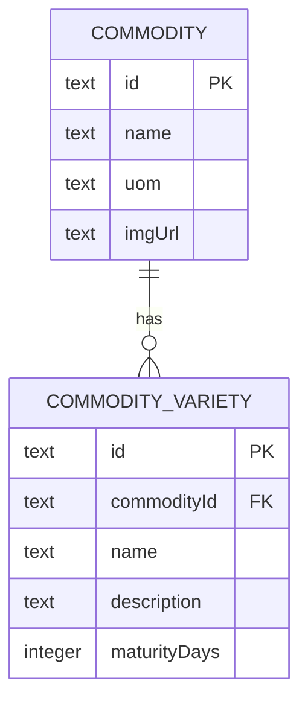
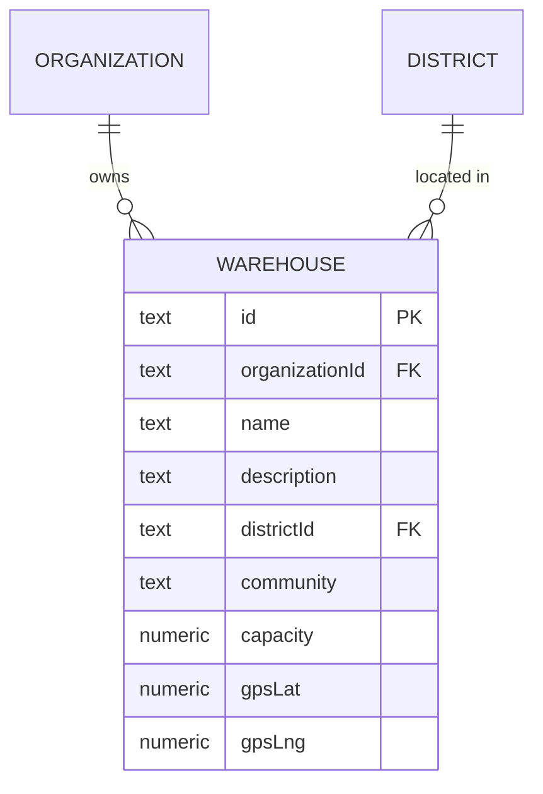
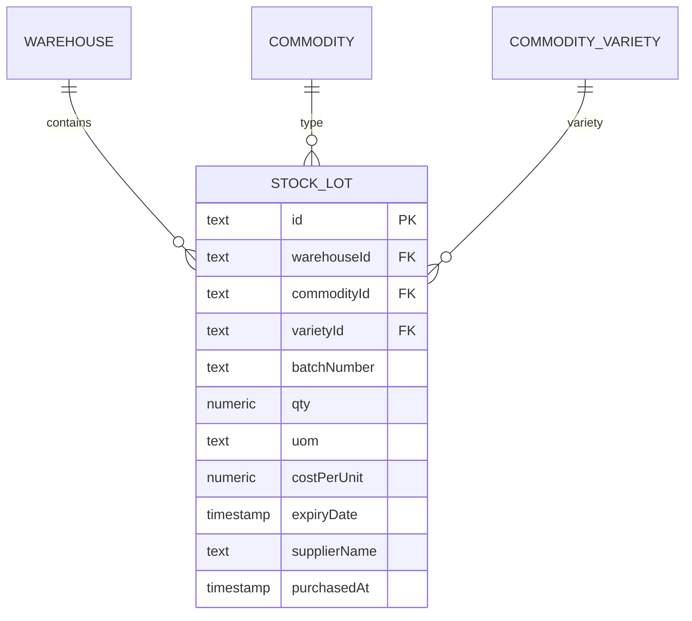
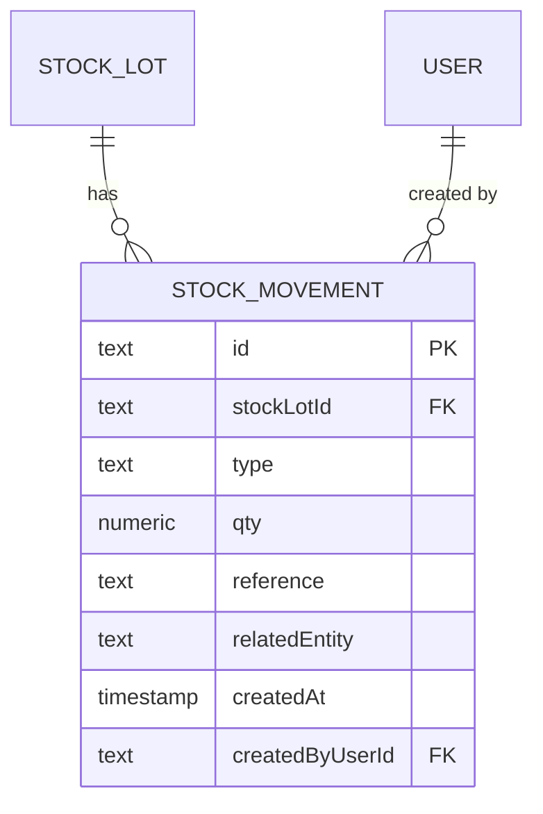
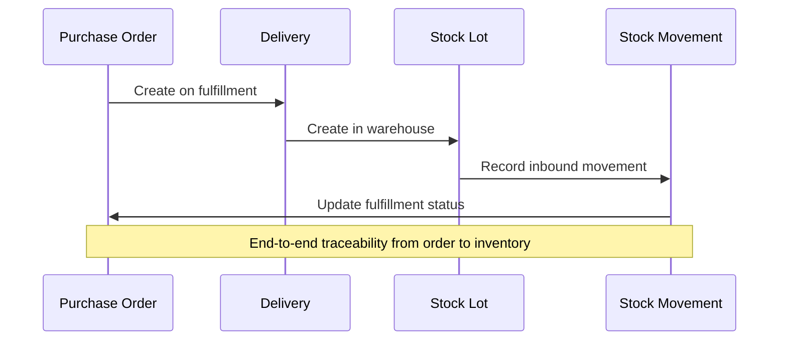
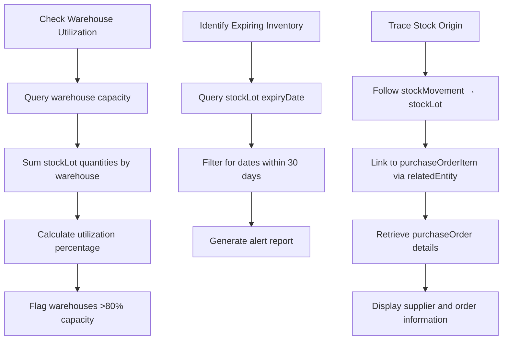

# Inventory & Warehouse Model

<cite>
**Referenced Files in This Document**   
- [schema.ts](file://src/server/db/schema.ts#L496-L586)
- [admin-inventory-warehouses-page.tsx](file://src/app/(admin)/admin/inventory/warehouses/page.tsx)
- [admin-commodities-page.tsx](file://src/app/(admin)/admin/inventory/commodities/page.tsx)
- [commodity-detail-page.tsx](file://src/app/(admin)/admin/inventory/commodities/[commodityId]/page.tsx)
- [inventory-card.tsx](file://src/features/admin/organizations/components/organization-details/inventory-card.tsx)
</cite>

## Table of Contents
1. [Introduction](#introduction)
2. [Commodity & Variety Hierarchy](#commodity--variety-hierarchy)
3. [Warehouse Model](#warehouse-model)
4. [Stock Lot Management](#stock-lot-management)
5. [Stock Movement & Audit Trail](#stock-movement--audit-trail)
6. [Purchase Order Fulfillment](#purchase-order-fulfillment)
7. [Inventory Operations & Use Cases](#inventory-operations--use-cases)
8. [Data Integrity & Performance](#data-integrity--performance)
9. [Conclusion](#conclusion)

## Introduction
This document details the inventory and warehouse data models for an agricultural supply chain platform. The system supports commodity tracking from farm to warehouse, with robust inventory management capabilities including batch tracking, expiry monitoring, and audit trails. The model is designed to support agricultural commodities with specific varieties, warehouse capacity management, and traceability through stock lots and movements.

**Section sources**
- [schema.ts](file://src/server/db/schema.ts#L496-L586)

## Commodity & Variety Hierarchy

The commodity and commodityVariety entities form a hierarchical relationship for agricultural products. The `commodity` table represents broad agricultural categories such as Maize, Rice, or Cocoa, while `commodityVariety` represents specific cultivars or strains within each commodity type.

Each commodity has a name, default unit of measure (UOM), and optional image URL. The variety entity extends this by establishing a parent-child relationship through the `commodityId` foreign key, allowing multiple varieties to belong to a single commodity. Varieties include descriptive attributes such as name, description, and maturity days, which are critical for agricultural planning and quality differentiation.

This hierarchy enables the system to manage both general commodity-level operations and variety-specific tracking, supporting agricultural practices where different varieties of the same crop have distinct market values, growing requirements, and quality characteristics.

**Diagram sources**
- [schema.ts](file://src/server/db/schema.ts#L496-L513)

**Section sources**
- [schema.ts](file://src/server/db/schema.ts#L496-L513)
- [admin-commodities-page.tsx](file://src/app/(admin)/admin/inventory/commodities/page.tsx)
- [commodity-detail-page.tsx](file://src/app/(admin)/admin/inventory/commodities/[commodityId]/page.tsx)

## Warehouse Model

The warehouse entity represents physical storage facilities with comprehensive location and capacity metadata. Each warehouse is organization-owned and includes critical operational data such as name, description, district and community location, storage capacity, and GPS coordinates (latitude and longitude).

Warehouses serve as the physical nodes in the inventory network, enabling geographic distribution of stock and supporting logistics planning. The capacity field, stored as a numeric value with high precision, allows for accurate utilization tracking, while GPS coordinates facilitate route optimization and delivery planning.

The model supports multi-tenancy through the organizationId foreign key, ensuring that warehouses are properly scoped to their owning organizations (typically suppliers or aggregators). This structure enables both centralized platform-wide views and organization-specific inventory management.

**Diagram sources**
- [schema.ts](file://src/server/db/schema.ts#L515-L531)

**Section sources**
- [schema.ts](file://src/server/db/schema.ts#L515-L531)
- [admin-inventory-warehouses-page.tsx](file://src/app/(admin)/admin/inventory/warehouses/page.tsx)

## Stock Lot Management

The stockLot entity provides granular inventory tracking with support for batch numbers, expiry dates, and cost basis. Each stock lot represents a discrete quantity of a specific commodity variety stored in a particular warehouse, creating a fundamental unit of inventory management.

Key attributes include:
- **Batch tracking**: The batchNumber field enables traceability from production to consumption
- **Expiration management**: The expiryDate field supports perishable inventory monitoring
- **Cost accounting**: The costPerUnit field maintains financial basis for inventory valuation
- **Provenance tracking**: Supplier name and purchase date fields capture origin information

Stock lots are created when inventory enters the system (typically through purchase orders or farmer deliveries) and are consumed through sales, transfers, or adjustments. The model supports agricultural commodities by linking to both commodity and variety entities, ensuring proper quality and type tracking.

**Diagram sources**
- [schema.ts](file://src/server/db/schema.ts#L533-L555)

**Section sources**
- [schema.ts](file://src/server/db/schema.ts#L533-L555)
- [inventory-card.tsx](file://src/features/admin/organizations/components/organization-details/inventory-card.tsx)

## Stock Movement & Audit Trail

The stockMovement entity records all inventory changes with a comprehensive audit trail. Each movement represents a transaction that alters the quantity of a stock lot, categorized by type: inbound ("in"), outbound ("out"), adjustments ("adjustment"), reservations ("reserve"), or releases ("release").

The audit trail is maintained through several key fields:
- **Reference tracking**: The reference field links movements to source documents
- **Entity relationships**: The relatedEntity field (e.g., "purchase_order_item:ID") establishes provenance
- **User accountability**: The createdByUserId field identifies the operator
- **Temporal ordering**: The createdAt timestamp ensures chronological integrity

The model enforces data quality through constraints that prevent zero-quantity movements and validate movement types against an enumerated list. An index on stockLotId and createdAt optimizes queries for inventory history and balance calculations.

**Diagram sources**
- [schema.ts](file://src/server/db/schema.ts#L557-L584)

**Section sources**
- [schema.ts](file://src/server/db/schema.ts#L557-L584)

## Purchase Order Fulfillment

The inventory model integrates with purchase orders to track fulfillment from order to delivery. When a purchase order is fulfilled, stock lots are created in designated warehouses, and stock movements are recorded to reflect inventory changes.

The relationship is established through the relatedEntity field in stockMovement, which can reference purchase order items (e.g., "purchase_order_item:ID"). This linkage enables end-to-end traceability from purchase commitment to physical inventory, supporting reconciliation and audit requirements.

The delivery entity further enhances this workflow by capturing delivery-specific data such as vehicle registration, waybill numbers, GPS coordinates of delivery, and QR tags for physical traceability. This creates a comprehensive chain of custody for agricultural commodities moving through the supply chain.

**Diagram sources**
- [schema.ts](file://src/server/db/schema.ts#L533-L584)
- [schema.ts](file://src/server/db/schema.ts#L622-L664)

**Section sources**
- [schema.ts](file://src/server/db/schema.ts#L533-L584)
- [schema.ts](file://src/server/db/schema.ts#L622-L664)

## Inventory Operations & Use Cases

### Warehouse Utilization Monitoring
The system supports warehouse utilization analysis by comparing current stock levels against total capacity. Queries can calculate utilization percentages and identify facilities approaching capacity limits, enabling proactive inventory redistribution.

### Expiring Inventory Identification
The expiryDate field in stockLot enables proactive management of perishable goods. The system can generate alerts for inventory approaching expiration (e.g., within 30 days), allowing for timely marketing or redistribution to minimize waste.

### Stock Origin Tracing
Complete traceability is achieved through the chain: stockMovement → stockLot → purchaseOrderItem → purchaseOrder. This allows users to trace any inventory item back to its original purchase order, supplier, and even farm of origin when integrated with farmer data.

**Diagram sources**
- [schema.ts](file://src/server/db/schema.ts#L515-L555)
- [inventory-card.tsx](file://src/features/admin/organizations/components/organization-details/inventory-card.tsx)

**Section sources**
- [schema.ts](file://src/server/db/schema.ts#L515-L555)
- [inventory-card.tsx](file://src/features/admin/organizations/components/organization-details/inventory-card.tsx)

## Data Integrity & Performance

### Constraints and Validation
The model enforces data integrity through multiple mechanisms:
- Foreign key constraints ensure referential integrity
- Check constraints prevent invalid data (e.g., zero-quantity movements)
- Unique constraints prevent duplicate records
- Not-null constraints ensure critical fields are populated

### Indexing Strategy
Performance is optimized through strategic indexing:
- `idx_stock_movement_lot_created` on stockMovement (stockLotId, createdAt) accelerates inventory history queries
- Organization and status indexes on purchaseOrder enable fast filtering
- Composite indexes on frequently queried field combinations

### Query Optimization
The relationship model supports efficient balance calculations by allowing stock lot quantities to be derived from the sum of movements, with the current qty field serving as a denormalized optimization to avoid expensive aggregation queries for common operations.

**Section sources**
- [schema.ts](file://src/server/db/schema.ts#L557-L584)
- [schema.ts](file://src/server/db/schema.ts#L622-L664)

## Conclusion
The inventory and warehouse data model provides a comprehensive foundation for agricultural supply chain management. By combining hierarchical commodity classification, detailed warehouse metadata, granular stock lot tracking, and auditable movement records, the system supports critical operations from farm gate to market. The integration with purchase orders enables end-to-end traceability, while performance optimizations ensure scalability. This model effectively addresses the unique requirements of agricultural inventory management, including perishability, batch tracking, and geographic distribution.