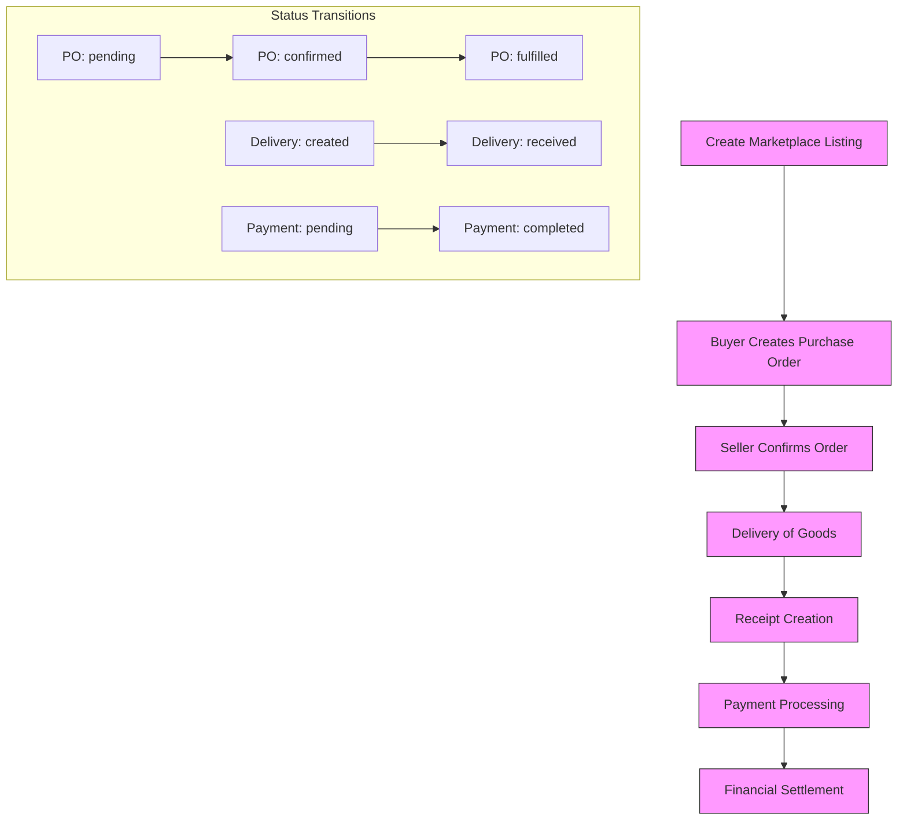

# Marketplace & Purchase Orders Model

<cite>
**Referenced Files in This Document**   
- [schema.ts](file://src/server/db/schema.ts#L588-L779)
- [schema.ts](file://src/server/db/schema.ts#L1180-L1202)
</cite>

## Table of Contents
1. [Introduction](#introduction)
2. [Marketplace Listing](#marketplace-listing)
3. [Purchase Order System](#purchase-order-system)
4. [Delivery Management](#delivery-management)
5. [Receipt and Payment Processing](#receipt-and-payment-processing)
6. [End-to-End Transaction Flow](#end-to-end-transaction-flow)
7. [Data Integrity and Relationships](#data-integrity-and-relationships)

## Introduction
This document provides comprehensive data model documentation for the marketplace and purchase order system. The system enables sellers to expose inventory through marketplace listings, buyers to initiate transactions via purchase orders, and supports full lifecycle management from listing to financial settlement. Key components include pricing and availability tracking, payment terms with deferred payment options, shipment tracking with geolocation, and reconciliation of payments against receipts.

**Section sources**
- [schema.ts](file://src/server/db/schema.ts#L588-L779)

## Marketplace Listing
The `marketplaceListing` entity represents seller inventory exposure with pricing and availability details. Each listing is associated with a seller organization and specifies commodity type, variety, available quantity, unit of measure, price, and currency.

Key attributes:
- **quantity**: Numeric value with precision 14, scale 2, must be positive
- **price**: Numeric value with precision 14, scale 2, must be positive
- **status**: Enum with values "available", "reserved", "sold", "withdrawn"
- **expiresAt**: Optional expiration timestamp for time-limited offers
- **metadata**: JSONB field for additional listing-specific information

Listings are indexed by organization and status for efficient querying of active inventory.

**Section sources**
- [schema.ts](file://src/server/db/schema.ts#L588-L622)

## Purchase Order System
The purchase order system consists of two core entities: `purchaseOrder` and `purchaseOrderItem`. This structure supports buyer-initiated transactions with detailed specifications.

### Purchase Order
The parent `purchaseOrder` entity contains:
- **poNumber**: Human-readable identifier (unique constraint)
- **buyerOrgId** and **sellerOrgId**: References to participating organizations
- **status**: "pending", "confirmed", "fulfilled", or "cancelled"
- **paymentTerms**: "net7", "net30", or "immediate"
- **deferredPercent**: Integer (0-100) indicating percentage of payment deferred
- **approvedAt** and **approvedByUserId**: Approval tracking
- **metadata**: JSONB for traceability flags and other contextual data

Indexes exist on buyer/seller organization and status for efficient order retrieval.

### Purchase Order Item
Each `purchaseOrderItem` specifies:
- **purchaseOrderId**: Parent reference
- **commodityId** and **varietyId**: Product specification
- **qty**: Ordered quantity (positive numeric)
- **unitPrice**: Price per unit (positive numeric)
- **currency**: Transaction currency
- **metadata**: Item-level metadata

Items maintain referential integrity with commodities through restrict delete constraints.

**Section sources**
- [schema.ts](file://src/server/db/schema.ts#L624-L690)

## Delivery Management
The `delivery` entity tracks shipment information with geolocation and waybill data. Each delivery is linked to a purchase order and captures:

- **deliveredAt**: Timestamp of delivery (defaults to current time)
- **deliveredQty**: Actual quantity delivered
- **warehouseId**: Destination warehouse reference
- **vehicleReg**: Vehicle registration number
- **waybillNumber**: Shipping document identifier
- **qrTag**: Traceability QR code
- **deliveryLat** and **deliveryLng**: GPS coordinates (precision 10, scale 6)
- **receivedByUserId**: User who received the delivery

An index on purchaseOrderId enables efficient delivery tracking by order.

**Section sources**
- [schema.ts](file://src/server/db/schema.ts#L692-L717)

## Receipt and Payment Processing
Financial settlement is managed through `receipt` and `payment` entities that ensure transactional consistency.

### Receipt
The `receipt` entity documents goods receipt with:
- **purchaseOrderId**: Parent purchase order reference
- **receiptNo**: Unique receipt number
- **totalAmount**: Numeric value (precision 14, scale 2) > 0
- **currency**: Transaction currency
- **postedAt** and **postedByUserId**: Posting audit trail

### Payment
The `payment` entity handles financial transactions with:
- **purchaseOrderId**: Optional reference (set null on delete)
- **payerOrgId** and **payeeOrgId**: Financial parties
- **amount**: Positive numeric value
- **method**: "momo", "bank", or "cash"
- **provider**: Specific provider ("mtn_momo", "bank_transfer")
- **feeAmount**: Transaction fees (non-negative)
- **netAmount**: amount - feeAmount
- **reference**: External transaction reference
- **idempotencyKey**: Unique key for idempotent operations
- **status**: "pending", "completed", "failed", "cancelled"

Unique constraint on idempotencyKey prevents duplicate processing.

**Section sources**
- [schema.ts](file://src/server/db/schema.ts#L719-L779)

## End-to-End Transaction Flow


**Diagram sources**
- [schema.ts](file://src/server/db/schema.ts#L624-L662)
- [schema.ts](file://src/server/db/schema.ts#L692-L717)
- [schema.ts](file://src/server/db/schema.ts#L743-L779)

**Section sources**
- [schema.ts](file://src/server/db/schema.ts#L624-L779)

## Data Integrity and Relationships
```mermaid
erDiagram
MARKETPLACE_LISTING ||--o{ ORGANIZATION : "seller"
MARKETPLACE_LISTING ||--o{ COMMODITY : "product"
MARKETPLACE_LISTING ||--o{ COMMODITY_VARIETY : "variety"
PURCHASE_ORDER ||--o{ ORGANIZATION : "buyer"
PURCHASE_ORDER ||--o{ ORGANIZATION : "seller"
PURCHASE_ORDER ||--o{ USER : "approver"
PURCHASE_ORDER ||--||| PURCHASE_ORDER_ITEM : "contains"
PURCHASE_ORDER ||--o{ DELIVERY : "has"
PURCHASE_ORDER ||--o{ RECEIPT : "generates"
PURCHASE_ORDER ||--o{ PAYMENT : "receives"
PURCHASE_ORDER_ITEM ||--o{ COMMODITY : "product"
PURCHASE_ORDER_ITEM ||--o{ COMMODITY_VARIETY : "variety"
DELIVERY ||--o{ WAREHOUSE : "destination"
DELIVERY ||--o{ USER : "receiver"
RECEIPT ||--o{ USER : "posted_by"
PAYMENT ||--o{ ORGANIZATION : "payer"
PAYMENT ||--o{ ORGANIZATION : "payee"
MARKETPLACE_LISTING {
string id PK
string organizationId FK
string commodityId FK
string varietyId FK
numeric quantity
string uom
numeric price
string currency
string status
timestamp createdAt
timestamp expiresAt
jsonb metadata
}
PURCHASE_ORDER {
string id PK
string poNumber UK
string buyerOrgId FK
string sellerOrgId FK
string status
string paymentTerms
integer deferredPercent
timestamp createdAt
timestamp approvedAt
string approvedByUserId FK
jsonb metadata
}
PURCHASE_ORDER_ITEM {
string id PK
string purchaseOrderId FK
string commodityId FK
string varietyId FK
numeric qty
string uom
numeric unitPrice
string currency
jsonb metadata
}
DELIVERY {
string id PK
string purchaseOrderId FK
timestamp deliveredAt
numeric deliveredQty
string warehouseId FK
string vehicleReg
string waybillNumber
string qrTag
numeric deliveryLat
numeric deliveryLng
string receivedByUserId FK
jsonb metadata
}
RECEIPT {
string id PK
string purchaseOrderId FK
string receiptNo
timestamp createdAt
numeric totalAmount
string currency
timestamp postedAt
string postedByUserId FK
}
PAYMENT {
string id PK
string purchaseOrderId FK
string payerOrgId FK
string payeeOrgId FK
numeric amount
string currency
string method
string provider
numeric feeAmount
numeric netAmount
string reference
string idempotencyKey UK
string status
timestamp paidAt
jsonb metadata
}
```

**Diagram sources**
- [schema.ts](file://src/server/db/schema.ts#L588-L779)
- [schema.ts](file://src/server/db/schema.ts#L1180-L1202)

**Section sources**
- [schema.ts](file://src/server/db/schema.ts#L588-L779)
- [schema.ts](file://src/server/db/schema.ts#L1180-L1202)