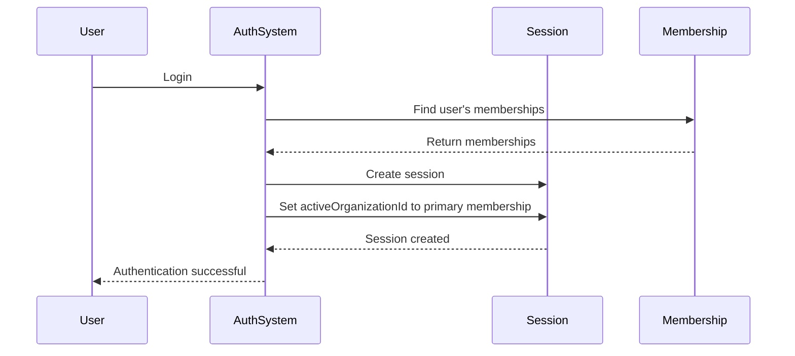

# User & Organization Model

<cite>
**Referenced Files in This Document**   
- [schema.ts](file://src/server/db/schema.ts)
- [auth.ts](file://src/config/constants/auth.ts)
- [org-permissions.ts](file://src/lib/org-permissions.ts)
- [auth.ts](file://src/lib/auth.ts)
- [auth-organization-utils.ts](file://src/lib/auth-organization-utils.ts)
</cite>

## Table of Contents
1. [Introduction](#introduction)
2. [User Data Model](#user-data-model)
3. [Organization Data Model](#organization-data-model)
4. [Multi-Tenancy Implementation](#multi-tenancy-implementation)
5. [User-Organization Relationship](#user-organization-relationship)
6. [Role-Based Access Control](#role-based-access-control)
7. [Status Workflows](#status-workflows)
8. [KYC Verification States](#kyc-verification-states)
9. [Session Management](#session-management)
10. [Query Examples](#query-examples)
11. [Conclusion](#conclusion)

## Introduction
This document provides comprehensive documentation for the User and Organization entities in the pukpara database. It details the data models, relationships, and business logic governing user and organization management within the platform. The system implements a multi-tenant architecture where organizations serve as the primary tenant boundary, with users belonging to organizations through membership relationships. The documentation covers field definitions, constraints, indexes, status workflows, KYC verification processes, and practical usage examples.

**Section sources**
- [schema.ts](file://src/server/db/schema.ts#L0-L1318)

## User Data Model
The User entity represents individuals within the system and contains comprehensive personal, contact, and status information.

### Field Definitions
The user table includes the following fields:

| Field | Type | Constraints | Description |
|-------|------|-------------|-------------|
| id | text | Primary Key | Unique identifier for the user |
| name | text | Not Null | Full name of the user |
| email | text | Not Null, Unique | Email address, serves as primary login credential |
| emailVerified | boolean | Default: false | Indicates whether email has been verified |
| image | text | - | URL to user's profile image |
| createdAt | timestamp | Default: now, Not Null | Timestamp when user was created |
| updatedAt | timestamp | Default: now, On Update: now, Not Null | Timestamp of last update |
| phoneNumber | text | Unique | User's phone number |
| phoneNumberVerified | boolean | - | Indicates whether phone number has been verified |
| role | text | - | System role (distinct from organization membership role) |
| banned | boolean | Default: false | Indicates if user is banned from the system |
| banReason | text | - | Reason for ban, if applicable |
| banExpires | timestamp | - | Expiration timestamp for temporary bans |
| districtId | text | Not Null, References district.id | Geographic district where user is located |
| address | text | Not Null | Physical address of the user |
| kycStatus | text | Default: USER_KYC_STATUS.PENDING | KYC verification status |
| status | text | Default: USER_STATUS.PENDING | Account status |
| approvedAt | timestamp | - | Timestamp when user was approved |
| lastLogin | timestamp | - | Timestamp of user's last login |
| consentTermsAt | timestamp | - | Timestamp when user consented to terms |
| consentPrivacyAt | timestamp | - | Timestamp when user consented to privacy policy |
| notificationPrefs | jsonb | - | JSON object containing user's notification preferences |
| legacyUserId | text | - | Identifier from legacy system, if migrated |
| legacyTenantId | text | - | Legacy tenant identifier, if applicable |

### Indexes
The user table has the following indexes:
- Primary key index on `id`
- Unique index on `email`
- Unique index on `phoneNumber`

**Section sources**
- [schema.ts](file://src/server/db/schema.ts#L0-L1318)

## Organization Data Model
The Organization entity represents business entities or groups within the system and serves as the primary unit for multi-tenancy.

### Field Definitions
The organization table includes the following fields:

| Field | Type | Constraints | Description |
|-------|------|-------------|-------------|
| id | text | Primary Key | Unique identifier for the organization |
| name | text | Not Null | Name of the organization |
| slug | text | Unique | URL-friendly identifier for the organization |
| logo | text | - | URL to organization's logo |
| createdAt | timestamp | Not Null | Timestamp when organization was created |
| metadata | text | - | Additional metadata stored as text |
| organizationType | text | Not Null | Type of organization (FARMER_ORG, SUPPLIER, FINANCIAL, BUYER) |
| organizationSubType | text | - | Sub-type classification within the main type |
| contactEmail | text | - | Primary contact email for the organization |
| contactPhone | text | - | Primary contact phone number |
| address | text | - | Physical address of the organization |
| districtId | text | References district.id, On Delete: set null | Geographic district where organization is located |
| regionId | text | References region.code, On Delete: set null | Geographic region where organization is located |
| status | text | Default: ORGANIZATION_STATUS.PENDING | Current status of the organization |
| subscriptionType | text | Default: ORGANIZATION_SUBSCRIPTION_TYPE.FREEMIUM | Subscription tier (freemium, paid, enterprise) |
| licenseStatus | text | Default: ORGANIZATION_LICENSE_STATUS.ISSUED | Status of organization's operating license |
| planRenewsAt | timestamp | - | Timestamp when current subscription plan renews |
| maxUsers | integer | Default: 100 | Maximum number of users allowed in the organization |
| billingEmail | text | - | Email address for billing communications |
| taxId | text | - | Tax identification number |
| defaultCurrency | text | Default: "GHS" | Default currency for financial transactions |
| timezone | text | Default: "Africa/Accra" | Timezone used for the organization |
| ussdShortCode | text | - | USSD short code for mobile interactions |
| smsSenderId | text | - | Sender ID for SMS communications |
| kycStatus | text | Default: ORGANIZATION_KYC_STATUS.PENDING | KYC verification status for the organization |
| limits | jsonb | - | JSON object defining various operational limits |

### Indexes
The organization table has the following indexes:
- Primary key index on `id`
- Unique index on `slug`

**Section sources**
- [schema.ts](file://src/server/db/schema.ts#L0-L1318)

## Multi-Tenancy Implementation
The system implements a multi-tenant architecture where the Organization entity serves as the primary tenant boundary. This design ensures data isolation between different organizations while allowing shared infrastructure.

### Tenant-Specific Data
All tenant-specific data tables include an `organizationId` foreign key that references the organization table. This pattern is consistently applied across the domain models:

- **Farmer domain**: farmer, team, farm, farmCoordinate, farmYield
- **Financial domain**: savingsAccount, savingsEntry, loan, loanRepayment
- **Inventory domain**: warehouse, stockLot, stockMovement
- **Marketplace domain**: marketplaceListing, purchaseOrder, purchaseOrderItem, delivery, receipt, payment
- **Input credit domain**: inputCredit

Each of these tables has a foreign key constraint on `organizationId` with `ON DELETE CASCADE`, ensuring that when an organization is deleted, all its associated data is automatically removed.

### Data Isolation
The multi-tenancy model ensures that:
1. Users can only access data belonging to their organization(s)
2. Queries must include organization context to retrieve relevant data
3. Business logic enforces organization boundaries for all operations
4. Reporting and analytics are scoped to specific organizations

This implementation allows the platform to support multiple independent organizations on a shared codebase and database while maintaining strict data separation.

**Section sources**
- [schema.ts](file://src/server/db/schema.ts#L0-L1318)

## User-Organization Relationship
The relationship between User and Organization is managed through the member table, which serves as a junction table in a many-to-many relationship.

### Member Table Structure
The member table contains the following fields:

| Field | Type | Constraints | Description |
|-------|------|-------------|-------------|
| id | text | Primary Key | Unique identifier for the membership record |
| organizationId | text | Not Null, References organization.id, ON DELETE CASCADE | Foreign key to the organization |
| userId | text | Not Null, References user.id, ON DELETE CASCADE | Foreign key to the user |
| role | text | Not Null, Default: ORGANIZATION_MEMBER_ROLE.MEMBER | Role of the user within the organization |
| createdAt | timestamp | Default: now, Not Null | Timestamp when membership was created |
| updatedAt | timestamp | On Update: now | Timestamp of last update to membership |

### Unique Constraint
The member table has a unique constraint on the combination of `organizationId` and `userId` (uqOrgUser), ensuring that a user cannot have multiple membership records in the same organization.

### Relationship Cardinality
- One User can belong to multiple Organizations
- One Organization can have multiple Users
- The relationship is many-to-many, mediated by the member table

This design allows users to participate in multiple organizations (e.g., a consultant working with several agricultural cooperatives) while maintaining clear membership records for each organization.

**Section sources**
- [schema.ts](file://src/server/db/schema.ts#L0-L1318)

## Role-Based Access Control
The system implements role-based access control (RBAC) through the ORGANIZATION_MEMBER_ROLE enum and corresponding permission definitions.

### Role Definitions
The ORGANIZATION_MEMBER_ROLE enum defines three roles:

```typescript
export const ORGANIZATION_MEMBER_ROLE = {
  OWNER: "owner",
  ADMIN: "admin",
  MEMBER: "member",
} as const;
```

### Permission Hierarchy
Roles follow a hierarchical permission model:

- **OWNER**: Has all permissions of ADMIN plus ownership privileges
- **ADMIN**: Has administrative privileges across all modules
- **MEMBER**: Has basic viewing and limited interaction privileges

### Permission Implementation
Permissions are defined in the org-permissions.ts file using an access control system:

```mermaid
erDiagram
USER ||--o{ MEMBER : "has"
ORGANIZATION ||--o{ MEMBER : "has"
MEMBER }|--|| ORGANIZATION_MEMBER_ROLE : "has"
class USER {
id: string
name: string
email: string
}
class ORGANIZATION {
id: string
name: string
status: string
}
class MEMBER {
id: string
role: ORGANIZATION_MEMBER_ROLE
createdAt: timestamp
}
class ORGANIZATION_MEMBER_ROLE {
OWNER
ADMIN
MEMBER
}
```

**Diagram sources**
- [schema.ts](file://src/server/db/schema.ts#L0-L1318)
- [auth.ts](file://src/config/constants/auth.ts#L0-L75)
- [org-permissions.ts](file://src/lib/org-permissions.ts#L0-L84)

The permission system grants specific capabilities based on role:
- **OWNER and ADMIN**: Can create, update, delete, and view all resources
- **MEMBER**: Primarily has view access with limited create/update capabilities

This RBAC model ensures appropriate access levels while maintaining security and data integrity.

**Section sources**
- [auth.ts](file://src/config/constants/auth.ts#L0-L75)
- [org-permissions.ts](file://src/lib/org-permissions.ts#L0-L84)

## Status Workflows
The system implements status workflows for both User and Organization entities to manage their lifecycle through different states.

### User Status Workflow
The USER_STATUS enum defines the possible states for a user:

```typescript
export const USER_STATUS = {
  PENDING: "pending",
  APPROVED: "approved",
  REJECTED: "rejected",
  SUSPENDED: "suspended",
} as const;
```

#### Workflow States
- **PENDING**: Initial state after registration; user awaits approval
- **APPROVED**: User has been approved and can fully access the system
- **REJECTED**: User application was rejected and cannot access the system
- **SUSPENDED**: User account is temporarily suspended

#### State Transitions
The typical workflow progresses from PENDING to either APPROVED or REJECTED. SUSPENDED is a special state that can be applied to APPROVED users when necessary.

### Organization Status Workflow
The ORGANIZATION_STATUS enum defines the possible states for an organization:

```typescript
export const ORGANIZATION_STATUS = {
  PENDING: "pending",
  ACTIVE: "active",
  SUSPENDED: "suspended",
} as const;
```

#### Workflow States
- **PENDING**: Organization has been created but awaits administrative approval
- **ACTIVE**: Organization has been approved and is fully operational
- **SUSPENDED**: Organization has been temporarily suspended

#### State Transitions
Organizations start in PENDING status and transition to ACTIVE upon approval. SUSPENDED status can be applied to ACTIVE organizations when necessary.

### Workflow Management
Status changes are managed through administrative interfaces where platform administrators can:
- Approve or reject pending users and organizations
- Suspend active users and organizations
- View status history and approval timestamps

The system captures the `approvedAt` timestamp when a user is approved, providing an audit trail for status changes.

**Section sources**
- [auth.ts](file://src/config/constants/auth.ts#L0-L75)

## KYC Verification States
The system implements KYC (Know Your Customer) verification processes for both users and organizations to ensure compliance and security.

### User KYC States
The USER_KYC_STATUS enum defines the KYC verification states for users:

```typescript
export const USER_KYC_STATUS = {
  UNVERIFIED: "unverified",
  PENDING: "pending",
  VERIFIED: "verified",
  REJECTED: "rejected",
} as const;
```

#### State Definitions
- **UNVERIFIED**: User has not initiated the KYC process
- **PENDING**: User has submitted KYC information and is awaiting verification
- **VERIFIED**: User's identity has been successfully verified
- **REJECTED**: User's KYC submission was rejected

### Organization KYC States
The ORGANIZATION_KYC_STATUS enum defines the KYC verification states for organizations:

```typescript
export const ORGANIZATION_KYC_STATUS = {
  PENDING: "pending",
  VERIFIED: "verified",
  REJECTED: "rejected",
} as const;
```

#### State Definitions
- **PENDING**: Organization has submitted KYC information and is awaiting verification
- **VERIFIED**: Organization's credentials have been successfully verified
- **REJECTED**: Organization's KYC submission was rejected

### KYC Implementation
KYC status is stored in both the user and organization tables:
- User table has a `kycStatus` field with default value USER_KYC_STATUS.PENDING
- Organization table has a `kycStatus` field with default value ORGANIZATION_KYC_STATUS.PENDING

The KYC process is separate from the general status workflow, allowing for independent verification of identity credentials. This separation enables scenarios where an organization might be ACTIVE but still have PENDING KYC status, requiring completion of verification for full functionality.

**Section sources**
- [auth.ts](file://src/config/constants/auth.ts#L0-L75)
- [schema.ts](file://src/server/db/schema.ts#L0-L1318)

## Session Management
The system implements session management that ties user sessions to specific organizational contexts, enabling seamless multi-organization support.

### Active Organization Context
The session table includes an `activeOrganizationId` field that stores the currently selected organization for the user:

```typescript
export const session = pgTable("session", {
  // ... other fields
  activeOrganizationId: text("active_organization_id"),
  // ... other fields
});
```

### Session Initialization
When a user creates a new session, the system automatically sets their active organization:



**Diagram sources**
- [auth.ts](file://src/lib/auth.ts#L98-L190)
- [auth-organization-utils.ts](file://src/lib/auth-organization-utils.ts#L173-L215)
- [schema.ts](file://src/server/db/schema.ts#L0-L1318)

### Primary Organization Selection
The system determines the primary organization for a new session by:
1. Querying all membership records for the user
2. Sorting by `createdAt` in ascending order (oldest first)
3. Selecting the organization from the first membership record

This ensures consistent behavior where the first organization the user joined becomes their default active organization.

### Organization Switching
Users can switch between their organizations through the user interface, which updates the `activeOrganizationId` in their session. All subsequent operations are scoped to the active organization, ensuring data isolation and appropriate context.

The session also includes an `activeTeamId` field, suggesting support for even more granular context switching within an organization.

**Section sources**
- [auth.ts](file://src/lib/auth.ts#L98-L190)
- [auth-organization-utils.ts](file://src/lib/auth-organization-utils.ts#L173-L215)
- [schema.ts](file://src/server/db/schema.ts#L0-L1318)

## Query Examples
This section provides practical examples of common queries for working with users and organizations in the system.

### Querying Users Within an Organization
To retrieve all users belonging to a specific organization:

```sql
SELECT u.*
FROM user u
JOIN member m ON u.id = m.userId
WHERE m.organizationId = 'org_123'
ORDER BY u.name;
```

To include membership role information:

```sql
SELECT u.id, u.name, u.email, m.role, m.createdAt as membershipDate
FROM user u
JOIN member m ON u.id = m.userId
WHERE m.organizationId = 'org_123'
ORDER BY m.createdAt DESC;
```

### Handling Organization Membership Changes
To add a user to an organization:

```sql
INSERT INTO member (id, organizationId, userId, role, createdAt)
VALUES ('mem_123', 'org_123', 'usr_123', 'member', NOW());
```

To change a user's role within an organization:

```sql
UPDATE member
SET role = 'admin', updatedAt = NOW()
WHERE organizationId = 'org_123' AND userId = 'usr_123';
```

To remove a user from an organization:

```sql
DELETE FROM member
WHERE organizationId = 'org_123' AND userId = 'usr_123';
```

### Retrieving Organization with Leadership Information
To get organization details along with its leadership team:

```sql
SELECT o.*, u.id as leaderId, u.name as leaderName, u.email as leaderEmail, m.role as leaderRole
FROM organization o
LEFT JOIN member m ON o.id = m.organizationId
LEFT JOIN user u ON m.userId = u.id
WHERE o.id = 'org_123'
AND m.role IN ('owner', 'admin')
ORDER BY m.role, m.createdAt;
```

### Finding Pending Organizations for Approval
To identify organizations awaiting administrative approval:

```sql
SELECT id, name, contactEmail, createdAt
FROM organization
WHERE status = 'pending'
ORDER BY createdAt ASC;
```

### Counting Members by Organization
To get the number of members in each organization:

```sql
SELECT o.id, o.name, COUNT(m.id) as memberCount
FROM organization o
LEFT JOIN member m ON o.id = m.organizationId
GROUP BY o.id, o.name
ORDER BY memberCount DESC;
```

These examples demonstrate how the data model supports common operations while maintaining the multi-tenancy and relationship constraints defined in the schema.

**Section sources**
- [schema.ts](file://src/server/db/schema.ts#L0-L1318)

## Conclusion
The User and Organization data models in the pukpara system form a robust foundation for a multi-tenant platform serving agricultural and financial organizations. The design effectively separates user identity from organizational membership through the member junction table, enabling flexible many-to-many relationships. The implementation of status workflows and KYC verification states provides a structured approach to user and organization lifecycle management.

Key strengths of the model include:
- Clear separation of concerns between user identity and organizational membership
- Comprehensive multi-tenancy support through consistent `organizationId` foreign keys
- Flexible role-based access control with OWNER, ADMIN, and MEMBER roles
- Well-defined status workflows for both users and organizations
- Integrated KYC verification processes for compliance
- Session management that supports seamless organization context switching

The model supports the platform's core use cases while maintaining data integrity and security. The consistent application of constraints, indexes, and foreign key relationships ensures data quality and referential integrity across the system. This well-structured data model enables the platform to scale effectively while supporting complex business requirements in the agricultural finance domain.

**Section sources**
- [schema.ts](file://src/server/db/schema.ts#L0-L1318)
- [auth.ts](file://src/config/constants/auth.ts#L0-L75)
- [org-permissions.ts](file://src/lib/org-permissions.ts#L0-L84)
- [auth.ts](file://src/lib/auth.ts#L98-L190)
- [auth-organization-utils.ts](file://src/lib/auth-organization-utils.ts#L173-L215)