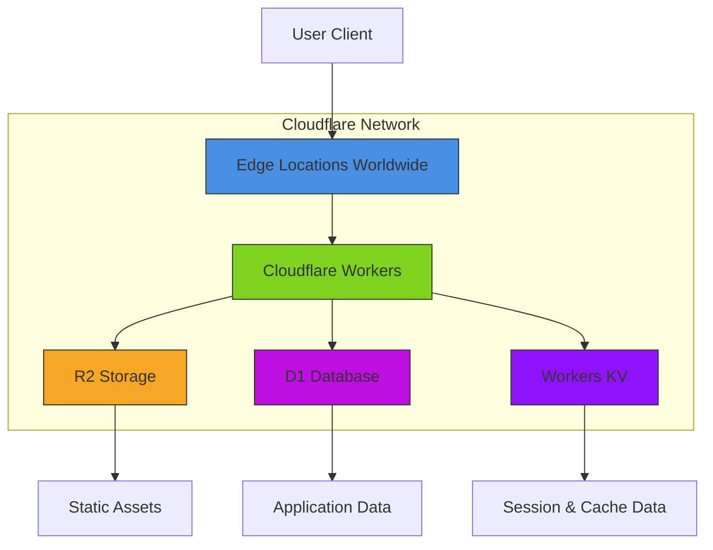
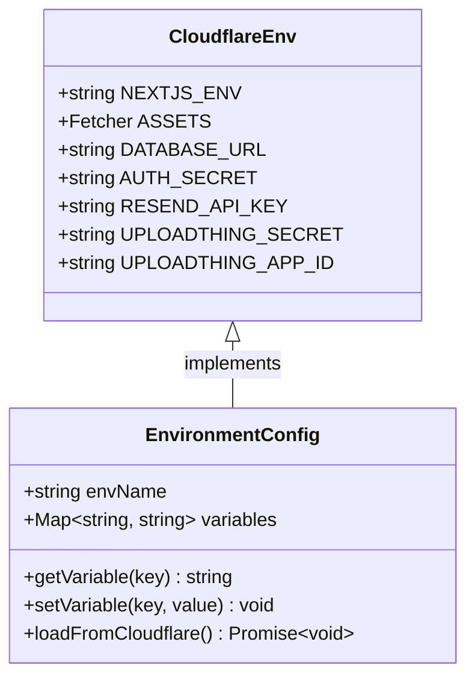
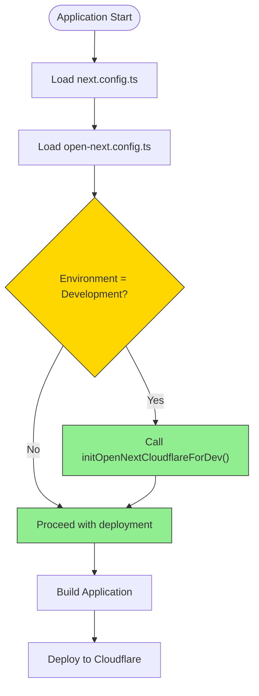
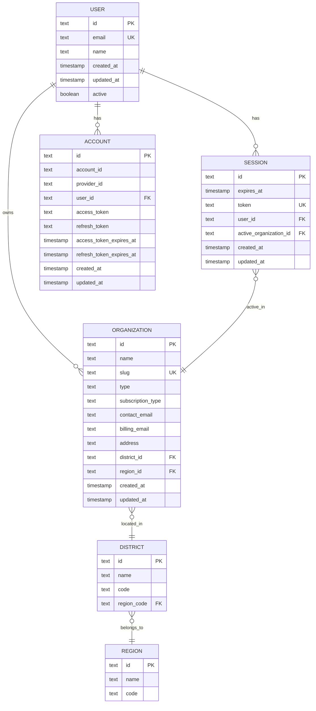
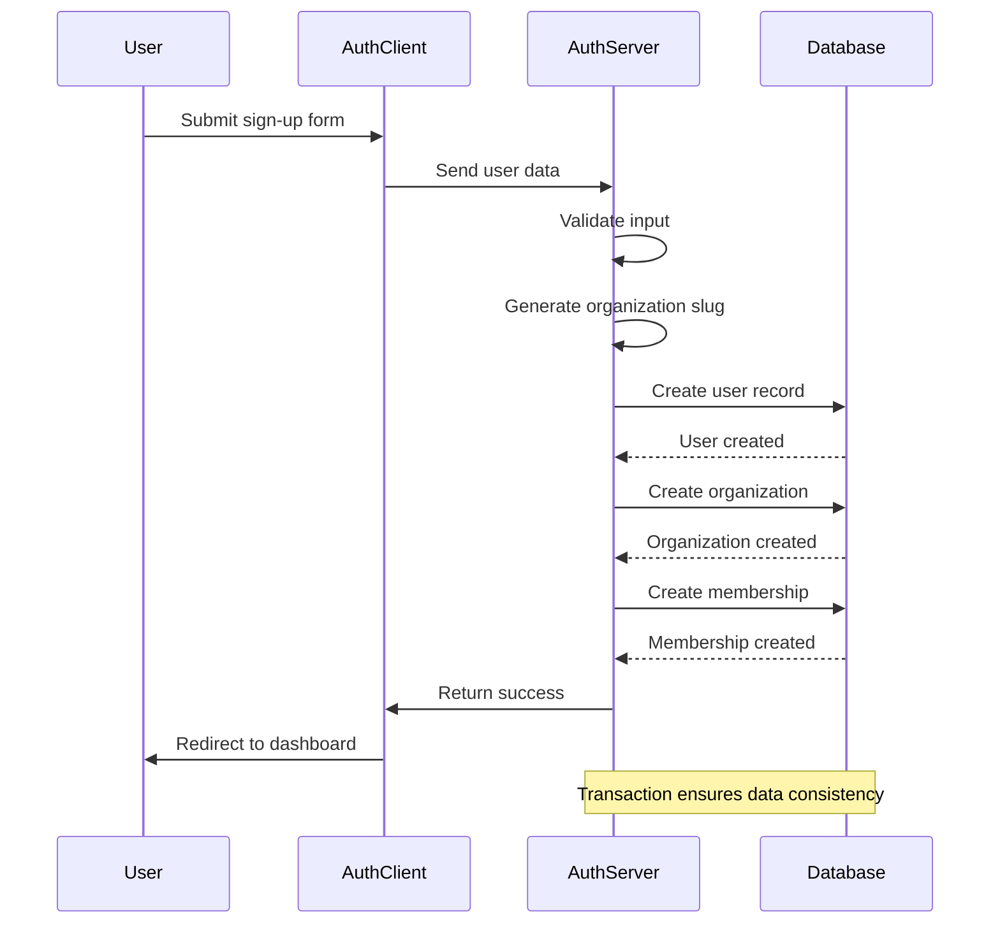

# Deployment & Environment Configuration

<cite>
**Referenced Files in This Document**   
- [next.config.ts](file://next.config.ts)
- [open-next.config.ts](file://open-next.config.ts)
- [cloudflare-env.d.ts](file://cloudflare-env.d.ts)
- [drizzle.config.ts](file://drizzle.config.ts)
- [src/server/db/schema.ts](file://src/server/db/schema.ts)
- [src/lib/auth.ts](file://src/lib/auth.ts)
- [src/config/constants/auth.ts](file://src/config/constants/auth.ts)
- [src/lib/org-permissions.ts](file://src/lib/org-permissions.ts)
- [src/lib/auth-organization-utils.ts](file://src/lib/auth-organization-utils.ts)
</cite>

## Table of Contents
1. [Introduction](#introduction)
2. [Cloudflare Deployment Strategy with OpenNext](#cloudflare-deployment-strategy-with-opennext)
3. [Environment Configuration and Variables](#environment-configuration-and-variables)
4. [Next.js and OpenNext Configuration](#nextjs-and-opennext-configuration)
5. [Database Setup and Migration Strategy](#database-setup-and-migration-strategy)
6. [Authentication and Security Configuration](#authentication-and-security-configuration)
7. [Deployment Workflows and CI/CD](#deployment-workflows-and-cicd)
8. [Rollback Procedures](#rollback-procedures)
9. [Monitoring and Observability](#monitoring-and-observability)
10. [Scaling Considerations](#scaling-considerations)
11. [Cost Optimization Strategies](#cost-optimization-strategies)

## Introduction
This document provides comprehensive guidance on deploying and configuring the pukpara application on Cloudflare using OpenNext. It covers infrastructure requirements, environment setup, configuration files, deployment workflows, and operational best practices. The application leverages Cloudflare's global network for high performance and low latency, with OpenNext enabling seamless deployment of Next.js applications to Cloudflare Workers.

## Cloudflare Deployment Strategy with OpenNext

The pukpara application utilizes OpenNext, a deployment framework that enables Next.js applications to run on Cloudflare Workers. This strategy provides serverless execution, global distribution, and integration with Cloudflare's performance and security features.

The deployment architecture leverages Cloudflare's edge network to serve static assets and execute server-side logic at the edge, reducing latency and improving user experience. OpenNext transforms the Next.js application into a format compatible with Cloudflare Workers, handling routing, API routes, and server-side rendering.

**Diagram sources**
- [open-next.config.ts](file://open-next.config.ts#L1-L9)
- [cloudflare-env.d.ts](file://cloudflare-env.d.ts#L1-L14)

**Section sources**
- [open-next.config.ts](file://open-next.config.ts#L1-L9)
- [cloudflare-env.d.ts](file://cloudflare-env.d.ts#L1-L14)

## Environment Configuration and Variables

The pukpara application requires several environment variables for proper operation in different environments. These variables are managed through Cloudflare's environment configuration system and accessed via the `CloudflareEnv` interface.

Key environment variables include:
- `NEXTJS_ENV`: Specifies the current environment (development, staging, production)
- `DATABASE_URL`: Connection string for the PostgreSQL database
- Authentication secrets for user management and organization creation
- Third-party service credentials for email delivery and file storage

The application uses a structured approach to environment configuration, with different values for development, staging, and production environments. Secrets are stored securely in Cloudflare's environment variables system and accessed at runtime.

**Diagram sources**
- [cloudflare-env.d.ts](file://cloudflare-env.d.ts#L1-L14)
- [src/lib/auth.ts](file://src/lib/auth.ts#L270-L303)

**Section sources**
- [cloudflare-env.d.ts](file://cloudflare-env.d.ts#L1-L14)
- [src/lib/auth.ts](file://src/lib/auth.ts#L270-L303)

## Next.js and OpenNext Configuration

The application's configuration is split between `next.config.ts` and `open-next.config.ts`, each serving a specific purpose in the deployment pipeline.

The `next.config.ts` file contains standard Next.js configuration options, extended with OpenNext-specific initialization for development environments. This includes the `initOpenNextCloudflareForDev` function that enables Cloudflare context access during development.

The `open-next.config.ts` file configures OpenNext-specific settings, including caching strategies and deployment options. Currently, the incremental cache with R2 is available as an option but commented out, allowing for easy enablement when needed.

**Section sources**
- [next.config.ts](file://next.config.ts#L1-L11)
- [open-next.config.ts](file://open-next.config.ts#L1-L8)

## Database Setup and Migration Strategy

The pukpara application uses a PostgreSQL database managed through Drizzle ORM for schema definition and migrations. The database configuration is defined in `drizzle.config.ts`, which specifies the PostgreSQL dialect, schema location, and output directory for migration files.

Database migrations are managed through Drizzle Kit, with schema definitions in `src/server/db/schema.ts`. The migration process follows a structured approach:
1. Define schema changes in the TypeScript schema file
2. Generate migration files using Drizzle CLI
3. Apply migrations to the database
4. Verify changes and update documentation

The application includes seed scripts for initial data population, such as the `seed-districts.ts` script that populates Ghana's regions and districts.

**Diagram sources**
- [drizzle.config.ts](file://drizzle.config.ts#L1-L10)
- [src/server/db/schema.ts](file://src/server/db/schema.ts#L73-L109)

**Section sources**
- [drizzle.config.ts](file://drizzle.config.ts#L1-L10)
- [src/server/db/schema.ts](file://src/server/db/schema.ts#L73-L109)

## Authentication and Security Configuration

The authentication system in pukpara is configured through the `auth.ts` file, which defines the authentication strategy, plugins, and organization management. The system uses a multi-provider approach with support for email/password, phone number (OTP), and API key authentication.

Organization creation and management are handled through utility functions in `auth-organization-utils.ts`, which generate unique slugs and handle organization metadata. The system enforces security policies through role-based access control defined in `org-permissions.ts`.

Security considerations include:
- Secure storage of authentication secrets
- Proper session management with expiration
- Role-based access control for organization members
- Input validation and sanitization
- Protection against common web vulnerabilities

**Diagram sources**
- [src/lib/auth.ts](file://src/lib/auth.ts#L143-L190)
- [src/lib/auth-organization-utils.ts](file://src/lib/auth-organization-utils.ts#L0-L55)

**Section sources**
- [src/lib/auth.ts](file://src/lib/auth.ts#L143-L190)
- [src/lib/auth-organization-utils.ts](file://src/lib/auth-organization-utils.ts#L0-L55)

## Deployment Workflows and CI/CD

The deployment workflow for pukpara follows a structured process to ensure reliable and consistent deployments across environments. The workflow is designed to support multiple environments (development, staging, production) with appropriate safeguards.

Deployment steps:
1. Code is pushed to the main branch or a release branch
2. CI pipeline runs tests and builds the application
3. OpenNext packages the application for Cloudflare deployment
4. Application is deployed to the target environment
5. Health checks verify the deployment
6. Traffic is routed to the new version

The workflow includes automated testing, code quality checks, and security scanning to maintain application quality. Rollback procedures are in place to quickly revert to a previous version if issues are detected.

## Rollback Procedures

Rollback procedures are critical for maintaining application availability and reliability. The pukpara application supports rollback through Cloudflare's version management system.

Rollback process:
1. Identify the issue requiring rollback
2. Verify the previous stable version is available
3. Initiate rollback through Cloudflare dashboard or CLI
4. Monitor application health during rollback
5. Verify functionality after rollback
6. Document the incident and rollback

The application maintains multiple deployment versions, allowing for quick restoration of previous states. Database migrations are designed to be reversible when possible, minimizing data impact during rollbacks.

## Monitoring and Observability

Monitoring is implemented through Cloudflare's built-in analytics and logging capabilities. Key metrics are tracked including:
- Request volume and response times
- Error rates and types
- Database query performance
- Cache hit ratios
- User authentication patterns

Alerts are configured for critical metrics, with notifications sent to the operations team. Logs are retained for audit and troubleshooting purposes, with sensitive information properly redacted.

## Scaling Considerations

The application is designed to scale horizontally through Cloudflare's distributed architecture. Key scaling considerations include:

- **Edge Caching**: Static assets and frequently accessed content are cached at the edge to reduce origin load
- **Database Scaling**: D1 database can be scaled based on performance requirements
- **Concurrency Management**: Worker concurrency is managed to handle traffic spikes
- **Rate Limiting**: Implemented to prevent abuse and ensure fair resource usage

The architecture supports automatic scaling based on traffic patterns, with performance monitoring to identify scaling needs.

## Cost Optimization Strategies

Cost optimization is achieved through several strategies:

- **Efficient Caching**: Maximizing cache hit ratios to reduce compute costs
- **Resource Tiering**: Using appropriate resource tiers for different environments
- **Scheduled Scaling**: Adjusting resources based on usage patterns
- **Monitoring and Alerts**: Identifying and addressing cost anomalies quickly

The application leverages Cloudflare's pricing model, which charges based on usage rather than fixed infrastructure costs, allowing for cost-effective scaling.