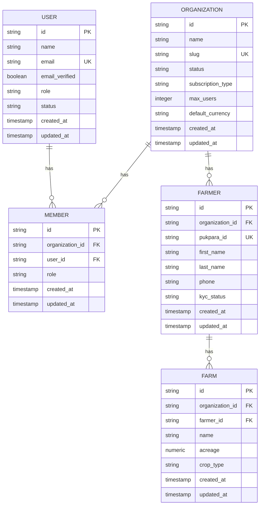
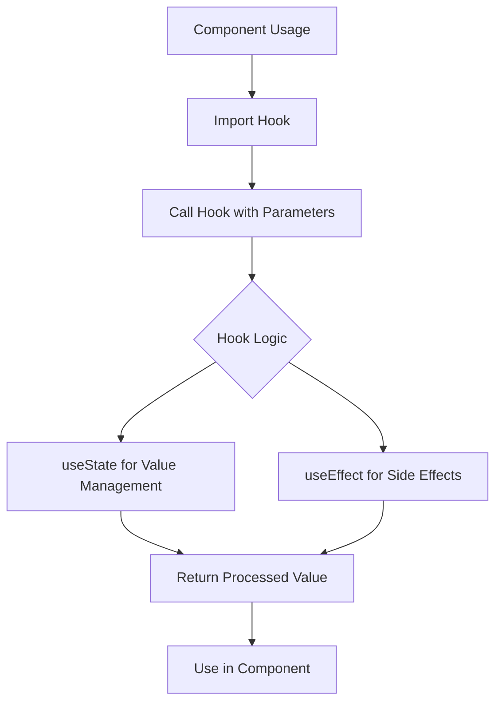
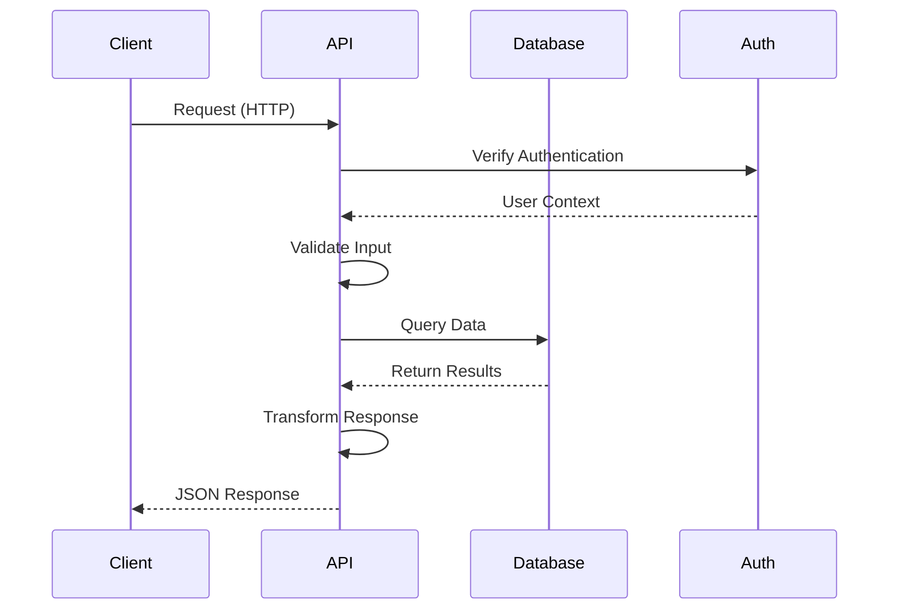

# Developer Guide

<cite>
**Referenced Files in This Document**   
- [use-debounce.ts](file://src/hooks/use-debounce.ts)
- [use-mobile.ts](file://src/hooks/use-mobile.ts)
- [drizzle.config.ts](file://drizzle.config.ts)
- [schema.ts](file://src/server/db/schema.ts)
- [districts.ts](file://src/server/api/routers/districts.ts)
- [organizations.ts](file://src/server/api/routers/organizations.ts)
- [admin-permissions.ts](file://src/lib/admin-permissions.ts)
- [auth-admin-client.ts](file://src/lib/auth-admin-client.ts)
- [auth-client.ts](file://src/lib/auth-client.ts)
- [auth-organization-utils.ts](file://src/lib/auth-organization-utils.ts)
- [auth-server.ts](file://src/lib/auth-server.ts)
- [auth.ts](file://src/lib/auth.ts)
- [org-permissions.ts](file://src/lib/org-permissions.ts)
- [uploadthing.ts](file://src/lib/uploadthing.ts)
- [utils.ts](file://src/lib/utils.ts)
</cite>

## Table of Contents
1. [Introduction](#introduction)
2. [Development Environment Setup](#development-environment-setup)
3. [Database Setup and Configuration](#database-setup-and-configuration)
4. [Drizzle ORM Migration Workflow](#drizzle-orm-migration-workflow)
5. [Custom Hooks Usage and Integration](#custom-hooks-usage-and-integration)
6. [API Development and Extension](#api-development-and-extension)
7. [Testing Strategy](#testing-strategy)
8. [Debugging Techniques](#debugging-techniques)
9. [Contribution Guidelines](#contribution-guidelines)
10. [Common Development Tasks](#common-development-tasks)

## Introduction
This Developer Guide provides comprehensive instructions for developers working on the pukpara application. It covers environment setup, database management, custom hook usage, API development, testing, debugging, and contribution workflows. The guide is designed to help both new and experienced developers understand the codebase structure and development practices used in the project.

## Development Environment Setup
To set up the development environment for pukpara, follow these steps:

1. Clone the repository from the source control system
2. Install Node.js (version 18 or higher) and pnpm package manager
3. Run `pnpm install` to install all project dependencies
4. Set up environment variables by creating a `.env` file based on the example configuration
5. Install PostgreSQL database server or use a cloud-hosted instance
6. Configure the DATABASE_URL environment variable with your PostgreSQL connection string
7. Start the development server using `pnpm dev`

The application uses Next.js with TypeScript, so ensure your IDE has proper support for these technologies. Recommended IDEs include Visual Studio Code with appropriate extensions for TypeScript, React, and Drizzle ORM.

**Section sources**
- [package.json](file://package.json#L1-L20)
- [next.config.ts](file://next.config.ts#L1-L10)
- [tsconfig.json](file://tsconfig.json#L1-L15)

## Database Setup and Configuration
The pukpara application uses PostgreSQL as its primary database with Drizzle ORM for schema management. To set up the database:

1. Create a PostgreSQL database instance
2. Configure the connection URL in the environment variables
3. Initialize the database schema using Drizzle CLI commands
4. Run migrations to create the initial database structure

The database configuration is defined in `drizzle.config.ts`, which specifies the PostgreSQL dialect, schema file location, and output directory for migration files. The actual schema definitions are located in `src/server/db/schema.ts`, which contains comprehensive table definitions for all application domains including users, organizations, farmers, inventory, and financial transactions.

**Section sources**
- [drizzle.config.ts](file://drizzle.config.ts#L1-L10)
- [schema.ts](file://src/server/db/schema.ts#L1-L50)

## Drizzle ORM Migration Workflow
The database migration workflow in pukpara follows a structured process using Drizzle ORM:

1. Define schema changes in `src/server/db/schema.ts`
2. Generate migration files using `pnpm drizzle-kit generate`
3. Review the generated migration SQL in the `drizzle` directory
4. Apply migrations to the database using `pnpm drizzle-kit push`
5. Verify the changes in the database

For production deployments, use `pnpm drizzle-kit migrate` to apply migrations in a controlled manner. The migration system supports versioning and rollback capabilities. When making schema changes, ensure backward compatibility with existing data and applications. Always test migrations on a copy of production data before applying to live environments.

The schema file uses Drizzle's fluent API to define tables, relationships, indexes, and constraints. It includes comprehensive type safety through TypeScript interfaces and supports complex relationships between entities such as organizations, users, farmers, and financial records.

**Diagram sources**
- [schema.ts](file://src/server/db/schema.ts#L100-L200)
- [schema.ts](file://src/server/db/schema.ts#L300-L400)

**Section sources**
- [drizzle.config.ts](file://drizzle.config.ts#L1-L10)
- [schema.ts](file://src/server/db/schema.ts#L1-L100)

## Custom Hooks Usage and Integration
The pukpara application includes custom React hooks in the `src/hooks/` directory that provide reusable functionality across components. These hooks follow React best practices and are designed for optimal performance and type safety.

The `use-debounce` hook implements debouncing for values, commonly used in search inputs and form fields to reduce unnecessary re-renders or API calls. It takes a value and delay parameter, returning the debounced value after the specified timeout.

The `use-is-mobile` hook detects mobile device screen size using window.matchMedia, returning a boolean indicating whether the current viewport is below the mobile breakpoint (768px). This hook is useful for implementing responsive design patterns and conditional rendering based on device type.

To integrate custom hooks in components:
1. Import the hook from `src/hooks/`
2. Call the hook in your functional component
3. Use the returned values in your component logic or rendering

Custom hooks can be extended or new ones created by following the same pattern and placing them in the hooks directory. All hooks should be properly typed with TypeScript and include JSDoc comments for documentation.

**Diagram sources**
- [use-debounce.ts](file://src/hooks/use-debounce.ts#L1-L17)
- [use-mobile.ts](file://src/hooks/use-mobile.ts#L1-L19)

**Section sources**
- [use-debounce.ts](file://src/hooks/use-debounce.ts#L1-L17)
- [use-mobile.ts](file://src/hooks/use-mobile.ts#L1-L19)

## API Development and Extension
The pukpara application uses tRPC for type-safe API development, providing end-to-end TypeScript types for backend and frontend communication. API routes are defined in `src/server/api/routers/` directory, with each router handling a specific domain.

To extend existing APIs or create new ones:
1. Create a new router file in the appropriate subdirectory
2. Define procedures using tRPC's publicProcedure or protectedProcedure
3. Implement the business logic with proper error handling
4. Import and merge the router in the root router configuration

The districts API example shows how to create a query procedure that joins multiple tables (district and region) and returns structured data. The procedure uses Drizzle ORM for database queries with proper type inference. When creating new API endpoints, follow the same pattern of input validation, error handling, and response formatting.

Authentication and authorization are handled through middleware, with different procedures available for public, organization-level, and admin-level access. The permission system is implemented in the lib directory with utilities for checking user roles and organization membership.

**Diagram sources**
- [districts.ts](file://src/server/api/routers/districts.ts#L1-L66)
- [organizations.ts](file://src/server/api/routers/organizations.ts#L1-L50)

**Section sources**
- [districts.ts](file://src/server/api/routers/districts.ts#L1-L66)
- [organizations.ts](file://src/server/api/routers/organizations.ts#L1-L50)

## Testing Strategy
The pukpara application implements a comprehensive testing strategy that includes unit tests, integration tests, and end-to-end tests. The testing framework is based on Jest and React Testing Library, with additional tools for API testing and database mocking.

Unit tests focus on individual functions, hooks, and components in isolation. Integration tests verify the interaction between multiple components or between the frontend and backend APIs. End-to-end tests simulate user workflows through the application interface.

Test files are colocated with the source files they test, using the `.test.ts` or `.spec.ts` extension. All tests should be written with clear assertions and descriptive test names. Mock external dependencies such as API calls and database operations to ensure test reliability and speed.

The testing strategy emphasizes:
- High code coverage for critical business logic
- Type safety through TypeScript in test assertions
- Realistic test data that reflects production scenarios
- Performance testing for critical API endpoints
- Accessibility testing for UI components

**Section sources**
- [package.json](file://package.json#L20-L30)
- [jest.config.js](file://jest.config.js#L1-L50)

## Debugging Techniques
Effective debugging in the pukpara application involves several techniques and tools:

1. Use browser developer tools for frontend debugging, particularly React DevTools for component inspection
2. Enable detailed logging in development mode through environment variables
3. Use console.log statements strategically, removing them before commit
4. Leverage TypeScript compiler errors for catching issues early
5. Use debugger statements for step-through debugging in both frontend and backend code

For API debugging, examine the network tab in browser developer tools to inspect request/response payloads and status codes. For database issues, use Drizzle ORM's query logging to see the actual SQL being generated. When debugging authentication issues, check the session and token storage in browser local storage or cookies.

The application includes error boundaries in React components to catch and display frontend errors gracefully. On the backend, implement proper error handling with structured error responses that include error codes and messages suitable for both developers and end users.

**Section sources**
- [middleware.ts](file://src/middleware.ts#L1-L20)
- [error-handler.ts](file://src/lib/error-handler.ts#L1-L30)

## Contribution Guidelines
Contributions to the pukpara application follow a structured workflow:

1. Create a feature branch from the main branch
2. Implement changes with proper testing
3. Ensure code formatting with Prettier and linting with ESLint
4. Write clear commit messages following conventional commits
5. Submit a pull request with a detailed description of changes
6. Await code review and address feedback
7. Merge after approval

Code quality is maintained through:
- TypeScript for type safety
- ESLint for code style enforcement
- Prettier for consistent formatting
- Husky for pre-commit hooks
- GitHub Actions for CI/CD

Documentation should be updated alongside code changes, particularly for public APIs and configuration options. When introducing breaking changes, provide migration guides and deprecation warnings.

**Section sources**
- [package.json](file://package.json#L30-L50)
- [.github/workflows](file://.github/workflows#L1-L100)

## Common Development Tasks

### Adding New Features
To add new features to pukpara:
1. Identify the appropriate location in the codebase based on feature domain
2. Create necessary database schema changes in `schema.ts`
3. Generate and apply migrations
4. Implement backend API endpoints using tRPC
5. Create frontend components and pages
6. Connect frontend to backend using tRPC hooks
7. Write tests for all new functionality
8. Update documentation

### Extending APIs
When extending existing APIs:
1. Determine if new endpoints are needed or existing ones should be modified
2. Update router files with new procedures
3. Implement business logic with proper error handling
4. Update input validation schemas
5. Extend response types in TypeScript interfaces
6. Update documentation for new endpoints
7. Write integration tests

### Modifying Database Schema
To modify the database schema:
1. Update `src/server/db/schema.ts` with new tables, columns, or relationships
2. Generate migration files using Drizzle Kit
3. Review generated SQL for correctness
4. Test migrations on a development database
5. Add data migration logic if needed
6. Update repository interfaces and services
7. Test all affected functionality

When making schema changes, consider backward compatibility, data integrity, and performance implications. For production changes, plan downtime if necessary and communicate with stakeholders.

**Section sources**
- [schema.ts](file://src/server/db/schema.ts#L1-L1318)
- [drizzle.config.ts](file://drizzle.config.ts#L1-L10)
- [lib/](file://src/lib/#L1-L100)