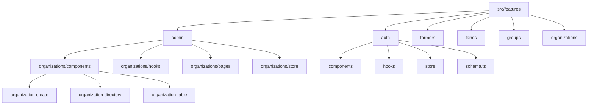

# Directory Structure

<cite>
**Referenced Files in This Document**  
- [layout.tsx](file://src/app/layout.tsx)
- [button.tsx](file://src/components/ui/button.tsx)
- [utils.ts](file://src/lib/utils.ts)
- [organizations-page.tsx](file://src/features/admin/organizations/pages/organizations-page.tsx)
- [app](file://src/app)
- [components](file://src/components)
- [features](file://src/features)
- [lib](file://src/lib)
- [server](file://src/server)
- [next.config.ts](file://next.config.ts)
- [package.json](file://package.json)
- [tsconfig.json](file://tsconfig.json)
</cite>

## Table of Contents
1. [Introduction](#introduction)
2. [Top-Level Directory Overview](#top-level-directory-overview)
3. [App Router Structure (src/app)](#app-router-structure-srcapp)
4. [Reusable UI Components (src/components)](#reusable-ui-components-srccomponents)
5. [Domain-Specific Features (src/features)](#domain-specific-features-srcfeatures)
6. [Core Utilities (src/lib)](#core-utilities-srclib)
7. [Backend Logic (src/server)](#backend-logic-srctserver)
8. [Root-Level Configuration Files](#root-level-configuration-files)
9. [File Naming and Routing Patterns](#file-naming-and-routing-patterns)
10. [Impact on Maintainability and Developer Onboarding](#impact-on-maintainability-and-developer-onboarding)

## Introduction
The pukpara codebase follows a well-organized, scalable structure that aligns with modern Next.js practices and feature-sliced architecture principles. This document provides a comprehensive breakdown of the directory organization, explaining the purpose of each major directory and subdirectory, highlighting routing patterns, component categorization, and how the structure supports long-term maintainability and team onboarding.

## Top-Level Directory Overview
The project root contains configuration files and the `src` directory, which houses all application source code. The top-level directories serve distinct roles:

- `src/app`: Implements the Next.js App Router for page routing and layout management
- `src/components`: Contains reusable UI elements categorized by function
- `src/features`: Organizes domain-specific functionality using a feature-sliced approach
- `src/lib`: Houses core utility functions and shared logic
- `src/server`: Contains backend logic including API routes and database interactions
- Root-level files: Configuration for Next.js, TypeScript, package management, and build tools

This separation ensures clear boundaries between concerns and enables scalable growth.

**Section sources**
- [next.config.ts](file://next.config.ts)
- [package.json](file://package.json)
- [tsconfig.json](file://tsconfig.json)

## App Router Structure (src/app)
The `src/app` directory implements the Next.js App Router, organizing pages and layouts hierarchically. It uses route groups (denoted by parentheses) to logically separate different application contexts:

- `(admin)`: Admin-specific routes requiring elevated permissions
- `(app)`: Main application routes for authenticated users
- `(auth)`: Authentication flows including sign-in, sign-up, and password reset

Each route group contains feature-specific subdirectories (e.g., `farmers`, `organizations`, `settings`) with `page.tsx` files defining the UI for each route. Dynamic routes use the `[param]` syntax (e.g., `[organizationId]/page.tsx`) to handle variable path segments.

The root `layout.tsx` provides shared UI elements and providers (theme, TRPC, toast notifications) across all routes, ensuring consistent application state and styling.

```mermaid
graph TB
A[src/app] --> B[(admin)/admin]
A --> C[(app)]
A --> D[(auth)]
A --> E[api]
A --> F[pending-approval]
A --> G[layout.tsx]
A --> H[globals.css]
B --> B1[audit]
B --> B2[farmers]
B --> B3[inventory]
B --> B4[marketplace]
B --> B5[organizations]
B --> B6[payments]
B --> B7[settings]
B --> B8[users]
C --> C1[farmers]
C --> C2[groups]
C --> C3[settings]
D --> D1[forgot-password]
D --> D2[reset-password]
D --> D3[sign-in]
D --> D4[sign-up]
```

**Diagram sources**
- [src/app](file://src/app)
- [src/app/layout.tsx](file://src/app/layout.tsx)

**Section sources**
- [src/app](file://src/app)
- [src/app/layout.tsx](file://src/app/layout.tsx)

## Reusable UI Components (src/components)
The `src/components` directory is organized into three main subdirectories:

- `layout`: Contains structural components like `header`, `sidebar`, and `dashboard-layout` that define page layouts
- `providers`: Houses context providers such as `theme-provider` for managing application state
- `ui`: Contains primitive UI components (buttons, cards, inputs) built using Radix UI and Tailwind CSS

The `ui` directory follows a component-per-file pattern with descriptive names (e.g., `button.tsx`, `card.tsx`). These components are designed to be reusable across features and are styled using utility classes and `cva` for variant management.

**Section sources**
- [src/components/ui/button.tsx](file://src/components/ui/button.tsx)
- [src/components/layout](file://src/components/layout)
- [src/components/providers/theme-provider.tsx](file://src/components/providers/theme-provider.tsx)

## Domain-Specific Features (src/features)
The `src/features` directory implements a feature-sliced architecture, organizing code by domain rather than technical layer. Each feature (e.g., `admin`, `auth`, `farmers`) contains its own components, hooks, and pages:

- `admin/organizations`: Contains organization management functionality with subdirectories for components, hooks, pages, and state management
- `auth`: Handles authentication flows with forms, layout, and validation schema
- Feature-specific components are colocated with their functionality, reducing dependency sprawl

This approach improves maintainability by keeping related code together and enables teams to work independently on different features.



**Diagram sources**
- [src/features](file://src/features)
- [src/features/admin/organizations/pages/organizations-page.tsx](file://src/features/admin/organizations/pages/organizations-page.tsx)

**Section sources**
- [src/features](file://src/features)
- [src/features/admin/organizations/pages/organizations-page.tsx](file://src/features/admin/organizations/pages/organizations-page.tsx)

## Core Utilities (src/lib)
The `src/lib` directory contains shared utility functions and service clients that are used across multiple features:

- `auth-client.ts`, `auth-admin-client.ts`: Authentication service clients
- `admin-permissions.ts`, `org-permissions.ts`: Role-based access control utilities
- `uploadthing.ts`: File upload integration
- `utils.ts`: General-purpose utilities like `cn()` for className merging and `toSlug()` for string transformation

These utilities are designed to be imported throughout the application, promoting code reuse and consistency.

**Section sources**
- [src/lib/utils.ts](file://src/lib/utils.ts)
- [src/lib](file://src/lib)

## Backend Logic (src/server)
The `src/server` directory contains server-side logic organized into:

- `api/routers`: tRPC routers for type-safe API endpoints (e.g., `districts.ts`, `organizations.ts`)
- `db`: Database configuration and schema definitions using Drizzle ORM
- `email`: Email service integration (Resend)

This structure separates backend concerns from frontend code while maintaining type safety through tRPC. The API routes in `src/app/api` serve as entry points that connect to these server-side implementations.

**Section sources**
- [src/server](file://src/server)
- [src/server/api/routers](file://src/server/api/routers)

## Root-Level Configuration Files
Root-level configuration files define the project's build, linting, and runtime settings:

- `next.config.ts`: Next.js configuration including compiler options and routing
- `tsconfig.json`: TypeScript compiler configuration
- `drizzle.config.ts`: Database migration configuration
- `package.json`: Project metadata and dependencies
- `components.json`: Component library configuration for UI primitives

These files establish the foundational settings that govern how the application is built and deployed.

**Section sources**
- [next.config.ts](file://next.config.ts)
- [tsconfig.json](file://tsconfig.json)
- [package.json](file://package.json)
- [drizzle.config.ts](file://drizzle.config.ts)

## File Naming and Routing Patterns
The codebase follows consistent naming conventions:

- **Page files**: `page.tsx` for route entry points, enabling Next.js routing
- **Component files**: PascalCase for component names (e.g., `OrganizationDirectoryCard.tsx`)
- **Hook files**: `use-*` prefix (e.g., `use-organization-filters.ts`)
- **Dynamic routes**: `[param]` syntax (e.g., `[organizationId]/page.tsx`) for route parameters
- **Route groups**: Parentheses `(group)` to organize related routes without affecting URL structure

These patterns make it easy to understand the purpose of files at a glance and ensure predictable routing behavior.

**Section sources**
- [src/app](file://src/app)
- [src/features](file://src/features)

## Impact on Maintainability and Developer Onboarding
The directory structure significantly enhances maintainability and developer onboarding through:

1. **Clear separation of concerns**: Each directory has a well-defined responsibility
2. **Feature-sliced architecture**: Related code is colocated, reducing cognitive load
3. **Consistent patterns**: Predictable file naming and routing conventions
4. **Scalable organization**: New features can be added without disrupting existing code
5. **Discoverability**: Logical grouping makes it easy to find related functionality

New developers can quickly understand the application structure by following the directory hierarchy and established patterns, reducing ramp-up time and minimizing the risk of introducing bugs.

**Section sources**
- [src/app](file://src/app)
- [src/features](file://src/features)
- [src/components](file://src/components)
- [src/lib](file://src/lib)
- [src/server](file://src/server)