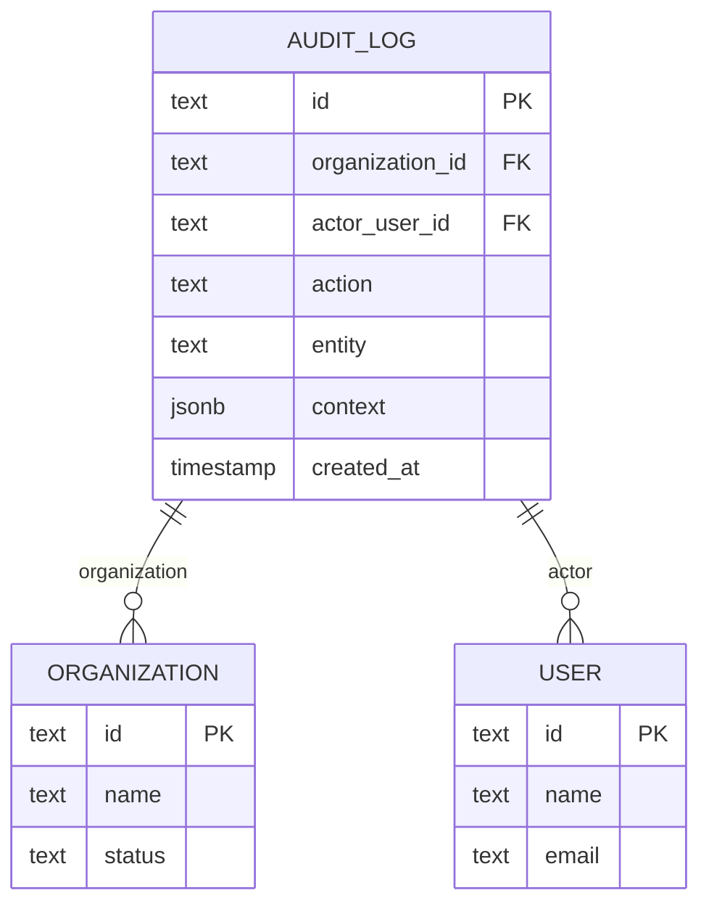
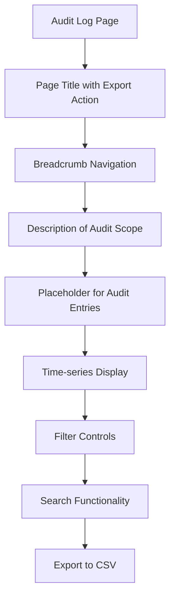

# Audit & Compliance

<cite>
**Referenced Files in This Document**   
- [schema.ts](file://src/server/db/schema.ts#L849-L888)
- [page.tsx](file://src/app/(admin)/admin/audit/page.tsx#L0-L19)
- [auth.ts](file://src/lib/auth.ts#L98-L145)
</cite>

## Table of Contents
1. [Introduction](#introduction)
2. [Audit Logging Implementation](#audit-logging-implementation)
3. [Database Schema for Audit Events](#database-schema-for-audit-events)
4. [UI for Viewing Audit Trails](#ui-for-viewing-audit-trails)
5. [Integration with Better Auth](#integration-with-better-auth)
6. [Compliance Features](#compliance-features)
7. [Forensic Analysis and Regulatory Reporting](#forensic-analysis-and-regulatory-reporting)
8. [Conclusion](#conclusion)

## Introduction
The Audit & Compliance system provides a comprehensive framework for tracking and auditing critical operations across organizations, users, and financial transactions. This document details the implementation of audit logging, database schema design, user interface components, authentication integration, and compliance mechanisms that ensure data integrity and regulatory adherence.

**Section sources**
- [schema.ts](file://src/server/db/schema.ts#L849-L888)
- [page.tsx](file://src/app/(admin)/admin/audit/page.tsx#L0-L19)

## Audit Logging Implementation
Audit logging is implemented at the application level to capture critical operations across the system. The audit mechanism records actions related to organizations, users, financial transactions, and administrative operations. Each audit entry captures the actor (user), action performed, affected entity, and contextual information.

Audit logs are created through application-level hooks that trigger when sensitive operations occur, such as approving loans, modifying user permissions, or changing organizational settings. These hooks ensure that all critical operations are captured regardless of the entry point (API, UI, or background process).

The system uses a centralized audit log table that maintains a time-series record of all auditable events, enabling traceability and accountability across the platform.

**Section sources**
- [schema.ts](file://src/server/db/schema.ts#L849-L888)
- [auth.ts](file://src/lib/auth.ts#L98-L145)

## Database Schema for Audit Events
The audit event schema is designed to capture essential information about each audited operation while maintaining flexibility for various event types.

**Diagram sources**
- [schema.ts](file://src/server/db/schema.ts#L849-L888)

The `audit_log` table contains the following fields:
- **id**: Unique identifier for the audit entry
- **organizationId**: Reference to the organization context (if applicable)
- **actorUserId**: Reference to the user who performed the action
- **action**: String identifier for the action (e.g., "loan.approve", "user.create")
- **entity**: Reference to the affected entity in format "entityType:entityId"
- **context**: JSONB field containing additional contextual information about the operation
- **createdAt**: Timestamp of when the action was performed

The schema includes relations that connect audit logs to their associated organizations and users, enabling efficient querying and reporting.

**Section sources**
- [schema.ts](file://src/server/db/schema.ts#L849-L888)

## UI for Viewing Audit Trails
The administrative interface for audit trails provides a comprehensive view of system activities with filtering, search, and export capabilities.

**Diagram sources**
- [page.tsx](file://src/app/(admin)/admin/audit/page.tsx#L0-L19)

The audit page UI includes:
- **Page title** with export functionality to CSV format
- **Breadcrumbs** for navigation context
- **Descriptive text** explaining the scope of the audit log
- **Time-series display** of audit entries (currently represented by a placeholder)
- **Filtering options** to narrow down audit events by date, user, organization, or action type
- **Search capability** to find specific events or entities
- **Export functionality** to download audit data for external analysis or compliance reporting

The current implementation shows a placeholder section, indicating that the full audit trail visualization will be implemented with time-series entries, retention controls, and advanced filtering options.

**Section sources**
- [page.tsx](file://src/app/(admin)/admin/audit/page.tsx#L0-L19)

## Integration with Better Auth
The audit system is integrated with the authentication framework to track all authentication-related events and session changes.

Authentication events such as user sign-ins, session creation, and organization switching are captured in the audit log. The integration occurs through middleware and authentication hooks that create audit entries when authentication state changes.

When a user creates a new session, the system records this event in the audit log, capturing the user ID, timestamp, and any relevant context such as IP address or user agent (when available). Organization creation events triggered through the authentication flow are also audited, ensuring that all identity and access management operations are traceable.

This integration ensures that security-critical authentication operations are subject to the same audit requirements as business operations, providing a complete picture of system activity.

**Section sources**
- [auth.ts](file://src/lib/auth.ts#L98-L145)
- [schema.ts](file://src/server/db/schema.ts#L849-L888)

## Compliance Features
The audit system incorporates several compliance-focused features to meet regulatory requirements and ensure data integrity.

### Immutable Logs
Audit logs are designed to be immutable - once created, they cannot be modified or deleted. This immutability is enforced at both the application and database levels, preventing tampering with audit records.

### Retention Policies
The system implements configurable retention policies that determine how long audit logs are preserved. These policies can be set at the organization level or globally for administrative logs, ensuring compliance with data retention regulations.

### Access Controls
Access to audit data is strictly controlled through role-based permissions. Only users with appropriate administrative privileges can view the global audit log, and their access is itself audited. This creates a layered security model where sensitive audit data is protected from unauthorized access.

### Data Integrity
The audit system ensures data integrity through several mechanisms:
- All audit entries are timestamped at creation
- Each entry is linked to the actor who performed the action
- Contextual information is preserved in the JSONB context field
- Relationships to organizations and users are maintained even if the referenced entities are later modified

These compliance features work together to create a trustworthy audit trail that can be used for regulatory reporting and forensic analysis.

**Section sources**
- [schema.ts](file://src/server/db/schema.ts#L849-L888)

## Forensic Analysis and Regulatory Reporting
The audit system supports both forensic analysis and regulatory reporting through its comprehensive data capture and export capabilities.

For forensic analysis, investigators can:
- Trace the sequence of operations leading up to an incident
- Identify the users responsible for specific actions
- Examine the context in which operations were performed
- Correlate events across different entities and time periods

The system facilitates regulatory reporting by providing:
- Complete records of all critical operations
- Export functionality for offline analysis and submission
- Search and filtering tools to identify specific event categories
- Time-series data suitable for compliance audits

The audit log's structure, with its standardized action naming, entity references, and contextual data, enables automated analysis tools to process and interpret audit data for compliance verification and risk assessment.

**Section sources**
- [schema.ts](file://src/server/db/schema.ts#L849-L888)
- [page.tsx](file://src/app/(admin)/admin/audit/page.tsx#L0-L19)

## Conclusion
The Audit & Compliance system provides a robust framework for tracking critical operations across the platform. By implementing comprehensive audit logging at the application level, designing a flexible database schema, and integrating with authentication systems, the platform ensures accountability and traceability for all sensitive operations.

The system's compliance features, including immutable logs, retention policies, and access controls, meet regulatory requirements while supporting forensic analysis and reporting needs. The administrative interface provides the necessary tools for monitoring system activity and exporting audit data when required.

Future enhancements to the audit system will likely include advanced filtering, real-time alerts for suspicious activities, and enhanced visualization of audit trails to further strengthen the platform's compliance capabilities.