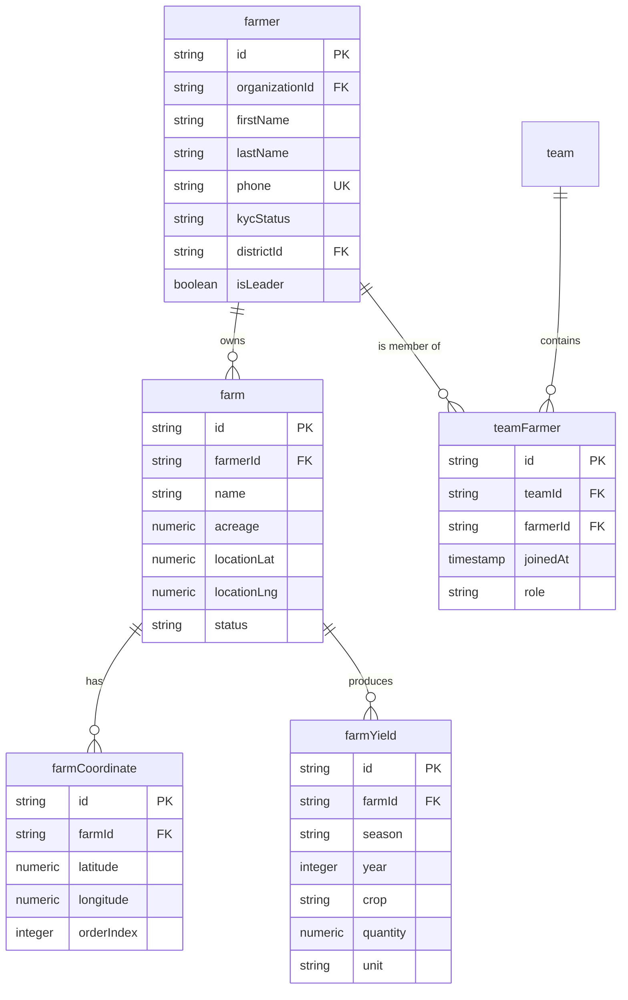
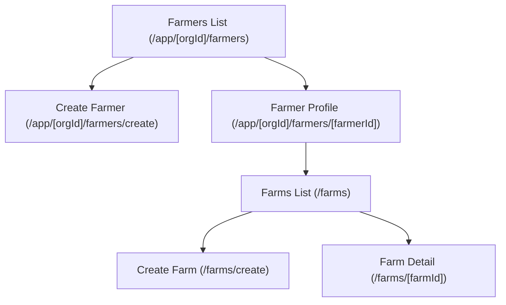
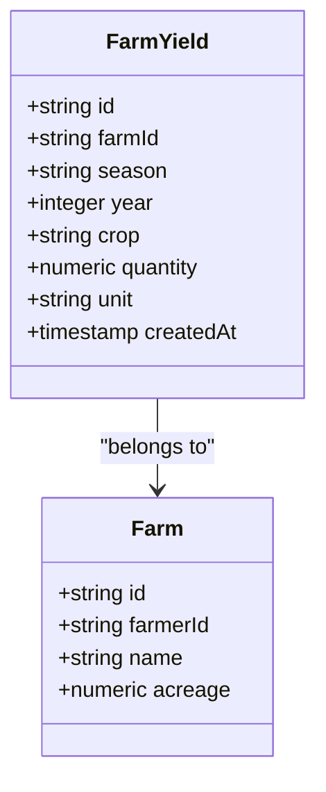
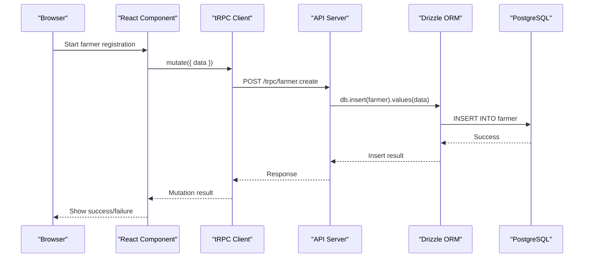

# Farmer Management System

<cite>
**Referenced Files in This Document**   
- [schema.ts](file://src/server/db/schema.ts#L252-L329)
- [page.tsx](file://src/app/(app)/farmers/page.tsx)
- [create/page.tsx](file://src/app/(app)/farmers/create/page.tsx)
- [farmers-directory-placeholder.tsx](file://src/features/farmers/components/farmers-directory-placeholder.tsx)
- [farm.tsx](file://src/server/db/schema.ts#L293-L329)
- [farmCoordinate.tsx](file://src/server/db/schema.ts#L331-L349)
- [farmYield.tsx](file://src/server/db/schema.ts#L351-L370)
- [teamFarmer.tsx](file://src/server/db/schema.ts#L293-L307)
- [react.tsx](file://src/trpc/react.tsx)
- [farmerId]/page.tsx](file://src/app/(app)/farmers/[farmerId]/page.tsx)
- [farmerId]/farms/page.tsx](file://src/app/(app)/farmers/[farmerId]/farms/page.tsx)
- [farmerId]/farms/create/page.tsx](file://src/app/(app)/farmers/[farmerId]/farms/create/page.tsx)
- [farmerId]/farms/[farmId]/page.tsx](file://src/app/(app)/farmers/[farmerId]/farms/[farmId]/page.tsx)
- [farms-list-placeholder.tsx](file://src/features/farms/components/farms-list-placeholder.tsx)
</cite>

## Table of Contents
1. [Introduction](#introduction)
2. [Domain Model](#domain-model)
3. [UI Components and Page Structure](#ui-components-and-page-structure)
4. [tRPC Integration for Data Handling](#trpc-integration-for-data-handling)
5. [GPS Coordinate Handling and Farm Mapping](#gps-coordinate-handling-and-farm-mapping)
6. [Seasonal Yield Tracking](#seasonal-yield-tracking)
7. [Relationship Management with VSLAs or Teams](#relationship-management-with-vslas-or-teams)
8. [Reusable UI Components Usage](#reusable-ui-components-usage)
9. [Farmer Creation Flow and Drizzle ORM Persistence](#farmer-creation-flow-and-drizzle-orm-persistence)
10. [Common Issues and Data Validation Strategies](#common-issues-and-data-validation-strategies)

## Introduction
The Farmer Management System enables agricultural organizations to register, track, and manage smallholder farmers and their farms. It supports KYC verification, GPS-based farm mapping, yield tracking, and integration with community groups such as VSLAs (Village Savings and Loan Associations). The system is built using a modern React/Next.js stack with tRPC for end-to-end type safety and Drizzle ORM for database interactions.

This document details the domain model, UI architecture, data flow, and key implementation patterns for managing farmers and farms within the member-facing application.

**Section sources**
- [page.tsx](file://src/app/(app)/farmers/page.tsx)
- [schema.ts](file://src/server/db/schema.ts#L252-L329)

## Domain Model
The core domain entities include `Farmer`, `Farm`, `FarmCoordinate`, `FarmYield`, and `TeamFarmer` for group affiliations. These are modeled using PostgreSQL via Drizzle ORM with proper referential integrity and indexing.

### Farmer Entity
The `farmer` table captures personal, demographic, and compliance data:
- Personal info: `firstName`, `lastName`, `gender`, `dateOfBirth`
- Contact: `phone`, `address`, `community`
- Identification: `idNumber`, `idType`, `kycStatus` (pending, verified, rejected)
- Organizational context: `organizationId`, `districtId`, `pukparaId`
- Metadata: `householdSize`, `isLeader`, `imgUrl`

### Farm Entity
Each farmer may have multiple farms represented by the `farm` table:
- Basic info: `name`, `acreage`, `cropType`, `soilType`
- Location: `locationLat`, `locationLng` (for centroid)
- Status: `status` (active, inactive), timestamps

### Farm Coordinates
Polygonal boundaries are stored in `farmCoordinate`:
- `latitude`, `longitude`, `orderIndex` to reconstruct farm perimeters
- Linked to `farm` via `farmId`

### Yield Tracking
Seasonal production data is captured in `farmYield`:
- `season`, `year`, `crop`, `quantity`, `unit`
- Supports historical yield analysis

### Team Membership
Farmers can belong to VSLAs or other teams via `teamFarmer`:
- `teamId`, `farmerId`, `joinedAt`, `role` (e.g., chairperson)

**Diagram sources**
- [schema.ts](file://src/server/db/schema.ts#L252-L329)
- [schema.ts](file://src/server/db/schema.ts#L331-L370)

**Section sources**
- [schema.ts](file://src/server/db/schema.ts#L252-L329)

## UI Components and Page Structure
The member-facing application provides a structured navigation experience for managing farmers and farms.

### Farmers List Page
Located at `/app/[orgId]/farmers`, this page displays a directory of all farmers within an organization. It uses the `FarmersDirectoryPlaceholder` component as a UI shell for future data grid implementation.

**Key Elements:**
- Breadcrumb navigation
- Action button to create new farmer
- Search and filter controls (planned)
- Data table placeholder

### Farmer Profile Page
Accessed via `/app/[orgId]/farmers/[farmerId]`, this page shows an individual farmer’s details including personal information, KYC status, and associated farms.

### Farms Management
Farmers can have multiple farms managed under nested routes:
- `/farms`: List all farms for a farmer
- `/farms/create`: Register a new farm
- `/farms/[farmId]`: View detailed farm information

Each page uses consistent layout with `PageTitle` for breadcrumbs, actions, and descriptions.

**Diagram sources**
- [page.tsx](file://src/app/(app)/farmers/page.tsx)
- [farmerId]/page.tsx](file://src/app/(app)/farmers/[farmerId]/page.tsx)
- [farmerId]/farms/page.tsx](file://src/app/(app)/farmers/[farmerId]/farms/page.tsx)

**Section sources**
- [page.tsx](file://src/app/(app)/farmers/page.tsx)
- [farmerId]/page.tsx](file://src/app/(app)/farmers/[farmerId]/page.tsx)
- [farmers-directory-placeholder.tsx](file://src/features/farmers/components/farmers-directory-placeholder.tsx)

## tRPC Integration for Data Fetching and Form Submission
The system uses tRPC for end-to-end type-safe API communication between the frontend and backend. The `@/trpc/react` module provides React hooks for seamless data fetching and mutation.

### Key Patterns:
- **Data Fetching**: `useQuery` hooks retrieve farmer and farm data
- **Form Submissions**: `useMutation` handles create/update operations
- **Real-time Validation**: Input validation occurs during form entry
- **Error Handling**: Unified error handling via tRPC’s error codes

Example usage includes:
- Fetching farmer list with filters
- Loading individual farmer profile
- Submitting new farm registration
- Updating yield records

The tRPC client ensures full TypeScript integration, eliminating manual API contract management.

**Section sources**
- [react.tsx](file://src/trpc/react.tsx)

## GPS Coordinate Handling and Farm Mapping
Farm boundaries are captured using GPS coordinates. The system supports both manual entry and map-based drawing tools (planned).

### Coordinate Storage
- Coordinates are stored in `farmCoordinate` table with `latitude`, `longitude`, and `orderIndex`
- Multiple coordinates define a polygon representing the farm boundary
- Centroid (`locationLat`, `locationLng`) stored in `farm` for quick reference

### Implementation Considerations
- Coordinates are validated for valid ranges (latitude: -90 to 90, longitude: -180 to 180)
- Polygon closure is enforced (first and last coordinate should match)
- Area calculation can be derived from coordinates
- Future integration with mapping libraries (e.g., Leaflet, Google Maps) planned

This enables accurate geo-referencing of farms for monitoring, insurance, and extension services.

**Section sources**
- [schema.ts](file://src/server/db/schema.ts#L331-L349)
- [farmerId]/farms/create/page.tsx](file://src/app/(app)/farmers/[farmerId]/farms/create/page.tsx)

## Seasonal Yield Tracking
The system supports tracking agricultural production across seasons through the `farmYield` entity.

### Data Model
- `season`: e.g., "Long rains", "Short rains"
- `year`: Harvest year
- `crop`: Crop type harvested
- `quantity`: Numeric yield
- `unit`: Measurement unit (kg, tons, etc.)

### Use Cases
- Historical yield analysis
- Productivity benchmarking
- Input recommendation engines
- Risk assessment for lending

Yield data is linked to specific farms, enabling per-farm performance tracking over time.

**Diagram sources**
- [schema.ts](file://src/server/db/schema.ts#L351-L370)

**Section sources**
- [schema.ts](file://src/server/db/schema.ts#L351-L370)

## Relationship Management with VSLAs or Teams
Farmers can be members of various groups such as VSLAs, cooperatives, or farmer-based organizations (FBOs) through the `teamFarmer` junction table.

### Key Features
- Many-to-many relationship between `team` and `farmer`
- Role assignment (e.g., chairperson, treasurer)
- Membership date tracking
- Cascading deletes to maintain referential integrity

This enables:
- Group-based lending
- Collective marketing
- Peer learning networks
- Leadership identification

The relationship model supports flexible organizational structures common in smallholder agriculture.

**Section sources**
- [schema.ts](file://src/server/db/schema.ts#L293-L307)

## Reusable UI Components Usage
The system leverages a component library under `src/components/ui` for consistent, accessible UI elements.

### Key Components Used
- `PageTitle`: Standardized page headers with breadcrumbs and actions
- `Button`: Action triggers (e.g., "Register farm")
- `Input`, `PhoneInput`, `Calendar`: Form controls
- `Table`: Data grids (planned)
- `Dialog`, `Sheet`: Modal interfaces
- `Breadcrumb`: Navigation aid
- `Placeholder`: Loading states and feature previews

These components ensure design consistency and reduce development effort across farmer and farm management pages.

**Section sources**
- [page.tsx](file://src/app/(app)/farmers/page.tsx)
- [components](file://src/components/ui/)

## Farmer Creation Flow and Drizzle ORM Persistence
The farmer registration process is structured as a step-driven workflow accessible via `/farmers/create`.

### Flow Steps
1. Navigate to "Register farmer" from farmers list
2. Fill in personal and contact information
3. Upload identification documents
4. Capture farm details (in subsequent steps)
5. Submit for KYC verification

### Data Persistence
Using Drizzle ORM:
- Schema-defined tables ensure data integrity
- Foreign key constraints maintain relationships
- Indexes optimize query performance (e.g., `idxOrgLastName`)
- Soft delete pattern via `isDeleted` flag
- Automatic timestamps with `createdAt` and `updatedAt`

Data is persisted through tRPC mutations that invoke server-side Drizzle operations, ensuring transactional safety and proper error handling.

**Diagram sources**
- [create/page.tsx](file://src/app/(app)/farmers/create/page.tsx)
- [schema.ts](file://src/server/db/schema.ts#L252-L291)

**Section sources**
- [create/page.tsx](file://src/app/(app)/farmers/create/page.tsx)
- [schema.ts](file://src/server/db/schema.ts#L252-L291)

## Common Issues and Data Validation Strategies
Several challenges arise in farmer data management, addressed through proactive validation and UX design.

### Incomplete Farmer Profiles
**Issue**: Field officers may skip non-mandatory fields  
**Solution**: 
- Progressive profiling (collect minimal data first)
- Required field highlighting
- KYC status drives data completeness incentives

### Data Quality
**Issue**: Incorrect phone numbers, duplicate entries  
**Solutions**:
- Unique constraint on `(organizationId, phone)`
- Phone number formatting/validation
- Duplicate detection via name + phone + community

### GPS Accuracy
**Issue**: Poor signal in rural areas  
**Solutions**:
- Accept manual entry with validation
- Allow coordinate correction
- Use centroid + approximate acreage when precise mapping unavailable

### Validation Implementation
- Client-side: React Hook Form with Zod schema validation
- Server-side: tRPC input validation using Zod
- Database: NOT NULL constraints, foreign keys, data types

These strategies ensure reliable data collection even in low-connectivity environments typical of agricultural field operations.

**Section sources**
- [schema.ts](file://src/server/db/schema.ts#L252-L329)
- [create/page.tsx](file://src/app/(app)/farmers/create/page.tsx)
- [react.tsx](file://src/trpc/react.tsx)