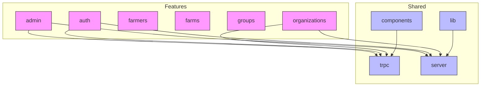
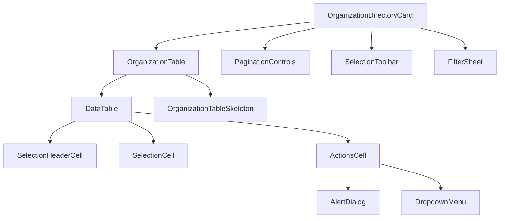
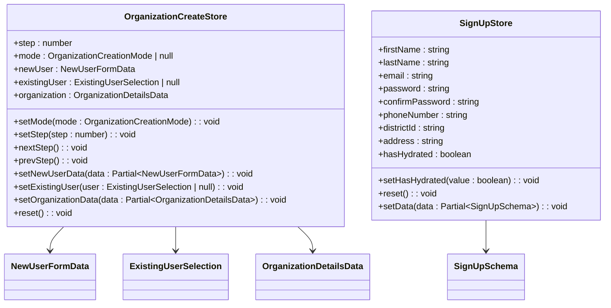
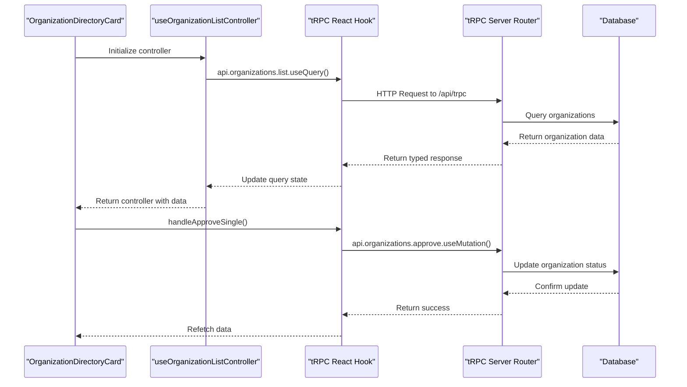
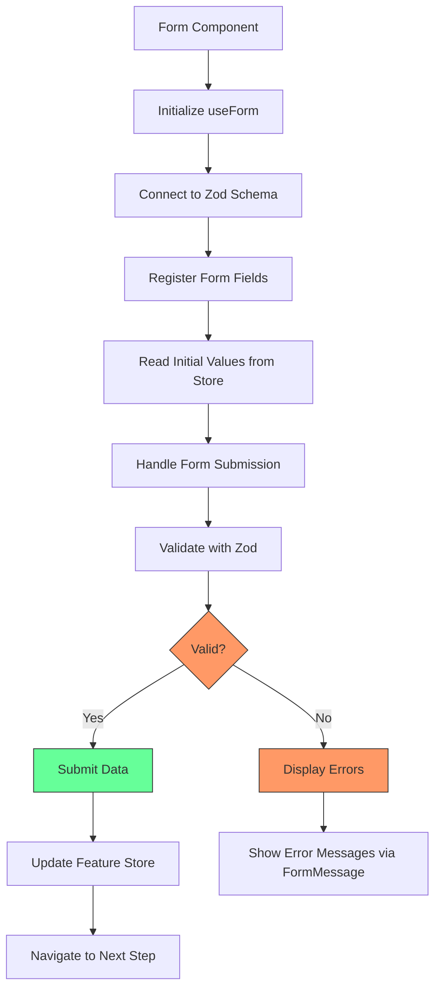
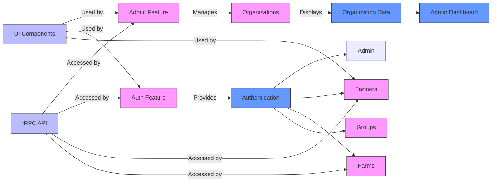

# Feature-Specific Architecture

<cite>
**Referenced Files in This Document**   
- [organization-create-store.ts](file://src/features/admin/organizations/store/organization-create-store.ts)
- [use-organization-list-controller.ts](file://src/features/admin/organizations/hooks/use-organization-list-controller.ts)
- [columns.tsx](file://src/features/admin/organizations/components/organization-table/columns.tsx)
- [data-table.tsx](file://src/features/admin/organizations/components/organization-table/data-table.tsx)
- [organization-directory-card.tsx](file://src/features/admin/organizations/components/organization-directory/organization-directory-card.tsx)
- [organizations-page.tsx](file://src/features/admin/organizations/pages/organizations-page.tsx)
- [sign-up-store.ts](file://src/features/auth/store/sign-up-store.ts)
- [step-one-form.tsx](file://src/features/auth/components/sign-up/step-one-form.tsx)
- [step-two-form.tsx](file://src/features/auth/components/sign-up/step-two-form.tsx)
- [form.tsx](file://src/components/ui/form.tsx)
- [appRouter.ts](file://src/server/api/root.ts)
- [trpc/react.tsx](file://src/trpc/react.tsx)
- [trpc/server.ts](file://src/trpc/server.ts)
- [createTRPCContext.ts](file://src/server/api/trpc.ts)
</cite>

## Table of Contents
1. [Introduction](#introduction)
2. [Feature-Sliced Architecture Overview](#feature-sliced-architecture-overview)
3. [Core Feature Modules](#core-feature-modules)
4. [Component Structure and Organization](#component-structure-and-organization)
5. [State Management and Stores](#state-management-and-stores)
6. [Data Fetching with tRPC](#data-fetching-with-trpc)
7. [Form Management and Validation](#form-management-and-validation)
8. [Cross-Feature Interactions](#cross-feature-interactions)
9. [UI Patterns and Design System Integration](#ui-patterns-and-design-system-integration)
10. [Conclusion](#conclusion)

## Introduction
The pukpara application implements a feature-sliced architecture pattern that organizes code by domain-specific features rather than technical layers. This approach enhances maintainability, improves developer experience, and enables better separation of concerns. The architecture centers around domain modules for admin, farmers, farms, and organizations, each containing their own components, hooks, and state management logic. This document details the implementation of this pattern, focusing on how features are structured, how data flows between components, and how business logic is encapsulated within each feature boundary.

## Feature-Sliced Architecture Overview
The feature-sliced architecture in pukpara organizes the codebase around business domains rather than technical concerns. The `src/features` directory contains top-level feature modules including admin, auth, farmers, farms, groups, and organizations. Each feature directory encapsulates all functionality related to that domain, including UI components, business logic, state management, and data access patterns.

This approach follows the principles of domain-driven design, where each feature represents a bounded context with well-defined responsibilities. The architecture promotes high cohesion within features and loose coupling between them, making it easier to understand, test, and modify individual features without affecting unrelated parts of the system.

**Diagram sources**
- [src/features](file://src/features)
- [src/components](file://src/components)
- [src/lib](file://src/lib)
- [src/trpc](file://src/trpc)
- [src/server](file://src/server)

## Core Feature Modules
The application contains several core feature modules, each representing a distinct business domain. The admin feature provides administrative capabilities for managing organizations and users. The auth feature handles user authentication and registration workflows. The farmers, farms, and groups features support agricultural operations management. The organizations feature enables organization lifecycle management.

Each feature module follows a consistent internal structure with subdirectories for components, hooks, pages, and stores. This standardized organization makes it easy for developers to navigate between features and understand their implementation patterns. The feature boundaries are enforced through selective exports and dependency management, ensuring that features only access shared functionality through well-defined interfaces.

**Section sources**
- [src/features/admin](file://src/features/admin)
- [src/features/auth](file://src/features/auth)
- [src/features/farmers](file://src/features/farmers)
- [src/features/farms](file://src/features/farms)
- [src/features/groups](file://src/features/groups)
- [src/features/organizations](file://src/features/organizations)

## Component Structure and Organization
Each feature directory contains a components subdirectory that houses reusable UI elements specific to that feature. Components are organized into logical groupings based on their functionality. For example, the admin/organizations feature contains component directories for organization-create, organization-directory, and organization-table.

Components follow a composition pattern where higher-level components orchestrate lower-level ones. The organization-directory-card.tsx component, for instance, composes the organization-table with pagination controls and selection toolbars to create a comprehensive organizational management interface. This hierarchical composition enables complex UIs to be built from simpler, reusable parts while maintaining clear responsibility boundaries.

**Diagram sources**
- [organization-directory-card.tsx](file://src/features/admin/organizations/components/organization-directory/organization-directory-card.tsx)
- [data-table.tsx](file://src/features/admin/organizations/components/organization-table/data-table.tsx)
- [pagination-controls.tsx](file://src/features/admin/organizations/components/organization-directory/pagination-controls.tsx)
- [selection-toolbar.tsx](file://src/features/admin/organizations/components/organization-directory/selection-toolbar.tsx)

## State Management and Stores
State management in pukpara is implemented using Zustand stores that are scoped to specific features. Each store encapsulates the state and actions for a particular workflow, providing a centralized location for managing complex state transitions. The organization-create-store.ts manages the multi-step organization creation process, while the sign-up-store.ts handles the user registration workflow.

Stores follow a consistent pattern of defining state properties and action functions that modify that state. They use the persist middleware to maintain state across page reloads, which is particularly important for multi-step forms where users might navigate away and return later. The stores are designed to be simple and focused, containing only the state necessary for their specific feature domain.

**Diagram sources**
- [organization-create-store.ts](file://src/features/admin/organizations/store/organization-create-store.ts)
- [sign-up-store.ts](file://src/features/auth/store/sign-up-store.ts)

**Section sources**
- [organization-create-store.ts](file://src/features/admin/organizations/store/organization-create-store.ts)
- [sign-up-store.ts](file://src/features/auth/store/sign-up-store.ts)

## Data Fetching with tRPC
Data fetching in pukpara is implemented using tRPC, which provides end-to-end type safety for API calls. The architecture integrates tRPC hooks directly into feature components, enabling seamless data access with automatic type inference. The useOrganizationListController hook in the admin/organizations feature demonstrates this pattern by using tRPC queries and mutations to fetch and modify organization data.

The tRPC integration follows a layered approach where client components use tRPC React hooks, which in turn connect to server-side tRPC routers. This creates a type-safe pipeline from the UI through to the database layer. The architecture supports both client-side data fetching through React components and server-side data fetching through React Server Components, allowing developers to choose the appropriate strategy based on performance and SEO requirements.

**Diagram sources**
- [use-organization-list-controller.ts](file://src/features/admin/organizations/hooks/use-organization-list-controller.ts)
- [trpc/react.tsx](file://src/trpc/react.tsx)
- [root.ts](file://src/server/api/root.ts)
- [trpc.ts](file://src/server/api/trpc.ts)

**Section sources**
- [use-organization-list-controller.ts](file://src/features/admin/organizations/hooks/use-organization-list-controller.ts)
- [trpc/react.tsx](file://src/trpc/react.tsx)
- [server.ts](file://src/trpc/server.ts)

## Form Management and Validation
Form management in pukpara leverages react-hook-form for efficient state management and validation. Each form component integrates with feature-specific stores to persist user input across navigation. The sign-up workflow demonstrates this pattern with step-one-form.tsx and step-two-form.tsx components that read from and write to the sign-up-store.

Forms use Zod for schema validation, with validation schemas defined alongside the components that use them. The form components are wrapped with the UI library's form components (form.tsx) which provide accessible form controls with consistent styling. This approach separates form logic from presentation while maintaining a clean API for form field registration and error display.

**Diagram sources**
- [step-one-form.tsx](file://src/features/auth/components/sign-up/step-one-form.tsx)
- [step-two-form.tsx](file://src/features/auth/components/sign-up/step-two-form.tsx)
- [form.tsx](file://src/components/ui/form.tsx)
- [sign-up-store.ts](file://src/features/auth/store/sign-up-store.ts)

**Section sources**
- [step-one-form.tsx](file://src/features/auth/components/sign-up/step-one-form.tsx)
- [step-two-form.tsx](file://src/features/auth/components/sign-up/step-two-form.tsx)

## Cross-Feature Interactions
While features are designed to be independent, they interact through well-defined interfaces and shared dependencies. The admin and organizations features have a particularly close relationship, with the admin interface providing management capabilities for organizations. The auth feature provides authentication services used across all other features.

Cross-feature interactions occur primarily through shared state management patterns, common UI components, and the tRPC API layer. Features do not directly import components or hooks from other features, maintaining clear boundaries. Instead, they communicate through the application's global state, API calls, and navigation events. This approach prevents tight coupling while still enabling the coordinated behavior required for a cohesive user experience.

**Diagram sources**
- [src/features/admin](file://src/features/admin)
- [src/features/auth](file://src/features/auth)
- [src/features/farmers](file://src/features/farmers)
- [src/features/farms](file://src/features/farms)
- [src/features/groups](file://src/features/groups)
- [src/features/organizations](file://src/features/organizations)
- [src/components/ui](file://src/components/ui)
- [src/trpc](file://src/trpc)

## UI Patterns and Design System Integration
The application implements a consistent set of UI patterns through a shared component library in src/components/ui. These components follow the Radix UI primitives pattern, providing accessible, unstyled components that are then styled with Tailwind CSS. Features consume these components rather than creating their own UI elements, ensuring visual consistency across the application.

The design system includes form controls, data tables, dialogs, and navigation components that are used across multiple features. The organization-table component, for example, uses the shared Table, Button, Checkbox, and DropdownMenu components to create a feature-specific data display. This approach enables rapid UI development while maintaining a cohesive design language throughout the application.

**Section sources**
- [src/components/ui](file://src/components/ui)
- [src/features/admin/organizations/components/organization-table](file://src/features/admin/organizations/components/organization-table)

## Conclusion
The feature-sliced architecture in pukpara provides a robust foundation for building and maintaining a complex agricultural management application. By organizing code around business domains rather than technical layers, the architecture promotes better code organization, improved developer experience, and enhanced maintainability. The integration of tRPC for type-safe data fetching, Zustand for feature-scoped state management, and a shared component library for consistent UI patterns creates a cohesive development experience that scales effectively as the application grows. This architectural approach enables the team to deliver high-quality features efficiently while maintaining clear boundaries and dependencies between different parts of the system.