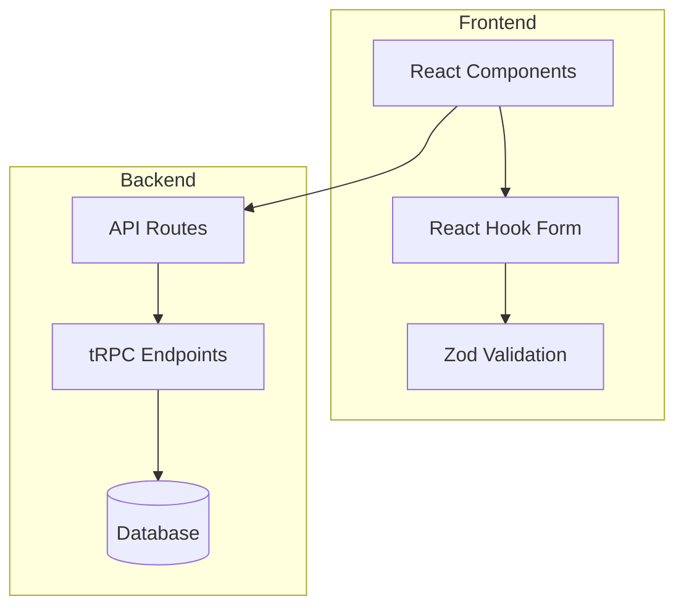
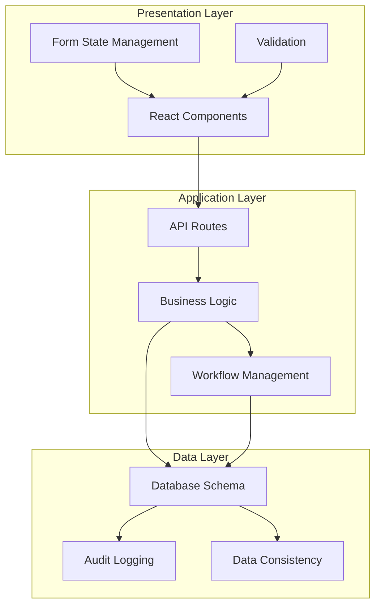
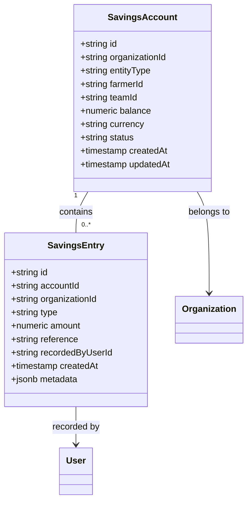
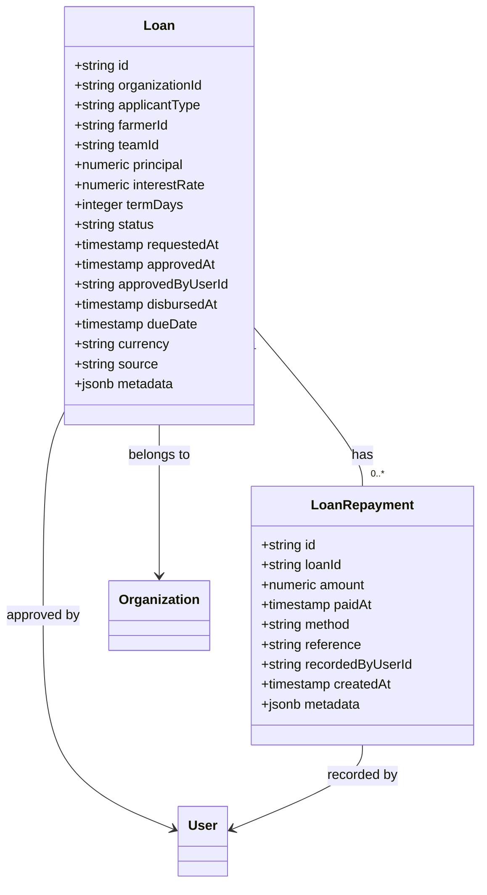
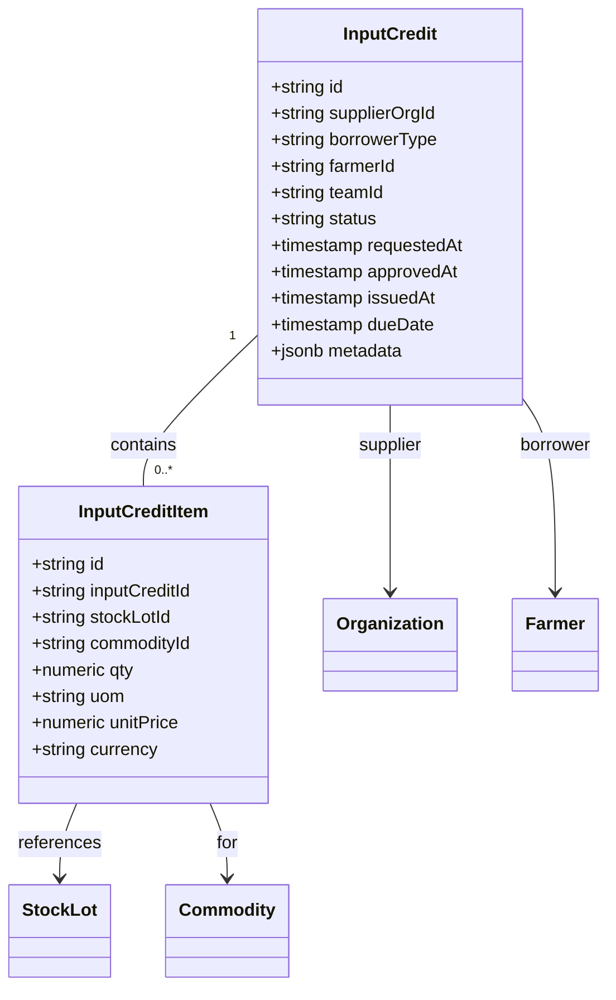
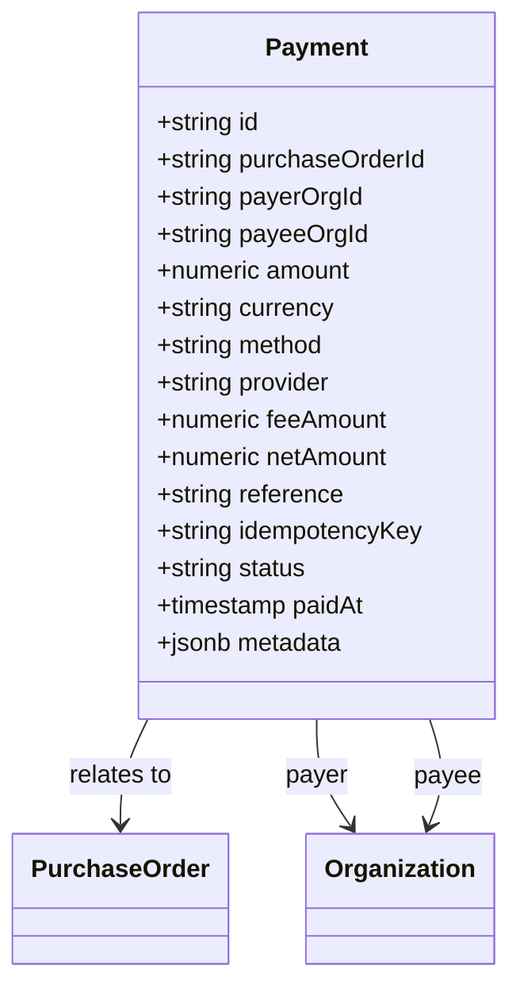
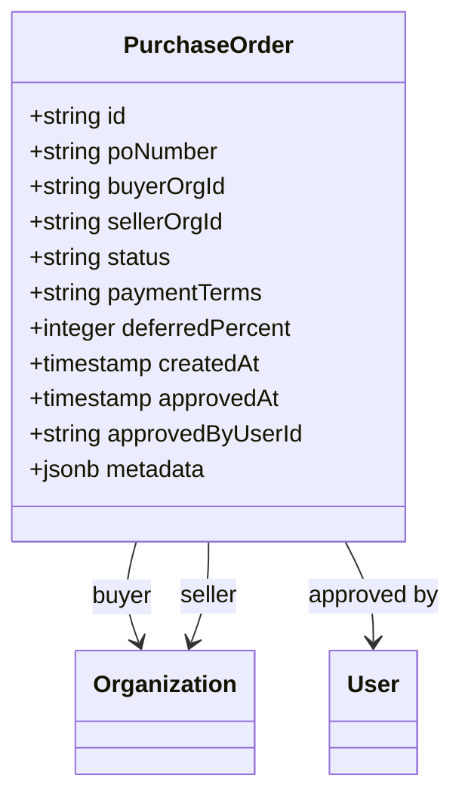
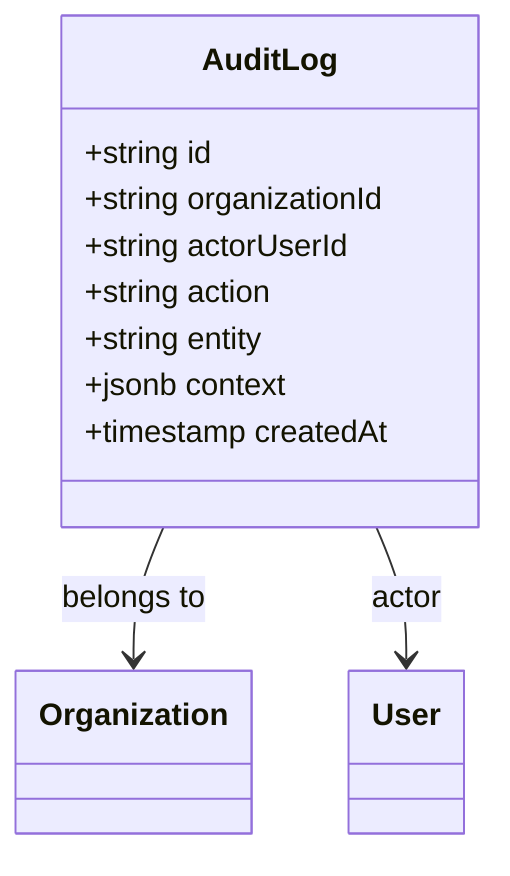
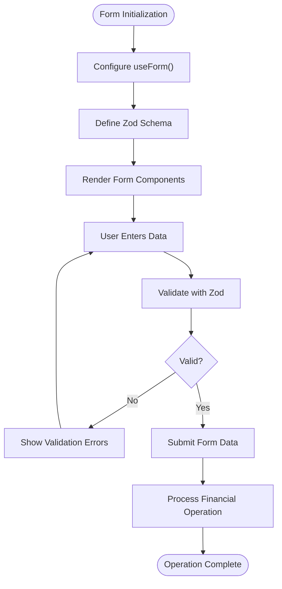
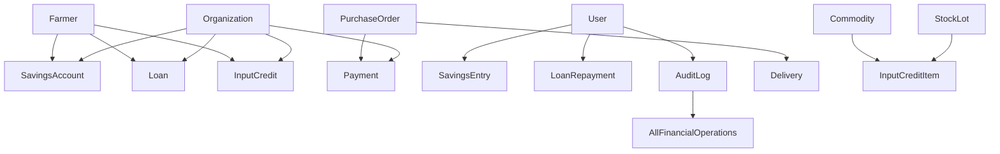

# Financial Operations

<cite>
**Referenced Files in This Document**   
- [schema.ts](file://src/server/db/schema.ts#L360-L414)
- [schema.ts](file://src/server/db/schema.ts#L416-L470)
- [schema.ts](file://src/server/db/schema.ts#L472-L492)
- [schema.ts](file://src/server/db/schema.ts#L624-L662)
- [schema.ts](file://src/server/db/schema.ts#L781-L812)
- [schema.ts](file://src/server/db/schema.ts#L743-L779)
- [schema.ts](file://src/server/db/schema.ts#L849-L888)
- [sign-in-form.tsx](file://src/features/auth/components/sign-in-form.tsx#L65-L73)
- [reset-password-form.tsx](file://src/features/auth/components/reset-password-form.tsx#L61-L68)
- [step-one-form.tsx](file://src/features/auth/components/sign-up/step-one-form.tsx#L62-L66)
- [form.tsx](file://src/components/ui/form.tsx#L18-L18)
</cite>

## Table of Contents
1. [Introduction](#introduction)
2. [Project Structure](#project-structure)
3. [Core Components](#core-components)
4. [Architecture Overview](#architecture-overview)
5. [Detailed Component Analysis](#detailed-component-analysis)
6. [Dependency Analysis](#dependency-analysis)
7. [Performance Considerations](#performance-considerations)
8. [Troubleshooting Guide](#troubleshooting-guide)
9. [Conclusion](#conclusion)

## Introduction
This document provides comprehensive architectural documentation for the Financial Operations module of the Pukpara application. The system supports financial services for agricultural organizations, including savings accounts, loan management, input credit systems, and payment tracking. The module integrates with inventory and marketplace components to provide a complete financial ecosystem for farmers and agricultural cooperatives. The architecture emphasizes data consistency, auditability, and role-based access control to ensure secure financial operations.

## Project Structure
The Financial Operations module is implemented within the server-side database schema and integrated with frontend components through API routes and React forms. The core financial entities are defined in the database schema file, with relationships established between savings, loans, payments, and other business entities. The frontend components use React Hook Form and Zod for form state management and validation, providing a robust user interface for financial operations.

**Diagram sources**
- [sign-in-form.tsx](file://src/features/auth/components/sign-in-form.tsx#L65-L73)
- [schema.ts](file://src/server/db/schema.ts#L360-L414)

**Section sources**
- [schema.ts](file://src/server/db/schema.ts#L360-L888)
- [sign-in-form.tsx](file://src/features/auth/components/sign-in-form.tsx#L65-L73)

## Core Components
The Financial Operations module consists of several core components that work together to provide comprehensive financial services. These include savings accounts for farmers and teams, loan management for microfinance operations, input credit systems for agricultural supplies, and payment tracking for marketplace transactions. Each component is designed with data integrity, auditability, and user experience in mind, ensuring reliable financial operations in agricultural settings.

**Section sources**
- [schema.ts](file://src/server/db/schema.ts#L360-L414)
- [schema.ts](file://src/server/db/schema.ts#L416-L470)
- [schema.ts](file://src/server/db/schema.ts#L472-L492)

## Architecture Overview
The Financial Operations architecture follows a layered approach with clear separation between data storage, business logic, and user interface components. The database schema defines the core financial entities and their relationships, while the application layer implements business rules and workflows. The presentation layer provides user interfaces for financial operations, using React Hook Form for state management and Zod for validation. Audit logging is implemented across all financial operations to ensure accountability and traceability.

**Diagram sources**
- [schema.ts](file://src/server/db/schema.ts#L360-L888)
- [sign-in-form.tsx](file://src/features/auth/components/sign-in-form.tsx#L65-L73)

## Detailed Component Analysis

### Savings Account System
The savings account system enables farmers and teams to maintain financial accounts within the platform. Each savings account is linked to an organization and can be associated with either a farmer or a team. The system tracks contributions, withdrawals, and adjustments through savings entries, which record the transaction type, amount, and metadata. The account balance is maintained as a denormalized field for performance, with constraints ensuring that transaction amounts are non-zero.

**Diagram sources**
- [schema.ts](file://src/server/db/schema.ts#L360-L382)
- [schema.ts](file://src/server/db/schema.ts#L384-L414)

**Section sources**
- [schema.ts](file://src/server/db/schema.ts#L360-L414)

### Loan Management System
The loan management system supports microfinance operations for farmers and teams. Loans are created with principal amounts, interest rates, and term durations, and go through an approval workflow before disbursement. The system tracks loan status through various stages, from pending to repaid or defaulted. Loan repayments are recorded as separate entities, allowing for multiple payments against a single loan. The approvedByUserId field establishes accountability for loan approvals.

**Diagram sources**
- [schema.ts](file://src/server/db/schema.ts#L416-L470)
- [schema.ts](file://src/server/db/schema.ts#L472-L492)

**Section sources**
- [schema.ts](file://src/server/db/schema.ts#L416-L470)

### Input Credit System
The input credit system enables suppliers to extend credit to farmers and teams for agricultural inputs. Input credit records track the status of credit arrangements, from pending to settled or defaulted. Each input credit can include multiple items, linking to specific stock lots in the inventory system. This integration with inventory ensures that credit is tied to physical goods, providing traceability and reducing risk. The system supports flexible repayment terms and tracks due dates for credit settlement.

**Diagram sources**
- [schema.ts](file://src/server/db/schema.ts#L781-L812)
- [schema.ts](file://src/server/db/schema.ts#L814-L847)

**Section sources**
- [schema.ts](file://src/server/db/schema.ts#L781-L847)

### Payment Tracking System
The payment tracking system manages financial transactions related to purchase orders in the marketplace. Payments are linked to specific purchase orders and record the amount, currency, method, and status of each transaction. The system supports various payment methods, including mobile money, bank transfers, and cash. Idempotency keys ensure that duplicate payments are prevented, while fee amounts and net amounts provide detailed financial accounting. The integration with purchase orders creates a complete audit trail from order to payment.

**Diagram sources**
- [schema.ts](file://src/server/db/schema.ts#L743-L779)

**Section sources**
- [schema.ts](file://src/server/db/schema.ts#L743-L779)

### Purchase Order System
The purchase order system facilitates marketplace transactions between buyer and seller organizations. Purchase orders track the status of transactions from pending to fulfilled, with approval workflows ensuring proper authorization. The system supports flexible payment terms, including immediate payment, net 7, and net 30 arrangements. Deferred payment percentages allow for partial upfront payments with the remainder due later. The integration with delivery and receipt systems creates a complete supply chain workflow, from order to delivery to payment.

**Diagram sources**
- [schema.ts](file://src/server/db/schema.ts#L624-L662)

**Section sources**
- [schema.ts](file://src/server/db/schema.ts#L624-L662)

### Audit Logging System
The audit logging system provides comprehensive tracking of financial operations across the platform. Every significant action, such as loan approvals or payment transactions, is recorded in the audit log with details about the actor, action, entity, and context. This creates a complete audit trail for financial operations, supporting compliance, reconciliation, and troubleshooting. The system links audit records to specific users and organizations, enabling detailed reporting on financial activities.

**Diagram sources**
- [schema.ts](file://src/server/db/schema.ts#L849-L888)

**Section sources**
- [schema.ts](file://src/server/db/schema.ts#L849-L888)

### Form State Management
The frontend implements form state management using React Hook Form and Zod validation schemas. This combination provides an efficient and type-safe approach to handling user input in financial operations. React Hook Form manages the form state and validation lifecycle, while Zod provides runtime type checking and validation rules. The integration between these libraries ensures that financial data entered by users is validated before submission, reducing errors and improving data quality.

**Diagram sources**
- [sign-in-form.tsx](file://src/features/auth/components/sign-in-form.tsx#L65-L73)
- [reset-password-form.tsx](file://src/features/auth/components/reset-password-form.tsx#L61-L68)
- [step-one-form.tsx](file://src/features/auth/components/sign-up/step-one-form.tsx#L62-L66)

**Section sources**
- [sign-in-form.tsx](file://src/features/auth/components/sign-in-form.tsx#L65-L73)
- [reset-password-form.tsx](file://src/features/auth/components/reset-password-form.tsx#L61-L68)
- [step-one-form.tsx](file://src/features/auth/components/sign-up/step-one-form.tsx#L62-L66)

## Dependency Analysis
The Financial Operations module has extensive dependencies across the application architecture. The core financial entities depend on the organization, farmer, and user entities for identity and access control. The savings, loan, and payment systems depend on the audit logging system for accountability. The input credit and payment systems depend on the inventory and marketplace modules for integration with physical goods and transactions. These dependencies create a cohesive financial ecosystem where operations in one module can trigger workflows in others.

**Diagram sources**
- [schema.ts](file://src/server/db/schema.ts#L360-L888)

**Section sources**
- [schema.ts](file://src/server/db/schema.ts#L360-L888)

## Performance Considerations
The Financial Operations module is designed with performance considerations for transaction-heavy operations. Database indexes are strategically placed on frequently queried fields, such as organizationId and createdAt timestamps, to optimize query performance. The use of denormalized fields, like account balances, reduces the need for expensive aggregate queries during read operations. Idempotency keys prevent duplicate processing of financial transactions, ensuring data consistency even under high load. The system also implements proper constraints and checks to maintain data integrity without sacrificing performance.

**Section sources**
- [schema.ts](file://src/server/db/schema.ts#L360-L888)

## Troubleshooting Guide
When troubleshooting issues in the Financial Operations module, start by examining the audit logs to trace the sequence of financial operations. Verify that all financial entities have proper relationships to organizations, farmers, and users. Check for validation errors in form submissions, particularly around amount fields and date constraints. For payment issues, verify that idempotency keys are properly implemented to prevent duplicate transactions. When investigating data consistency issues, review the database constraints and triggers that enforce business rules.

**Section sources**
- [schema.ts](file://src/server/db/schema.ts#L360-L888)
- [sign-in-form.tsx](file://src/features/auth/components/sign-in-form.tsx#L65-L73)

## Conclusion
The Financial Operations module provides a comprehensive set of financial services for agricultural organizations, integrating savings, loans, credit, and payment systems into a cohesive platform. The architecture emphasizes data consistency, auditability, and user experience, with robust validation and error handling throughout. The integration with inventory and marketplace modules creates a complete ecosystem for agricultural finance, supporting the full lifecycle of financial operations from account creation to transaction settlement. The use of modern frontend technologies like React Hook Form and Zod ensures a reliable and user-friendly interface for financial operations.