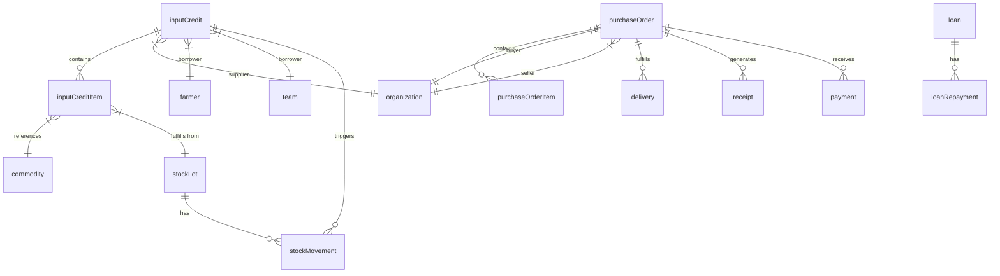
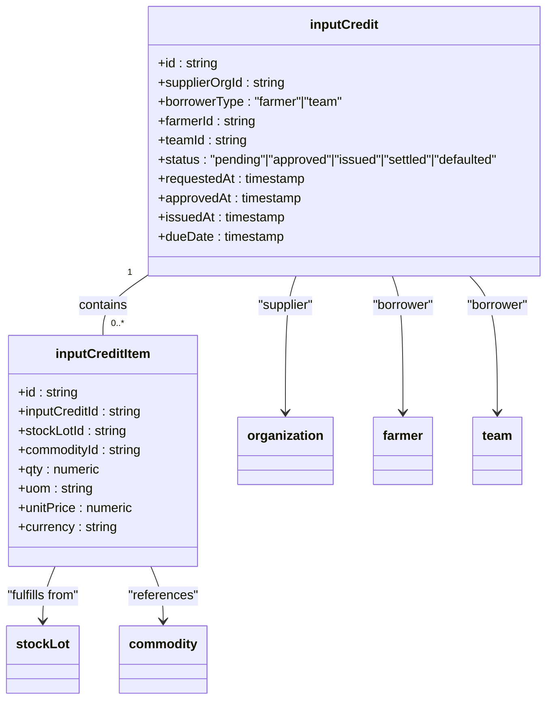
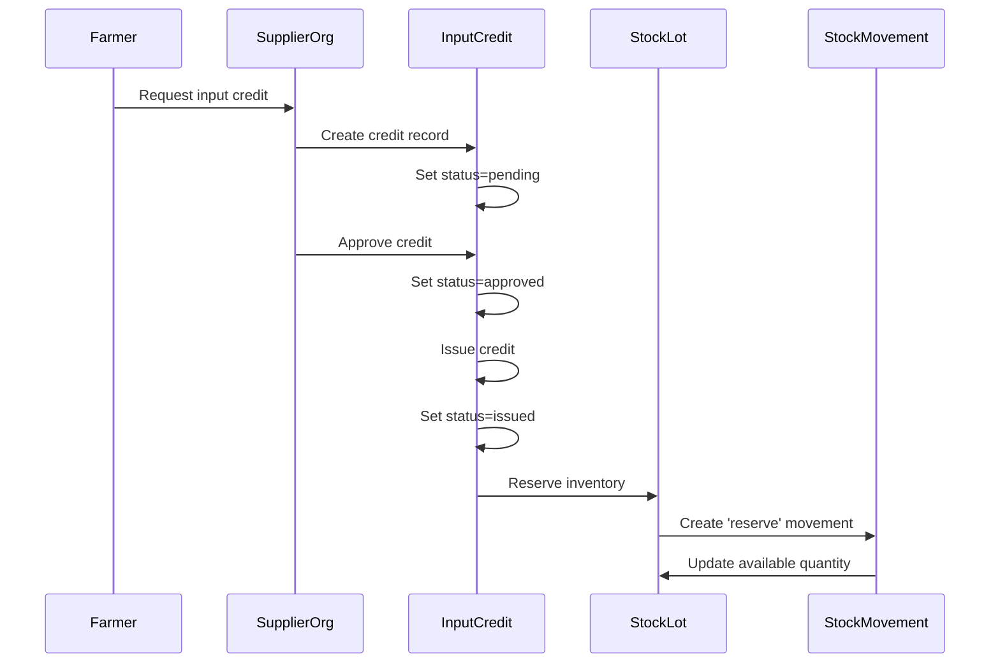
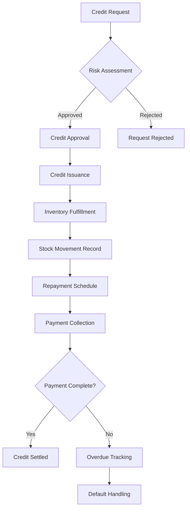
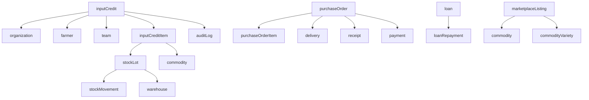

# Input Credit System

<cite>
**Referenced Files in This Document**   
- [schema.ts](file://src/server/db/schema.ts#L781-L847)
- [schema.ts](file://src/server/db/schema.ts#L557-L586)
- [schema.ts](file://src/server/db/schema.ts#L624-L662)
- [schema.ts](file://src/server/db/schema.ts#L416-L452)
- [schema.ts](file://src/server/db/schema.ts#L743-L779)
</cite>

## Table of Contents
1. [Introduction](#introduction)
2. [Core Components](#core-components)
3. [Architecture Overview](#architecture-overview)
4. [Detailed Component Analysis](#detailed-component-analysis)
5. [Dependency Analysis](#dependency-analysis)
6. [Performance Considerations](#performance-considerations)
7. [Troubleshooting Guide](#troubleshooting-guide)
8. [Conclusion](#conclusion)

## Introduction
The Input Credit System enables farmers and organizations to receive credit for agricultural inputs such as seeds and fertilizers. This document details the implementation of credit management within the platform, focusing on the integration between PurchaseOrder, Inventory, and Financial modules. The system supports credit issuance, fulfillment tracking, repayment reconciliation, and risk assessment workflows.

## Core Components

The Input Credit System is built around several core database entities that manage credit lifecycle, inventory fulfillment, and financial reconciliation. These components work together to ensure that credit is properly issued, tracked, and settled.

**Section sources**
- [schema.ts](file://src/server/db/schema.ts#L781-L847)
- [schema.ts](file://src/server/db/schema.ts#L557-L586)

## Architecture Overview

**Diagram sources**
- [schema.ts](file://src/server/db/schema.ts#L781-L812)
- [schema.ts](file://src/server/db/schema.ts#L814-L847)
- [schema.ts](file://src/server/db/schema.ts#L557-L586)

## Detailed Component Analysis

### Input Credit Management

The Input Credit system allows suppliers (organizations) to extend credit to farmers or teams for agricultural inputs. Each credit record tracks the status lifecycle from request through approval, issuance, and settlement.

**Diagram sources**
- [schema.ts](file://src/server/db/schema.ts#L781-L812)
- [schema.ts](file://src/server/db/schema.ts#L814-L847)

### Purchase Order and Inventory Integration

The system integrates credit fulfillment with inventory management through stock movements. When credit is issued, inventory is reserved and moved accordingly, ensuring proper tracking of physical goods against credit obligations.

**Diagram sources**
- [schema.ts](file://src/server/db/schema.ts#L557-L586)
- [schema.ts](file://src/server/db/schema.ts#L781-L812)

### Financial Reconciliation

The system reconciles credit issuance with repayments through a structured financial workflow. Credit terms are linked to repayment schedules, and payments are tracked against outstanding obligations.

**Diagram sources**
- [schema.ts](file://src/server/db/schema.ts#L743-L779)
- [schema.ts](file://src/server/db/schema.ts#L416-L452)

## Dependency Analysis

**Diagram sources**
- [schema.ts](file://src/server/db/schema.ts#L1261-L1316)
- [schema.ts](file://src/server/db/schema.ts#L1180-L1220)

## Performance Considerations

The Input Credit System is designed with performance and scalability in mind. Database indexes are implemented on key fields such as status, organization ID, and timestamps to ensure efficient querying. The system uses foreign key relationships with appropriate onDelete behaviors to maintain data integrity while optimizing for read performance. Credit status changes trigger audit logs for compliance tracking, and all financial operations are designed to be idempotent where applicable.

## Troubleshooting Guide

Common issues in the Input Credit System typically involve credit limit miscalculations or fulfillment mismatches. For credit limit issues, verify that the borrower's risk profile and historical repayment behavior are correctly calculated. For fulfillment mismatches, check that stock lot availability matches credit item requirements and that stock movements are properly recorded. Ensure that the inputCreditItem.stockLotId correctly references available inventory and that quantity validations are enforced. When credit status transitions fail, verify that all prerequisite conditions (approval, inventory availability) are met before issuance.

**Section sources**
- [schema.ts](file://src/server/db/schema.ts#L781-L812)
- [schema.ts](file://src/server/db/schema.ts#L557-L586)

## Conclusion

The Input Credit System provides a comprehensive solution for extending credit to farmers and organizations for agricultural inputs. By integrating PurchaseOrder, Inventory, and Financial modules, the system ensures that credit terms are properly managed from request through fulfillment and repayment. The architecture supports robust risk assessment, transparent reconciliation, and seamless integration with supplier accounts and marketplace listings.