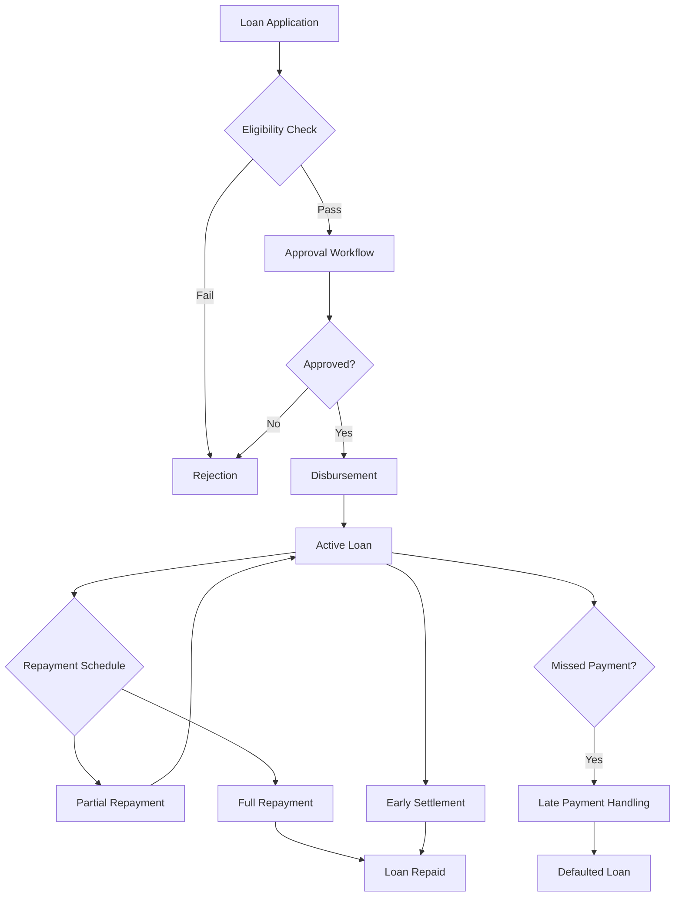
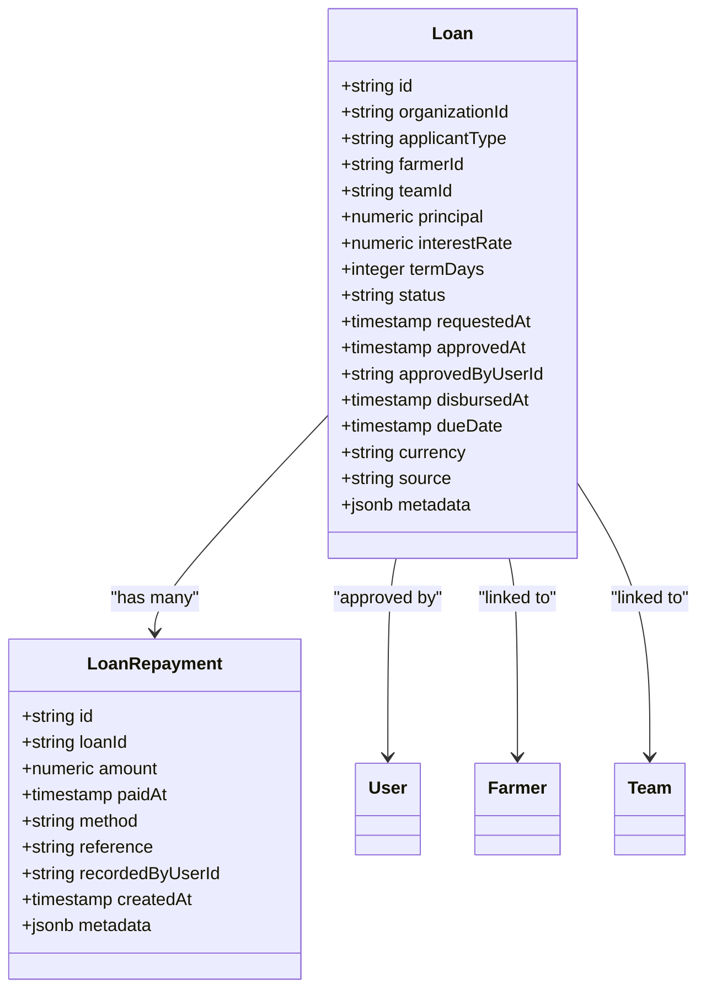
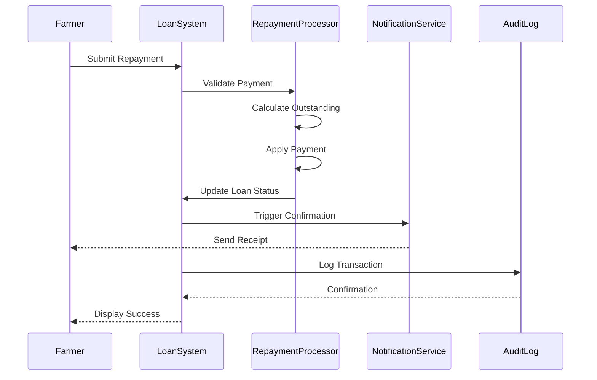

# Loan Processing

<cite>
**Referenced Files in This Document**   
- [loan.ts](file://src/server/db/schema.ts#L416-L452)
- [loanRepayment.ts](file://src/server/db/schema.ts#L472-L513)
- [savingsAccount.ts](file://src/server/db/schema.ts#L384-L414)
- [auditLog.ts](file://src/server/db/schema.ts#L849-L888)
- [kpis-finance-card.tsx](file://src/features/admin/organizations/components/organization-details/kpis-finance-card.tsx#L73-L112)
</cite>

## Table of Contents
1. [Introduction](#introduction)
2. [Loan Lifecycle Overview](#loan-lifecycle-overview)
3. [Loan Entity Structure](#loan-entity-structure)
4. [Repayment System Design](#repayment-system-design)
5. [Approval Workflows and Risk Assessment](#approval-workflows-and-risk-assessment)
6. [Interest Calculation and Loan Terms](#interest-calculation-and-loan-terms)
7. [Eligibility Determination Based on Savings History](#eligibility-determination-based-on-savings-history)
8. [Repayment Scheduling and Tracking](#repayment-scheduling-and-tracking)
9. [Late Payment Handling and Notifications](#late-payment-handling-and-notifications)
10. [Audit Trails and Modification Logging](#audit-trails-and-modification-logging)
11. [Edge Case Management](#edge-case-management)

## Introduction
This document provides a comprehensive overview of the Loan Processing sub-feature within the Pukpara platform. It details the complete lifecycle of a loan from application through disbursement and repayment, focusing on core entities such as Loan and LoanRepayment. The system supports financial services for farmers and teams, integrating with savings history, credit policies, and notification systems to ensure robust loan management.

**Section sources**
- [loan.ts](file://src/server/db/schema.ts#L416-L452)
- [loanRepayment.ts](file://src/server/db/schema.ts#L472-L513)

## Loan Lifecycle Overview

**Diagram sources**
- [loan.ts](file://src/server/db/schema.ts#L416-L452)
- [loanRepayment.ts](file://src/server/db/schema.ts#L472-L513)

**Section sources**
- [loan.ts](file://src/server/db/schema.ts#L416-L452)
- [loanRepayment.ts](file://src/server/db/schema.ts#L472-L513)

## Loan Entity Structure

**Diagram sources**
- [loan.ts](file://src/server/db/schema.ts#L416-L452)
- [loanRepayment.ts](file://src/server/db/schema.ts#L472-L513)

**Section sources**
- [loan.ts](file://src/server/db/schema.ts#L416-L452)

## Repayment System Design

**Diagram sources**
- [loanRepayment.ts](file://src/server/db/schema.ts#L472-L513)
- [auditLog.ts](file://src/server/db/schema.ts#L849-L888)

**Section sources**
- [loanRepayment.ts](file://src/server/db/schema.ts#L472-L513)

## Approval Workflows and Risk Assessment
The loan approval workflow begins when a farmer or team submits a loan application. The system evaluates risk based on predefined credit policies and savings history. Only users with appropriate permissions can approve loans, and all approvals are logged for audit purposes. The status transitions from "pending" to "approved" upon successful review, enabling disbursement.

Key validation rules include:
- Principal amount must be greater than zero
- Interest rate must be between 0% and 100%
- Term days must be positive
- Applicant type restricted to "farmer" or "team"
- Status constrained to valid states: pending, approved, rejected, active, repaid, defaulted

**Section sources**
- [loan.ts](file://src/server/db/schema.ts#L416-L452)

## Interest Calculation and Loan Terms
Interest is calculated using a simple interest formula based on the principal, interest rate, and term duration in days. The system stores both the principal and interest rate as numeric values with precision to two decimal places. The due date is computed at disbursement time based on the termDays field added to the disbursedAt timestamp.

The interest calculation logic ensures:
- Precision of 5 digits with 2 decimal places for interest rate
- Principal stored with 14-digit precision and 2 decimal places
- Currency defaults to GHS (Ghanaian Cedi)
- Term duration defined in days for accurate accrual

**Section sources**
- [loan.ts](file://src/server/db/schema.ts#L416-L452)

## Eligibility Determination Based on Savings History
Loan eligibility is determined by analyzing the applicant's savings history through the savingsAccount and savingsEntry entities. The system evaluates contribution patterns, withdrawal frequency, and overall balance trends to assess creditworthiness. Farmers or teams with consistent contributions and positive balances are more likely to qualify for loans.

Savings entries are linked to accounts and include metadata such as mobile money references or bank transaction IDs, providing verifiable transaction history. The system uses this data to generate financial KPIs visible in administrative dashboards.

**Section sources**
- [savingsAccount.ts](file://src/server/db/schema.ts#L384-L414)
- [kpis-finance-card.tsx](file://src/features/admin/organizations/components/organization-details/kpis-finance-card.tsx#L73-L112)

## Repayment Scheduling and Tracking
Repayment schedules are generated at loan disbursement based on the termDays and dueDate fields. Each repayment is recorded in the loanRepayment table with the amount, payment method (cash, MoMo, bank), and optional reference number. The system tracks partial repayments and accumulates payments until the full principal plus interest is settled.

The relationship between Loan and LoanRepayment is one-to-many, allowing multiple repayment records per loan. The total repayment amount can be aggregated and compared against the outstanding balance to determine loan status.

**Section sources**
- [loanRepayment.ts](file://src/server/db/schema.ts#L472-L513)
- [loan.ts](file://src/server/db/schema.ts#L416-L452)

## Late Payment Handling and Notifications
When a loan's dueDate passes without full repayment, the system flags it for late payment handling. The status remains "active" initially but transitions to "defaulted" if no payments are made after a grace period. The notification system triggers reminders at configurable intervals before and after the due date.

Payment methods are recorded to enable reconciliation, with metadata capturing external references like mobile money transaction IDs. This integration ensures traceability and supports automated matching of incoming payments.

**Section sources**
- [loan.ts](file://src/server/db/schema.ts#L416-L452)
- [loanRepayment.ts](file://src/server/db/schema.ts#L472-L513)

## Audit Trails and Modification Logging
All significant loan modifications are tracked through the auditLog system. Events such as loan approval, disbursement, and status changes generate audit entries that capture the actor (user), action performed, entity affected, and context details. This provides a complete trail for compliance and operational oversight.

The audit system integrates with user permissions and logs activities across financial operations, ensuring transparency and accountability in loan management processes.

**Section sources**
- [auditLog.ts](file://src/server/db/schema.ts#L849-L888)
- [loan.ts](file://src/server/db/schema.ts#L416-L452)

## Edge Case Management
The system handles several edge cases including partial repayments, early settlements, and loan write-offs. Partial payments are applied to the outstanding balance and reflected in the repayment history. Early settlements trigger full balance calculation and closure of the loan account.

For irrecoverable debts, loans can be marked as "defaulted" after exhausting collection efforts. The system supports manual adjustments through administrative interfaces, with all changes subject to audit logging. Write-off decisions require authorization and are documented with metadata explaining the rationale.

**Section sources**
- [loan.ts](file://src/server/db/schema.ts#L416-L452)
- [loanRepayment.ts](file://src/server/db/schema.ts#L472-L513)