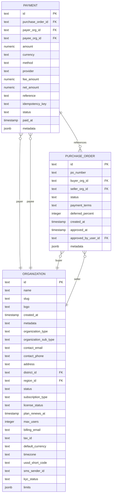

# Payment Tracking

<cite>
**Referenced Files in This Document**   
- [payment.tsx](file://src/app/(admin)/admin/payments/page.tsx)
- [paymentId.tsx](file://src/app/(admin)/admin/payments/[paymentId]/page.tsx)
- [schema.ts](file://src/server/db/schema.ts)
</cite>

## Table of Contents
1. [Introduction](#introduction)
2. [Payment Data Model](#payment-data-model)
3. [Unified Payment Interface](#unified-payment-interface)
4. [Transaction Recording and Monitoring](#transaction-recording-and-monitoring)
5. [Data Model Relationships](#data-model-relationships)
6. [Filtering and Search Operations](#filtering-and-search-operations)
7. [Bulk Operations on Payment Records](#bulk-operations-on-payment-records)
8. [External System Integration](#external-system-integration)
9. [Audit Requirements and Data Retention](#audit-requirements-and-data-retention)
10. [Reporting Capabilities](#reporting-capabilities)
11. [Handling Failed Payments, Refunds, and Chargebacks](#handling-failed-payments-refunds-and-chargebacks)

## Introduction
The Payment Tracking sub-feature provides a comprehensive system for recording and monitoring all financial inflows and outflows across savings, loans, and marketplace transactions within the platform. This documentation details the unified payment interface used by administrators to view and manage payments, the underlying data model relationships, and the various operations available for payment record management. The system is designed to ensure accurate financial tracking, facilitate reconciliation, and support audit requirements.

## Payment Data Model
The payment data model is centered around the `payment` table in the database schema, which captures essential details of each financial transaction. Key attributes include the payment amount, currency, method (e.g., momo, bank, cash), provider (e.g., mtn_momo, bank_transfer), and status (pending, completed, failed, cancelled). The model also includes fields for fee amount, net amount, reference, idempotency key, and metadata to support detailed transaction tracking and reconciliation.

**Section sources**
- [schema.ts](file://src/server/db/schema.ts#L743-L779)

## Unified Payment Interface
The unified payment interface is accessible through the admin dashboard and provides a centralized view for managing all platform payments, payouts, and reconciliation status. The interface includes a payments ledger with filters for status, method, and organization attribution, allowing administrators to easily navigate and analyze payment records. A dedicated page for each payment provides detailed transaction metadata, amounts, associated parties, settlement timeline, ledger sync, and audit notes.

**Section sources**
- [payment.tsx](file://src/app/(admin)/admin/payments/page.tsx#L1-L23)
- [paymentId.tsx](file://src/app/(admin)/admin/payments/[paymentId]/page.tsx#L1-L42)

## Transaction Recording and Monitoring
Financial transactions are recorded and monitored through the integration of the payment system with various platform features, including savings, loans, and marketplace transactions. Each transaction is linked to a purchase order, payer organization, and payee organization, ensuring comprehensive tracking of financial flows. The system supports real-time monitoring of transaction status, enabling timely identification and resolution of issues.

**Section sources**
- [schema.ts](file://src/server/db/schema.ts#L743-L779)

## Data Model Relationships
The payment data model is intricately linked with other entities in the system, forming a robust network of financial relationships. Payments are associated with purchase orders, which in turn are linked to buyer and seller organizations. Additionally, payments are connected to payer and payee organizations, facilitating accurate attribution of financial transactions. These relationships are enforced through foreign key constraints and are leveraged for efficient querying and reporting.

**Diagram sources**
- [schema.ts](file://src/server/db/schema.ts#L624-L662)
- [schema.ts](file://src/server/db/schema.ts#L743-L779)

## Filtering and Search Operations
The payment tracking system supports advanced filtering and search operations to help administrators quickly locate specific payment records. Filters are available for payment status, method, and organization attribution, enabling targeted analysis of financial data. The search functionality allows for quick retrieval of payment records based on reference numbers, transaction amounts, and other key attributes.

**Section sources**
- [payment.tsx](file://src/app/(admin)/admin/payments/page.tsx#L1-L23)

## Bulk Operations on Payment Records
Administrators can perform bulk operations on payment records, such as updating payment statuses, applying refunds, and initiating chargebacks. These operations are designed to be efficient and secure, with appropriate validation and audit logging to ensure data integrity. The system supports bulk processing of payments, enabling streamlined management of large volumes of financial transactions.

**Section sources**
- [payment.tsx](file://src/app/(admin)/admin/payments/page.tsx#L1-L23)

## External System Integration
The payment tracking system integrates with external systems for payment verification and reconciliation. These integrations ensure that payment data is accurate and up-to-date, facilitating seamless financial operations. The system supports various payment providers and methods, enabling flexible and reliable transaction processing.

**Section sources**
- [schema.ts](file://src/server/db/schema.ts#L743-L779)

## Audit Requirements and Data Retention
The system adheres to strict audit requirements and data retention policies to ensure compliance with regulatory standards. All payment transactions are logged with detailed metadata, including timestamps, user identifiers, and contextual information. The audit log captures all significant actions related to payments, providing a comprehensive trail for review and analysis. Data retention policies are designed to balance the need for historical data with privacy and security considerations.

**Section sources**
- [schema.ts](file://src/server/db/schema.ts#L849-L888)

## Reporting Capabilities
The payment tracking system offers robust reporting capabilities, enabling administrators to generate detailed financial reports. Reports can be customized to include various metrics, such as transaction volumes, payment methods, and organizational attribution. These reports support informed decision-making and facilitate financial oversight.

**Section sources**
- [payment.tsx](file://src/app/(admin)/admin/payments/page.tsx#L1-L23)

## Handling Failed Payments, Refunds, and Chargebacks
The system includes mechanisms for handling failed payments, refunds, and chargebacks. Failed payments are flagged for review, and administrators can initiate corrective actions, such as retrying the payment or contacting the payer. Refunds and chargebacks are processed through a secure and auditable workflow, ensuring that financial adjustments are accurately recorded and justified.

**Section sources**
- [schema.ts](file://src/server/db/schema.ts#L743-L779)