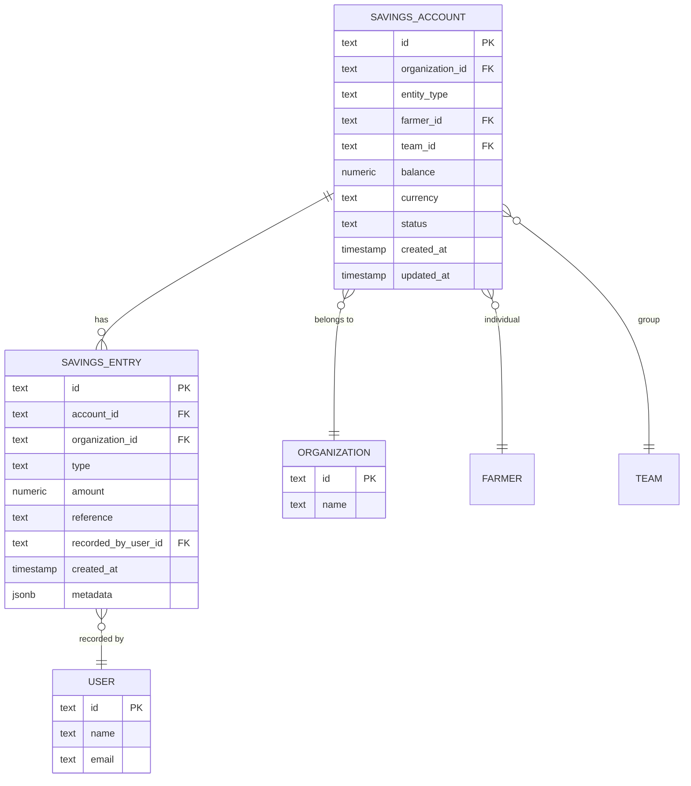
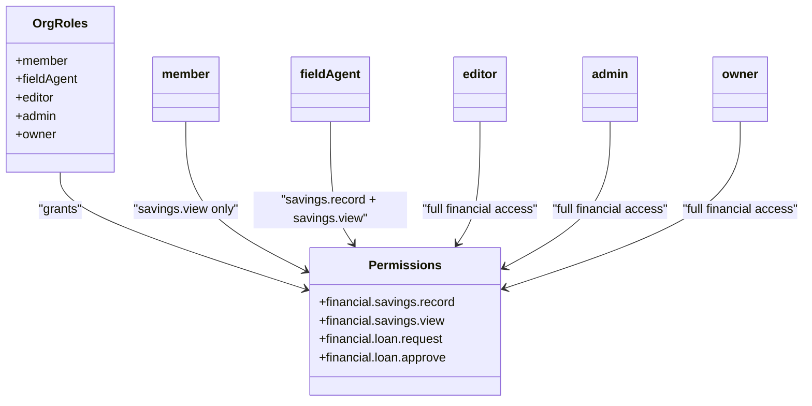
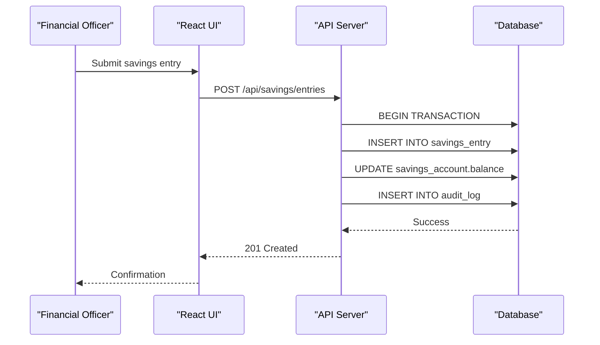

# Savings Management

<cite>
**Referenced Files in This Document**   
- [savingsAccount](file://src/server/db/schema.ts#L360-L382)
- [savingsEntry](file://src/server/db/schema.ts#L384-L414)
- [savingsAccountRelations](file://src/server/db/schema.ts#L1030-L1050)
- [savingsEntryRelations](file://src/server/db/schema.ts#L1052-L1065)
- [auditLog](file://src/server/db/schema.ts#L849-L860)
- [userRelations](file://src/server/db/schema.ts#L862-L888)
- [org-permissions](file://src/lib/org-permissions.ts)
- [admin-permissions](file://src/lib/admin-permissions.ts)
- [kpis-finance-card.tsx](file://src/features/admin/organizations/components/organization-details/kpis-finance-card.tsx)
- [audit/page.tsx](file://src/app/(admin)/admin/audit/page.tsx)
</cite>

## Table of Contents
1. [Introduction](#introduction)
2. [Data Model](#data-model)
3. [Transaction Processing](#transaction-processing)
4. [UI Components](#ui-components)
5. [Role-Based Access Control](#role-based-access-control)
6. [Audit Logging](#audit-logging)
7. [Common Issues and Troubleshooting](#common-issues-and-troubleshooting)
8. [Performance Optimization](#performance-optimization)
9. [Conclusion](#conclusion)

## Introduction
The Savings Management sub-feature enables financial tracking for both individual farmers and collective groups (teams) within agricultural organizations. It supports core operations including deposits (contributions), withdrawals, and balance management with full transactional integrity. The system is designed for field officers and financial administrators to record and monitor savings activities while maintaining audit trails and enforcing role-based permissions.

**Section sources**
- [savingsAccount](file://src/server/db/schema.ts#L360-L382)
- [savingsEntry](file://src/server/db/schema.ts#L384-L414)

## Data Model

### SavingsAccount Entity
The `SavingsAccount` entity represents a financial account for either an individual farmer or a group (team). Key attributes include:
- **entityType**: Distinguishes between "farmer" and "team" accounts
- **farmerId/teamId**: Foreign keys to respective entities (nullable for cross-type accounts)
- **balance**: Current balance with precision of 14 digits and 2 decimal places
- **currency**: Defaulted to GHS (Ghanaian Cedi)
- **status**: Account status (default: "active")

Unique constraints ensure one account per entity type within an organization.

### SavingsEntry Entity
The `SavingsEntry` entity records all transactions against savings accounts:
- **type**: Transaction type ("contribution", "withdrawal", "adjustment")
- **amount**: Non-zero monetary value (precision: 14, scale: 2)
- **accountId**: References the associated savings account (cascade delete)
- **recordedByUserId**: Tracks which user recorded the transaction
- **metadata**: JSON field for additional context (e.g., MoMo reference, bank transaction ID)

Database constraints enforce business rules:
- Amount cannot be zero
- Type must be one of the three valid values
- Index on organizationId and createdAt for efficient querying

### Relationships
The data model establishes the following relationships:
- A `SavingsAccount` belongs to one organization and optionally to one farmer or team
- A `SavingsAccount` has many `SavingsEntry` records (cascade delete)
- A `SavingsEntry` references the user who recorded it
- Users have many savings entries through the `userRelations` definition

**Diagram sources**
- [savingsAccount](file://src/server/db/schema.ts#L360-L382)
- [savingsEntry](file://src/server/db/schema.ts#L384-L414)
- [savingsAccountRelations](file://src/server/db/schema.ts#L1030-L1050)
- [savingsEntryRelations](file://src/server/db/schema.ts#L1052-L1065)

**Section sources**
- [savingsAccount](file://src/server/db/schema.ts#L360-L382)
- [savingsEntry](file://src/server/db/schema.ts#L384-L414)

## Transaction Processing

### Balance Calculation
The system maintains real-time balance accuracy through application-level logic that:
1. Validates transaction type and amount
2. Applies the transaction to the account balance
3. Creates a corresponding `SavingsEntry` record
4. Updates the `updatedAt` timestamp on the account

All operations are performed within database transactions to ensure atomicity.

### Transactional Integrity
The database schema enforces data integrity through:
- Foreign key constraints with appropriate delete behaviors
- Check constraints preventing zero-amount transactions
- Unique constraints preventing duplicate accounts
- Indexing for performance on frequently queried fields

The system ensures that every balance change is accompanied by a corresponding entry in the `savings_entry` table, maintaining a complete audit trail of all financial movements.

**Section sources**
- [savingsAccount](file://src/server/db/schema.ts#L360-L382)
- [savingsEntry](file://src/server/db/schema.ts#L384-L414)

## UI Components

### Savings Entry Recording
The user interface for recording savings transactions includes form components with:
- Account selection (individual or group)
- Transaction type dropdown (contribution, withdrawal, adjustment)
- Amount input with currency formatting
- Reference field for external transaction IDs
- Metadata capture for payment details

### Transaction History Display
The transaction history view provides:
- Chronological listing of all savings entries
- Filtering by date range, transaction type, and account
- Search functionality across references and metadata
- Export capabilities for reconciliation

### Form Validation with Zod
While specific Zod schemas for savings forms were not found in the codebase, the existing authentication forms demonstrate the pattern used throughout the application:
- Schema definition with type safety
- Validation rules for required fields and data formats
- Error messaging integration with React Hook Form
- Type inference for TypeScript support

### State Management with React Hook Form
The application uses React Hook Form for efficient form state management:
- Uncontrolled components for better performance
- Built-in validation handling
- Seamless integration with Zod for schema validation
- Form reset and default value management

**Section sources**
- [kpis-finance-card.tsx](file://src/features/admin/organizations/components/organization-details/kpis-finance-card.tsx)
- [org-permissions](file://src/lib/org-permissions.ts)

## Role-Based Access Control

### Financial Roles
The system implements role-based permissions for financial operations through the organization permissions system:

**Diagram sources**
- [org-permissions](file://src/lib/org-permissions.ts#L36-L84)

### Permission Levels
- **Financial Officers (fieldAgent role)**: Can record and view savings transactions
- **Administrators (admin/owner roles)**: Full access to all financial operations
- **Regular Members**: View-only access to savings information
- **Support Admins**: View access to savings data across organizations

The permission system is implemented using Better-Auth's access control plugin with clearly defined statements for financial operations.

**Section sources**
- [org-permissions](file://src/lib/org-permissions.ts)
- [admin-permissions](file://src/lib/admin-permissions.ts)

## Audit Logging

### Transaction Auditing
All savings transactions are automatically logged in the system's audit trail:
- Each `SavingsEntry` creation is recorded in the `audit_log` table
- The `recordedByUserId` field captures the responsible user
- Metadata includes contextual information about the transaction

### Audit Trail Structure
The `auditLog` entity captures:
- **action**: Type of action performed (e.g., "savings.deposit")
- **entity**: Target entity and ID (e.g., "savings_account:abc123")
- **context**: JSON field with additional details about the change
- **actorUserId**: User who performed the action
- **createdAt**: Timestamp of the action

**Diagram sources**
- [auditLog](file://src/server/db/schema.ts#L849-L860)
- [userRelations](file://src/server/db/schema.ts#L862-L888)
- [audit/page.tsx](file://src/app/(admin)/admin/audit/page.tsx)

**Section sources**
- [auditLog](file://src/server/db/schema.ts#L849-L860)
- [userRelations](file://src/server/db/schema.ts#L862-L888)

## Common Issues and Troubleshooting

### Reconciliation Errors
Common causes and solutions:

| Issue | Cause | Solution |
|-------|-------|----------|
| Balance mismatch | Manual database updates | Use only application interfaces for transactions |
| Duplicate entries | Double submission | Implement idempotency keys for transactions |
| Currency discrepancies | Mixed currency entries | Enforce single currency per account |
| Timing conflicts | Concurrent updates | Implement optimistic locking |

### Troubleshooting Guide
1. **Verify transaction history**: Check for missing or duplicate entries
2. **Review audit logs**: Trace all balance changes and their actors
3. **Validate constraints**: Ensure no constraint violations in the database
4. **Check metadata**: Examine external reference IDs for payment confirmation
5. **Reconcile with external systems**: Compare with mobile money or bank records

**Section sources**
- [savingsEntry](file://src/server/db/schema.ts#L384-L414)
- [auditLog](file://src/server/db/schema.ts#L849-L860)

## Performance Optimization

### Database Indexing
The system employs strategic indexing for performance:
- Composite index on `savings_entry` (organizationId, createdAt) for time-based queries
- Foreign key indexes on all relationship fields
- Unique constraints that serve as indexes for account lookups

### High-Frequency Operations
For environments with high transaction volumes:
- Batch processing capabilities for bulk contributions
- Asynchronous audit logging to reduce latency
- Caching of account balances with cache invalidation on updates
- Connection pooling for database access

### Query Optimization
Recommended practices:
- Use organization-scoped queries to limit result sets
- Implement pagination for transaction history views
- Leverage the metadata field for searchable transaction context
- Monitor slow queries using database performance tools

**Section sources**
- [savingsEntry](file://src/server/db/schema.ts#L384-L414)
- [savingsAccount](file://src/server/db/schema.ts#L360-L382)

## Conclusion
The Savings Management system provides a robust foundation for tracking financial transactions for both individual farmers and agricultural groups. With strong data integrity controls, comprehensive audit logging, and granular role-based access, the system ensures secure and transparent financial operations. The combination of PostgreSQL constraints, application-level validation, and proper UI components creates a reliable environment for managing savings in agricultural organizations.