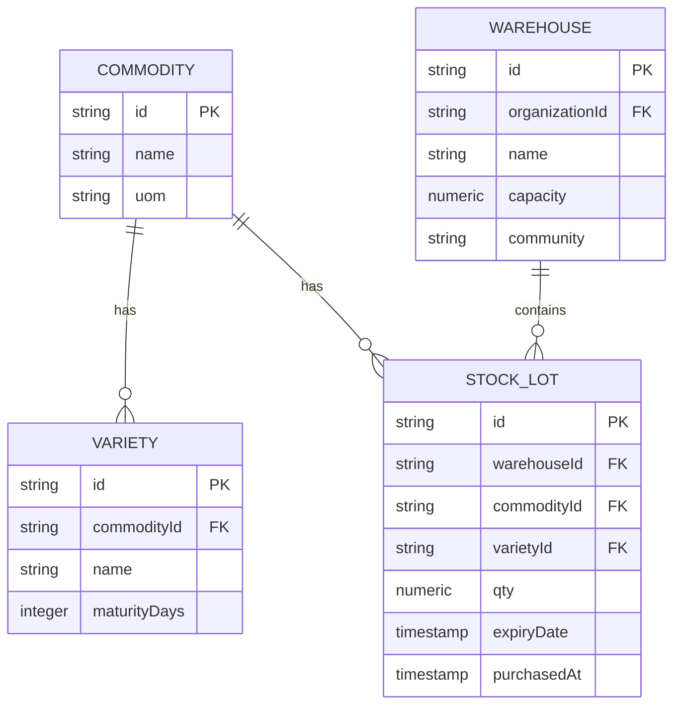
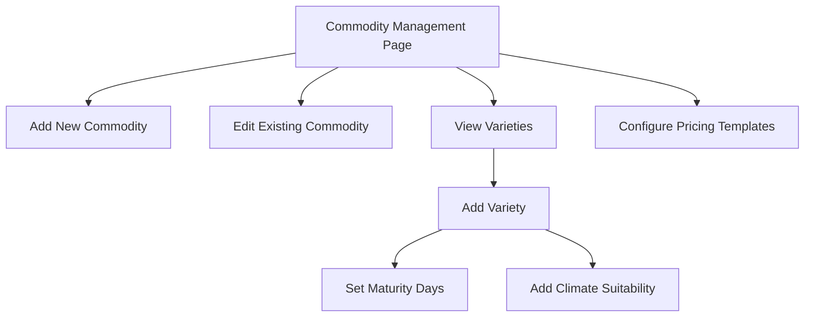
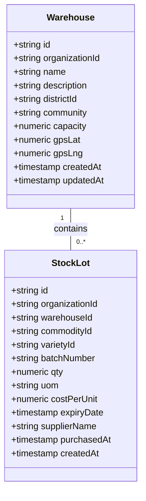
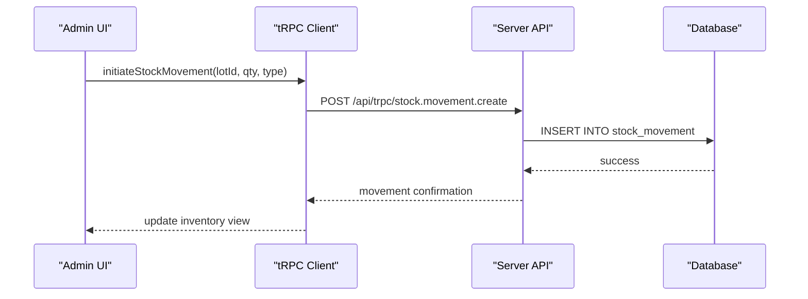
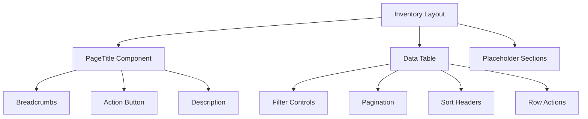
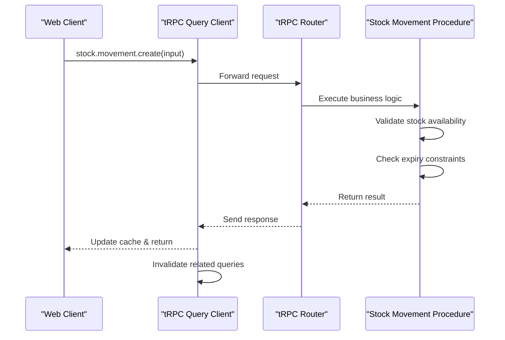
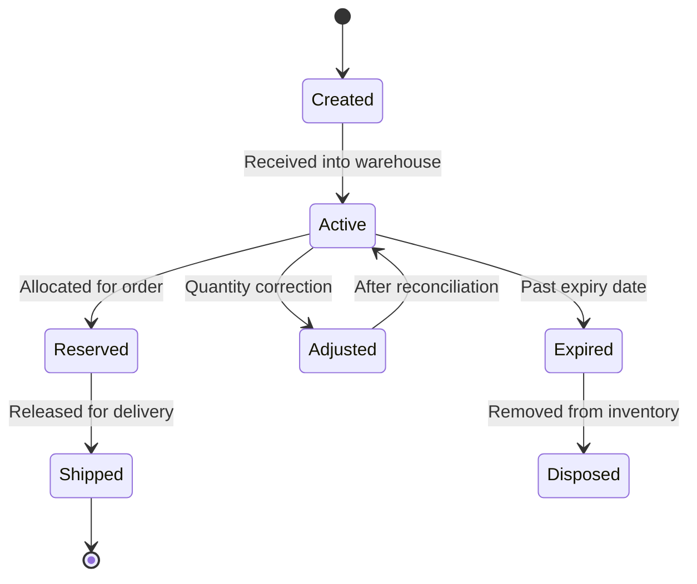
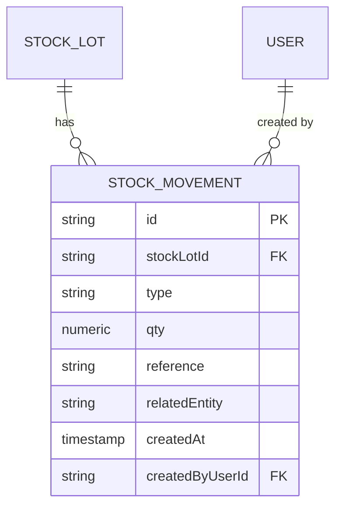

# Inventory & Warehouse Management

<cite>
**Referenced Files in This Document**  
- [commodities/page.tsx](file://src/app/(admin)/admin/inventory/commodities/page.tsx)
- [commodities/[commodityId]/page.tsx](file://src/app/(admin)/admin/inventory/commodities/[commodityId]/page.tsx)
- [varieties/page.tsx](file://src/app/(admin)/admin/inventory/varieties/page.tsx)
- [varieties/[varietyId]/page.tsx](file://src/app/(admin)/admin/inventory/varieties/[varietyId]/page.tsx)
- [warehouses/page.tsx](file://src/app/(admin)/admin/inventory/warehouses/page.tsx)
- [schema.ts](file://src/server/db/schema.ts#L472-L586)
- [inventory-card.tsx](file://src/features/admin/organizations/components/organization-details/inventory-card.tsx)
- [table.tsx](file://src/components/ui/table.tsx)
- [query-client.ts](file://src/trpc/query-client.ts)
- [react.tsx](file://src/trpc/react.tsx)
- [server.ts](file://src/trpc/server.ts)
</cite>

## Table of Contents
1. [Introduction](#introduction)
2. [Data Model Hierarchy](#data-model-hierarchy)
3. [Commodity and Variety Management](#commodity-and-variety-management)
4. [Warehouse and Stock Lot Structure](#warehouse-and-stock-lot-structure)
5. [Stock Movement and Expiry Tracking](#stock-movement-and-expiry-tracking)
6. [UI Architecture for Inventory Administration](#ui-architecture-for-inventory-administration)
7. [tRPC Integration for Real-Time Updates](#trpc-integration-for-real-time-updates)
8. [Warehouse Capacity and Stock Lifecycle](#warehouse-capacity-and-stock-lifecycle)
9. [Inventory Reporting and Audit Trails](#inventory-reporting-and-audit-trails)
10. [Common Issues and Reconciliation Strategies](#common-issues-and-reconciliation-strategies)

## Introduction
The Inventory & Warehouse Management sub-system provides a comprehensive solution for tracking agricultural commodities across a distributed network of storage facilities. It supports hierarchical data modeling of commodities, varieties, warehouses, and stock lots, with robust tracking of expiry dates, stock movements, and real-time inventory updates. The system integrates tRPC for reactive data synchronization and supports audit-compliant operations for inventory adjustments.

**Section sources**
- [commodities/page.tsx](file://src/app/(admin)/admin/inventory/commodities/page.tsx#L1-L28)
- [warehouses/page.tsx](file://src/app/(admin)/admin/inventory/warehouses/page.tsx#L1-L28)

## Data Model Hierarchy
The inventory system is built on a four-tier hierarchy:
1. **Commodity**: Top-level category (e.g., Maize, Rice)
2. **Variety**: Subtype of a commodity with specific agronomic traits
3. **Warehouse**: Physical storage facility with capacity constraints
4. **StockLot**: Specific quantity of a commodity/variety in a warehouse with expiry tracking

This hierarchy enables granular tracking from broad categories down to individual batches.

**Diagram sources**
- [schema.ts](file://src/server/db/schema.ts#L472-L513)
- [schema.ts](file://src/server/db/schema.ts#L515-L555)

**Section sources**
- [schema.ts](file://src/server/db/schema.ts#L472-L555)

## Commodity and Variety Management
The system provides dedicated interfaces for managing the commodity catalog and associated varieties. Commodities represent broad agricultural categories, while varieties capture specific cultivar information including maturity periods and agronomic recommendations.

The UI for commodity management includes data tables with filtering and pagination, allowing administrators to browse and search the global commodity catalog. Each commodity can have multiple varieties, which are managed through a separate interface with detailed agronomic metadata.

**Diagram sources**
- [commodities/page.tsx](file://src/app/(admin)/admin/inventory/commodities/page.tsx#L1-L28)
- [varieties/page.tsx](file://src/app/(admin)/admin/inventory/varieties/page.tsx#L1-L28)

**Section sources**
- [commodities/page.tsx](file://src/app/(admin)/admin/inventory/commodities/page.tsx#L1-L28)
- [varieties/page.tsx](file://src/app/(admin)/admin/inventory/varieties/page.tsx#L1-L28)
- [commodities/[commodityId]/page.tsx](file://src/app/(admin)/admin/inventory/commodities/[commodityId]/page.tsx#L1-L41)
- [varieties/[varietyId]/page.tsx](file://src/app/(admin)/admin/inventory/varieties/[varietyId]/page.tsx#L1-L42)

## Warehouse and Stock Lot Structure
Warehouses are physical storage facilities with defined capacity limits. Each warehouse belongs to an organization and may have GPS coordinates for precise location tracking. Stock lots represent specific batches of inventory stored within warehouses, with tracking of quantity, unit of measure, cost, and expiry dates.

The system enforces referential integrity between warehouses and stock lots, ensuring that all inventory is properly accounted for within the storage network. Warehouse capacity is tracked but not currently enforced as a hard constraint in the data model.

**Diagram sources**
- [schema.ts](file://src/server/db/schema.ts#L515-L555)
- [inventory-card.tsx](file://src/features/admin/organizations/components/organization-details/inventory-card.tsx#L0-L73)

**Section sources**
- [schema.ts](file://src/server/db/schema.ts#L515-L555)
- [warehouses/page.tsx](file://src/app/(admin)/admin/inventory/warehouses/page.tsx#L1-L28)

## Stock Movement and Expiry Tracking
Stock movements are recorded as discrete transactions with type classification (in, out, adjustment, reserve, release). Each movement references a specific stock lot and includes quantity, timestamp, and optional reference to related entities like purchase orders.

The system tracks expiry dates for stock lots, enabling proactive management of perishable inventory. While the current implementation includes the expiryDate field, there are no automated alerts or workflows for approaching expiry dates.

**Diagram sources**
- [schema.ts](file://src/server/db/schema.ts#L557-L586)
- [react.tsx](file://src/trpc/react.tsx)
- [server.ts](file://src/trpc/server.ts)

**Section sources**
- [schema.ts](file://src/server/db/schema.ts#L557-L586)

## UI Architecture for Inventory Administration
The inventory administration interface follows a consistent pattern across commodity, variety, and warehouse management pages. Each page uses the PageTitle component with breadcrumbs, action buttons, and descriptive text. Data is presented in tabular format using the shared table.tsx component with support for filtering, sorting, and pagination.

Placeholder sections are used in the current implementation, indicating that the full data table functionality will be implemented in subsequent development phases. The UI is designed to support bulk operations and inline editing for efficient inventory management.

**Diagram sources**
- [page.tsx](file://src/app/(admin)/admin/inventory/commodities/page.tsx#L1-L28)
- [table.tsx](file://src/components/ui/table.tsx)
- [PlaceholderSection.tsx](file://src/features/admin/overview/components/placeholder-section.tsx)

**Section sources**
- [commodities/page.tsx](file://src/app/(admin)/admin/inventory/commodities/page.tsx#L1-L28)
- [components/ui/table.tsx](file://src/components/ui/table.tsx)

## tRPC Integration for Real-Time Updates
The system uses tRPC for type-safe API communication between the frontend and backend. The integration enables real-time inventory updates with automatic query invalidation and data synchronization. The query-client.ts file configures the tRPC client with appropriate caching and refetching policies.

tRPC routers handle inventory-related operations including stock movement recording, inventory adjustments, and conflict resolution during concurrent edits. The system uses optimistic updates to provide a responsive user experience while ensuring data consistency through server-side validation.

**Diagram sources**
- [query-client.ts](file://src/trpc/query-client.ts)
- [react.tsx](file://src/trpc/react.tsx)
- [server.ts](file://src/trpc/server.ts)

**Section sources**
- [query-client.ts](file://src/trpc/query-client.ts)
- [react.tsx](file://src/trpc/react.tsx)
- [server.ts](file://src/trpc/server.ts)

## Warehouse Capacity and Stock Lifecycle
Warehouse capacity is tracked as a numeric field in the database schema, allowing administrators to monitor utilization levels. While capacity is recorded, the current implementation does not enforce capacity limits during stock receipt operations.

Stock lots follow a lifecycle from creation (via purchase or transfer) through various movement types (in, out, adjustment) to eventual depletion or expiration. The system maintains a complete history of all stock movements, enabling full traceability from receipt to final disposition.

The inventory-card.tsx component demonstrates how warehouse summary information is presented, including stock lot counts and total inventory value by warehouse.

**Diagram sources**
- [schema.ts](file://src/server/db/schema.ts#L515-L555)
- [inventory-card.tsx](file://src/features/admin/organizations/components/organization-details/inventory-card.tsx#L0-L73)

**Section sources**
- [schema.ts](file://src/server/db/schema.ts#L515-L555)
- [inventory-card.tsx](file://src/features/admin/organizations/components/organization-details/inventory-card.tsx#L0-L73)

## Inventory Reporting and Audit Trails
The system maintains comprehensive audit trails through the stock_movement table, which records all changes to inventory quantities. Each movement includes timestamps, user references, and optional metadata for traceability. The relatedEntity field allows linking movements to business documents like purchase orders.

While the current implementation captures the core data for reporting, dedicated reporting interfaces have not yet been implemented. Future enhancements could include inventory aging reports, turnover analysis, and expiry forecasting based on the existing data model.

**Diagram sources**
- [schema.ts](file://src/server/db/schema.ts#L557-L586)
- [inventory-card.tsx](file://src/features/admin/organizations/components/organization-details/inventory-card.tsx#L0-L73)

**Section sources**
- [schema.ts](file://src/server/db/schema.ts#L557-L586)

## Common Issues and Reconciliation Strategies
The system addresses several common inventory management challenges:

**Stock Count Discrepancies**: Occur due to data entry errors, unrecorded movements, or spoilage. The system supports adjustment movements to correct balances, with full audit logging of all changes.

**Concurrent Adjustments**: Multiple users editing the same stock lot simultaneously could lead to conflicts. The tRPC integration includes optimistic concurrency control with version checking to prevent overwrites.

**Expiry Management**: While expiry dates are tracked, the system currently lacks automated alerts. Manual review of stock lots by expiry date is required to prevent losses.

**Reconciliation Process**:
1. Identify discrepancy through physical count
2. Investigate movement history via audit trail
3. Create adjustment movement with justification
4. Update inventory records through tRPC interface
5. Verify synchronization across all views

The PlaceholderSection component indicates that more sophisticated reconciliation tools will be implemented in future iterations.

**Section sources**
- [schema.ts](file://src/server/db/schema.ts#L557-L586)
- [react.tsx](file://src/trpc/react.tsx)
- [inventory-card.tsx](file://src/features/admin/organizations/components/organization-details/inventory-card.tsx#L0-L73)