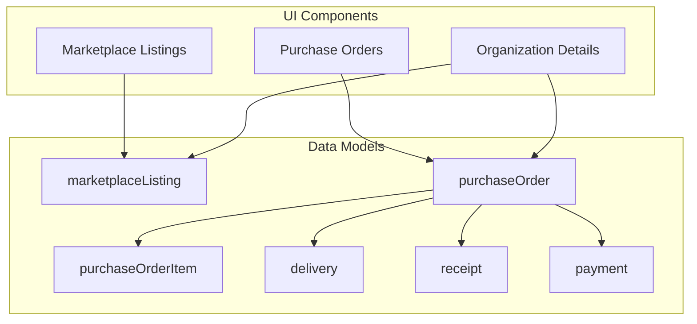
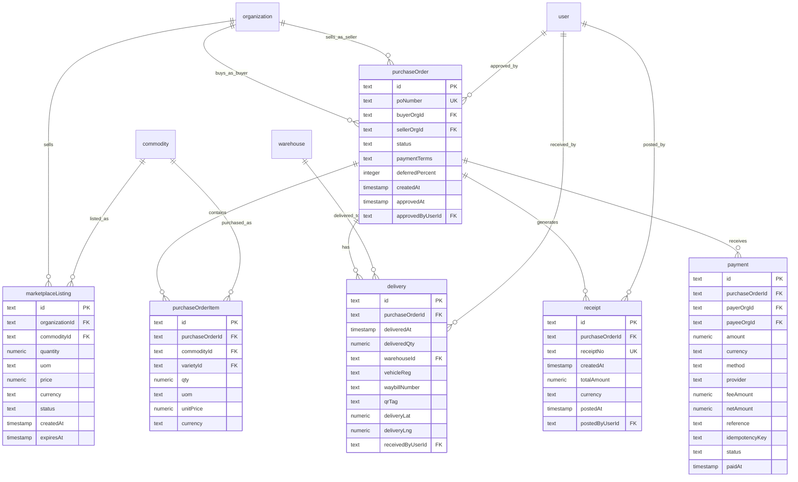
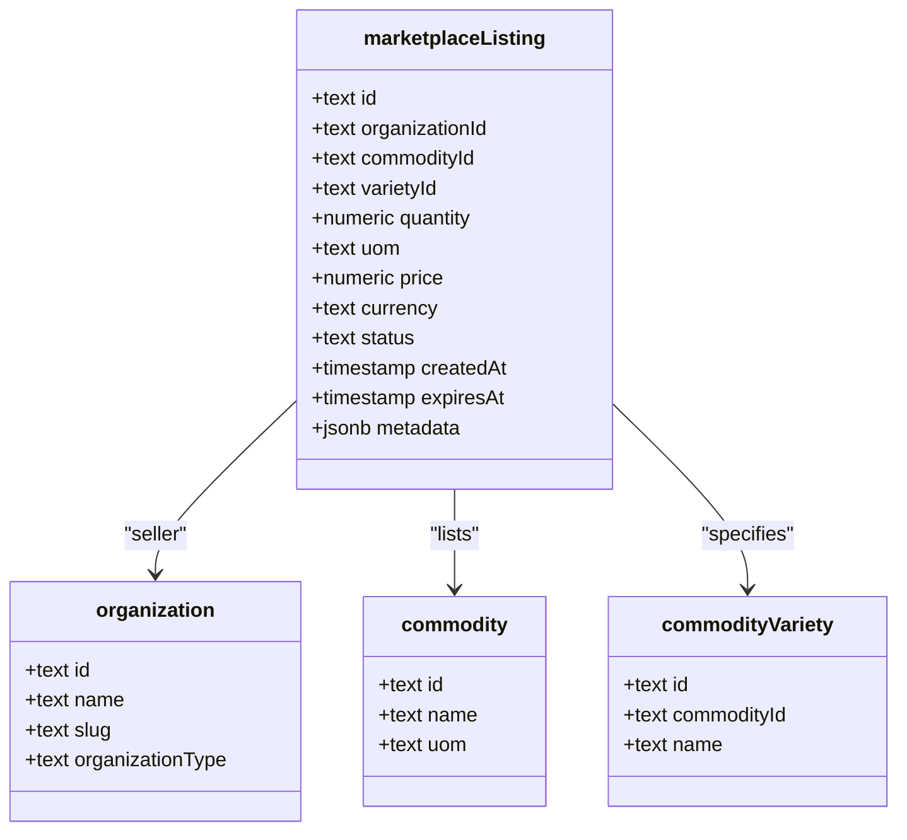
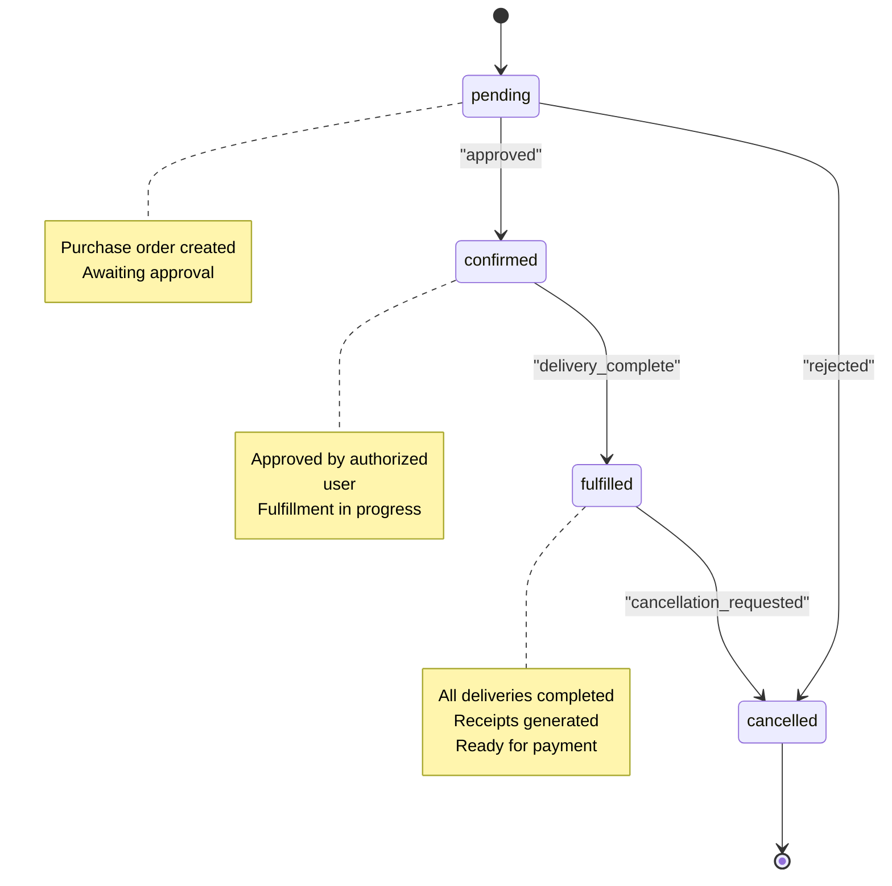
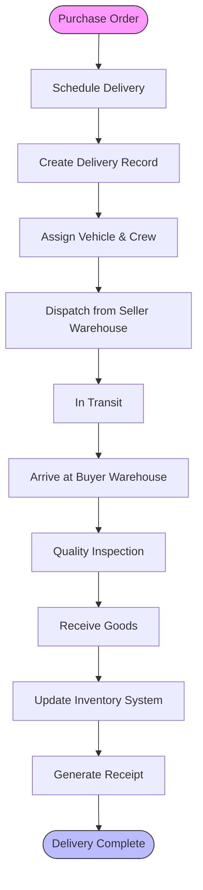
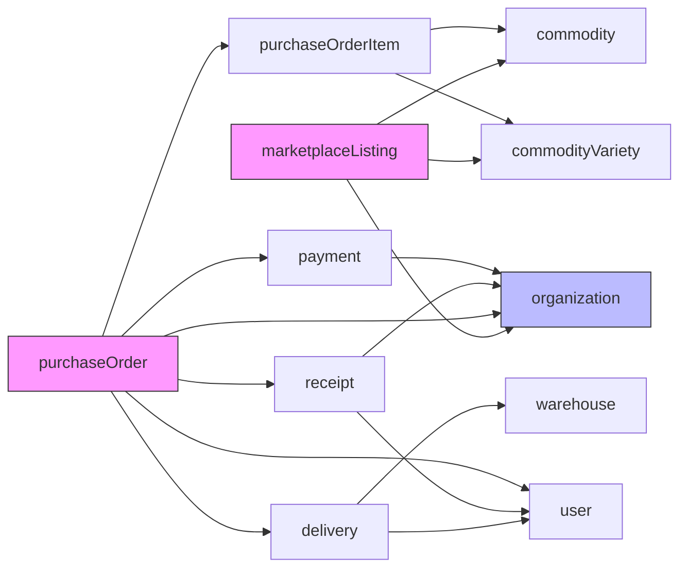

# Marketplace & Purchase Orders

<cite>
**Referenced Files in This Document**   
- [marketplace-listing.ts](file://src/server/db/schema.ts#L586-L622)
- [purchase-order.ts](file://src/server/db/schema.ts#L624-L662)
- [purchase-order-item.ts](file://src/server/db/schema.ts#L664-L690)
- [delivery.ts](file://src/server/db/schema.ts#L692-L741)
- [receipt.ts](file://src/server/db/schema.ts#L743-L779)
- [payment.ts](file://src/server/db/schema.ts#L779-L815)
- [marketplace-activity-card.tsx](file://src/features/admin/organizations/components/organization-details/marketplace-activity-card.tsx)
- [page.tsx](file://src/app/(admin)/admin/marketplace/purchase-orders/page.tsx)
- [page.tsx](file://src/app/(admin)/admin/marketplace/purchase-orders/[poId]/page.tsx)
</cite>

## Table of Contents
1. [Introduction](#introduction)
2. [Project Structure](#project-structure)
3. [Core Components](#core-components)
4. [Architecture Overview](#architecture-overview)
5. [Detailed Component Analysis](#detailed-component-analysis)
6. [Dependency Analysis](#dependency-analysis)
7. [Performance Considerations](#performance-considerations)
8. [Troubleshooting Guide](#troubleshooting-guide)
9. [Conclusion](#conclusion)

## Introduction
This document provides comprehensive architectural documentation for the Marketplace feature, focusing on product listings, purchase order creation, approval workflows, and delivery tracking. It details the data model relationships between key entities such as Listing, PurchaseOrder, Supplier, and Receipt, and explains how UI components integrate with financial and inventory systems. The document also covers order status transitions, payment processing integration points, receipt generation, state machine usage for order lifecycle management, and notification triggers for status changes.

## Project Structure
The Marketplace feature is organized under the admin section of the application, with dedicated routes for listings and purchase orders. The data models are defined in the server database schema, with corresponding UI components in the features directory.

**Diagram sources**
- [schema.ts](file://src/server/db/schema.ts#L586-L815)
- [marketplace-activity-card.tsx](file://src/features/admin/organizations/components/organization-details/marketplace-activity-card.tsx)

**Section sources**
- [schema.ts](file://src/server/db/schema.ts#L586-L815)
- [marketplace](file://src/app/(admin)/admin/marketplace)

## Core Components
The core components of the Marketplace feature include product listings, purchase orders, delivery tracking, receipts, and payments. These components work together to facilitate marketplace transactions from listing creation to final settlement.

**Section sources**
- [marketplace-listing.ts](file://src/server/db/schema.ts#L586-L622)
- [purchase-order.ts](file://src/server/db/schema.ts#L624-L662)
- [delivery.ts](file://src/server/db/schema.ts#L692-L741)
- [receipt.ts](file://src/server/db/schema.ts#L743-L779)
- [payment.ts](file://src/server/db/schema.ts#L779-L815)

## Architecture Overview
The Marketplace architecture follows a clean separation between UI components and data models, with well-defined relationships between entities. The system supports end-to-end marketplace operations including listing management, purchase order processing, delivery tracking, and financial settlement.

**Diagram sources**
- [schema.ts](file://src/server/db/schema.ts#L586-L815)

## Detailed Component Analysis

### Product Listings Analysis
The product listing system enables suppliers to create and manage marketplace listings for commodities. Each listing is associated with a supplier organization and includes details about the commodity, quantity, price, and availability status.

**Diagram sources**
- [marketplace-listing.ts](file://src/server/db/schema.ts#L586-L622)

**Section sources**
- [marketplace-listing.ts](file://src/server/db/schema.ts#L586-L622)

### Purchase Order Management Analysis
The purchase order system manages the creation, approval, and fulfillment of orders between buyer and seller organizations. It includes approval workflows and tracks the order lifecycle through various status transitions.

**Diagram sources**
- [purchase-order.ts](file://src/server/db/schema.ts#L624-L662)

**Section sources**
- [purchase-order.ts](file://src/server/db/schema.ts#L624-L662)
- [page.tsx](file://src/app/(admin)/admin/marketplace/purchase-orders/page.tsx)
- [page.tsx](file://src/app/(admin)/admin/marketplace/purchase-orders/[poId]/page.tsx)

### Delivery Tracking Analysis
The delivery system tracks the physical movement of goods from seller to buyer, capturing key logistics information including delivery timestamps, quantities, warehouse destinations, and quality control data.

**Diagram sources**
- [delivery.ts](file://src/server/db/schema.ts#L692-L741)

**Section sources**
- [delivery.ts](file://src/server/db/schema.ts#L692-L741)

## Dependency Analysis
The Marketplace feature has well-defined dependencies between its components, with clear relationships between entities that ensure data integrity and proper workflow execution.

**Diagram sources**
- [schema.ts](file://src/server/db/schema.ts#L586-L815)

**Section sources**
- [schema.ts](file://src/server/db/schema.ts#L586-L815)

## Performance Considerations
The Marketplace system is designed with performance in mind, including database indexes on key fields to optimize query performance for high-volume operations. The architecture supports scalability through efficient data access patterns and proper indexing strategies.

**Section sources**
- [schema.ts](file://src/server/db/schema.ts#L624-L662)
- [schema.ts](file://src/server/db/schema.ts#L779-L815)

## Troubleshooting Guide
When troubleshooting issues with the Marketplace feature, check the following common areas:
- Verify that purchase order status transitions are properly triggered
- Ensure delivery records are correctly linked to purchase orders
- Confirm that receipt generation occurs after successful delivery
- Validate that payment records are properly associated with purchase orders
- Check that inventory updates are synchronized with delivery events

**Section sources**
- [purchase-order.ts](file://src/server/db/schema.ts#L624-L662)
- [delivery.ts](file://src/server/db/schema.ts#L692-L741)
- [receipt.ts](file://src/server/db/schema.ts#L743-L779)

## Conclusion
The Marketplace feature provides a comprehensive solution for managing agricultural commodity transactions, from product listing to final settlement. The architecture supports complex business workflows including approval processes, delivery tracking, and financial integration. The system is designed for scalability and maintains data integrity through well-defined relationships and constraints. Future enhancements could include advanced analytics, predictive delivery scheduling, and enhanced supplier performance tracking.