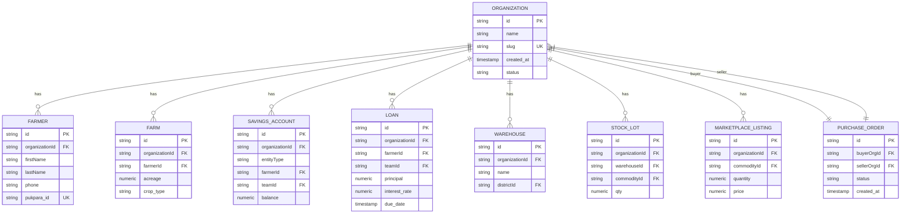

# Data Isolation Patterns

<cite>
**Referenced Files in This Document**   
- [schema.ts](file://src/server/db/schema.ts)
- [organizations.ts](file://src/server/api/routers/organizations.ts)
- [data-table.tsx](file://src/features/admin/organizations/components/organization-table/data-table.tsx)
</cite>

## Table of Contents
1. [Introduction](#introduction)
2. [Core Data Model and Multi-Tenancy Design](#core-data-model-and-multi-tenancy-design)
3. [Database Schema and OrganizationId Constraints](#database-schema-and-organizationid-constraints)
4. [ORM-Level Query Scoping with Drizzle](#orm-level-query-scoping-with-drizzle)
5. [API Layer Enforcement via tRPC](#api-layer-enforcement-via-trpc)
6. [Server-Side Pagination and Filtering](#server-side-pagination-and-filtering)
7. [Data Table Implementation and Client-Side Behavior](#data-table-implementation-and-client-side-behavior)
8. [Security Considerations and IDOR Prevention](#security-considerations-and-idor-prevention)
9. [Performance Implications and Indexing Strategy](#performance-implications-and-indexing-strategy)
10. [Best Practices for Tenant-Aware Development](#best-practices-for-tenant-aware-development)
11. [Conclusion](#conclusion)

## Introduction
The pukpara platform implements a robust multi-tenancy architecture to ensure strict data isolation between organizations. This document details the data isolation patterns used across the stack, focusing on how core entities such as users, farmers, farms, financial records, and inventory are scoped to an organization through the `organizationId` foreign key. The enforcement spans from the database schema design, through the ORM (Drizzle), up to the API (tRPC) and UI layers. Special attention is given to preventing Insecure Direct Object References (IDOR), ensuring secure query scoping, and maintaining performance through proper indexing and pagination strategies.

## Core Data Model and Multi-Tenancy Design
The foundation of pukpara's data isolation lies in its database schema, where nearly all business entities include an `organizationId` field that establishes ownership and access scope. This design ensures that data belonging to one organization cannot be accessed by another, even if direct object IDs are known. The `organization` table serves as the central tenant entity, with all other domain models referencing it via foreign key constraints.

Key tenant-scoped entities include:
- **Farmers and Farms**: Each farmer and their associated farms belong to a single organization.
- **Financial Records**: Savings accounts, loans, and repayments are tied to an organization.
- **Inventory and Warehousing**: Stock lots, warehouses, and commodity data are organization-specific.
- **Marketplace and Transactions**: Purchase orders, payments, and listings are scoped to buyer and seller organizations.

This pattern enforces data ownership at the schema level, forming the first line of defense against cross-tenant data access.

**Section sources**
- [schema.ts](file://src/server/db/schema.ts#L153-L188)
- [schema.ts](file://src/server/db/schema.ts#L280-L305)
- [schema.ts](file://src/server/db/schema.ts#L340-L355)

## Database Schema and OrganizationId Constraints
The database schema explicitly defines `organizationId` as a required foreign key in all tenant-specific tables, with cascading deletes to maintain referential integrity. This ensures that when an organization is deleted, all associated data is automatically removed.

For example, the `farmer` table includes:
```ts
organizationId: text("organization_id")
  .notNull()
  .references(() => organization.id, { onDelete: "cascade" })
```

Similar constraints exist for `farm`, `savingsAccount`, `loan`, `warehouse`, `stockLot`, and `marketplaceListing`. The `purchaseOrder` table uniquely references the `organization` table twice—once for the buyer (`buyerOrgId`) and once for the seller (`sellerOrgId`)—enabling secure cross-organizational transactions while still enforcing tenant context.

Unique constraints are also applied where necessary, such as ensuring a phone number is unique within an organization (`uqOrgPhone` index on `farmer`).



**Diagram sources**
- [schema.ts](file://src/server/db/schema.ts#L153-L188)
- [schema.ts](file://src/server/db/schema.ts#L280-L305)
- [schema.ts](file://src/server/db/schema.ts#L340-L355)
- [schema.ts](file://src/server/db/schema.ts#L624-L662)

## ORM-Level Query Scoping with Drizzle
At the ORM level, Drizzle enforces tenant isolation by requiring explicit filtering on `organizationId` in all queries. The application logic must always include this condition to retrieve data. For example, when querying farmers, the ORM call includes `.where(eq(farmer.organizationId, orgId))` to ensure only records belonging to the current organization are returned.

The schema also defines relation helpers (e.g., `organizationRelations`) that allow traversing tenant-scoped data safely. These relations are used in conjunction with joins and subqueries to aggregate data such as member counts or leadership roles, always scoped to the organization context.

**Section sources**
- [schema.ts](file://src/server/db/schema.ts#L890-L928)
- [schema.ts](file://src/server/db/schema.ts#L280-L305)

## API Layer Enforcement via tRPC
The tRPC API layer enforces data isolation through protected procedures that validate the caller's permissions and scope queries to the appropriate organization. The `organizationsRouter` defines several endpoints, including `list`, `detail`, `approve`, and `delete`, all of which operate within a tenant-aware context.

For example, the `detail` query retrieves an organization's information only if the authenticated user has administrative privileges. It also fetches related data such as member count and leadership roles, all scoped to the requested `organizationId`.


**Diagram sources**
- [organizations.ts](file://src/server/api/routers/organizations.ts#L321-L359)
- [organizations.ts](file://src/server/api/routers/organizations.ts#L44-L78)

## Server-Side Pagination and Filtering
The `list` procedure in the `organizationsRouter` implements server-side pagination and filtering to efficiently handle large datasets. It accepts `page` and `pageSize` parameters, with a maximum page size of 100 to prevent excessive data retrieval.

The query uses `LIMIT` and `OFFSET` to paginate results, while aggregating data such as member count and owner information via SQL joins and grouping. This ensures that only the necessary data is fetched and transmitted, improving performance and reducing bandwidth usage.


**Diagram sources**
- [organizations.ts](file://src/server/api/routers/organizations.ts#L80-L113)
- [organizations.ts](file://src/server/api/routers/organizations.ts#L115-L160)

## Data Table Implementation and Client-Side Behavior
The client-side `DataTable` component renders organization data with support for sorting, selection, and actions. It receives paginated data from the API and allows users to sort by name, status, or creation date. The component also supports bulk actions such as approve, reject, suspend, and delete, all of which are confirmed via modal dialogs to prevent accidental operations.

Although the table performs client-side filtering and sorting for responsiveness, the initial data load is server-paginated, ensuring that only a subset of records is transferred at any time.


**Diagram sources**
- [data-table.tsx](file://src/features/admin/organizations/components/organization-table/data-table.tsx#L0-L450)

## Security Considerations and IDOR Prevention
To prevent Insecure Direct Object References (IDOR), the system employs multiple layers of protection:
1. **Foreign Key Constraints**: The database enforces `organizationId` ownership.
2. **Query Scoping**: All ORM queries must include `organizationId` in the WHERE clause.
3. **API Authorization**: tRPC procedures validate user roles before allowing access.
4. **Input Validation**: All inputs are validated using Zod schemas.
5. **Audit Logging**: Sensitive operations are logged for traceability.

Additionally, the `ensurePlatformAdmin` middleware ensures that only users with specific admin roles can access organization management endpoints, preventing privilege escalation.

**Section sources**
- [organizations.ts](file://src/server/api/routers/organizations.ts#L44-L78)
- [schema.ts](file://src/server/db/schema.ts#L153-L188)

## Performance Implications and Indexing Strategy
To maintain query performance under multi-tenancy, the schema includes strategic indexes on `organizationId` fields. For example:
- `idxOrgLastName` on `farmer(organizationId, lastName)` enables fast lookups.
- `idxBuyerStatus` and `idxSellerStatus` on `purchaseOrder` allow efficient filtering by buyer/seller and status.
- `idxOrgCreated` on `savingsEntry` supports time-based queries within an organization.

These indexes ensure that tenant-scoped queries remain performant even as data volume grows. However, developers must be cautious to avoid N+1 query patterns and ensure that joins are optimized.

**Section sources**
- [schema.ts](file://src/server/db/schema.ts#L280-L305)
- [schema.ts](file://src/server/db/schema.ts#L624-L662)
- [schema.ts](file://src/server/db/schema.ts#L460-L480)

## Best Practices for Tenant-Aware Development
When writing tenant-aware queries and features in pukpara, follow these best practices:
- Always include `organizationId` in WHERE clauses for tenant-scoped entities.
- Use parameterized queries to prevent SQL injection.
- Validate user permissions before accessing organization data.
- Implement server-side pagination for large datasets.
- Use indexes on frequently queried tenant-scoped fields.
- Avoid client-side only filtering for security-sensitive data.
- Log sensitive operations for audit purposes.
- Test data isolation thoroughly using multi-tenant scenarios.

## Conclusion
pukpara's data isolation model is comprehensive, enforcing multi-tenancy at every layer of the stack. From the database schema to the API and UI, the `organizationId` foreign key ensures that data remains securely scoped to its owning organization. Combined with proper indexing, pagination, and security checks, this approach provides a scalable and secure foundation for a multi-tenant agricultural platform.