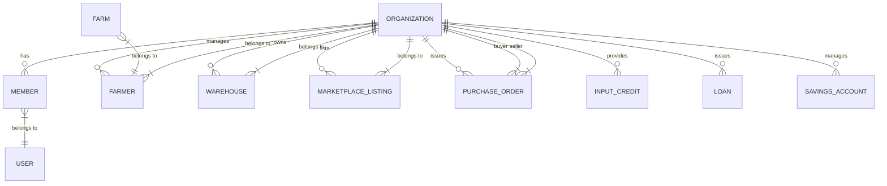
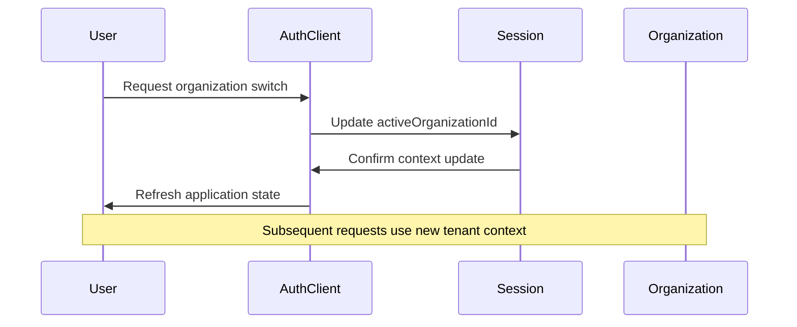
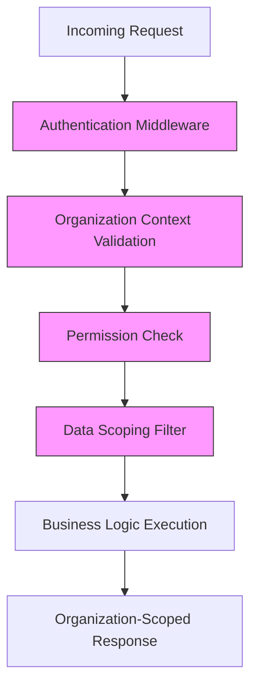
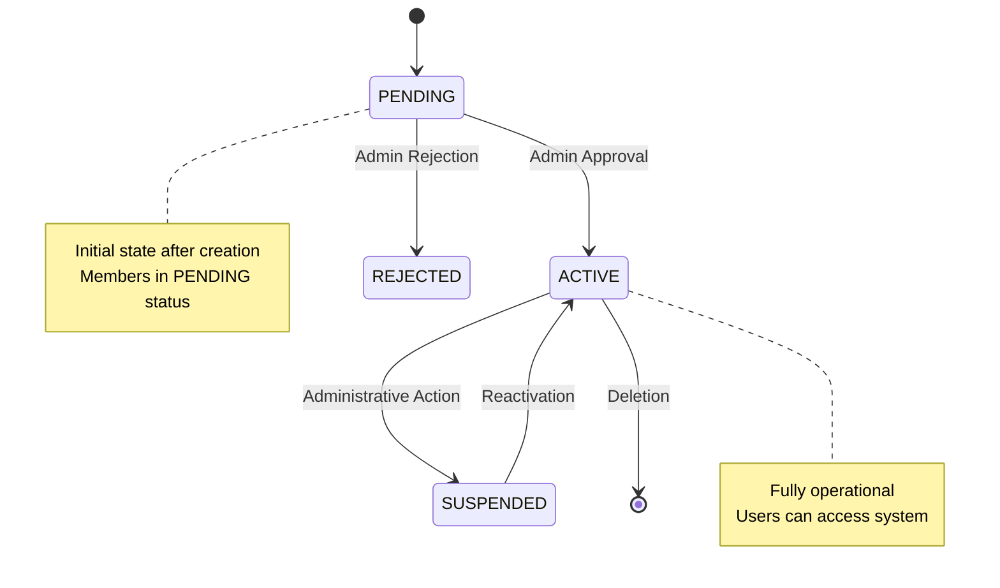

# Multi-Tenant Architecture

<cite>
**Referenced Files in This Document**   
- [schema.ts](file://src/server/db/schema.ts)
- [organizations.ts](file://src/server/api/routers/organizations.ts)
- [auth-server.ts](file://src/lib/auth-server.ts)
- [auth-organization-utils.ts](file://src/lib/auth-organization-utils.ts)
- [org-permissions.ts](file://src/lib/org-permissions.ts)
- [server.ts](file://src/trpc/server.ts)
- [organization-create-page.tsx](file://src/features/admin/organizations/pages/organization-create-page.tsx)
- [organizations-page.tsx](file://src/features/admin/organizations/pages/organizations-page.tsx)
- [use-organization-list-controller.ts](file://src/features/admin/organizations/hooks/use-organization-list-controller.ts)
- [use-organization-filters.ts](file://src/features/admin/organizations/hooks/use-organization-filters.ts)
- [creation-mode-step.tsx](file://src/features/admin/organizations/components/organization-create/creation-mode-step.tsx)
- [existing-user-step.tsx](file://src/features/admin/organizations/components/organization-create/existing-user-step.tsx)
- [new-user-step.tsx](file://src/features/admin/organizations/components/organization-create/new-user-step.tsx)
- [organization-details-step.tsx](file://src/features/admin/organizations/components/organization-create/organization-details-step.tsx)
- [review-step.tsx](file://src/features/admin/organizations/components/organization-create/review-step.tsx)
</cite>

## Table of Contents
1. [Introduction](#introduction)
2. [Data Isolation Strategy](#data-isolation-strategy)
3. [Tenant Context Management](#tenant-context-management)
4. [Middleware Enforcement](#middleware-enforcement)
5. [Organization Lifecycle Management](#organization-lifecycle-management)
6. [Membership and Access Control](#membership-and-access-control)
7. [Security Considerations](#security-considerations)
8. [Query Scoping Patterns](#query-soping-patterns)
9. [Extending Tenant-Aware Features](#extending-tenant-aware-features)
10. [Common Pitfalls](#common-pitfalls)

## Introduction
The pukpara platform implements a robust multi-tenancy architecture that enables multiple organizations to coexist within a shared infrastructure while maintaining strict data isolation. This document details the implementation of tenant isolation through organizationId foreign keys, session management via Better Auth, and middleware enforcement of tenant boundaries. The architecture supports both admin-initiated and self-service organization creation, with comprehensive approval workflows and membership management.

**Section sources**
- [schema.ts](file://src/server/db/schema.ts#L1-L1318)
- [organizations.ts](file://src/server/api/routers/organizations.ts#L1-L419)

## Data Isolation Strategy
Data isolation in pukpara is achieved through the consistent use of organizationId foreign keys across all tenant-scoped entities. The organization table serves as the root entity for tenant data partitioning, with all core business entities maintaining a direct relationship to it.

Key tenant-scoped entities include:
- **Users**: Linked via member table with role-based access
- **Farmers**: Direct organizationId reference with unique constraints
- **Farms**: Belong to farmers within the same organization
- **Financial Records**: Savings, loans, and payments scoped to organization
- **Inventory & Marketplace**: Warehouses, commodities, and purchase orders isolated by organization

The schema enforces referential integrity through cascading deletes and restrict constraints where appropriate, ensuring data consistency across tenant boundaries.



**Diagram sources**
- [schema.ts](file://src/server/db/schema.ts#L1-L1318)

**Section sources**
- [schema.ts](file://src/server/db/schema.ts#L1-L1318)

## Tenant Context Management
Better Auth plays a central role in managing organization-scoped sessions and tenant context switching. The session table includes an activeOrganizationId field that tracks the currently selected tenant for each user session.

When a user belongs to multiple organizations, the platform allows switching between tenant contexts while maintaining authentication state. The activeOrganizationId in the session record is updated upon context switch, ensuring subsequent requests operate within the correct tenant boundary.

The auth-server.ts and auth-organization-utils.ts modules provide utilities for:
- Resolving the active organization from session context
- Validating organization membership during authentication
- Managing organization-scoped permissions
- Handling organization switching workflows



**Diagram sources**
- [auth-server.ts](file://src/lib/auth-server.ts#L1-L100)
- [session table](file://src/server/db/schema.ts#L1-L1318)

**Section sources**
- [auth-server.ts](file://src/lib/auth-server.ts#L1-L100)
- [auth-organization-utils.ts](file://src/lib/auth-organization-utils.ts#L1-L50)

## Middleware Enforcement
Tenant boundaries are enforced through a combination of server-side middleware and tRPC middlewares that validate organization context on every request.

The protectedProcedure in tRPC server enforces authentication and can be extended with organization-level authorization checks. The organizations router demonstrates this pattern with admin role verification and tenant-scoped data access.

Key middleware components:
- **Authentication Middleware**: Validates session and extracts user context
- **Organization Context Middleware**: Ensures active organization is set
- **Authorization Middleware**: Verifies user permissions within organization
- **Data Scoping Middleware**: Automatically filters queries by organizationId

The org-permissions.ts module defines role-based access control policies that integrate with the middleware chain to enforce fine-grained permissions.



**Diagram sources**
- [server.ts](file://src/trpc/server.ts#L1-L200)
- [org-permissions.ts](file://src/lib/org-permissions.ts#L1-L80)

**Section sources**
- [server.ts](file://src/trpc/server.ts#L1-L200)
- [org-permissions.ts](file://src/lib/org-permissions.ts#L1-L80)

## Organization Lifecycle Management
The platform supports two organization creation workflows: admin-initiated and self-service registration. Both flows are managed through the admin/organizations feature components.

### Admin-Initiated Creation
Administrators can create organizations through the organization-create wizard, which guides through:
1. Selection of creation mode (new user or existing user)
2. Organization details entry
3. User account setup
4. Review and confirmation

The creation-mode-step.tsx component presents the initial choice between linking to an existing user or creating a new one. The subsequent steps handle data collection and validation before final creation.

### Self-Service Registration
While not detailed in the current codebase, the approval workflow suggests a self-service registration process where organizations are created in PENDING status and require administrative approval.

### Approval Process
The approve mutation in organizations.ts handles the activation of pending organizations:
- Updates organization status to ACTIVE
- Approves all associated members
- Sends notification emails to owners and admins
- Triggers onboarding workflows

The deletion functionality allows administrators to remove organizations, with cascading effects on related data.



**Diagram sources**
- [organizations.ts](file://src/server/api/routers/organizations.ts#L1-L419)
- [organization-create components](file://src/features/admin/organizations/components/organization-create/)

**Section sources**
- [organizations.ts](file://src/server/api/routers/organizations.ts#L1-L419)
- [organization-create-page.tsx](file://src/features/admin/organizations/pages/organization-create-page.tsx#L1-L150)

## Membership and Access Control
Organization membership is managed through the member table, which establishes the relationship between users and organizations with role-based access control.

### Membership Roles
The system defines several membership roles:
- **OWNER**: Full administrative privileges
- **ADMIN**: Administrative privileges within organization
- **MEMBER**: Standard user access
- **READ_ONLY**: Limited view access

### Invitation System
The invitation table supports bringing new users into organizations:
- Tracks invitation status and expiration
- Specifies role assignment
- Records inviter information
- Supports team-specific invitations

### Access Control
The member table enforces unique constraints to prevent duplicate memberships and maintains audit trails through createdAt and updatedAt timestamps. The system ensures that users can only access data within organizations they belong to, with role-based permissions determining the scope of operations.

**Section sources**
- [schema.ts](file://src/server/db/schema.ts#L1-L1318)
- [member table](file://src/server/db/schema.ts#L1-L1318)

## Security Considerations
The multi-tenant architecture incorporates several security mechanisms to prevent cross-tenant data access:

### Data Access Prevention
- All tenant-scoped queries must include organizationId filters
- Middleware automatically scopes data access
- Direct access to organizationId fields is restricted
- Cross-tenant joins are prohibited in application logic

### Session Security
- Active organization context is validated on each request
- Session fixation protection is implemented
- Organization switching requires explicit user action
- Suspicious activity monitoring is available

### Input Validation
- Organization identifiers are validated for ownership
- Role assignments are checked against permission policies
- Bulk operations include tenant-aware validation
- API endpoints enforce tenant context

### Audit and Monitoring
- All organization-related actions are logged
- Membership changes are tracked
- Approval workflows maintain audit trails
- Security events are monitored

**Section sources**
- [auth-server.ts](file://src/lib/auth-server.ts#L1-L100)
- [org-permissions.ts](file://src/lib/org-permissions.ts#L1-L80)
- [organizations.ts](file://src/server/api/routers/organizations.ts#L1-L419)

## Query Scoping Patterns
The application implements consistent query scoping patterns to ensure tenant data isolation:

### Automatic Scoping
Most queries automatically include organizationId filters through:
- Middleware-injected context
- Repository pattern with tenant awareness
- Base query builders that include tenant constraints

### Manual Scoping
When writing raw queries, developers must:
- Always include organizationId in WHERE clauses
- Use parameterized queries to prevent injection
- Validate organization context before execution
- Use database views for complex multi-tenant queries

### Example Pattern
```typescript
// Correct: Scoped query
const farms = await db.query.farm.findMany({
  where: and(
    eq(farm.organizationId, ctx.orgId),
    eq(farm.farmerId, farmerId)
  )
});

// Incorrect: Missing organization scope
const farms = await db.query.farm.findMany({
  where: eq(farm.farmerId, farmerId) // Security risk!
});
```

**Section sources**
- [organizations.ts](file://src/server/api/routers/organizations.ts#L1-L419)
- [schema.ts](file://src/server/db/schema.ts#L1-L1318)

## Extending Tenant-Aware Features
When adding new tenant-aware features, follow these guidelines:

### Database Schema
- Include organizationId foreign key on all tenant-scoped entities
- Add appropriate indexes for organizationId
- Consider soft deletes for tenant data
- Implement cascading deletes where appropriate

### API Design
- Accept organization context from middleware
- Validate organization membership
- Scope responses to tenant data
- Include organization identifiers in URLs

### Frontend Integration
- Use organization context hooks
- Display organization-aware UI elements
- Handle organization switching gracefully
- Show organization-specific branding

### Testing
- Test cross-tenant access prevention
- Verify data isolation
- Test organization switching
- Validate permission boundaries

**Section sources**
- [schema.ts](file://src/server/db/schema.ts#L1-L1318)
- [organizations.ts](file://src/server/api/routers/organizations.ts#L1-L419)
- [auth-organization-utils.ts](file://src/lib/auth-organization-utils.ts#L1-L50)

## Common Pitfalls
Developers should be aware of these common issues in multi-tenant systems:

### Missing Organization Scoping
Forgetting to include organizationId in queries can lead to data leaks:
```typescript
// Anti-pattern
const users = await db.query.user.findMany(); // Returns all users!

// Correct pattern
const users = await db.query.user.findMany({
  where: eq(user.organizationId, orgId)
});
```

### Incomplete Cascading Effects
Failing to handle related data during organization operations:
- Not cleaning up associated records on deletion
- Not updating status across related entities
- Not notifying all affected users

### Over-privileged Access
Granting excessive permissions:
- Allowing cross-tenant queries
- Permitting organizationId manipulation
- Bypassing role-based restrictions

### Performance Issues
- Missing indexes on organizationId fields
- N+1 query problems in tenant-scoped data
- Large cross-tenant aggregations

### Testing Gaps
- Not testing multi-organization scenarios
- Ignoring edge cases in organization switching
- Failing to verify data isolation

**Section sources**
- [schema.ts](file://src/server/db/schema.ts#L1-L1318)
- [organizations.ts](file://src/server/api/routers/organizations.ts#L1-L419)
- [org-permissions.ts](file://src/lib/org-permissions.ts#L1-L80)