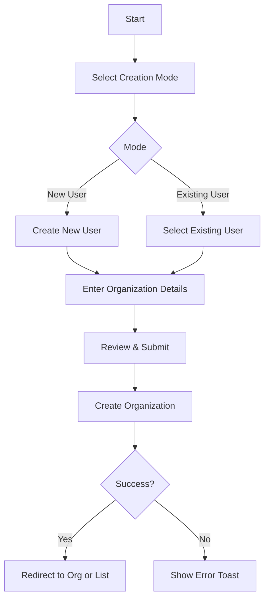
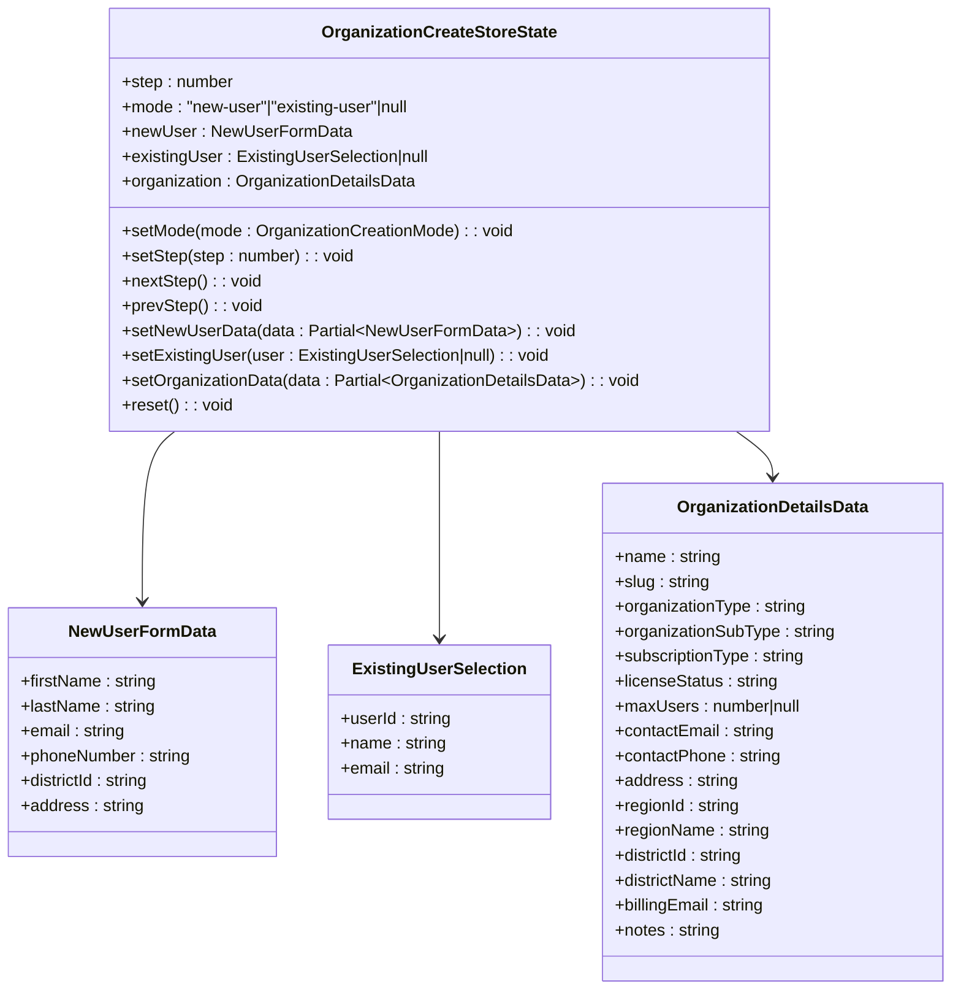
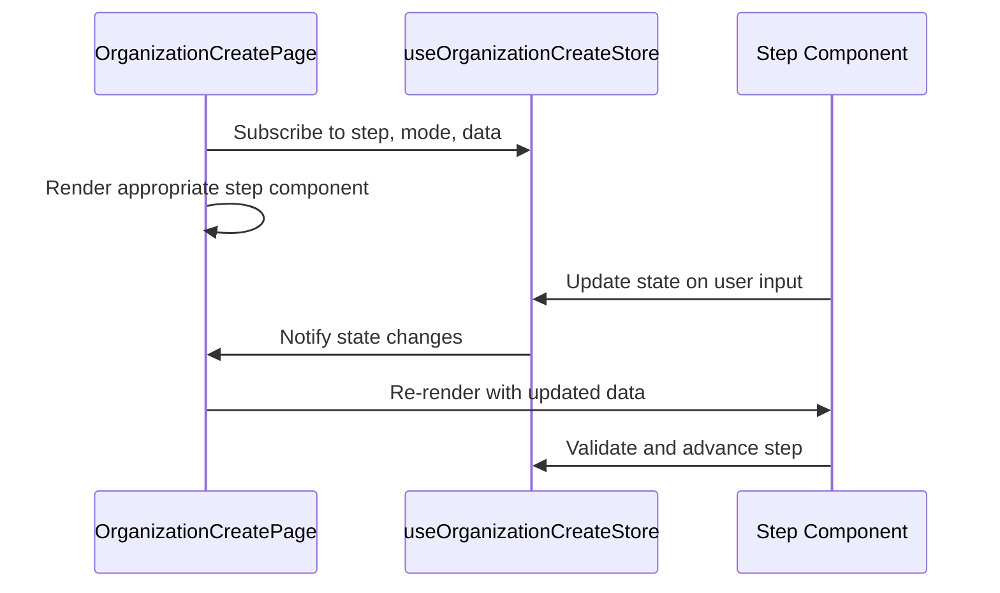
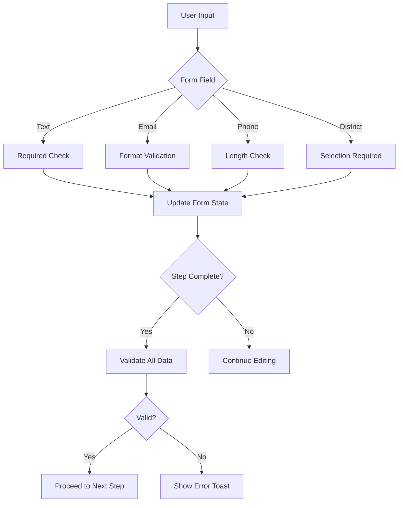
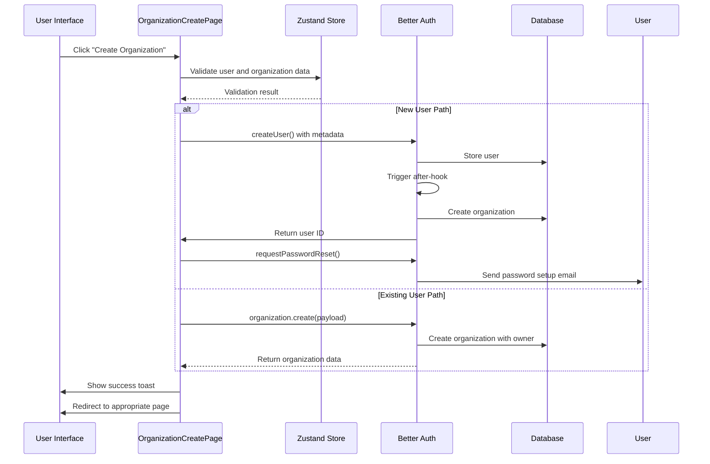

# Organization Lifecycle Management

<cite>
**Referenced Files in This Document**   
- [organization-create-page.tsx](file://src/features/admin/organizations/pages/organization-create-page.tsx)
- [organization-create-store.ts](file://src/features/admin/organizations/store/organization-create-store.ts)
- [creation-mode-step.tsx](file://src/features/admin/organizations/components/organization-create/creation-mode-step.tsx)
- [existing-user-step.tsx](file://src/features/admin/organizations/components/organization-create/existing-user-step.tsx)
- [new-user-step.tsx](file://src/features/admin/organizations/components/organization-create/new-user-step.tsx)
- [organization-details-step.tsx](file://src/features/admin/organizations/components/organization-create/organization-details-step.tsx)
- [review-step.tsx](file://src/features/admin/organizations/components/organization-create/review-step.tsx)
- [auth-organization-utils.ts](file://src/lib/auth-organization-utils.ts)
- [organizations.ts](file://src/server/api/routers/organizations.ts)
</cite>

## Table of Contents
1. [Introduction](#introduction)
2. [Organization Creation Workflow](#organization-creation-workflow)
3. [State Management with Zustand](#state-management-with-zustand)
4. [Step Components and Form Flow](#step-components-and-form-flow)
5. [Data Persistence and Prop Drilling](#data-persistence-and-prop-drilling)
6. [Validation Patterns](#validation-patterns)
7. [Submission Handling and API Integration](#submission-handling-and-api-integration)
8. [Approval Process and Tenant Provisioning](#approval-process-and-tenant-provisioning)
9. [Common Issues and Troubleshooting](#common-issues-and-troubleshooting)
10. [Extending the Workflow](#extending-the-workflow)

## Introduction
The organization lifecycle management system in pukpara enables administrators to create and manage tenant organizations through a guided multi-step workflow. This document details the implementation of the organization creation process, covering both admin-initiated and self-service registration paths. The system leverages Zustand for state management, React Hook Form for validation, and integrates with Better Auth for secure user and tenant provisioning. The workflow ensures data consistency, supports flexible ownership models, and provides a seamless onboarding experience.

## Organization Creation Workflow
The organization creation process is structured as a four-step wizard, accessible via the admin interface at `/admin/organizations/new`. Users can initiate organization creation through two distinct paths: creating a new user or attaching the organization to an existing user.

The workflow begins with the **creation mode selection**, where administrators choose between provisioning a new user or assigning the organization to an existing account. Based on this selection, the subsequent steps adapt dynamically:

1. **Owner Setup**: Configure owner details either by creating a new user or selecting from existing users.
2. **Organization Details**: Define organization metadata including name, slug, type, subscription, and contact information.
3. **Review & Create**: Final validation and submission of the organization configuration.

The workflow is non-committal until the final submission, allowing users to navigate away and resume later without data loss.

**Diagram sources**
- [organization-create-page.tsx](file://src/features/admin/organizations/pages/organization-create-page.tsx#L1-L558)
- [creation-mode-step.tsx](file://src/features/admin/organizations/components/organization-create/creation-mode-step.tsx#L1-L138)

**Section sources**
- [organization-create-page.tsx](file://src/features/admin/organizations/pages/organization-create-page.tsx#L1-L558)
- [creation-mode-step.tsx](file://src/features/admin/organizations/components/organization-create/creation-mode-step.tsx#L1-L138)

## State Management with Zustand
The organization creation workflow utilizes Zustand via `useOrganizationCreateStore` to maintain state across steps. This centralized store ensures data persistence throughout the multi-step process, even when navigating between steps or temporarily leaving the page.

The store manages the following state:
- Current step in the wizard
- Creation mode (`new-user` or `existing-user`)
- New user form data (name, email, phone, district, address)
- Existing user selection (user ID, name, email)
- Organization details (name, slug, type, subscription, contact info, metadata)

The store provides actions for:
- `setMode()`: Set the creation mode
- `nextStep()`/`prevStep()`: Navigate between steps
- `setNewUserData()`: Update new user form fields
- `setExistingUser()`: Select existing user
- `setOrganizationData()`: Update organization fields
- `reset()`: Clear all state after successful creation

State is automatically clamped to valid step ranges (1–4), and initial values are defined with sensible defaults such as `FARMER_ORG` as the default organization type and `FREEMIUM` subscription.

**Diagram sources**
- [organization-create-store.ts](file://src/features/admin/organizations/store/organization-create-store.ts#L1-L138)

**Section sources**
- [organization-create-store.ts](file://src/features/admin/organizations/store/organization-create-store.ts#L1-L138)

## Step Components and Form Flow
The workflow is implemented as a series of step components, each responsible for a specific phase of organization creation. The `OrganizationCreatePage` orchestrates the flow by conditionally rendering the appropriate step based on the current state.

### Creation Mode Step
The initial step presents two options:
- **Create new user workspace**: Provisions a new user and automatically generates a workspace
- **Attach to existing user**: Creates an organization for an existing platform user

Users must select a mode before proceeding. The selection updates the global store and influences subsequent steps.

### Owner Setup Step
This step adapts based on the creation mode:
- For **new users**, a form collects owner details including name, email, phone, district, and address
- For **existing users**, a searchable list allows selection from the user directory

The step uses React Query to fetch users with debounce-based search, ensuring responsive performance even with large user bases.

### Organization Details Step
Collects organization metadata:
- Name and slug (auto-generated from name)
- Organization type and sub-type
- Subscription and license status
- Contact and billing information
- Address and geographical context (district/region)
- Additional notes

### Review Step
Displays a summary of all entered data for final verification before submission. Shows different content based on creation mode and prevents submission if validation fails.

**Diagram sources**
- [organization-create-page.tsx](file://src/features/admin/organizations/pages/organization-create-page.tsx#L1-L558)
- [creation-mode-step.tsx](file://src/features/admin/organizations/components/organization-create/creation-mode-step.tsx#L1-L138)
- [new-user-step.tsx](file://src/features/admin/organizations/components/organization-create/new-user-step.tsx#L1-L390)
- [existing-user-step.tsx](file://src/features/admin/organizations/components/organization-create/existing-user-step.tsx#L1-L207)

**Section sources**
- [organization-create-page.tsx](file://src/features/admin/organizations/pages/organization-create-page.tsx#L1-L558)
- [creation-mode-step.tsx](file://src/features/admin/organizations/components/organization-create/creation-mode-step.tsx#L1-L138)
- [new-user-step.tsx](file://src/features/admin/organizations/components/organization-create/new-user-step.tsx#L1-L390)
- [existing-user-step.tsx](file://src/features/admin/organizations/components/organization-create/existing-user-step.tsx#L1-L207)

## Data Persistence and Prop Drilling
The organization creation workflow avoids excessive prop drilling by leveraging the Zustand store for state management. Components access and update state directly through store selectors, minimizing the need to pass props through intermediate components.

However, some controlled prop passing is used for:
- Navigation callbacks (`onBack`, `onNext`) passed from page to step components
- Form submission handlers passed to the final review step
- Loading and disabled states passed to buttons

The store maintains data consistency across steps, ensuring that partially completed forms retain their state when navigating back and forth. When switching between creation modes, relevant organization fields (contact email, phone, address, district) are automatically populated from user data if not already set.

Field synchronization occurs in two scenarios:
1. When a new user is configured, their contact details are copied to organization fields if those fields are empty
2. When an existing user is selected, their email is used for contact and billing if not already specified

This reduces redundant data entry and improves user experience.

**Section sources**
- [organization-create-page.tsx](file://src/features/admin/organizations/pages/organization-create-page.tsx#L1-L558)
- [new-user-step.tsx](file://src/features/admin/organizations/components/organization-create/new-user-step.tsx#L1-L390)
- [existing-user-step.tsx](file://src/features/admin/organizations/components/organization-create/existing-user-step.tsx#L1-L207)

## Validation Patterns
The workflow implements both client-side and server-side validation to ensure data integrity.

### Client-Side Validation
- **Zod schemas** define validation rules for new user data (required fields, email format, phone length)
- **Conditional validation** based on creation mode:
  - New user path requires all owner fields
  - Existing user path requires user selection
  - Organization details require name, slug, and district
- **Real-time feedback** using React Hook Form with `onBlur` validation mode
- **Debounced search** for user lookup (350ms delay)
- **Visual indicators** for required fields and error states

### Server-Side Validation
- Email uniqueness enforcement during user creation
- District existence validation
- Organization name and slug uniqueness
- Proper role assignment and permission checks

Error messages are normalized through `extractErrorMessage()` and `interpretCreateUserError()` utilities, providing user-friendly feedback. For example, a "User already exists" error is translated to a specific guidance message suggesting the "Attach to existing user" flow.

Validation occurs at multiple points:
1. Before advancing from owner setup step
2. Before advancing from organization details step
3. Before final submission
4. During server-side processing

**Diagram sources**
- [new-user-step.tsx](file://src/features/admin/organizations/components/organization-create/new-user-step.tsx#L1-L390)
- [organization-create-page.tsx](file://src/features/admin/organizations/pages/organization-create-page.tsx#L1-L558)

**Section sources**
- [new-user-step.tsx](file://src/features/admin/organizations/components/organization-create/new-user-step.tsx#L1-L390)
- [organization-create-page.tsx](file://src/features/admin/organizations/pages/organization-create-page.tsx#L1-L558)

## Submission Handling and API Integration
The final submission process differs based on creation mode, leveraging different integration points with the authentication system.

### New User Path
1. Generate a temporary password using `crypto.randomUUID()` or fallback
2. Call `createUser()` to create the user with organization metadata
3. Trigger password setup email via `/api/auth/request-password-reset`
4. Rely on an after-hook in the authentication system to automatically create the organization
5. Redirect to organization list (ID unknown due to hook creation)

### Existing User Path
1. Resolve the selected user's context
2. Build organization payload with owner ID and metadata
3. Call `authClient.organization.create()` API directly
4. On success, redirect to the newly created organization's detail page

The submission handler includes comprehensive error handling with user-friendly toast notifications. Password setup emails are sent asynchronously, with warnings displayed if delivery fails but not blocking organization creation.

Integration with Better Auth occurs through:
- `authClient` for organization CRUD operations
- `auth-admin-client` for user management
- After-hooks for automatic organization provisioning
- Metadata injection for tenant configuration

**Diagram sources**
- [organization-create-page.tsx](file://src/features/admin/organizations/pages/organization-create-page.tsx#L1-L558)
- [organizations.ts](file://src/server/api/routers/organizations.ts#L1-L100)

**Section sources**
- [organization-create-page.tsx](file://src/features/admin/organizations/pages/organization-create-page.tsx#L1-L558)
- [organizations.ts](file://src/server/api/routers/organizations.ts#L1-L100)

## Approval Process and Tenant Provisioning
After organization creation, the system initiates an approval and provisioning workflow:

### For New Users
1. User is created with `status: APPROVED` and `kycStatus: PENDING`
2. Password setup email is sent to the owner
3. Owner must complete password setup to activate the account
4. Organization is automatically provisioned via authentication hook
5. Admin receives confirmation through success toast

### For Existing Users
1. Organization is created immediately with the user as owner
2. No additional activation required
3. User can access the new organization immediately

The organization metadata includes provisioning parameters:
- Source (`admin`)
- Organization name and slug
- Type and sub-type
- Subscription and license status
- User limits and contact information
- Geographical context (district/region)

Tenant isolation is maintained through the authentication system's organization-based permissions model. The `auth-organization-utils.ts` library provides helper functions for managing organization contexts and permissions.

Post-creation, organizations appear in the admin directory and are subject to ongoing management including billing, user management, and status updates.

**Section sources**
- [organization-create-page.tsx](file://src/features/admin/organizations/pages/organization-create-page.tsx#L1-L558)
- [auth-organization-utils.ts](file://src/lib/auth-organization-utils.ts#L1-L50)

## Common Issues and Troubleshooting
The organization creation workflow may encounter several common issues:

### Incomplete Submissions
**Symptoms**: User cannot proceed to next step  
**Causes**: Missing required fields, validation errors not visible  
**Resolution**: Ensure all fields are filled according to validation rules; check browser console for JavaScript errors

### Duplicate Organization Names
**Symptoms**: Creation fails with "already exists" error  
**Resolution**: The system validates slug uniqueness; modify organization name to generate a unique slug

### Email Verification Failures
**Symptoms**: User cannot set password; "invite email could not be sent" warning  
**Causes**: Email service misconfiguration, invalid email address, network issues  
**Resolution**: Verify email configuration in environment variables; check spam folder; manual password reset available

### District Loading Issues
**Symptoms**: "Unable to load districts" error  
**Causes**: API connectivity problems, stale cache  
**Resolution**: Refresh the page; verify API endpoint availability; check network connectivity

### User Already Exists
**Symptoms**: "User already exists" error during new user creation  
**Resolution**: Switch to "Attach to existing user" mode and select the existing account

### Permission Errors
**Symptoms**: "Failed to create organization" without specific details  
**Causes**: Insufficient admin permissions, role restrictions  
**Resolution**: Verify admin role has organization creation privileges

The system provides user-friendly error messages and recovery suggestions, minimizing administrative overhead.

**Section sources**
- [organization-create-page.tsx](file://src/features/admin/organizations/pages/organization-create-page.tsx#L1-L558)
- [new-user-step.tsx](file://src/features/admin/organizations/components/organization-create/new-user-step.tsx#L1-L390)

## Extending the Workflow
The organization creation workflow can be extended to support additional requirements:

### Adding New Steps
To add a step:
1. Create a new step component implementing the desired functionality
2. Update `TOTAL_STEPS` in the store
3. Modify step navigation logic
4. Update step indicator labels
5. Adjust validation requirements

### Custom Validation Rules
Extend validation by:
1. Adding new Zod schema rules for new fields
2. Implementing custom validation functions in the submission handler
3. Adding server-side validation in the API router
4. Creating reusable validation utilities

### Additional Data Collection
To collect more information:
1. Extend the `OrganizationDetailsData` interface
2. Add fields to the organization details step
3. Update the payload builder to include new data
4. Modify metadata storage as needed

### Integration with External Systems
The workflow can integrate with:
- CRM systems for customer data synchronization
- Billing platforms for subscription management
- Analytics tools for onboarding metrics
- Notification services for approval workflows

Custom after-hooks can be added to the authentication system to trigger external processes upon organization creation.

The modular architecture and centralized state management make the workflow highly extensible while maintaining data consistency and user experience.

**Section sources**
- [organization-create-store.ts](file://src/features/admin/organizations/store/organization-create-store.ts#L1-L138)
- [organization-create-page.tsx](file://src/features/admin/organizations/pages/organization-create-page.tsx#L1-L558)
- [organization-details-step.tsx](file://src/features/admin/organizations/components/organization-create/organization-details-step.tsx#L1-L100)