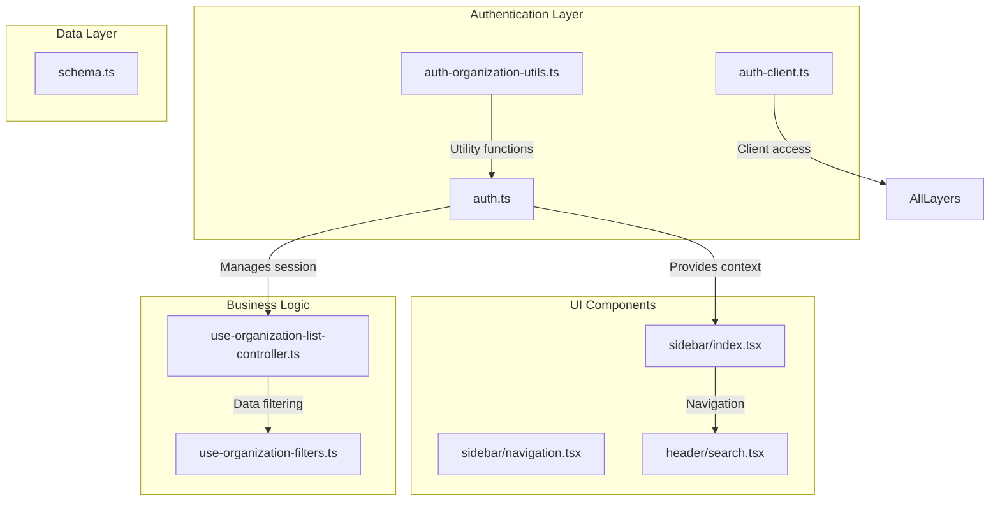
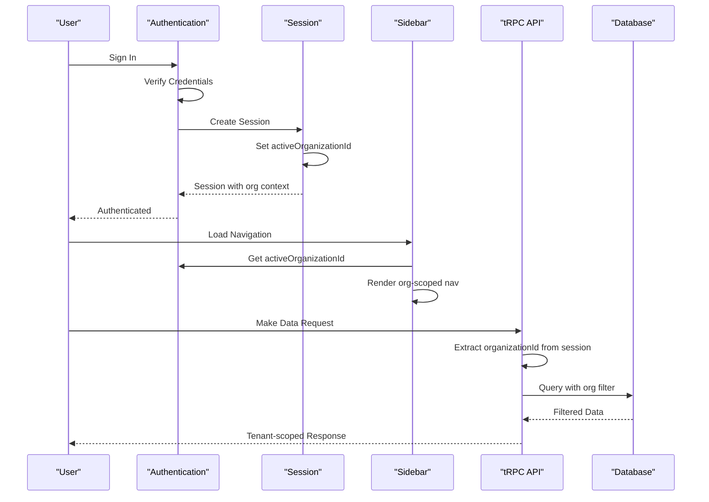
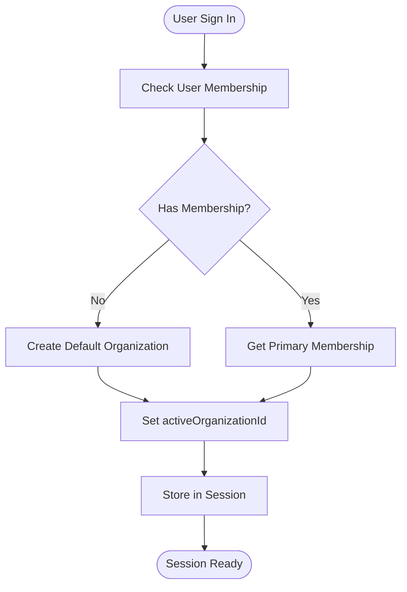
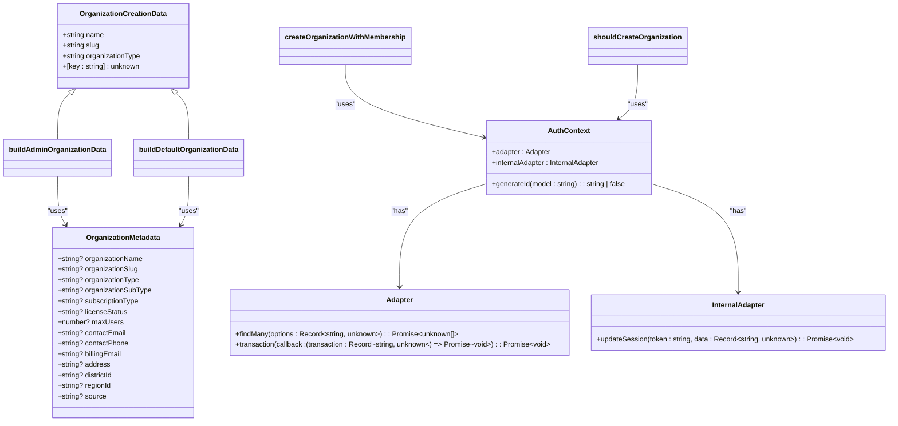
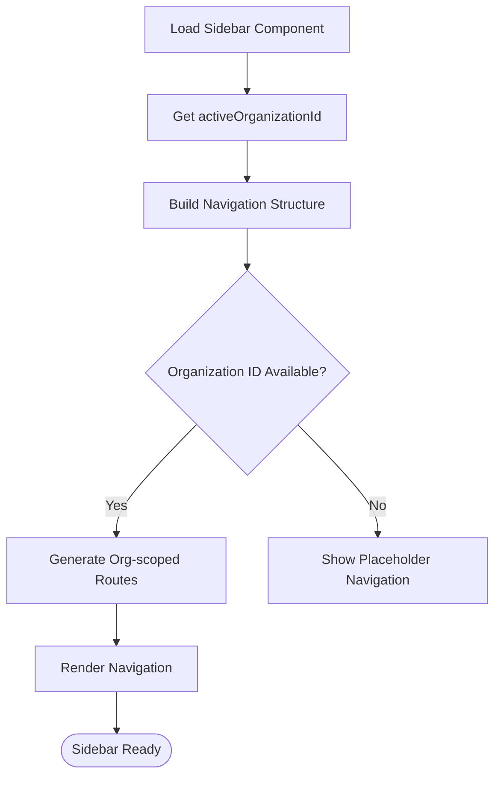
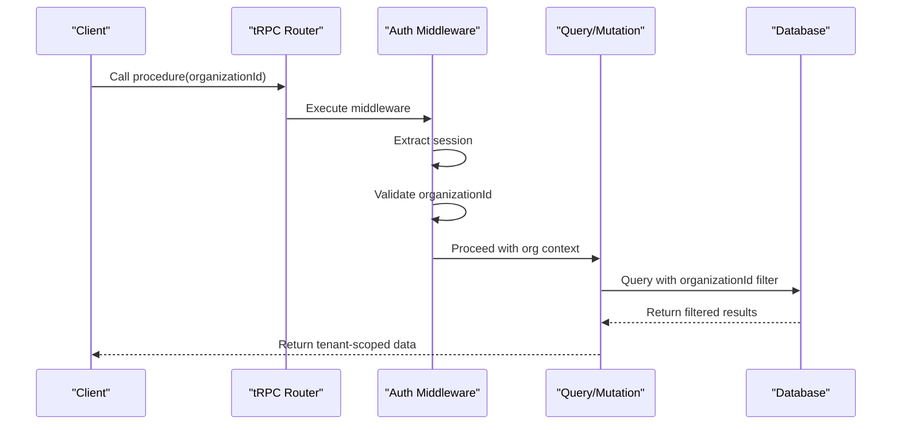
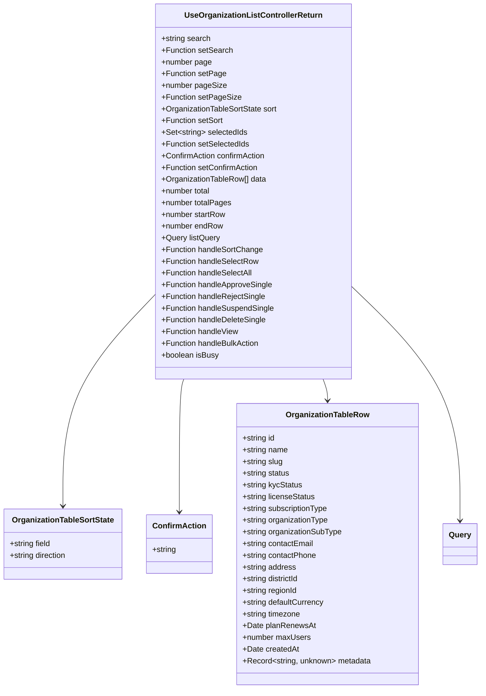
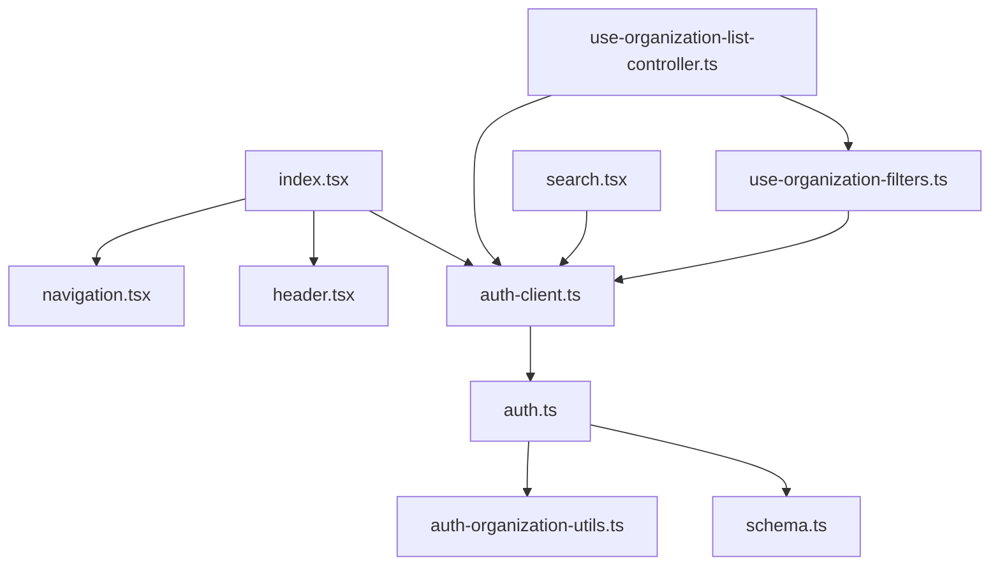

# Tenant Context Management

<cite>
**Referenced Files in This Document**   
- [auth.ts](file://src/lib/auth.ts)
- [auth-client.ts](file://src/lib/auth-client.ts)
- [auth-organization-utils.ts](file://src/lib/auth-organization-utils.ts)
- [use-organization-list-controller.ts](file://src/features/admin/organizations/hooks/use-organization-list-controller.ts)
- [use-organization-filters.ts](file://src/features/admin/organizations/hooks/use-organization-filters.ts)
- [sidebar/index.tsx](file://src/components/layout/sidebar/index.tsx)
- [sidebar/navigation.tsx](file://src/components/layout/sidebar/navigation.tsx)
- [search.tsx](file://src/components/layout/header/search.tsx)
- [schema.ts](file://src/server/db/schema.ts)
</cite>

## Table of Contents
1. [Introduction](#introduction)
2. [Project Structure](#project-structure)
3. [Core Components](#core-components)
4. [Architecture Overview](#architecture-overview)
5. [Detailed Component Analysis](#detailed-component-analysis)
6. [Dependency Analysis](#dependency-analysis)
7. [Performance Considerations](#performance-considerations)
8. [Troubleshooting Guide](#troubleshooting-guide)
9. [Conclusion](#conclusion)

## Introduction
This document provides comprehensive architectural documentation for tenant context management in the pukpara application. It details how the current organization context is established and maintained across the application using Better Auth's session mechanisms and custom auth clients. The document explains the role of layout components in rendering tenant-scoped navigation, how organization switching is handled, and how tRPC middlewares enforce tenant scoping on the server side. It also covers security considerations and implementation guidelines for respecting tenant boundaries.

## Project Structure
The tenant context management system is implemented across multiple layers of the application, with core logic residing in the `lib`, `features`, and `components` directories. The architecture follows a modular pattern with clear separation between authentication logic, UI components, and data access layers.



**Diagram sources**
- [auth.ts](file://src/lib/auth.ts)
- [auth-client.ts](file://src/lib/auth-client.ts)
- [auth-organization-utils.ts](file://src/lib/auth-organization-utils.ts)
- [sidebar/index.tsx](file://src/components/layout/sidebar/index.tsx)
- [sidebar/navigation.tsx](file://src/components/layout/sidebar/navigation.tsx)
- [search.tsx](file://src/components/layout/header/search.tsx)
- [use-organization-list-controller.ts](file://src/features/admin/organizations/hooks/use-organization-list-controller.ts)
- [use-organization-filters.ts](file://src/features/admin/organizations/hooks/use-organization-filters.ts)
- [schema.ts](file://src/server/db/schema.ts)

**Section sources**
- [auth.ts](file://src/lib/auth.ts)
- [auth-client.ts](file://src/lib/auth-client.ts)
- [auth-organization-utils.ts](file://src/lib/auth-organization-utils.ts)
- [sidebar/index.tsx](file://src/components/layout/sidebar/index.tsx)
- [sidebar/navigation.tsx](file://src/components/layout/sidebar/navigation.tsx)
- [search.tsx](file://src/components/layout/header/search.tsx)
- [use-organization-list-controller.ts](file://src/features/admin/organizations/hooks/use-organization-list-controller.ts)
- [use-organization-filters.ts](file://src/features/admin/organizations/hooks/use-organization-filters.ts)
- [schema.ts](file://src/server/db/schema.ts)

## Core Components
The tenant context management system consists of several core components that work together to establish and maintain the current organization context throughout the application. These include the authentication system, session management, sidebar navigation, and data filtering hooks.

**Section sources**
- [auth.ts](file://src/lib/auth.ts)
- [auth-client.ts](file://src/lib/auth-client.ts)
- [auth-organization-utils.ts](file://src/lib/auth-organization-utils.ts)
- [sidebar/index.tsx](file://src/components/layout/sidebar/index.tsx)
- [use-organization-list-controller.ts](file://src/features/admin/organizations/hooks/use-organization-list-controller.ts)
- [use-organization-filters.ts](file://src/features/admin/organizations/hooks/use-organization-filters.ts)

## Architecture Overview
The tenant context management architecture is built on Better Auth's organization plugin, which provides the foundation for multi-tenancy. The system establishes the current organization context during session creation and maintains it throughout the user's session. This context is then used to scope all data access and navigation.



**Diagram sources**
- [auth.ts](file://src/lib/auth.ts)
- [sidebar/index.tsx](file://src/components/layout/sidebar/index.tsx)
- [auth-client.ts](file://src/lib/auth-client.ts)

## Detailed Component Analysis

### Authentication and Session Management
The authentication system uses Better Auth to manage user sessions and establish the initial organization context. When a user signs in, the system checks their membership and sets the active organization in the session.



**Diagram sources**
- [auth.ts](file://src/lib/auth.ts#L98-L190)
- [auth-organization-utils.ts](file://src/lib/auth-organization-utils.ts)

#### Organization Creation Logic
When a new user signs up, the system determines whether to create an organization based on their membership status. Admin-created users receive organizations with specific metadata, while regular sign-ups receive default organizations.



**Diagram sources**
- [auth-organization-utils.ts](file://src/lib/auth-organization-utils.ts#L0-L216)
- [auth.ts](file://src/lib/auth.ts#L0-L304)

### Sidebar Navigation and Organization Switching
The sidebar components render tenant-scoped navigation based on the current organization context. The navigation structure is dynamically generated to reflect the active organization's capabilities and permissions.



**Diagram sources**
- [sidebar/index.tsx](file://src/components/layout/sidebar/index.tsx)
- [sidebar/navigation.tsx](file://src/components/layout/sidebar/navigation.tsx)
- [search.tsx](file://src/components/layout/header/search.tsx)

### tRPC Middleware and Server-side Tenant Scoping
The server-side implementation uses tRPC middlewares to inject the organizationId into all relevant queries and mutations, ensuring that data access is always scoped to the current tenant.



**Diagram sources**
- [auth.ts](file://src/lib/auth.ts)
- [trpc.ts](file://src/server/api/trpc.ts)

### Data Filtering and Organization Management
The organization management features use custom hooks to handle filtered data access based on tenant boundaries. These hooks provide the foundation for organization listing, filtering, and bulk operations.

#### use-organization-list-controller Hook
This hook manages the state and logic for the organization list view, including pagination, sorting, and bulk actions.



**Diagram sources**
- [use-organization-list-controller.ts](file://src/features/admin/organizations/hooks/use-organization-list-controller.ts)

#### use-organization-filters Hook
This hook manages the state for organization filtering, including status, type, KYC, license, subscription, region, district, and date range filters.

```mermaid
classDiagram
class UseOrganizationFiltersReturn {
+string[] statusFilters
+string[] typeFilters
+string[] kycFilters
+string[] licenseFilters
+string[] subscriptionFilters
+string[] regionFilters
+string[] districtFilters
+DateRange createdRange
+Function toggleStatus
+Function toggleType
+Function toggleKyc
+Function toggleLicense
+Function toggleSubscription
+Function toggleRegion
+Function toggleDistrict
+Function updateCreatedRange
+Function resetFilters
+Function removeFilterChip
+{key : string, label : string}[] activeFilterChips
}
class DateRange {
+Date? from
+Date? to
}
class FilterCollections {
+{key : string, values : string[], setter : Function}[]
}
UseOrganizationFiltersReturn --> DateRange
UseOrganizationFiltersReturn --> FilterCollections
```

**Diagram sources**
- [use-organization-filters.ts](file://src/features/admin/organizations/hooks/use-organization-filters.ts)

**Section sources**
- [use-organization-list-controller.ts](file://src/features/admin/organizations/hooks/use-organization-list-controller.ts)
- [use-organization-filters.ts](file://src/features/admin/organizations/hooks/use-organization-filters.ts)

## Dependency Analysis
The tenant context management system has a well-defined dependency structure that ensures proper isolation and modularity.



**Diagram sources**
- [auth.ts](file://src/lib/auth.ts)
- [auth-client.ts](file://src/lib/auth-client.ts)
- [auth-organization-utils.ts](file://src/lib/auth-organization-utils.ts)
- [sidebar/index.tsx](file://src/components/layout/sidebar/index.tsx)
- [sidebar/navigation.tsx](file://src/components/layout/sidebar/navigation.tsx)
- [search.tsx](file://src/components/layout/header/search.tsx)
- [use-organization-list-controller.ts](file://src/features/admin/organizations/hooks/use-organization-list-controller.ts)
- [use-organization-filters.ts](file://src/features/admin/organizations/hooks/use-organization-filters.ts)
- [schema.ts](file://src/server/db/schema.ts)

**Section sources**
- [auth.ts](file://src/lib/auth.ts)
- [auth-client.ts](file://src/lib/auth-client.ts)
- [auth-organization-utils.ts](file://src/lib/auth-organization-utils.ts)
- [sidebar/index.tsx](file://src/components/layout/sidebar/index.tsx)
- [sidebar/navigation.tsx](file://src/components/layout/sidebar/navigation.tsx)
- [search.tsx](file://src/components/layout/header/search.tsx)
- [use-organization-list-controller.ts](file://src/features/admin/organizations/hooks/use-organization-list-controller.ts)
- [use-organization-filters.ts](file://src/features/admin/organizations/hooks/use-organization-filters.ts)
- [schema.ts](file://src/server/db/schema.ts)

## Performance Considerations
The tenant context management system is designed with performance in mind, using efficient data access patterns and client-side filtering where appropriate.

- **Session Initialization**: The active organization is set during session creation, minimizing runtime lookups
- **Client-side Filtering**: Organization lists use client-side filtering after initial server fetch to reduce database queries
- **Caching**: The authentication client likely implements caching for session data to reduce network requests
- **Batch Operations**: Bulk actions are implemented to minimize the number of API calls for multiple operations

**Section sources**
- [auth.ts](file://src/lib/auth.ts)
- [use-organization-list-controller.ts](file://src/features/admin/organizations/hooks/use-organization-list-controller.ts)
- [use-organization-filters.ts](file://src/features/admin/organizations/hooks/use-organization-filters.ts)

## Troubleshooting Guide
When implementing or debugging tenant context management features, consider the following common issues and solutions:

**Section sources**
- [auth.ts](file://src/lib/auth.ts)
- [auth-client.ts](file://src/lib/auth-client.ts)
- [auth-organization-utils.ts](file://src/lib/auth-organization-utils.ts)
- [use-organization-list-controller.ts](file://src/features/admin/organizations/hooks/use-organization-list-controller.ts)
- [use-organization-filters.ts](file://src/features/admin/organizations/hooks/use-organization-filters.ts)

### Security Considerations
The system addresses several security concerns related to tenant context management:

- **Context Leakage**: The active organization ID is stored in the session and validated on each request to prevent unauthorized access
- **Race Conditions**: Organization switching is handled through the authentication system's session management, which provides atomic updates
- **Session Invalidation**: Sessions are properly invalidated when users sign out or when their access is revoked
- **Data Isolation**: All database queries are scoped to the current organization ID, preventing cross-tenant data access

**Section sources**
- [auth.ts](file://src/lib/auth.ts)
- [schema.ts](file://src/server/db/schema.ts)

### Implementation Guidelines
When implementing new features that need to respect the active tenant context:

1. **Always use the authentication client** to access the current session and organization context
2. **Include organizationId in all relevant queries and mutations** to ensure proper scoping
3. **Validate organization membership** before performing any organization-specific operations
4. **Use the existing hooks** (like use-organization-list-controller) when implementing organization management features
5. **Ensure sidebar navigation** reflects the current organization's capabilities and permissions
6. **Implement proper error handling** for cases where the organization context is missing or invalid

**Section sources**
- [auth-client.ts](file://src/lib/auth-client.ts)
- [use-organization-list-controller.ts](file://src/features/admin/organizations/hooks/use-organization-list-controller.ts)
- [use-organization-filters.ts](file://src/features/admin/organizations/hooks/use-organization-filters.ts)

## Conclusion
The tenant context management system in pukpara provides a robust foundation for multi-tenancy, leveraging Better Auth's organization plugin to establish and maintain the current organization context across the application. The system effectively combines client-side navigation, server-side data scoping, and comprehensive filtering to deliver a seamless experience for managing multiple organizations. By following the established patterns and guidelines, new features can be implemented with proper tenant isolation and security.