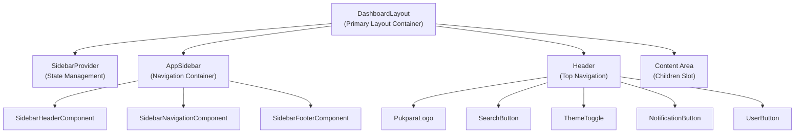
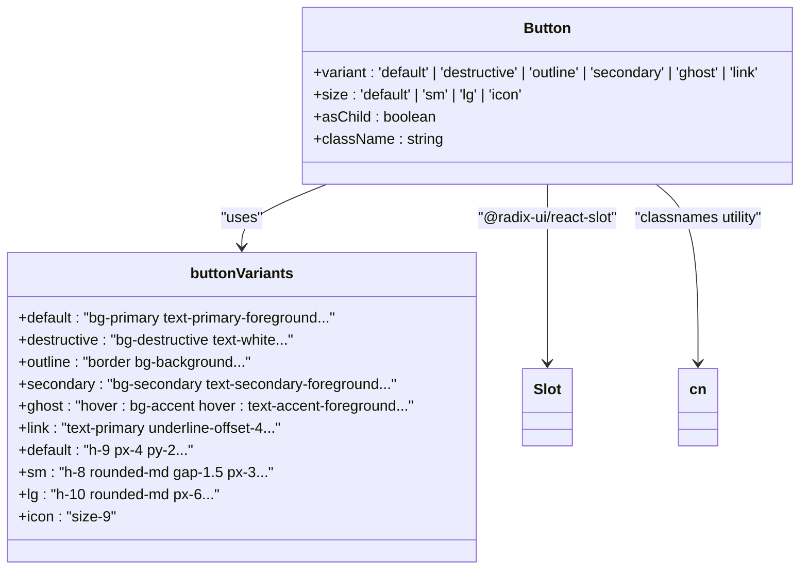
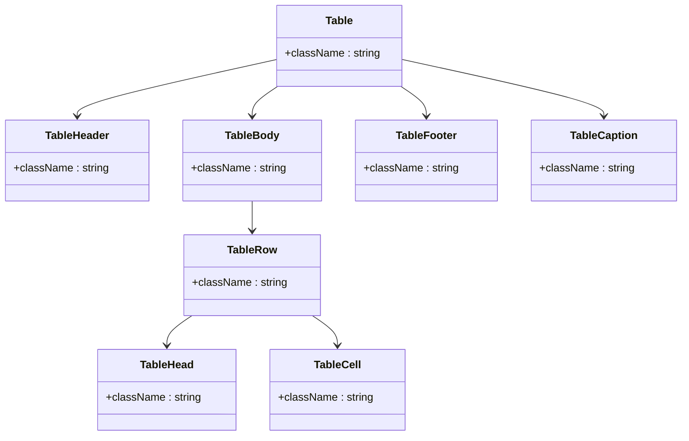
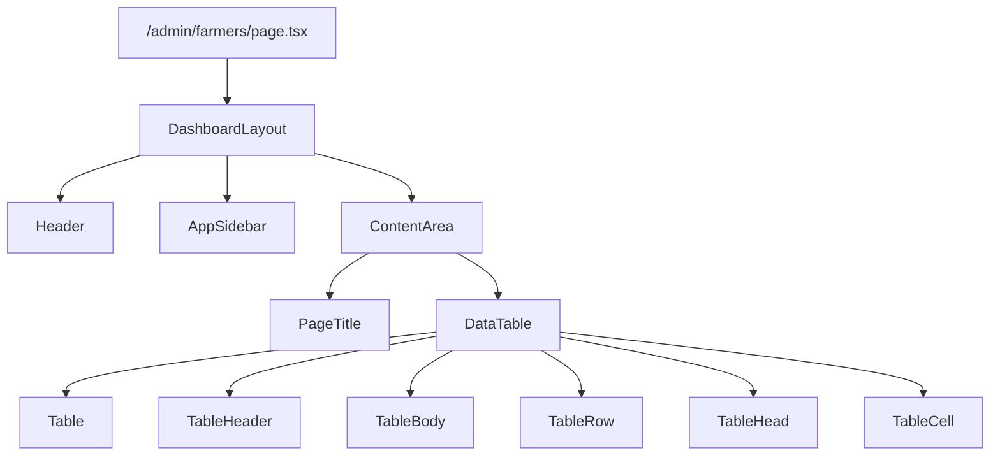
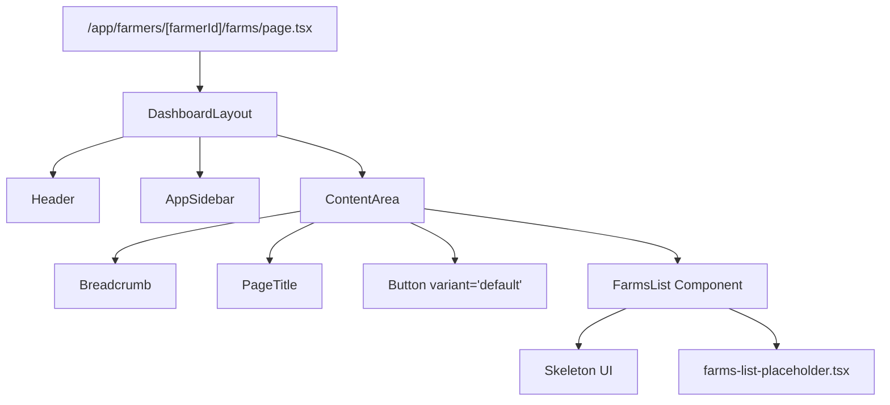

# Component Architecture

<cite>
**Referenced Files in This Document**   
- [dashboard-layout.tsx](file://src/components/layout/dashboard-layout.tsx)
- [header/index.tsx](file://src/components/layout/header/index.tsx)
- [sidebar/index.tsx](file://src/components/layout/sidebar/index.tsx)
- [sidebar/navigation.tsx](file://src/components/layout/sidebar/navigation.tsx)
- [theme-provider.tsx](file://src/components/providers/theme-provider.tsx)
- [button.tsx](file://src/components/ui/button.tsx)
- [table.tsx](file://src/components/ui/table.tsx)
- [layout.tsx](file://src/app/(admin)/admin/layout.tsx)
- [page.tsx](file://src/app/(app)/farmers/[farmerId]/farms/page.tsx)
</cite>

## Table of Contents
1. [Introduction](#introduction)
2. [Atomic Design Principles](#atomic-design-principles)
3. [Layout Components](#layout-components)
4. [UI Primitives Implementation](#ui-primitives-implementation)
5. [Component Composition Examples](#component-composition-examples)
6. [Accessibility and Responsive Behavior](#accessibility-and-responsive-behavior)
7. [Theming System Integration](#theming-system-integration)
8. [Authentication and Routing Integration](#authentication-and-routing-integration)
9. [Conclusion](#conclusion)

## Introduction
The frontend architecture of pukpara follows atomic design principles to create a scalable and maintainable component system. This documentation details how layout, composite, and primitive components are organized and interact within the application. The system leverages Radix UI for accessible base components and Tailwind CSS for styling, while integrating with Next.js routing and authentication state management.

## Atomic Design Principles
pukpara's frontend implements a three-tier atomic design system that categorizes components into distinct levels of abstraction:

- **Primitive Components**: Foundational UI elements like buttons, inputs, and tables that have no dependencies on other components
- **Composite Components**: Reusable groups of primitives that form meaningful units (e.g., data tables, form groups)
- **Layout Components**: Structural containers that organize page content and maintain consistent application chrome

This hierarchical approach ensures consistency, improves reusability, and simplifies maintenance across the application.

**Section sources**
- [src/components/ui](file://src/components/ui)
- [src/components/layout](file://src/components/layout)

## Layout Components
The layout system in pukpara provides a consistent structure across application views while supporting role-based navigation patterns.

### Dashboard Layout
The `DashboardLayout` component serves as the primary container for authenticated views, providing a responsive scaffold that includes sidebar navigation and header controls.



**Diagram sources**
- [dashboard-layout.tsx](file://src/components/layout/dashboard-layout.tsx#L1-L38)
- [header/index.tsx](file://src/components/layout/header/index.tsx#L1-L47)
- [sidebar/index.tsx](file://src/components/layout/sidebar/index.tsx#L1-L28)

### Navigation Structure
The sidebar navigation system dynamically renders menu groups based on user role and permissions, with active state highlighting based on the current route.

```mermaid
classDiagram
class SidebarNavGroup {
+title : string
+items : SidebarNavItem[]
}
class SidebarNavItem {
+title : string
+href : string
+icon : IconName
+description? : string
}
class SidebarNavigationComponent {
+groups : SidebarNavGroup[]
}
SidebarNavigationComponent --> SidebarNavGroup : "renders"
SidebarNavGroup --> SidebarNavItem : "contains"
SidebarNavItem --> "lucide-react".Icon : "uses"
```

**Diagram sources**
- [sidebar/navigation.tsx](file://src/components/layout/sidebar/navigation.tsx#L1-L73)

**Section sources**
- [dashboard-layout.tsx](file://src/components/layout/dashboard-layout.tsx#L1-L38)
- [sidebar/index.tsx](file://src/components/layout/sidebar/index.tsx#L1-L28)
- [sidebar/navigation.tsx](file://src/components/layout/sidebar/navigation.tsx#L1-L73)

## UI Primitives Implementation
Primitive components are implemented using Radix UI primitives enhanced with Tailwind CSS utilities for consistent styling.

### Button Component
The button primitive provides multiple variants and sizes while ensuring accessibility features are maintained.



**Diagram sources**
- [button.tsx](file://src/components/ui/button.tsx#L1-L59)

### Table Component
The table primitive implements a complete data display system with proper semantic HTML structure.



**Diagram sources**
- [table.tsx](file://src/components/ui/table.tsx#L1-L114)

**Section sources**
- [button.tsx](file://src/components/ui/button.tsx#L1-L59)
- [table.tsx](file://src/components/ui/table.tsx#L1-L114)

## Component Composition Examples
The atomic design system enables effective composition patterns across different application contexts.

### Admin Farmers Page
The `/admin/farmers` page demonstrates composition of layout, navigation, and data display components.



**Diagram sources**
- [dashboard-layout.tsx](file://src/components/layout/dashboard-layout.tsx#L1-L38)
- [src/app/(admin)/admin/farmers/page.tsx]

### Farmer Farms Page
The `/app/farmers/[farmerId]/farms` page shows dynamic routing integration with layout components.



**Diagram sources**
- [dashboard-layout.tsx](file://src/components/layout/dashboard-layout.tsx#L1-L38)
- [page.tsx](file://src/app/(app)/farmers/[farmerId]/farms/page.tsx)

**Section sources**
- [src/app/(admin)/admin/farmers/page.tsx]
- [page.tsx](file://src/app/(app)/farmers/[farmerId]/farms/page.tsx)

## Accessibility and Responsive Behavior
The component system prioritizes accessibility and responsive design across all levels.

### Responsive Layout System
The layout components adapt to different screen sizes using a mobile-first approach:

- On mobile devices, the sidebar is collapsible and accessible via hamburger menu
- Header elements reflow based on available screen width
- Data tables implement horizontal scrolling on small screens
- Button sizes and spacing adjust according to touch target requirements

### Accessibility Features
All components implement appropriate accessibility attributes:

- Proper ARIA roles and labels for interactive elements
- Keyboard navigation support for menu systems
- Focus management for modal dialogs
- Screen reader-friendly text alternatives
- Color contrast ratios that meet WCAG standards

**Section sources**
- [header/index.tsx](file://src/components/layout/header/index.tsx#L1-L47)
- [use-mobile.ts](file://src/hooks/use-mobile.ts)
- [button.tsx](file://src/components/ui/button.tsx#L1-L59)

## Theming System Integration
The theming system enables dynamic appearance changes while maintaining design consistency.

### Theme Provider Implementation
The `ThemeProvider` wraps the application and integrates with `next-themes` for theme persistence.

```mermaid
flowchart TD
App["Application Root"] --> ThemeProvider
ThemeProvider --> NextThemesProvider["next-themes Provider"]
NextThemesProvider --> ThemeStorage["localStorage"]
NextThemesProvider --> SystemPreference["prefers-color-scheme"]
Header --> ThemeToggle
ThemeToggle --> ThemeProvider : "triggers change"
```

**Diagram sources**
- [theme-provider.tsx](file://src/components/providers/theme-provider.tsx#L1-L11)

### Theme-Aware Components
UI components automatically adapt to the current theme using Tailwind's dark mode variants:

- Background and text colors switch between light and dark palettes
- Borders and shadows adjust for optimal visibility
- Interactive states maintain appropriate contrast
- Form elements preserve readability in both themes

**Section sources**
- [theme-provider.tsx](file://src/components/providers/theme-provider.tsx#L1-L11)
- [button.tsx](file://src/components/ui/button.tsx#L1-L59)
- [table.tsx](file://src/components/ui/table.tsx#L1-L114)

## Authentication and Routing Integration
Layout components interact with authentication state and dynamic routing to provide context-aware interfaces.

### Authentication State Handling
The header and sidebar components conditionally render based on authentication status:

- User profile information displays in the header when authenticated
- Navigation items are filtered according to user permissions
- Protected routes redirect unauthenticated users to sign-in
- Role-based access controls determine available features

### Dynamic Routing Integration
Components respond to route changes for enhanced user experience:

- Sidebar navigation highlights the active route
- Breadcrumb trails update based on route parameters
- Page titles incorporate dynamic segments
- Layout configurations adapt to route-specific requirements

**Section sources**
- [header/index.tsx](file://src/components/layout/header/index.tsx#L1-L47)
- [sidebar/navigation.tsx](file://src/components/layout/sidebar/navigation.tsx#L1-L73)
- [auth-client.ts](file://src/lib/auth-client.ts)
- [auth.ts](file://src/lib/auth.ts)

## Conclusion
pukpara's component architecture demonstrates a well-structured implementation of atomic design principles, combining Radix UI's accessible primitives with Tailwind CSS's utility-first styling approach. The three-tier system of layout, composite, and primitive components enables consistent, maintainable, and scalable UI development. By integrating with Next.js routing, authentication, and theming systems, the components provide a cohesive user experience across different application contexts while maintaining high accessibility standards and responsive behavior.