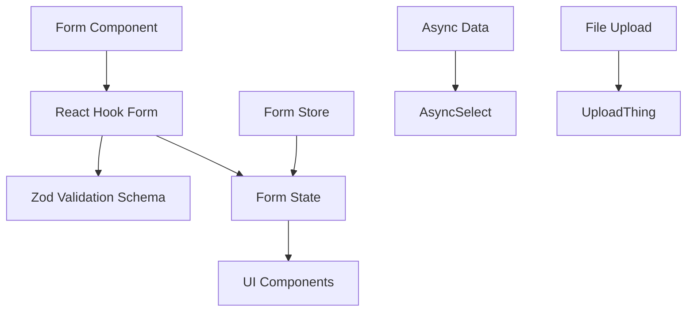

# Form Handling

<cite>
**Referenced Files in This Document**   
- [schema.ts](file://src/features/auth/schema.ts)
- [step-one-form.tsx](file://src/features/auth/components/sign-up/step-one-form.tsx)
- [step-two-form.tsx](file://src/features/auth/components/sign-up/step-two-form.tsx)
- [creation-mode-step.tsx](file://src/features/admin/organizations/components/organization-create/creation-mode-step.tsx)
- [existing-user-step.tsx](file://src/features/admin/organizations/components/organization-create/existing-user-step.tsx)
- [new-user-step.tsx](file://src/features/admin/organizations/components/organization-create/new-user-step.tsx)
- [organization-details-step.tsx](file://src/features/admin/organizations/components/organization-create/organization-details-step.tsx)
- [review-step.tsx](file://src/features/admin/organizations/components/organization-create/review-step.tsx)
- [form.tsx](file://src/components/ui/form.tsx)
- [input.tsx](file://src/components/ui/input.tsx)
- [phone-input.tsx](file://src/components/ui/phone-input.tsx)
- [async-select.tsx](file://src/components/ui/async-select.tsx)
- [uploadthing.ts](file://src/lib/uploadthing.ts)
</cite>

## Table of Contents
1. [Introduction](#introduction)
2. [Form Architecture Overview](#form-architecture-overview)
3. [Validation with Zod and React Hook Form](#validation-with-zod-and-react-hook-form)
4. [Multi-Step Form Implementation](#multi-step-form-implementation)
5. [State Persistence Between Steps](#state-persistence-between-steps)
6. [UI Component Integration](#ui-component-integration)
7. [Dynamic Form Behavior and Error Handling](#dynamic-form-behavior-and-error-handling)
8. [File Uploads with UploadThing](#file-uploads-with-uploadthing)
9. [Nested Data Structures and Complex Forms](#nested-data-structures-and-complex-forms)
10. [Accessibility and User Experience](#accessibility-and-user-experience)
11. [Common Issues and Best Practices](#common-issues-and-best-practices)

## Introduction
This document provides comprehensive documentation for form handling in the pukpara application. It details the implementation of forms using React Hook Form with Zod validation schemas, focusing on multi-step workflows such as user sign-up and organization creation. The documentation covers state management, validation strategies, integration with custom UI components, and best practices for handling complex form scenarios including file uploads and nested data structures.

## Form Architecture Overview
The form architecture in pukpara is built on React Hook Form for efficient state management and Zod for robust schema validation. Forms are structured to support both simple and complex use cases, including multi-step processes that require state persistence across navigation. The architecture emphasizes separation of concerns, with validation schemas defined independently from form components and state stored in dedicated stores for cross-component access.

**Diagram sources**
- [form.tsx](file://src/components/ui/form.tsx)
- [schema.ts](file://src/features/auth/schema.ts)

**Section sources**
- [step-one-form.tsx](file://src/features/auth/components/sign-up/step-one-form.tsx)
- [step-two-form.tsx](file://src/features/auth/components/sign-up/step-two-form.tsx)

## Validation with Zod and React Hook Form
Form validation in pukpara leverages Zod schemas integrated with React Hook Form via `zodResolver`. The `signUpSchema` defines all required fields with appropriate constraints, including email format validation, password length requirements, and mandatory fields. Step-specific schemas are derived using `.pick()` to include only relevant fields for each form step, ensuring focused validation.

Custom validation rules are implemented using `.refine()`, such as password confirmation matching. Error messages are localized within the schema definition, providing clear feedback to users. The resolver ensures type safety through `z.infer`, enabling strong typing across the form components.

**Section sources**
- [schema.ts](file://src/features/auth/schema.ts)
- [step-one-form.tsx](file://src/features/auth/components/sign-up/step-one-form.tsx)

## Multi-Step Form Implementation
The sign-up and organization creation workflows implement multi-step forms to improve user experience and reduce cognitive load. The sign-up process is divided into two steps: account creation (Step 1) and profile completion (Step 2). Each step renders a dedicated form component that collects a subset of the complete user data.

Organization creation follows a similar pattern with multiple steps including creation mode selection, user selection (existing or new), organization details entry, and final review. This stepwise approach allows for conditional rendering based on previous selections and progressive disclosure of form fields.

**Diagram sources**
- [step-one-form.tsx](file://src/features/auth/components/sign-up/step-one-form.tsx)
- [step-two-form.tsx](file://src/features/auth/components/sign-up/step-two-form.tsx)
- [creation-mode-step.tsx](file://src/features/admin/organizations/components/organization-create/creation-mode-step.tsx)
- [review-step.tsx](file://src/features/admin/organizations/components/organization-create/review-step.tsx)

**Section sources**
- [step-one-form.tsx](file://src/features/auth/components/sign-up/step-one-form.tsx)
- [step-two-form.tsx](file://src/features/auth/components/sign-up/step-two-form.tsx)
- [creation-mode-step.tsx](file://src/features/admin/organizations/components/organization-create/creation-mode-step.tsx)
- [review-step.tsx](file://src/features/admin/organizations/components/organization-create/review-step.tsx)

## State Persistence Between Steps
Form state persistence is achieved through a dedicated Zustand store (`signUpStore`). This store maintains form data across navigation between steps, allowing users to move forward and backward without losing entered information. The store is hydrated on component mount, and form values are synchronized with the store on submission of each step.

The `useEffect` hook ensures form reset when store data changes, maintaining consistency between UI and state. For organization creation, similar state management patterns are employed to preserve data across multiple steps, including user selections and organization details.

**Section sources**
- [sign-up-store.ts](file://src/features/auth/store/sign-up-store.ts)
- [step-one-form.tsx](file://src/features/auth/components/sign-up/step-one-form.tsx)
- [step-two-form.tsx](file://src/features/auth/components/sign-up/step-two-form.tsx)

## UI Component Integration
Custom UI components are seamlessly integrated with React Hook Form through the `FormField`, `FormItem`, `FormControl`, `FormLabel`, and `FormMessage` wrapper components. These wrappers provide consistent styling and error handling across all form inputs.

Specialized components include:
- **Input**: Standard text inputs with autocomplete attributes for better UX
- **PhoneInput**: Country-aware phone number input with default country (GH)
- **AsyncSelect**: Asynchronous searchable dropdown for district selection
- **Button**: Form submission with loading states

The `AsyncSelect` component fetches district data via tRPC queries and supports search filtering, enhancing usability for large datasets.

**Section sources**
- [form.tsx](file://src/components/ui/form.tsx)
- [input.tsx](file://src/components/ui/input.tsx)
- [phone-input.tsx](file://src/components/ui/phone-input.tsx)
- [async-select.tsx](file://src/components/ui/async-select.tsx)
- [step-two-form.tsx](file://src/features/auth/components/sign-up/step-two-form.tsx)

## Dynamic Form Behavior and Error Handling
Forms implement dynamic behavior including real-time validation on blur (`mode: "onBlur"`), loading states during async operations, and conditional rendering based on form state. Error handling is comprehensive, with both field-level validation errors and form-level error messages displayed prominently.

The sign-up form includes sophisticated error parsing for database constraints, translating technical error codes into user-friendly messages (e.g., phone number uniqueness violations). Form errors are displayed using Alert components, while field errors use the standardized `FormMessage` component.

**Diagram sources**
- [step-two-form.tsx](file://src/features/auth/components/sign-up/step-two-form.tsx)
- [form.tsx](file://src/components/ui/form.tsx)

**Section sources**
- [step-two-form.tsx](file://src/features/auth/components/sign-up/step-two-form.tsx)

## File Uploads with UploadThing
While not directly implemented in the analyzed sign-up forms, file upload functionality is available through UploadThing integration. The `uploadthing.ts` library provides utilities for handling file uploads within forms, allowing for the attachment of documents, images, or other files as part of form submissions.

Best practices for file uploads include:
- Using dedicated form fields for file inputs
- Implementing upload progress indicators
- Validating file types and sizes before upload
- Handling upload errors gracefully
- Storing upload results in form state

**Section sources**
- [uploadthing.ts](file://src/lib/uploadthing.ts)

## Nested Data Structures and Complex Forms
The form system supports complex nested data structures through Zod's object composition capabilities. While the sign-up form primarily handles flat data, the organization creation workflow demonstrates handling of more complex relationships, such as connecting users to organizations and managing organizational metadata.

For deeply nested forms, the architecture supports:
- Nested field arrays
- Conditional field groups
- Cross-field validation
- Dynamic field addition/removal
- Section-based validation

These patterns enable the creation of sophisticated forms while maintaining data integrity and user experience.

**Section sources**
- [organization-details-step.tsx](file://src/features/admin/organizations/components/organization-create/organization-details-step.tsx)
- [schema.ts](file://src/features/auth/schema.ts)

## Accessibility and User Experience
Forms in pukpara prioritize accessibility with proper labeling, semantic HTML, and ARIA attributes. Input fields include appropriate `autocomplete` attributes to assist browsers and password managers. The tab order follows logical form progression, and error messages are announced by screen readers.

User experience is enhanced through:
- Clear step indicators (e.g., "Step 1 of 2")
- Descriptive labels and placeholders
- Loading states during async operations
- Success feedback via toast notifications
- Easy navigation between form steps
- Terms of service acknowledgment with visible links

**Section sources**
- [step-one-form.tsx](file://src/features/auth/components/sign-up/step-one-form.tsx)
- [step-two-form.tsx](file://src/features/auth/components/sign-up/step-two-form.tsx)

## Common Issues and Best Practices
Common form issues and their solutions include:

**Validation Edge Cases:**
- Password confirmation matching handled with `.refine()`
- Database constraint errors translated to user-friendly messages
- Async validation for unique fields (email, phone) handled at API level

**Performance Optimization:**
- Memoization of form defaults with `useMemo`
- Efficient re-renders through React Hook Form's selective subscription
- Debounced search in AsyncSelect to reduce API calls

**Best Practices:**
- Separate validation schemas from components
- Use form-level stores for multi-step persistence
- Implement proper error boundaries
- Provide clear success/error feedback
- Support keyboard navigation
- Test with real user data and edge cases

**Section sources**
- [schema.ts](file://src/features/auth/schema.ts)
- [step-one-form.tsx](file://src/features/auth/components/sign-up/step-one-form.tsx)
- [step-two-form.tsx](file://src/features/auth/components/sign-up/step-two-form.tsx)
- [use-debounce.ts](file://src/hooks/use-debounce.ts)