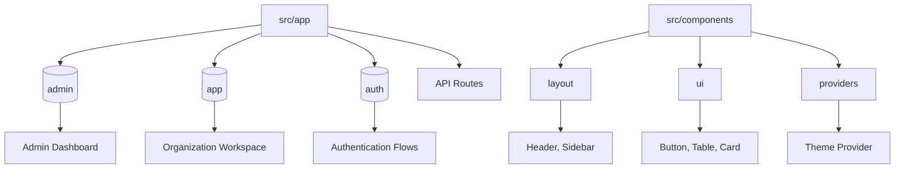
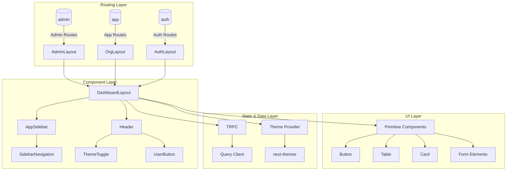
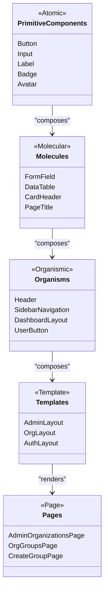
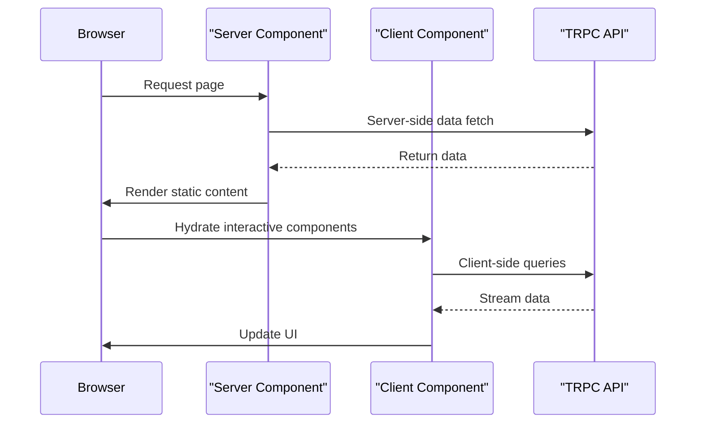
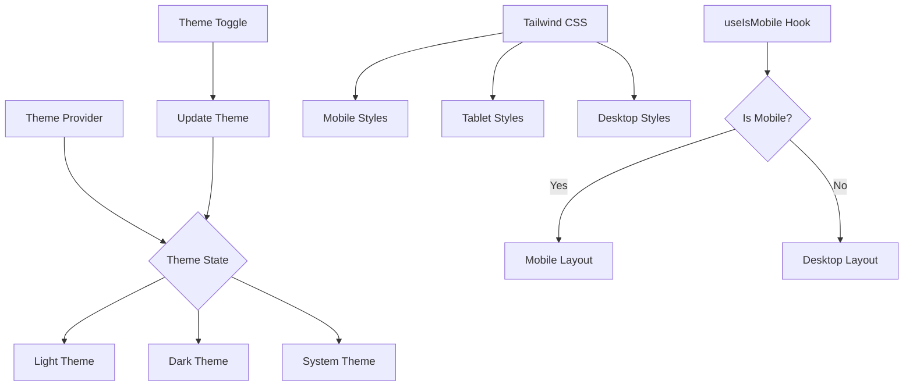
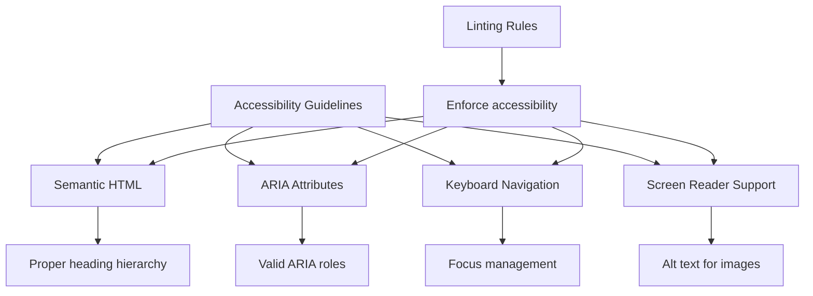
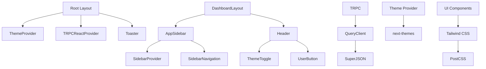

# Frontend Architecture

<cite>
**Referenced Files in This Document**   
- [layout.tsx](file://src/app/layout.tsx)
- [dashboard-layout.tsx](file://src/components/layout/dashboard-layout.tsx)
- [header/index.tsx](file://src/components/layout/header/index.tsx)
- [sidebar/index.tsx](file://src/components/layout/sidebar/index.tsx)
- [theme-provider.tsx](file://src/components/providers/theme-provider.tsx)
- [theme-toggle.tsx](file://src/components/layout/header/theme-toggle.tsx)
- [button.tsx](file://src/components/ui/button.tsx)
- [table.tsx](file://src/components/ui/table.tsx)
- [sidebar.tsx](file://src/components/ui/sidebar.tsx)
- [card.tsx](file://src/components/ui/card.tsx)
- [trpc/server.ts](file://src/trpc/server.ts)
- [trpc/react.tsx](file://src/trpc/react.tsx)
- [query-client.ts](file://src/trpc/query-client.ts)
- [api/trpc/[trpc]/route.ts](file://src/app/api/trpc/[trpc]/route.ts)
- [(admin)/admin/layout.tsx](file://src/app/(admin)/admin/layout.tsx)
- [(app)/layout.tsx](file://src/app/(app)/layout.tsx)
- [(auth)/layout.tsx](file://src/app/(auth)/layout.tsx)
- [groups-list-placeholder.tsx](file://src/features/groups/components/groups-list-placeholder.tsx)
- [PageTitle.tsx](file://src/components/ui/page-title.tsx)
</cite>

## Table of Contents
1. [Introduction](#introduction)
2. [Project Structure](#project-structure)
3. [Core Components](#core-components)
4. [Architecture Overview](#architecture-overview)
5. [Detailed Component Analysis](#detailed-component-analysis)
6. [Dependency Analysis](#dependency-analysis)
7. [Performance Considerations](#performance-considerations)
8. [Troubleshooting Guide](#troubleshooting-guide)
9. [Conclusion](#conclusion)

## Introduction
This document provides comprehensive architectural documentation for the frontend of the Pukpara platform. It details the implementation of Next.js App Router with route groups, component architecture based on atomic design principles, React Server Components usage, theme management, responsive design, and accessibility implementation.

## Project Structure



**Diagram sources**
- [layout.tsx](file://src/app/layout.tsx)
- [dashboard-layout.tsx](file://src/components/layout/dashboard-layout.tsx)

**Section sources**
- [layout.tsx](file://src/app/layout.tsx)
- [dashboard-layout.tsx](file://src/components/layout/dashboard-layout.tsx)

## Core Components

The frontend architecture is built around several core components that implement atomic design principles. Layout components such as header and sidebar provide consistent UI structure, while primitive UI components like button, form, and table serve as reusable building blocks across the application.

**Section sources**
- [header/index.tsx](file://src/components/layout/header/index.tsx)
- [sidebar/index.tsx](file://src/components/layout/sidebar/index.tsx)
- [button.tsx](file://src/components/ui/button.tsx)
- [table.tsx](file://src/components/ui/table.tsx)

## Architecture Overview



**Diagram sources**
- [(admin)/admin/layout.tsx](file://src/app/(admin)/admin/layout.tsx)
- [(app)/layout.tsx](file://src/app/(app)/layout.tsx)
- [(auth)/layout.tsx](file://src/app/(auth)/layout.tsx)
- [dashboard-layout.tsx](file://src/components/layout/dashboard-layout.tsx)
- [theme-provider.tsx](file://src/components/providers/theme-provider.tsx)

## Detailed Component Analysis

### Route Groups Implementation

The application implements Next.js route groups using three main groups: (admin), (app), and (auth). These groups organize routes by functionality while keeping them at the same level in the URL path.

```mermaid
graph TD
A[src/app] --> B[(admin)]
A --> C[(app)]
A --> D[(auth)]
B --> E[/admin/*]
C --> F[/app/*]
D --> G[/sign-in, /sign-up]
H[Root Layout] --> I[Route Group Detection]
I --> J{Route Group}
J --> |admin| K[AdminLayout]
J --> |app| L[OrgLayout]
J --> |auth| M[AuthLayout]
```

**Diagram sources**
- [(admin)/admin/layout.tsx](file://src/app/(admin)/admin/layout.tsx)
- [(app)/layout.tsx](file://src/app/(app)/layout.tsx)
- [(auth)/layout.tsx](file://src/app/(auth)/layout.tsx)

**Section sources**
- [(admin)/admin/layout.tsx](file://src/app/(admin)/admin/layout.tsx#L1-L47)
- [(app)/layout.tsx](file://src/app/(app)/layout.tsx#L1-L60)
- [(auth)/layout.tsx](file://src/app/(auth)/layout.tsx#L1-L8)

### Component Architecture with Atomic Design

The component architecture follows atomic design principles, organizing components into a hierarchical structure from primitive elements to complex layouts.



**Diagram sources**
- [button.tsx](file://src/components/ui/button.tsx)
- [table.tsx](file://src/components/ui/table.tsx)
- [card.tsx](file://src/components/ui/card.tsx)
- [header/index.tsx](file://src/components/layout/header/index.tsx)
- [sidebar/index.tsx](file://src/components/layout/sidebar/index.tsx)
- [dashboard-layout.tsx](file://src/components/layout/dashboard-layout.tsx)

**Section sources**
- [button.tsx](file://src/components/ui/button.tsx#L1-L60)
- [table.tsx](file://src/components/ui/table.tsx#L1-L120)
- [card.tsx](file://src/components/ui/card.tsx#L1-L70)
- [header/index.tsx](file://src/components/layout/header/index.tsx#L1-L50)
- [sidebar/index.tsx](file://src/components/layout/sidebar/index.tsx#L1-L30)

### React Server Components and Data Fetching

The application leverages React Server Components for initial data loading and rendering, with client components used for interactive elements. TRPC is used for type-safe API communication.



**Diagram sources**
- [trpc/server.ts](file://src/trpc/server.ts)
- [trpc/react.tsx](file://src/trpc/react.tsx)
- [api/trpc/[trpc]/route.ts](file://src/app/api/trpc/[trpc]/route.ts)

**Section sources**
- [trpc/server.ts](file://src/trpc/server.ts#L1-L30)
- [trpc/react.tsx](file://src/trpc/react.tsx#L1-L45)
- [query-client.ts](file://src/trpc/query-client.ts#L1-L25)

### Theme Management and Responsive Design

Theme management is implemented using next-themes, providing light, dark, and system theme options. The application uses Tailwind CSS for responsive design across device sizes.



**Diagram sources**
- [theme-provider.tsx](file://src/components/providers/theme-provider.tsx)
- [theme-toggle.tsx](file://src/components/layout/header/theme-toggle.tsx)
- [use-mobile.ts](file://src/hooks/use-mobile.ts)

**Section sources**
- [theme-provider.tsx](file://src/components/providers/theme-provider.tsx#L1-L12)
- [theme-toggle.tsx](file://src/components/layout/header/theme-toggle.tsx#L1-L70)
- [use-mobile.ts](file://src/hooks/use-mobile.ts#L1-L5)

### Accessibility Implementation

The application follows accessibility best practices as documented in AGENTS.md, ensuring compliance with WCAG guidelines through proper ARIA usage, semantic HTML, and keyboard navigation support.



**Diagram sources**
- [AGENTS.md](file://AGENTS.md)
- [button.tsx](file://src/components/ui/button.tsx)
- [sidebar.tsx](file://src/components/ui/sidebar.tsx)

**Section sources**
- [AGENTS.md](file://AGENTS.md#L18-L53)
- [button.tsx](file://src/components/ui/button.tsx#L37-L58)
- [sidebar.tsx](file://src/components/ui/sidebar.tsx#L306-L473)

## Dependency Analysis



**Diagram sources**
- [layout.tsx](file://src/app/layout.tsx)
- [dashboard-layout.tsx](file://src/components/layout/dashboard-layout.tsx)
- [trpc/react.tsx](file://src/trpc/react.tsx)
- [theme-provider.tsx](file://src/components/providers/theme-provider.tsx)
- [postcss.config.mjs](file://postcss.config.mjs)

**Section sources**
- [layout.tsx](file://src/app/layout.tsx#L1-L50)
- [trpc/react.tsx](file://src/trpc/react.tsx#L1-L45)
- [postcss.config.mjs](file://postcss.config.mjs#L1-L5)

## Performance Considerations

The application implements several performance optimizations including server-side rendering, code splitting via route groups, and efficient data fetching patterns. React Server Components reduce client-side JavaScript payload by moving rendering to the server. The TRPC integration with query de-duplication and caching minimizes unnecessary network requests.

## Troubleshooting Guide

Common issues in the frontend architecture typically relate to theme hydration, server-client component boundaries, and data fetching patterns. Ensure that client components are properly marked with 'use client' directive and that server components do not import client-side only APIs. For theme issues, verify that ThemeProvider is properly wrapped in the root layout. Data fetching problems can often be resolved by checking TRPC query configuration and ensuring proper error boundaries are implemented.

**Section sources**
- [trpc/server.ts](file://src/trpc/server.ts#L1-L30)
- [trpc/react.tsx](file://src/trpc/react.tsx#L1-L45)
- [theme-provider.tsx](file://src/components/providers/theme-provider.tsx#L1-L12)

## Conclusion

The Pukpara frontend architecture demonstrates a modern Next.js implementation with well-organized route groups, atomic design principles, and effective use of React Server Components. The combination of Next.js App Router, TRPC for type-safe APIs, next-themes for theme management, and Tailwind CSS for styling creates a robust foundation for the application. The architecture supports scalability through clear component hierarchies and separation of concerns between server and client components.