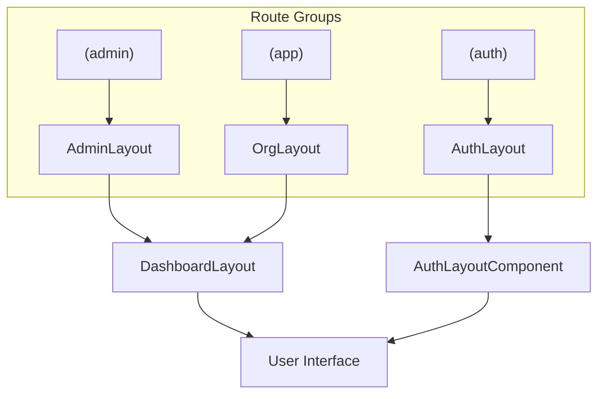
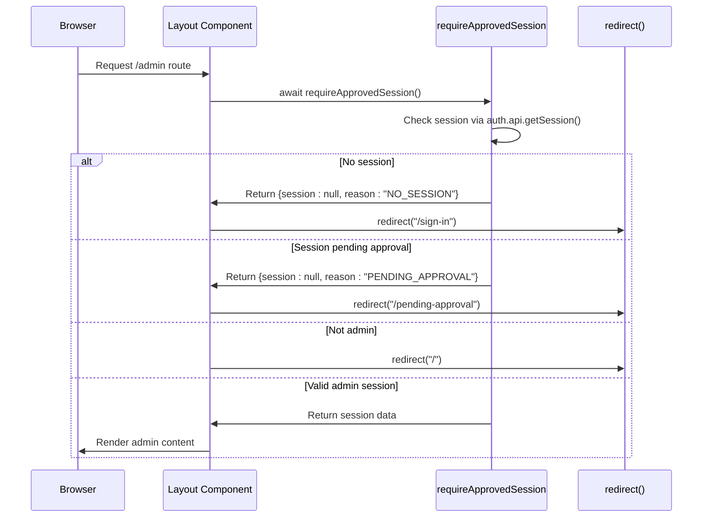
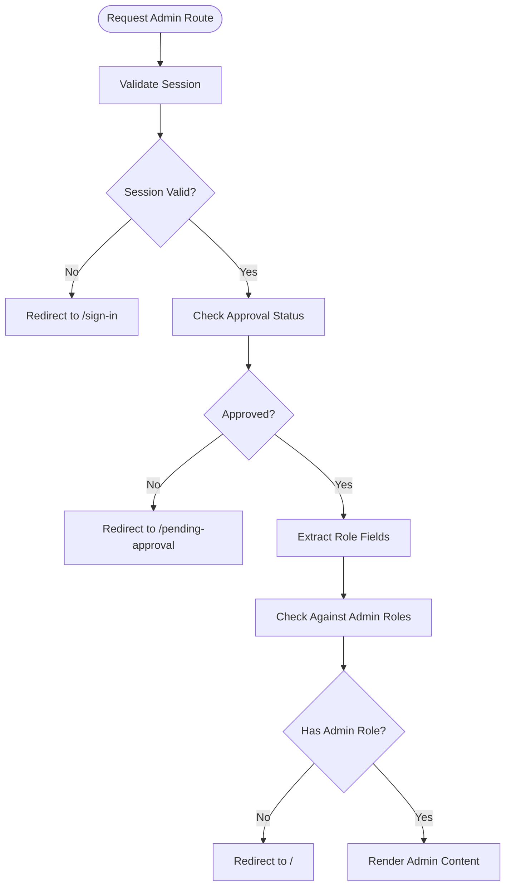

# Routing & Navigation

<cite>
**Referenced Files in This Document**   
- [AdminLayout.tsx](file://src/app/(admin)/admin/layout.tsx)
- [OrgLayout.tsx](file://src/app/(app)/layout.tsx)
- [AuthLayout.tsx](file://src/app/(auth)/layout.tsx)
- [navigation.tsx](file://src/components/layout/sidebar/navigation.tsx)
- [auth-server.ts](file://src/lib/auth-server.ts)
- [page.tsx](file://src/app/(admin)/admin/page.tsx)
- [farmer-profile.tsx](file://src/app/(app)/farmers/[farmerId]/page.tsx)
</cite>

## Table of Contents
1. [Introduction](#introduction)
2. [Route Groups and URL Structure](#route-groups-and-url-structure)
3. [Layout Isolation and Shared Layouts](#layout-isolation-and-shared-layouts)
4. [Access Control and Authentication Integration](#access-control-and-authentication-integration)
5. [Client-Side Navigation and State Management](#client-side-navigation-and-state-management)
6. [Protected Routes and Role-Based Access](#protected-routes-and-role-based-access)
7. [Dynamic Route Parameters](#dynamic-route-parameters)
8. [Adding New Routes](#adding-new-routes)
9. [Route Transitions and Navigation Patterns](#route-transitions-and-navigation-patterns)
10. [Sidebar Navigation and Role-Based Filtering](#sidebar-navigation-and-role-based-filtering)

## Introduction
This document provides comprehensive documentation for the routing and navigation system in the pukpara application, built using the Next.js App Router. It details the implementation of route groups, nested layouts, access control mechanisms, and client-side navigation patterns. The system is structured around three primary route groups: `(admin)`, `(app)`, and `(auth)`, each serving distinct user roles and functional domains.

**Section sources**
- [AdminLayout.tsx](file://src/app/(admin)/admin/layout.tsx)
- [OrgLayout.tsx](file://src/app/(app)/layout.tsx)
- [AuthLayout.tsx](file://src/app/(auth)/layout.tsx)

## Route Groups and URL Structure
The application uses Next.js route groups to organize routes by functional domain without affecting the URL structure. The three main route groups are:

- `(admin)` - Admin portal routes accessible only to platform administrators
- `(app)` - User-facing application routes scoped to specific organizations
- `(auth)` - Authentication flows including sign-in, sign-up, and password recovery

These route groups enable logical separation of concerns while maintaining clean URLs. For example, the path `src/app/(admin)/admin/organizations` is accessible at `/admin/organizations`, with the `(admin)` group name excluded from the URL.

The route groups also support layout isolation, allowing each group to define its own layout and authentication requirements independently.

**Section sources**
- [AdminLayout.tsx](file://src/app/(admin)/admin/layout.tsx)
- [OrgLayout.tsx](file://src/app/(app)/layout.tsx)
- [AuthLayout.tsx](file://src/app/(auth)/layout.tsx)

## Layout Isolation and Shared Layouts
The application implements a nested layout strategy with shared components across different route groups. Each route group has its own root layout that wraps all pages within that group.

The `(admin)` group uses `AdminLayout` which renders the `DashboardLayout` component with admin-specific navigation groups for Platform, Operations, and Governance sections. Similarly, the `(app)` group uses `OrgLayout` that provides organization-scoped navigation.

Both layouts share the same `DashboardLayout` component but configure it with different navigation items based on user role and context. The `(auth)` group uses a minimal `AuthLayout` that wraps authentication flows with a dedicated `AuthLayoutComponent`.



**Diagram sources**
- [AdminLayout.tsx](file://src/app/(admin)/admin/layout.tsx)
- [OrgLayout.tsx](file://src/app/(app)/layout.tsx)
- [AuthLayout.tsx](file://src/app/(auth)/layout.tsx)

**Section sources**
- [AdminLayout.tsx](file://src/app/(admin)/admin/layout.tsx#L1-L127)
- [OrgLayout.tsx](file://src/app/(app)/layout.tsx#L1-L61)
- [AuthLayout.tsx](file://src/app/(auth)/layout.tsx#L1-L9)

## Access Control and Authentication Integration
The routing system integrates tightly with the authentication workflow through server-side guards. The `requireApprovedSession` function in `auth-server.ts` is used in layout components to verify user authentication status and approval state.

When a user accesses a protected route, the layout performs server-side session validation. Unauthenticated users are redirected to `/sign-in`, while users with pending approval are redirected to `/pending-approval`. The admin layout additionally checks user roles to ensure only users with admin privileges (`admin`, `supportAdmin`, `userAc`) can access admin routes.

This server-side protection prevents unauthorized access before any client-side rendering occurs, enhancing security.



**Diagram sources**
- [auth-server.ts](file://src/lib/auth-server.ts#L1-L53)
- [AdminLayout.tsx](file://src/app/(admin)/admin/layout.tsx#L1-L127)

**Section sources**
- [auth-server.ts](file://src/lib/auth-server.ts#L1-L53)
- [AdminLayout.tsx](file://src/app/(admin)/admin/layout.tsx#L1-L127)

## Client-Side Navigation and State Management
Client-side navigation is implemented using Next.js `Link` components throughout the application. The `SidebarNavigationComponent` renders navigation items using `Link` for instant client-side transitions without full page reloads.

The navigation state is managed using `usePathname` from `next/navigation` to determine the active route and highlight the current navigation item. The active state logic accounts for both exact matches and route prefixes, ensuring parent navigation items remain highlighted when viewing child routes.

Navigation items include metadata such as icons, descriptions, and hrefs, which are passed as props to the `SidebarNavigationComponent` from layout files. This pattern enables consistent navigation across different layout contexts.

**Section sources**
- [navigation.tsx](file://src/components/layout/sidebar/navigation.tsx#L1-L73)
- [AdminLayout.tsx](file://src/app/(admin)/admin/layout.tsx#L1-L127)

## Protected Routes and Role-Based Access
The application implements role-based access control at the layout level. The admin layout performs comprehensive role checking by examining multiple potential role fields in the user session:

- Direct role field
- Roles array field
- Admin plugin roles field

These roles are consolidated and checked against a set of authorized admin roles (`admin`, `supportAdmin`, `userAc`). Users without any of these roles are redirected to the home page.

The access control logic is centralized in the layout component, protecting all routes nested under the `(admin)` group. This approach ensures consistent protection across all admin functionality without requiring individual page-level guards.



**Diagram sources**
- [AdminLayout.tsx](file://src/app/(admin)/admin/layout.tsx#L1-L127)
- [auth-server.ts](file://src/lib/auth-server.ts#L1-L53)

**Section sources**
- [AdminLayout.tsx](file://src/app/(admin)/admin/layout.tsx#L1-L127)

## Dynamic Route Parameters
The application extensively uses dynamic route parameters for resource-specific views. Parameters are implemented using Next.js bracket syntax `[parameterName]` in directory names.

Key dynamic routes include:
- `[farmerId]` - Individual farmer profiles
- `[organizationId]` - Specific organization views
- `[commodityId]` - Commodity details
- `[varietyId]` - Crop variety details
- `[listingId]` - Marketplace listings
- `[poId]` - Purchase orders
- `[paymentId]` - Payment details
- `[token]` - Password reset tokens

The route parameters are accessed through the `params` prop in page components. For organization-scoped routes, the `orgId` parameter is used to construct the base path for navigation links within the organization context.

**Section sources**
- [farmer-profile.tsx](file://src/app/(app)/farmers/[farmerId]/page.tsx#L1-L64)
- [AdminLayout.tsx](file://src/app/(admin)/admin/layout.tsx#L1-L127)

## Adding New Routes
To add new routes to the application, follow these steps:

1. Determine the appropriate route group based on functionality and access requirements
2. Create a new directory within the chosen route group using bracket syntax for dynamic parameters if needed
3. Add a `page.tsx` file to define the route content
4. Update the parent layout's navigation configuration to include the new route if it should appear in the sidebar
5. Ensure proper access control by leveraging existing layout guards

For admin routes, add the navigation item to the `navGroups` array in `AdminLayout`. For organization routes, add to the `navGroups` in `OrgLayout`. Authentication flows should be added within the `(auth)` group and will automatically use the shared `AuthLayout`.

**Section sources**
- [AdminLayout.tsx](file://src/app/(admin)/admin/layout.tsx#L1-L127)
- [OrgLayout.tsx](file://src/app/(app)/layout.tsx#L1-L61)

## Route Transitions and Navigation Patterns
The application uses Next.js App Router's built-in client-side navigation for smooth transitions between routes. All navigation is handled through the `Link` component, which prefetches linked pages for faster navigation.

Navigation patterns include:
- Top-level navigation via the sidebar menu
- Breadcrumb navigation with hierarchical context
- Action-based navigation (e.g., "Back to farmers")
- Programmatic navigation via `redirect()` for access control

The `DashboardLayout` component provides a consistent navigation experience across both admin and organization routes, with context-appropriate navigation items. Breadcrumbs are implemented in page titles to show hierarchical context, especially for deeply nested routes.

**Section sources**
- [navigation.tsx](file://src/components/layout/sidebar/navigation.tsx#L1-L73)
- [farmer-profile.tsx](file://src/app/(app)/farmers/[farmerId]/page.tsx#L1-L64)

## Sidebar Navigation and Role-Based Filtering
The sidebar navigation is implemented as a reusable `SidebarNavigationComponent` that accepts a configuration of navigation groups and items. Each item includes a title, href, icon, and description.

The navigation structure is role-based, with different layouts providing different navigation configurations:
- Admin layout provides platform-wide management options
- Organization layout provides organization-specific functionality
- Authentication routes have no sidebar navigation

The active route is highlighted using `usePathname` to compare the current path with navigation item hrefs. The comparison includes both exact matches and prefix matching to highlight parent items when viewing child routes.

This approach enables role-appropriate navigation filtering, ensuring users only see functionality they have access to.

```mermaid
classDiagram
class SidebarNavigationComponent {
+groups : SidebarNavGroup[]
-pathname : string
+render()
}
class SidebarNavGroup {
+title : string
+items : SidebarNavItem[]
}
class SidebarNavItem {
+title : string
+href : string
+icon : IconName
+description? : string
}
SidebarNavigationComponent --> SidebarNavGroup : "contains"
SidebarNavGroup --> SidebarNavItem : "contains"
SidebarNavigationComponent --> "next/navigation" : "uses usePathname"
SidebarNavigationComponent --> "next/link" : "uses Link"
```

**Diagram sources**
- [navigation.tsx](file://src/components/layout/sidebar/navigation.tsx#L1-L73)
- [AdminLayout.tsx](file://src/app/(admin)/admin/layout.tsx#L1-L127)

**Section sources**
- [navigation.tsx](file://src/components/layout/sidebar/navigation.tsx#L1-L73)