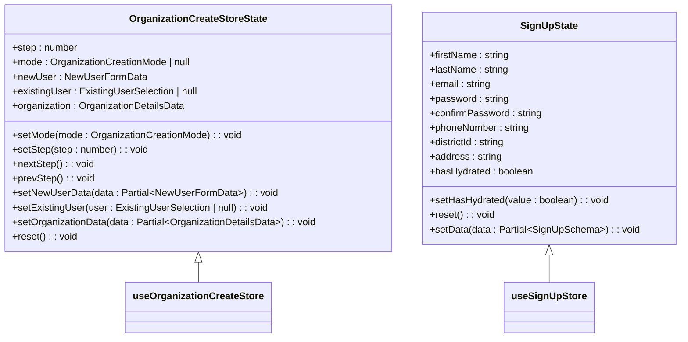
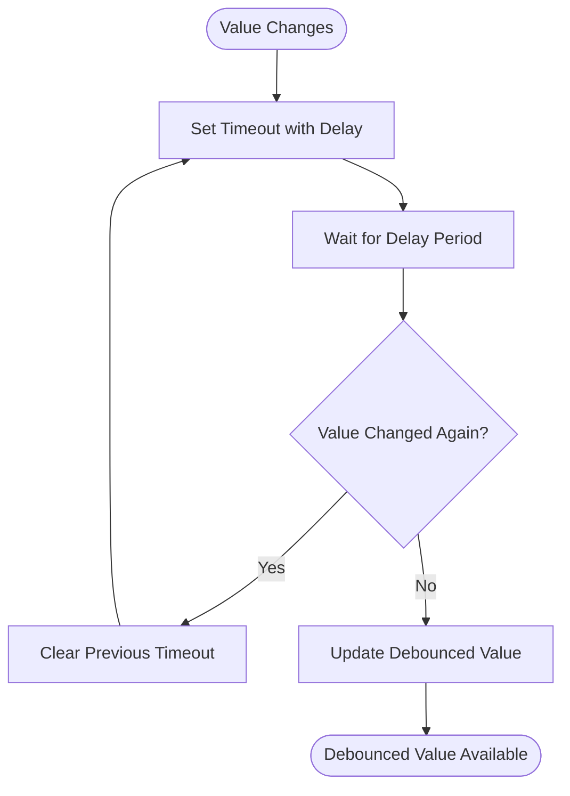
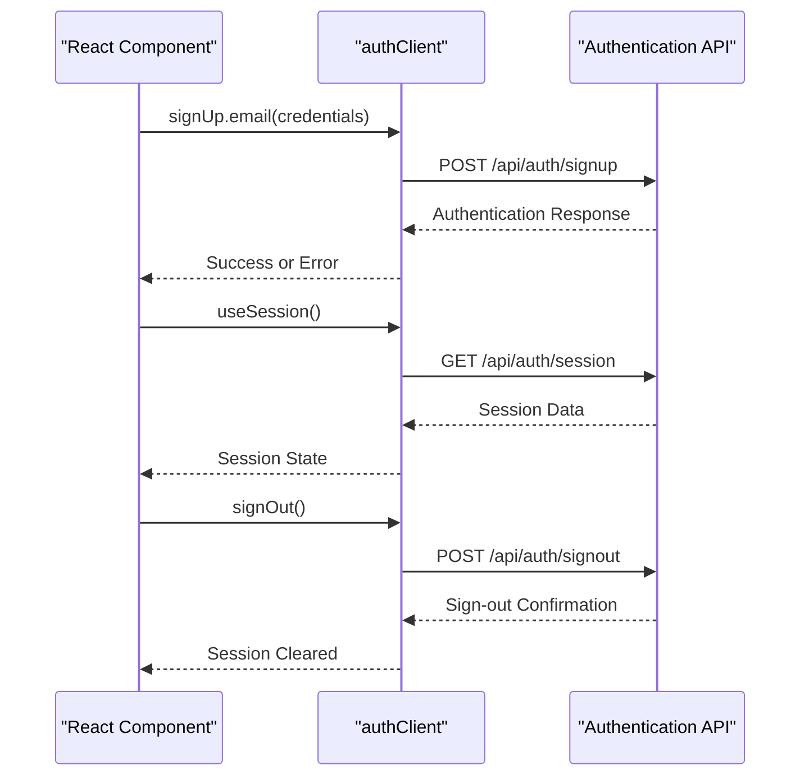
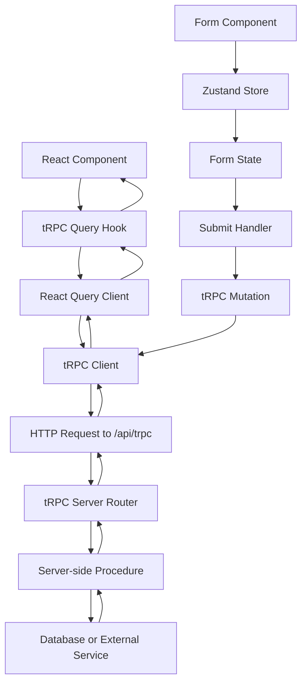
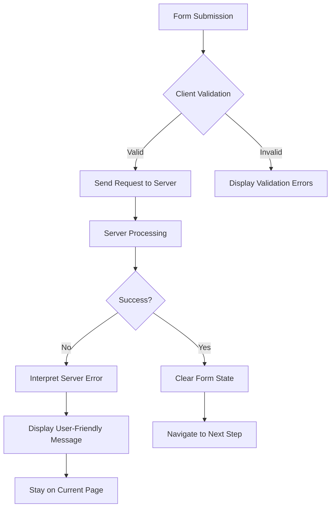
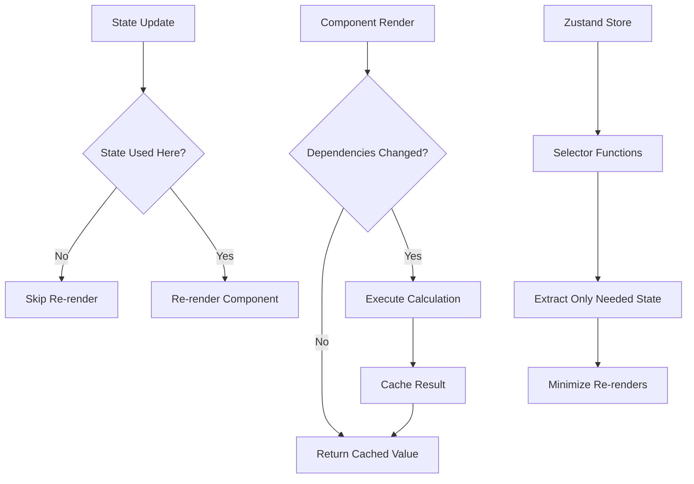

# State Management

<cite>
**Referenced Files in This Document**   
- [organization-create-store.ts](file://src/features/admin/organizations/store/organization-create-store.ts)
- [sign-up-store.ts](file://src/features/auth/store/sign-up-store.ts)
- [use-debounce.ts](file://src/hooks/use-debounce.ts)
- [use-mobile.ts](file://src/hooks/use-mobile.ts)
- [auth-client.ts](file://src/lib/auth-client.ts)
- [auth-admin-client.ts](file://src/lib/auth-admin-client.ts)
- [step-one-form.tsx](file://src/features/auth/components/sign-up/step-one-form.tsx)
- [step-two-form.tsx](file://src/features/auth/components/sign-up/step-two-form.tsx)
- [organization-create-page.tsx](file://src/features/admin/organizations/pages/organization-create-page.tsx)
- [new-user-step.tsx](file://src/features/admin/organizations/components/organization-create/new-user-step.tsx)
- [query-client.ts](file://src/trpc/query-client.ts)
- [react.tsx](file://src/trpc/react.tsx)
- [server.ts](file://src/trpc/server.ts)
</cite>

## Table of Contents
1. [Introduction](#introduction)
2. [Zustand for Form State Management](#zustand-for-form-state-management)
3. [Custom React Hooks for Common State Logic](#custom-react-hooks-for-common-state-logic)
4. [Client-Side Authentication State Management](#client-side-authentication-state-management)
5. [State Flow Between tRPC, React, and Form Stores](#state-flow-between-trpc-react-and-form-stores)
6. [State Persistence and Error Handling](#state-persistence-and-error-handling)
7. [Reactivity Patterns and Performance Considerations](#reactivity-patterns-and-performance-considerations)
8. [Conclusion](#conclusion)

## Introduction
This document provides a comprehensive overview of the state management strategies implemented in the pukpara application. It details the use of Zustand for managing complex form workflows, custom React hooks for shared state logic, authentication state synchronization, and the integration between tRPC queries and React components. The documentation also covers state persistence, error handling, reactivity patterns, and performance optimization techniques used throughout the application.

## Zustand for Form State Management

The pukpara application utilizes Zustand as its primary state management solution for complex multi-step form workflows, particularly in organization creation and user sign-up processes. Zustand provides a lightweight, scalable approach to managing form state across multiple components and navigation steps.

For organization creation, the `useOrganizationCreateStore` manages a multi-step wizard with four distinct stages. The store maintains state for the current step, creation mode (new user vs. existing user), user data, and organization details. This centralized state enables seamless navigation between steps while preserving form data throughout the workflow.

Similarly, the user sign-up process employs `useSignUpStore` to manage form state across multiple pages. The store captures user information collected in step one (name, email, password) and step two (phone number, district, address), ensuring data persistence as users progress through the registration flow.

**Diagram sources**
- [organization-create-store.ts](file://src/features/admin/organizations/store/organization-create-store.ts#L44-L137)
- [sign-up-store.ts](file://src/features/auth/store/sign-up-store.ts#L10-L46)

**Section sources**
- [organization-create-store.ts](file://src/features/admin/organizations/store/organization-create-store.ts#L0-L137)
- [sign-up-store.ts](file://src/features/auth/store/sign-up-store.ts#L0-L47)

## Custom React Hooks for Common State Logic

The application implements custom React hooks to encapsulate common state logic and promote reusability across components. These hooks abstract complex state management patterns into simple, composable functions that can be easily consumed by various parts of the application.

The `useDebounce` hook provides a generic solution for debouncing state updates, which is particularly useful for search inputs and other user interactions that trigger expensive operations. This hook delays the update of a value by a specified time, canceling previous updates if new values arrive before the delay period expires.

**Diagram sources**
- [use-debounce.ts](file://src/hooks/use-debounce.ts#L0-L16)

The `useMobile` hook (not fully visible in search results) likely determines mobile device state based on viewport dimensions or user agent detection, enabling responsive behavior in components. These custom hooks follow React best practices by encapsulating state logic in reusable functions that can be easily tested and maintained.

**Section sources**
- [use-debounce.ts](file://src/hooks/use-debounce.ts#L0-L16)

## Client-Side Authentication State Management

Authentication state in pukpara is managed through the `auth-client` module, which provides a comprehensive API for handling user sessions and authentication flows. The client-side authentication system is built on top of Better Auth and exposes a clean interface for sign-in, sign-up, sign-out operations, and session management.

The `authClient` instance is configured with plugins for admin functionality, organization management, and additional field inference, creating a unified authentication interface. The exported methods `signIn`, `signUp`, `signOut`, `useSession`, and `getSession` provide a consistent API for authentication operations across the application.

**Diagram sources**
- [auth-client.ts](file://src/lib/auth-client.ts#L0-L22)
- [auth-admin-client.ts](file://src/lib/auth-admin-client.ts#L0-L17)

The `useSession` hook enables real-time subscription to authentication state changes, automatically updating components when the user's session status changes. This reactive approach ensures that UI elements like user buttons and navigation menus stay synchronized with the current authentication state.

**Section sources**
- [auth-client.ts](file://src/lib/auth-client.ts#L0-L22)

## State Flow Between tRPC, React, and Form Stores

The application integrates tRPC for type-safe API communication, creating a seamless flow of data between the server and client components. The tRPC configuration establishes a robust query client with proper hydration, error handling, and data transformation capabilities.

The `TRPCReactProvider` component wraps the application with both React Query and tRPC providers, enabling efficient data fetching and caching. The query client is configured with SuperJSON for serialization of complex data types, ensuring that dates, maps, and other non-serializable objects can be properly transmitted between client and server.

**Diagram sources**
- [react.tsx](file://src/trpc/react.tsx#L0-L82)
- [query-client.ts](file://src/trpc/query-client.ts#L0-L25)
- [server.ts](file://src/trpc/server.ts#L0-L28)

The state flow follows a predictable pattern: React components consume data through tRPC query hooks, display it to users, and capture user input through form components that update Zustand stores. When users submit forms, tRPC mutation hooks send data to the server, with loading and error states managed through React Query's built-in mechanisms.

**Section sources**
- [react.tsx](file://src/trpc/react.tsx#L0-L82)
- [query-client.ts](file://src/trpc/query-client.ts#L0-L25)

## State Persistence and Error Handling

Form state persistence is implemented using Zustand's persist middleware, which automatically saves and restores store state from localStorage. The `useSignUpStore` configuration includes a persistence layer that stores form data between page navigations, allowing users to resume sign-up processes even after closing the browser.

The persistence configuration uses `createJSONStorage` with localStorage as the storage backend and includes a `partialize` function that excludes transient state (like hydration flags and action methods) from being persisted. The `onRehydrateStorage` callback updates the `hasHydrated` flag when state is restored, enabling components to detect when persisted data is available.

Error handling in form workflows is implemented through a combination of client-side validation and server error interpretation. The sign-up process captures validation errors through React Hook Form and displays them inline, while server errors are interpreted through helper functions like `getSignUpErrorMessage` that translate technical error messages into user-friendly feedback.

**Diagram sources**
- [sign-up-store.ts](file://src/features/auth/store/sign-up-store.ts#L0-L47)
- [step-two-form.tsx](file://src/features/auth/components/sign-up/step-two-form.tsx#L184-L256)

The organization creation workflow includes additional error handling through functions like `interpretCreateUserError`, which translates specific server error messages into contextual guidance for users (e.g., suggesting they switch to "Attach to existing user" when an email already exists).

**Section sources**
- [sign-up-store.ts](file://src/features/auth/store/sign-up-store.ts#L0-L47)
- [step-two-form.tsx](file://src/features/auth/components/sign-up/step-two-form.tsx#L96-L130)
- [organization-create-page.tsx](file://src/features/admin/organizations/pages/organization-create-page.tsx#L70-L118)

## Reactivity Patterns and Performance Considerations

The application employs several reactivity patterns and performance optimizations to ensure a smooth user experience. State colocation is practiced by keeping form state as close as possible to the components that need it, reducing unnecessary re-renders across the component tree.

Memoization is used extensively through React's `useMemo` and `useCallback` hooks to prevent expensive recalculations and maintain referential equality of functions and objects. The form components use `useMemo` to create stable default values objects that only change when underlying store values change.

**Diagram sources**
- [step-one-form.tsx](file://src/features/auth/components/sign-up/step-one-form.tsx#L43-L78)
- [new-user-step.tsx](file://src/features/admin/organizations/components/organization-create/new-user-step.tsx#L140-L190)

The application minimizes unnecessary re-renders by using Zustand's selector pattern, where components subscribe only to the specific pieces of state they need rather than the entire store. This fine-grained reactivity ensures that components only update when their specific dependencies change.

Additional performance considerations include the use of React Query's caching and background refetching capabilities, which reduce server load and provide instant access to previously fetched data. The query client is configured with appropriate stale times to balance data freshness with performance.

**Section sources**
- [step-one-form.tsx](file://src/features/auth/components/sign-up/step-one-form.tsx#L43-L78)
- [new-user-step.tsx](file://src/features/admin/organizations/components/organization-create/new-user-step.tsx#L140-L190)

## Conclusion
The pukpara application implements a comprehensive state management strategy that combines Zustand for form workflows, custom hooks for shared logic, and tRPC for type-safe data fetching. The architecture prioritizes user experience through state persistence, intuitive error handling, and performance optimizations. By following React best practices and leveraging modern state management patterns, the application provides a responsive and reliable interface for complex workflows like organization creation and user registration.