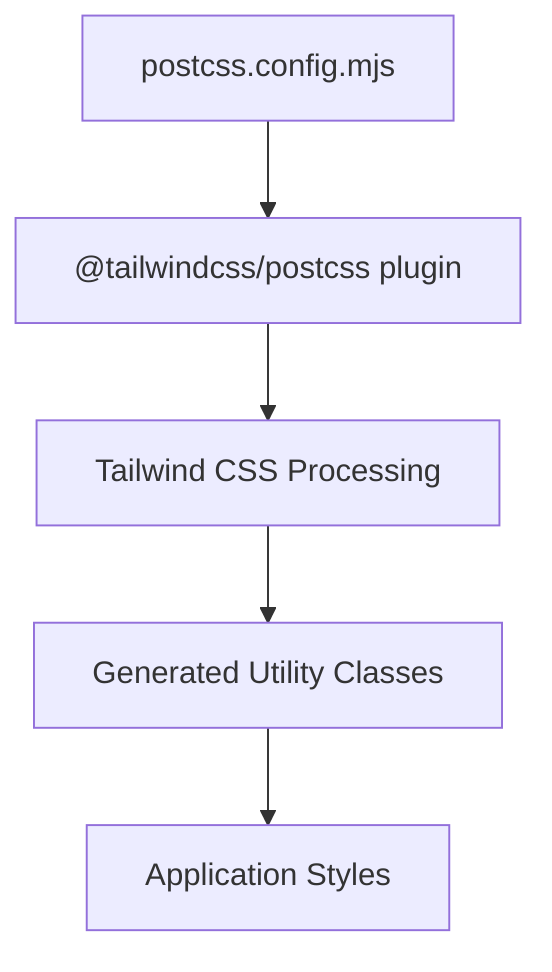
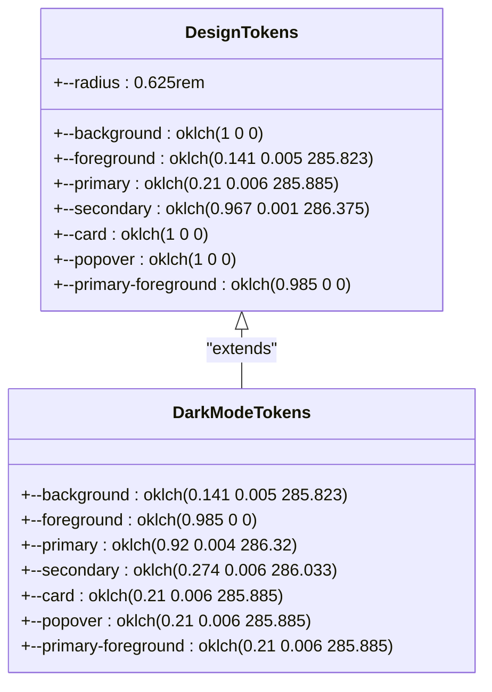
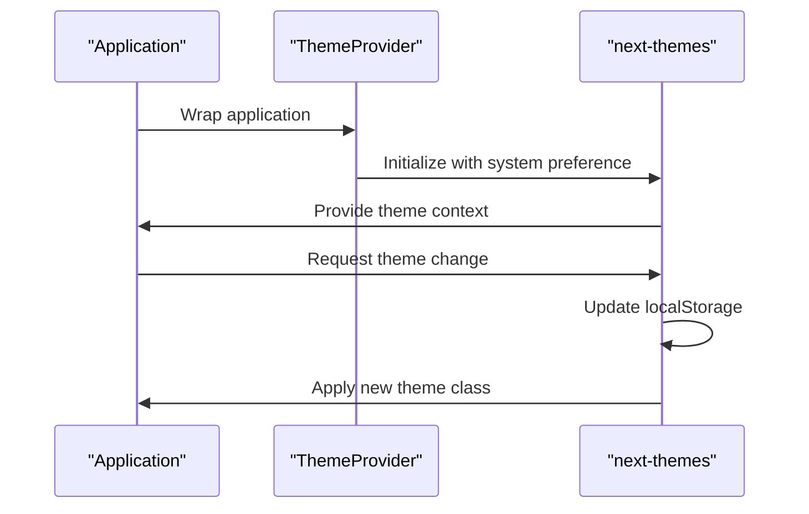
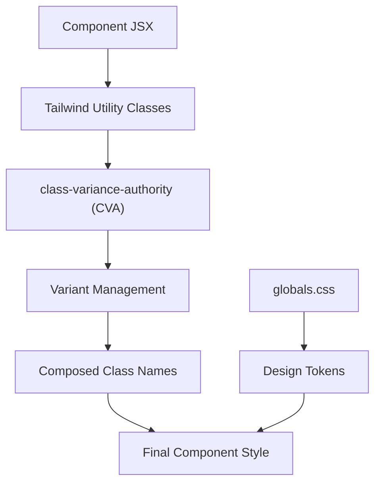
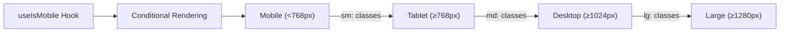
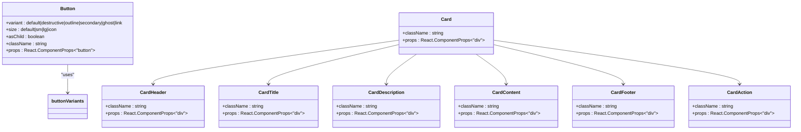

# Styling Strategy

<cite>
**Referenced Files in This Document**   
- [postcss.config.mjs](file://postcss.config.mjs)
- [globals.css](file://src/app/globals.css)
- [theme-provider.tsx](file://src/components/providers/theme-provider.tsx)
- [button.tsx](file://src/components/ui/button.tsx)
- [card.tsx](file://src/components/ui/card.tsx)
- [use-mobile.ts](file://src/hooks/use-mobile.ts)
</cite>

## Table of Contents
1. [Introduction](#introduction)
2. [Tailwind CSS Configuration](#tailwind-css-configuration)
3. [Global CSS and Design Tokens](#global-css-and-design-tokens)
4. [Dark Mode Implementation](#dark-mode-implementation)
5. [Component-Level Styling with Tailwind](#component-level-styling-with-tailwind)
6. [Responsive Design Patterns](#responsive-design-patterns)
7. [Custom Component Examples](#custom-component-examples)
8. [Accessibility Considerations](#accessibility-considerations)

## Introduction
This document outlines the styling strategy implemented in the pukpara application, focusing on the integration of Tailwind CSS for utility-first styling, component-level styling patterns, and theme management. The system leverages modern CSS methodologies, responsive design principles, and accessibility best practices to deliver a consistent and accessible user experience across devices and themes.

## Tailwind CSS Configuration

The project's PostCSS configuration is minimal and focused, enabling Tailwind CSS processing through the `@tailwindcss/postcss` plugin. This configuration ensures that Tailwind's utility classes are properly generated and applied during the build process.

**Diagram sources**
- [postcss.config.mjs](file://postcss.config.mjs#L1-L4)

**Section sources**
- [postcss.config.mjs](file://postcss.config.mjs#L1-L4)

## Global CSS and Design Tokens

The global styling is defined in `globals.css`, which serves as the foundation for the application's visual design system. It imports Tailwind CSS, additional animation utilities, and UploadThing's Tailwind integration. The file establishes design tokens using CSS custom properties (variables) for colors, typography, spacing, and radii, enabling consistent theming across light and dark modes.

The `:root` selector defines the default (light mode) theme with OKLCH color values for perceptual uniformity, while the `.dark` class overrides these values for dark mode. The `@theme inline` block maps these variables to semantic names used throughout the application.

**Diagram sources**
- [globals.css](file://src/app/globals.css#L15-L124)

**Section sources**
- [globals.css](file://src/app/globals.css#L1-L124)

## Dark Mode Implementation

Dark mode is implemented using the `next-themes` library, which provides a React context wrapper for theme management. The `ThemeProvider` component in `theme-provider.tsx` wraps the application and enables theme switching between light and dark modes. The theme state is persisted in localStorage and applied to the HTML element, allowing CSS to respond to the current theme via the `.dark` class.

**Diagram sources**
- [theme-provider.tsx](file://src/components/providers/theme-provider.tsx#L1-L11)

**Section sources**
- [theme-provider.tsx](file://src/components/providers/theme-provider.tsx#L1-L11)

## Component-Level Styling with Tailwind

Components are styled using Tailwind's utility-first approach, with composition of utility classes to create reusable UI elements. The styling strategy emphasizes semantic class names through the use of `class-variance-authority` (CVA) for variant management, as seen in the Button component. This approach allows for consistent styling across components while maintaining flexibility for different use cases.

The global base layer applies consistent border and outline styles across all elements, ensuring visual consistency. Components inherit their styling from the design tokens defined in `globals.css`, creating a cohesive design system.

**Section sources**
- [globals.css](file://src/app/globals.css#L1-L124)
- [button.tsx](file://src/components/ui/button.tsx#L1-L59)

## Responsive Design Patterns

Responsive design is implemented using Tailwind's mobile-first breakpoint system, with utility classes that adapt to different screen sizes. The `useIsMobile` hook provides a programmatic way to detect mobile devices based on a 768px breakpoint, enabling conditional rendering and behavior in React components.

Tailwind's responsive prefixes (e.g., `sm:`, `md:`, `lg:`) are used throughout the application to adjust layouts, spacing, and visibility across different device sizes, ensuring an optimal user experience on both mobile and desktop devices.

**Section sources**
- [use-mobile.ts](file://src/hooks/use-mobile.ts#L1-L18)
- [button.tsx](file://src/components/ui/button.tsx#L1-L59)

## Custom Component Examples

### Button Component
The Button component demonstrates the use of CVA for managing variants and sizes. It supports multiple variants (default, destructive, outline, secondary, ghost, link) and sizes (default, sm, lg, icon), with consistent styling and accessibility features including focus states and disabled opacity.

### Card Component
The Card component implements a flexible container with structured subcomponents (Header, Title, Description, Content, Footer, Action). It uses a grid layout with container queries to adapt to different content arrangements, with consistent spacing and border styling that follows the application's design tokens.

**Diagram sources**
- [button.tsx](file://src/components/ui/button.tsx#L1-L59)
- [card.tsx](file://src/components/ui/card.tsx#L1-L92)

**Section sources**
- [button.tsx](file://src/components/ui/button.tsx#L1-L59)
- [card.tsx](file://src/components/ui/card.tsx#L1-L92)

## Accessibility Considerations

The styling system incorporates several accessibility features:
- **Color Contrast**: The OKLCH color system ensures sufficient contrast between text and background colors in both light and dark modes
- **Focus States**: All interactive elements have visible focus indicators with a 3px ring that respects the theme's ring color
- **Motion Preferences**: The system respects user preferences for reduced motion through CSS media queries
- **Semantic Structure**: Components use appropriate HTML elements and ARIA attributes
- **Keyboard Navigation**: Focus styles are designed to be clearly visible for keyboard users
- **Form Validation**: Input components include visual indicators for invalid states with appropriate contrast

These accessibility features are implemented through a combination of Tailwind's built-in accessibility utilities and custom CSS rules that ensure compliance with WCAG guidelines.

**Section sources**
- [globals.css](file://src/app/globals.css#L1-L124)
- [button.tsx](file://src/components/ui/button.tsx#L1-L59)
- [card.tsx](file://src/components/ui/card.tsx#L1-L92)