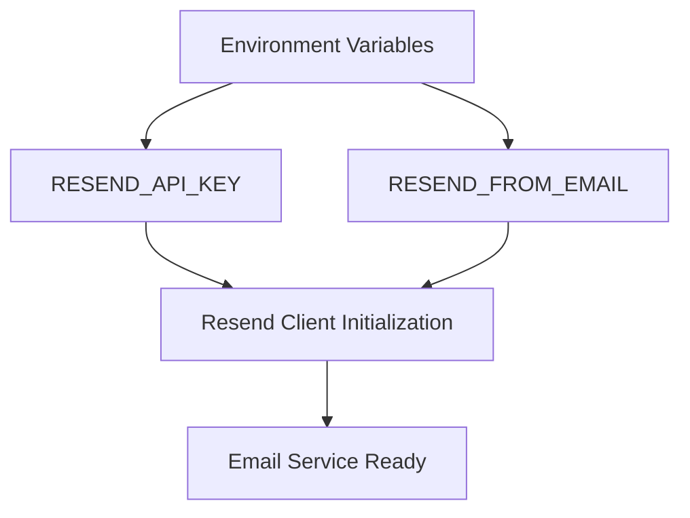
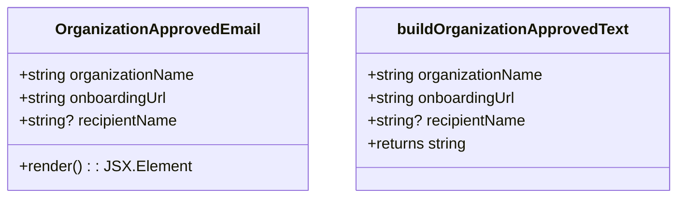
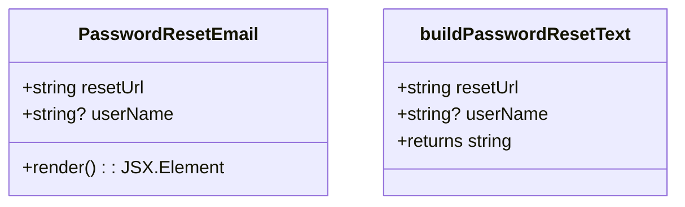
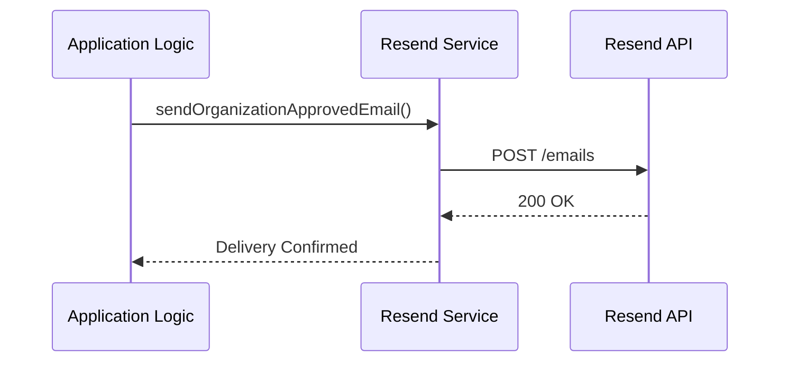
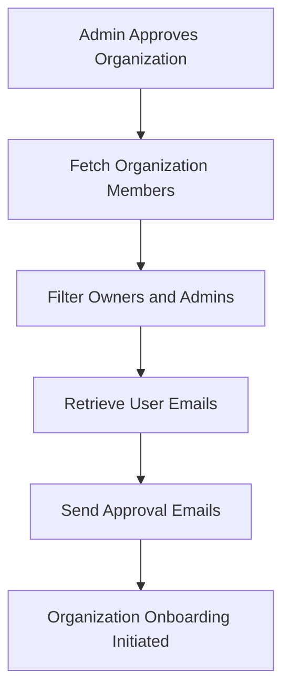
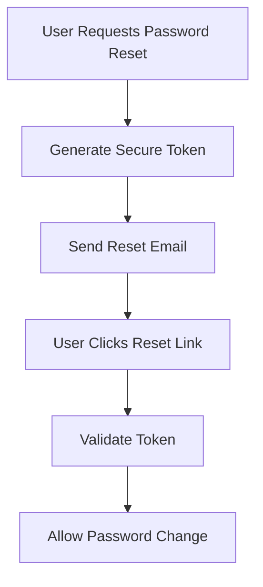
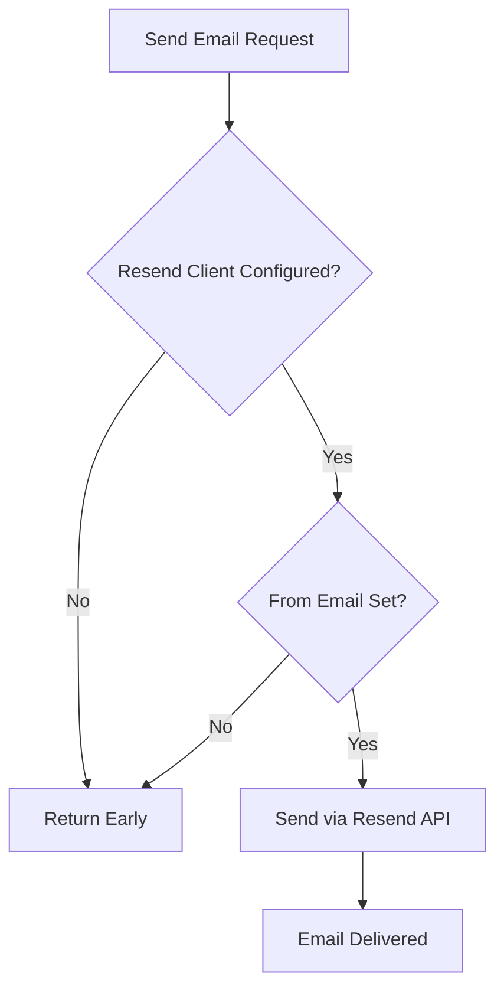

# Email Integration

<cite>
**Referenced Files in This Document**   
- [resend.ts](file://src/server/email/resend.ts)
- [organization-approved-email.tsx](file://src/email/templates/organization-approved-email.tsx)
- [password-reset-email.tsx](file://src/email/templates/password-reset-email.tsx)
- [organizations.ts](file://src/server/api/routers/organizations.ts)
</cite>

## Table of Contents
1. [Introduction](#introduction)
2. [Email Service Configuration](#email-service-configuration)
3. [Template Structure and Rendering](#template-structure-and-rendering)
4. [Email Delivery Patterns](#email-delivery-patterns)
5. [Business Workflow Integration](#business-workflow-integration)
6. [Error Handling and Reliability](#error-handling-and-reliability)
7. [Security Considerations](#security-considerations)
8. [Configuration Guidelines](#configuration-guidelines)

## Introduction
The email integration system in pukpara leverages Resend as the email delivery service to support critical business workflows such as organization approval and password reset. This document details the implementation of the Resend email service, including configuration, template rendering, asynchronous delivery, and integration with application logic. The system is designed for reliability, security, and maintainability, using React-based email templates and structured data injection patterns.

## Email Service Configuration

The Resend email service is configured through environment variables and initialized at application startup. The configuration includes API key authentication and sender email address setup.



**Diagram sources**
- [resend.ts](file://src/server/email/resend.ts#L4-L7)

**Section sources**
- [resend.ts](file://src/server/email/resend.ts#L4-L10)

## Template Structure and Rendering

Email templates are implemented as React components using the `@react-email/components` library, enabling JSX-to-HTML transformation for rich, responsive email content. Two primary templates are used: `organization-approved-email.tsx` and `password-reset-email.tsx`.

### Organization Approved Email Template
This template notifies organization members when their organization is approved, including a personalized greeting, organization name, and onboarding URL.



**Diagram sources**
- [organization-approved-email.tsx](file://src/email/templates/organization-approved-email.tsx#L6-L24)

### Password Reset Email Template
This template facilitates password reset functionality, providing a secure link that expires for security. It supports optional user name personalization.



**Diagram sources**
- [password-reset-email.tsx](file://src/email/templates/password-reset-email.tsx#L6-L24)

**Section sources**
- [password-reset-email.tsx](file://src/email/templates/password-reset-email.tsx#L6-L24)
- [organization-approved-email.tsx](file://src/email/templates/organization-approved-email.tsx#L6-L24)

## Email Delivery Patterns

Emails are delivered asynchronously using Resend's API, with proper error handling and graceful degradation when the service is unavailable. The system uses a client singleton pattern to manage the Resend connection.



**Diagram sources**
- [resend.ts](file://src/server/email/resend.ts#L12-L78)

**Section sources**
- [resend.ts](file://src/server/email/resend.ts#L12-L78)

## Business Workflow Integration

Email triggers are integrated into key business workflows, ensuring timely communication with users during critical processes.

### Organization Approval Workflow
When an organization is approved by an administrator, the system automatically sends approval emails to all owners and admins of the organization.



**Diagram sources**
- [organizations.ts](file://src/server/api/routers/organizations.ts#L250-L295)

### Password Reset Workflow
When a user requests a password reset, the system generates a secure token and sends a reset email with a time-limited link.



**Diagram sources**
- [resend.ts](file://src/server/email/resend.ts#L20-L38)
- [reset-password-form.tsx](file://src/features/auth/components/reset-password-form.tsx#L51-L90)

**Section sources**
- [organizations.ts](file://src/server/api/routers/organizations.ts#L250-L295)
- [resend.ts](file://src/server/email/resend.ts#L20-L38)

## Error Handling and Reliability

The email system implements robust error handling to ensure reliability and prevent application failures due to email service issues.

- **Graceful Degradation**: If Resend is not configured (missing API key), email functions return early without throwing errors
- **Null Safety**: All email functions check for required configuration before execution
- **Asynchronous Processing**: Email delivery is non-blocking, preventing delays in user-facing operations
- **Promise.allSettled**: When sending multiple emails (e.g., to organization members), failures in one email do not affect others



**Section sources**
- [resend.ts](file://src/server/email/resend.ts#L15-L18)
- [resend.ts](file://src/server/email/resend.ts#L25-L30)

## Security Considerations

The email system incorporates several security measures to protect user data and prevent abuse.

### Template Injection Prevention
All dynamic data injected into email templates is properly escaped by React's rendering engine, preventing XSS and HTML injection attacks. The system uses React's built-in escaping for all user-provided content.

### Personally Identifiable Information (PII) Handling
- Only necessary PII is included in emails (name, email address)
- Password reset links contain secure, time-limited tokens
- No sensitive information is stored in email templates
- All email content is reviewed for compliance with data protection regulations

### Secure Token Management
Password reset functionality uses cryptographically secure tokens that:
- Are generated server-side
- Have limited expiration periods
- Are invalidated after use
- Cannot be guessed or predicted

**Section sources**
- [password-reset-email.tsx](file://src/email/templates/password-reset-email.tsx#L20-L60)
- [reset-password-form.tsx](file://src/features/auth/components/reset-password-form.tsx#L51-L90)

## Configuration Guidelines

Proper configuration is essential for the email system to function correctly in different environments.

### API Key Configuration
Set the Resend API key in environment variables:
```
RESEND_API_KEY=your_api_key_here
```

### Sender Domain Configuration
Configure the sender email address:
```
RESEND_FROM_EMAIL=noreply@hellonaa.com
```

### Testing Environment Setup
For development and testing:
- Use Resend's test API key
- Configure a test email domain
- Enable email logging instead of actual delivery when appropriate
- Use feature flags to disable email sending in local environments

### Production Best Practices
- Store API keys in secure environment variables (never in code)
- Use a dedicated email domain with proper DNS configuration (SPF, DKIM, DMARC)
- Monitor email delivery rates and error logs
- Implement rate limiting to prevent abuse
- Regularly review email templates for compliance and branding

**Section sources**
- [resend.ts](file://src/server/email/resend.ts#L4-L7)
- [resend.ts](file://src/server/email/resend.ts#L12-L18)