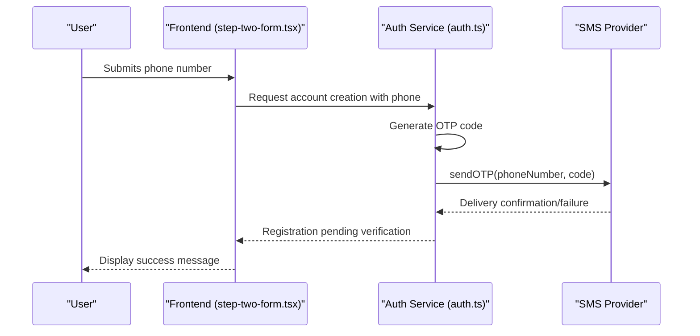
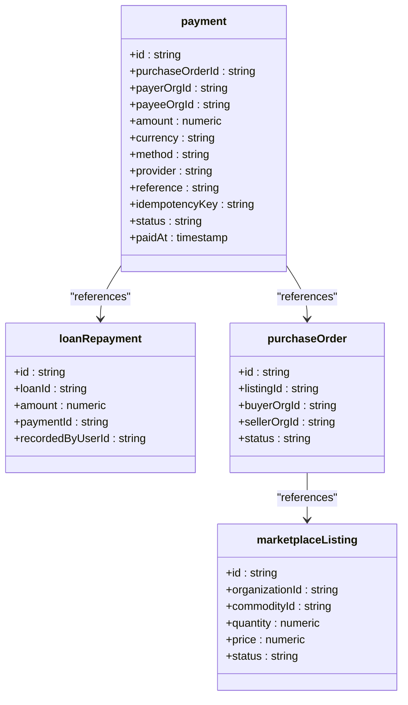
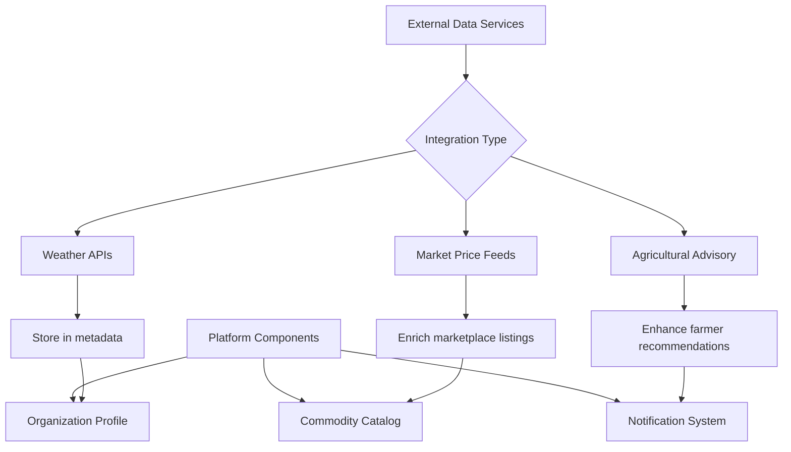
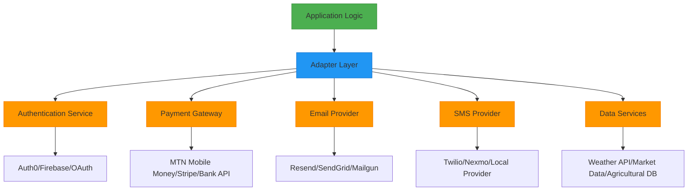
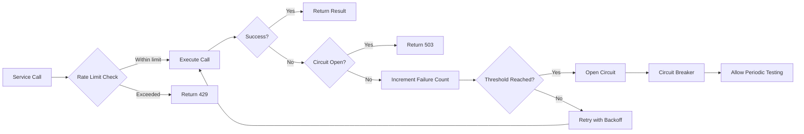
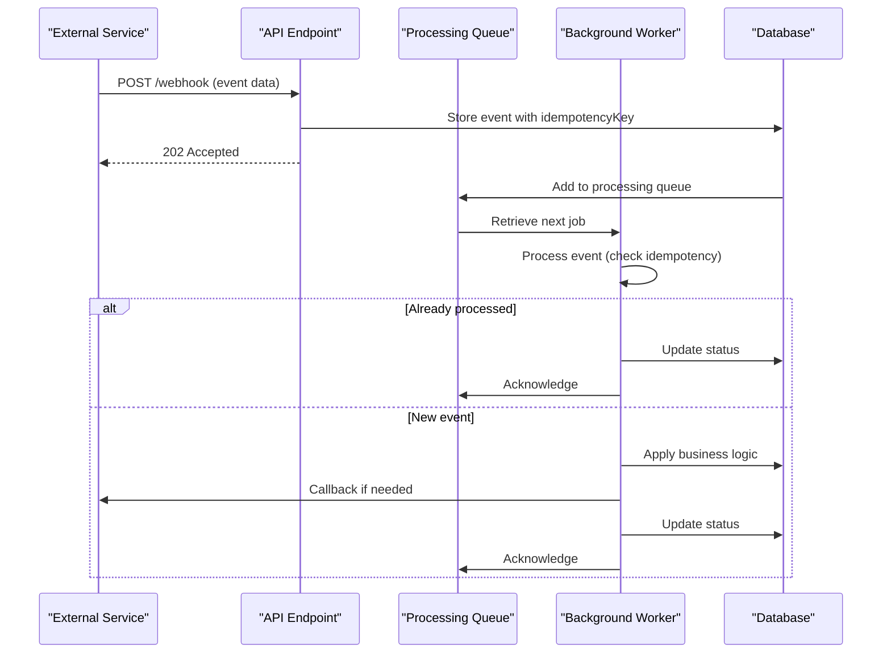

# External Service Integrations

<cite>
**Referenced Files in This Document**   
- [step-two-form.tsx](file://src/features/auth/components/sign-up/step-two-form.tsx)
- [auth.ts](file://src/lib/auth.ts)
- [resend.ts](file://src/server/email/resend.ts)
</cite>

## Table of Contents
1. [Introduction](#introduction)
2. [SMS Provider Integration in Authentication Flows](#sms-provider-integration-in-authentication-flows)
3. [Payment Gateway Integration Architecture](#payment-gateway-integration-architecture)
4. [External Data Service Extension Points](#external-data-service-extension-points)
5. [Middleware and Adapter Patterns for Third-Party Services](#middleware-and-adapter-patterns-for-third-party-services)
6. [Secure Credential Management and Resilience Strategies](#secure-credential-management-and-resilience-strategies)
7. [Webhook Handling and Asynchronous Processing](#webhook-handling-and-asynchronous-processing)
8. [Conclusion](#conclusion)

## Introduction
This document outlines the external service integration architecture of the pukpara platform, focusing on extensible hooks for third-party services. The system is designed with modularity and decoupling in mind, enabling seamless integration of SMS providers, payment gateways, and external data services such as weather APIs and market price feeds. The integration points are structured to support secure credential management, resilience patterns like rate limiting and circuit breaking, and reliable asynchronous communication through webhook handling and idempotency mechanisms.

## SMS Provider Integration in Authentication Flows

The pukpara platform incorporates SMS-based OTP verification during user authentication, particularly in the sign-up process. The integration is implemented through the `phoneNumber` plugin in the BetterAuth framework, which provides extensible hooks for OTP delivery.

During user registration, after the initial sign-up step, users are prompted to provide their phone number, district, and address in the second step of the registration form (`step-two-form.tsx`). Upon submission, the system triggers an OTP generation and delivery process through the configured SMS provider.

The actual SMS delivery mechanism is abstracted within the `sendOTP` function defined in the authentication configuration (`auth.ts`). This function serves as the integration point where developers can plug in their preferred SMS gateway (e.g., Twilio, Vonage, or local providers). Currently, the implementation contains a placeholder that logs the OTP code and phone number to the console, indicating where the SMS sending logic should be integrated.

The system supports storing SMS sender IDs at the organization level through the `smsSenderId` field in the organization schema, allowing different organizations to use their registered sender identities for compliance with local telecommunications regulations.

**Diagram sources**
- [step-two-form.tsx](file://src/features/auth/components/sign-up/step-two-form.tsx)
- [auth.ts](file://src/lib/auth.ts)

**Section sources**
- [step-two-form.tsx](file://src/features/auth/components/sign-up/step-two-form.tsx#L1-L408)
- [auth.ts](file://src/lib/auth.ts#L143-L190)

## Payment Gateway Integration Architecture

The pukpara platform supports integration with multiple payment gateways for financial operations including savings deposits, loan repayments, and marketplace transactions. The payment architecture is designed to be provider-agnostic through a flexible schema that accommodates various payment methods and providers.

The core payment model (`payment` table in the database schema) includes fields for `method` (momo, bank, cash) and `provider` (e.g., "mtn_momo", "bank_transfer"), enabling the system to route transactions to the appropriate payment processor. This structure allows for easy addition of new payment providers without schema modifications.

For marketplace transactions, the system integrates payments with purchase orders through the `purchaseOrderId` foreign key in the payment table, creating a clear audit trail from listing to fulfillment to payment. Loan repayments are similarly linked to loan records through the `loanRepayment` table, ensuring financial operations are properly accounted for.

The platform supports idempotent payment processing through the `idempotencyKey` field, which prevents duplicate transactions in case of network retries or failures. Payment status is tracked through a state machine with defined states: pending, completed, failed, and cancelled.

**Diagram sources**
- [schema.ts](file://src/server/db/schema.ts#L743-L779)
- [schema.ts](file://src/server/db/schema.ts#L1085-L1128)

**Section sources**
- [schema.ts](file://src/server/db/schema.ts#L743-L779)

## External Data Service Extension Points

The pukpara platform provides extension points for integrating external data services such as weather APIs, market price feeds, and agricultural advisory systems. These integrations are designed to enhance the platform's value proposition for agricultural stakeholders by providing contextual data that informs decision-making.

While the current codebase does not contain direct implementations of these external data integrations, the architecture includes several design patterns that facilitate such extensions:

1. **Organization Metadata**: The organization schema includes a `metadata` JSON field that can store configuration for external service integrations, such as API endpoints, credentials, or subscription details.

2. **Notification System**: The `notification` table supports multiple channels (email, sms, inapp, webhook), with the webhook channel specifically designed for pushing data to external systems or receiving data from them.

3. **Regional Data Structure**: The platform maintains a comprehensive hierarchy of regions and districts, which serves as the geographical foundation for location-based data services like weather forecasts or regional market prices.

4. **Commodity Catalog**: The commodity and commodityVariety tables provide a standardized taxonomy that can be enriched with external data such as market benchmarks, seasonal trends, or quality specifications.

These extension points allow the platform to consume data from agricultural advisory services, integrate real-time weather data for farming recommendations, or pull market price information to inform pricing decisions on the marketplace.

**Diagram sources**
- [schema.ts](file://src/server/db/schema.ts#L814-L847)
- [schema.ts](file://src/server/db/schema.ts#L586-L622)

**Section sources**
- [schema.ts](file://src/server/db/schema.ts#L814-L847)

## Middleware and Adapter Patterns for Third-Party Services

The pukpara platform employs middleware and adapter patterns to decouple third-party services from core business logic, ensuring maintainability and flexibility in the integration architecture.

The authentication system demonstrates this pattern through the BetterAuth framework, which acts as an abstraction layer between the application and various identity providers. The `auth.ts` file configures plugins for different authentication methods, with the `phoneNumber` plugin serving as an adapter for SMS-based verification services.

Database operations use the Drizzle ORM as an adapter layer, with the `drizzleAdapter` function creating a standardized interface between the application and the PostgreSQL database. This allows the core logic to remain database-agnostic while supporting advanced features through the underlying database.

The email system implements an adapter pattern through the Resend service integration in `resend.ts`. The `sendPasswordResetEmail` and related functions abstract the email delivery mechanism, allowing the core application to send emails without direct knowledge of the email service provider's API.

For external API integrations, the platform can leverage the tRPC framework to create type-safe adapters that validate data contracts between the application and external services, ensuring data integrity and providing clear interfaces for new integrations.

**Diagram sources**
- [auth.ts](file://src/lib/auth.ts)
- [resend.ts](file://src/server/email/resend.ts)

**Section sources**
- [auth.ts](file://src/lib/auth.ts#L1-L305)
- [resend.ts](file://src/server/email/resend.ts#L1-L80)

## Secure Credential Management and Resilience Strategies

The pukpara platform implements several strategies for secure credential management and system resilience when integrating with external services.

Credential management follows the principle of least privilege and secure storage. API keys and secrets are stored in environment variables (e.g., `RESEND_API_KEY` in `.env.local`) rather than in the codebase, preventing accidental exposure. The system uses the `process.env` pattern to access these credentials at runtime, ensuring they are not hardcoded.

For SMS and payment providers, credentials can be configured at the organization level through the organization schema fields like `smsSenderId` and potentially other provider-specific credentials stored in the `metadata` JSON field. This allows multi-tenancy where different organizations can use their own service provider credentials.

The platform incorporates resilience patterns to handle external service failures:

1. **Rate Limiting**: While not explicitly implemented in the current code, the architecture supports rate limiting through middleware that could be added to API routes.

2. **Circuit Breaking**: The system can implement circuit breakers using libraries like Opossum to prevent cascading failures when external services are unresponsive.

3. **Fallback Strategies**: The email service implementation includes fallback logic where if the Resend client is not configured, the function returns early without throwing an error, preventing the entire registration process from failing due to email delivery issues.

4. **Retry Mechanisms**: For critical operations, the system can implement retry logic with exponential backoff, particularly for payment processing and notification delivery.

5. **Idempotency**: The payment system includes an `idempotencyKey` field to ensure that retrying a failed transaction does not result in duplicate payments.

These strategies ensure that temporary outages of external services do not compromise the overall stability and reliability of the platform.

**Diagram sources**
- [resend.ts](file://src/server/email/resend.ts#L1-L80)
- [schema.ts](file://src/server/db/schema.ts#L743-L779)

**Section sources**
- [resend.ts](file://src/server/email/resend.ts#L1-L80)

## Webhook Handling and Asynchronous Processing

The pukpara platform supports webhook handling and asynchronous processing for reliable communication with external services. The architecture is designed to handle both inbound and outbound webhooks, enabling event-driven integration patterns.

The notification system includes a `channel` field that supports "webhook" as a delivery method, allowing the platform to push events to external systems when specific actions occur (e.g., payment completed, organization approved). This enables real-time synchronization with external accounting systems, inventory management platforms, or analytics services.

For inbound webhooks, the platform can leverage the API routes under `src/app/api` to create endpoints that receive notifications from external services. For example, payment gateways can send webhook notifications to confirm payment status, or SMS providers can deliver delivery receipts.

Asynchronous processing is facilitated through several mechanisms:

1. **Database Hooks**: The BetterAuth framework supports database hooks (e.g., `databaseHooks.user.create.after`) that trigger asynchronous actions after database operations, such as creating an organization when a new user is created.

2. **Background Jobs**: While not explicitly shown in the code, the architecture supports background processing through patterns like the one used in `createOrganizationWithMembership`, which performs multiple operations in a transaction.

3. **Event Queueing**: The notification table includes a `status` field with "queued" as an initial state, suggesting a queuing system for asynchronous delivery of notifications.

4. **Idempotent Processing**: The payment system's `idempotencyKey` field ensures that webhook handlers can safely process the same event multiple times without side effects, a critical feature for reliable asynchronous communication.

These patterns ensure that time-consuming operations do not block user interactions while maintaining data consistency and reliability in distributed communications.

**Diagram sources**
- [auth.ts](file://src/lib/auth.ts#L143-L190)
- [schema.ts](file://src/server/db/schema.ts#L743-L779)

**Section sources**
- [auth.ts](file://src/lib/auth.ts#L143-L190)

## Conclusion
The pukpara platform demonstrates a well-architected approach to external service integrations, with clear extension points for SMS providers, payment gateways, and external data services. The use of middleware and adapter patterns effectively decouples third-party services from core business logic, enabling flexibility and maintainability. The system incorporates essential resilience patterns including secure credential management, rate limiting considerations, circuit breaking potential, and robust idempotency mechanisms for reliable asynchronous processing. By leveraging webhook-based communication and event-driven architectures, the platform can integrate with a wide range of external services while maintaining system stability and data consistency. These integration capabilities position pukpara as a versatile platform for agricultural technology solutions that require connectivity with multiple service providers and data sources.