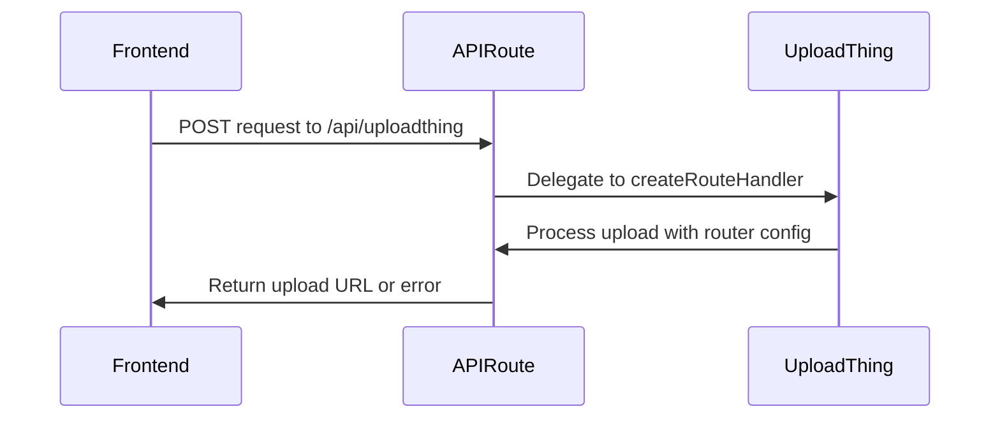
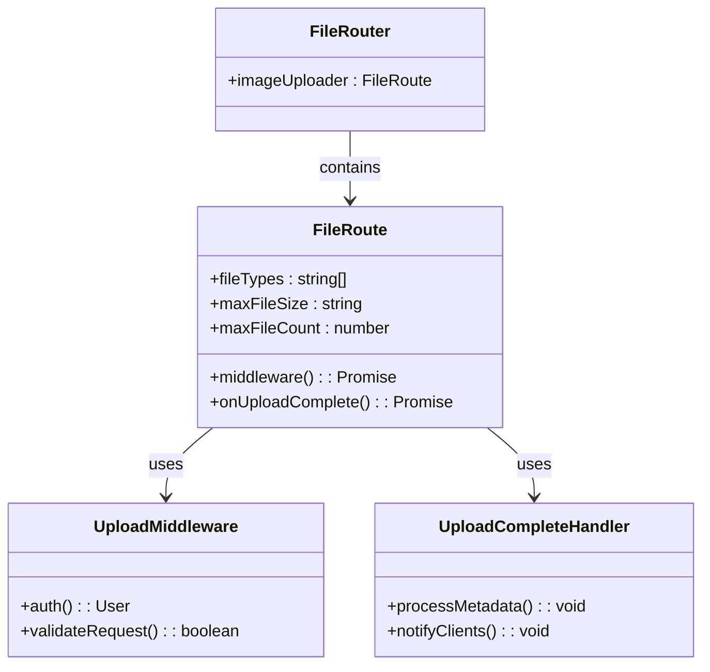
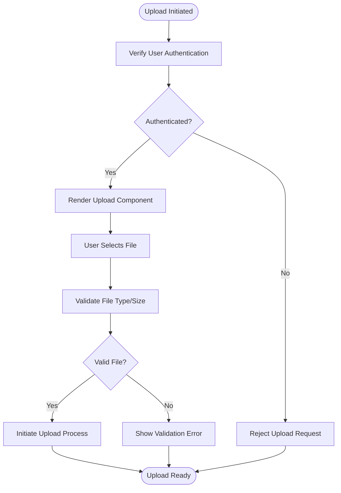
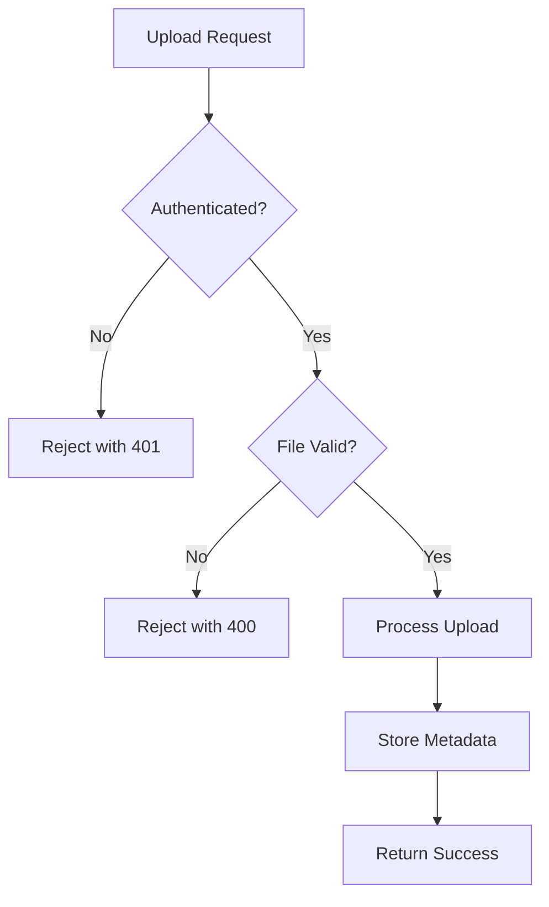

# File Upload Integration

<cite>
**Referenced Files in This Document**   
- [route.ts](file://src/app/api/uploadthing/route.ts)
- [core.ts](file://src/app/api/uploadthing/core.ts)
- [uploadthing.ts](file://src/lib/uploadthing.ts)
</cite>

## Table of Contents
1. [Introduction](#introduction)
2. [API Route Implementation](#api-route-implementation)
3. [Core Configuration](#core-configuration)
4. [Frontend Integration Layer](#frontend-integration-layer)
5. [Security Model](#security-model)
6. [Usage Examples](#usage-examples)
7. [Error Handling](#error-handling)
8. [Performance Optimization](#performance-optimization)
9. [Monitoring and Troubleshooting](#monitoring-and-troubleshooting)

## Introduction
The file upload infrastructure in pukpara is powered by UploadThing, providing a secure and scalable solution for handling various types of file uploads across the platform. This system supports critical operations such as uploading farmer documents, farm images, and inventory assets. The implementation follows a modular architecture with clear separation between API routes, configuration logic, and frontend integration components.

## API Route Implementation

The API route implementation in `src/app/api/uploadthing/route.ts` serves as the entry point for all file upload operations. It leverages UploadThing's Next.js integration to expose standardized HTTP endpoints for handling file uploads through the Next.js App Router.

**Diagram sources**
- [route.ts](file://src/app/api/uploadthing/route.ts#L1-L10)

**Section sources**
- [route.ts](file://src/app/api/uploadthing/route.ts#L1-L10)

## Core Configuration

The core configuration in `src/app/api/uploadthing/core.ts` defines the file routing logic, validation rules, and security policies. It implements a single file route named `imageUploader` that accepts image files with specific constraints.

Key configuration parameters include:
- **maxFileSize**: 4MB limit per file
- **maxFileCount**: Single file upload (1)
- **fileType**: Restricted to image formats

The configuration also includes middleware for authentication and metadata injection, along with completion handlers that process uploaded files.

**Diagram sources**
- [core.ts](file://src/app/api/uploadthing/core.ts#L15-L40)

**Section sources**
- [core.ts](file://src/app/api/uploadthing/core.ts#L1-L42)

## Frontend Integration Layer

The integration layer in `src/lib/uploadthing.ts` provides React components that connect frontend interfaces with the UploadThing backend. This abstraction simplifies the implementation of upload functionality across various UI components.

The library exports two primary components:
- **UploadButton**: A button-triggered upload interface
- **UploadDropzone**: A drag-and-drop upload area

These components are strongly typed using the `OurFileRouter` type definition, ensuring type safety throughout the application.

**Diagram sources**
- [uploadthing.ts](file://src/lib/uploadthing.ts#L1-L8)

**Section sources**
- [uploadthing.ts](file://src/lib/uploadthing.ts#L1-L8)

## Security Model

The security model implements multiple layers of protection for file uploads:

1. **Authentication Checks**: The middleware function validates user authentication before allowing uploads
2. **Authorization**: Only authenticated users can initiate uploads
3. **File Access Controls**: Uploaded files are associated with user metadata for access tracking
4. **Input Validation**: Strict file type and size restrictions prevent malicious uploads

The current implementation uses a placeholder authentication function that returns a fake user ID, which should be replaced with actual authentication logic in production.

Potential virus scanning considerations include integrating with cloud-based antivirus services or implementing server-side scanning before finalizing uploads, though these are not currently implemented.

**Section sources**
- [core.ts](file://src/app/api/uploadthing/core.ts#L10-L35)

## Usage Examples

### Farmer Document Upload
When registering a new farmer or updating their profile, field officers can upload identification documents, land ownership papers, or other compliance documents through the farmer registration interface.

### Farm Image Upload
During farm registration, users can upload geotagged images of farm plots, crop conditions, or infrastructure. These images are limited to 4MB each to ensure mobile-friendly uploads.

### Inventory Asset Upload
For inventory management, users can upload product images, packaging designs, or quality certification documents associated with agricultural commodities.

All these use cases leverage the same underlying upload infrastructure with consistent security and validation rules.

## Error Handling

The system handles various error conditions:

- **Failed Uploads**: Network interruptions or server errors trigger client-side retry mechanisms
- **Network Interruptions**: Uploads can be resumed if supported by the underlying storage backend
- **Invalid File Types**: Attempts to upload non-image files are rejected with clear error messages
- **Size Limit Exceeded**: Files larger than 4MB are rejected before upload begins

Error responses follow a consistent format, returning appropriate HTTP status codes and descriptive messages to guide users toward successful uploads.

**Section sources**
- [core.ts](file://src/app/api/uploadthing/core.ts#L25-L30)
- [route.ts](file://src/app/api/uploadthing/route.ts#L5-L8)

## Performance Optimization

While the current implementation does not explicitly configure chunked uploads, the Cloudflare R2 storage backend (evident from environment definitions) supports multipart uploads, which could be leveraged for large file transfers.

CDN integration is inherent through Cloudflare's global network, providing edge caching and accelerated delivery of uploaded assets. The 4MB file size limit helps ensure acceptable upload times even on slower connections.

Future optimization opportunities include:
- Implementing client-side image compression
- Adding support for resumable uploads
- Configuring cache headers for optimized delivery

## Monitoring and Troubleshooting

Upload success rates can be monitored through:
- Server-side logging of upload completion events
- Client-side tracking of upload success/failure rates
- Storage usage metrics from Cloudflare R2

Common issues and their resolutions:
- **Authentication failures**: Verify user session state
- **File validation errors**: Ensure files meet type and size requirements
- **Timeout errors**: Check network connectivity and file size
- **Partial uploads**: Implement retry logic for interrupted transfers

The `onUploadComplete` callback provides a hook for implementing custom monitoring and alerting systems.

**Section sources**
- [core.ts](file://src/app/api/uploadthing/core.ts#L32-L38)
- [cloudflare-env.d.ts](file://cloudflare-env.d.ts#L2032-L2081)