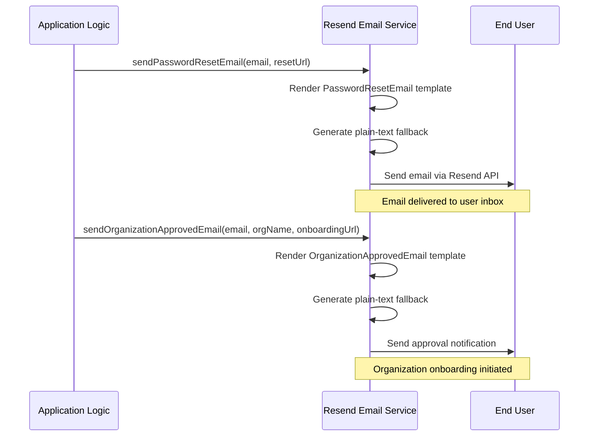
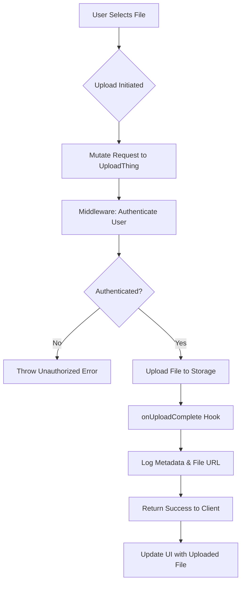

# Integration Points

<cite>
**Referenced Files in This Document**   
- [organization-approved-email.tsx](file://src/email/templates/organization-approved-email.tsx)
- [password-reset-email.tsx](file://src/email/templates/password-reset-email.tsx)
- [resend.ts](file://src/server/email/resend.ts)
- [core.ts](file://src/app/api/uploadthing/core.ts)
- [route.ts](file://src/app/api/uploadthing/route.ts)
- [uploadthing.ts](file://src/lib/uploadthing.ts)
</cite>

## Table of Contents
1. [Email Integration with Resend](#email-integration-with-resend)
2. [File Upload Infrastructure with UploadThing](#file-upload-infrastructure-with-uploadthing)
3. [Potential Integration Points](#potential-integration-points)
4. [Integration Hooks and Error Handling](#integration-hooks-and-error-handling)
5. [Configuration Guidelines and Security Best Practices](#configuration-guidelines-and-security-best-practices)
6. [Monitoring and Logging for Integration Health](#monitoring-and-logging-for-integration-health)

## Email Integration with Resend

The email integration in pukpara is implemented using **Resend**, a transactional email API service. It enables sending structured, template-based emails for key user workflows such as password resets and organization approvals. The system supports both HTML and plain-text email formats to ensure compatibility across clients.

Email templates are defined in the `src/email/templates` directory and built using the `@react-email/components` library, which allows React components to be used for dynamic email rendering. Two primary templates are currently implemented:

- `password-reset-email.tsx`: Handles password reset flows with a secure reset link.
- `organization-approved-email.tsx`: Notifies users when their organization has been approved, including a link to onboarding.

Each template includes a corresponding `buildXText()` function that generates a plain-text fallback version of the email, ensuring accessibility and compliance with email client standards.

The actual email dispatch logic is centralized in `src/server/email/resend.ts`, which initializes the Resend client using environment variables (`RESEND_API_KEY` and `noreply@hellonaa.com` as the sender). The module exports three main functions:
- `sendPasswordResetEmail`: Sends a password reset email to a specified address.
- `sendOrganizationApprovedEmail`: Notifies the organization admin that their account is approved.
- `sendOrganizationInviteEmail`: Reuses the password reset template to send onboarding invitations with a custom subject line.

These functions include safety checks to prevent execution if the Resend client or sender email is not configured.

**Diagram sources**
- [resend.ts](file://src/server/email/resend.ts#L20-L78)
- [password-reset-email.tsx](file://src/email/templates/password-reset-email.tsx#L1-L136)
- [organization-approved-email.tsx](file://src/email/templates/organization-approved-email.tsx#L1-L140)

**Section sources**
- [resend.ts](file://src/server/email/resend.ts#L1-L79)
- [password-reset-email.tsx](file://src/email/templates/password-reset-email.tsx#L1-L136)
- [organization-approved-email.tsx](file://src/email/templates/organization-approved-email.tsx#L1-L140)

## File Upload Infrastructure with UploadThing

The file upload infrastructure in pukpara is powered by **UploadThing**, a full-stack solution for handling file uploads in Next.js applications. It provides secure, scalable, and type-safe file upload capabilities with support for client-side components and server-side validation.

The core configuration is defined in `src/app/api/uploadthing/core.ts`, where the `ourFileRouter` object specifies available upload endpoints. Currently, a single route `imageUploader` is defined, which:
- Accepts only image files
- Enforces a maximum file size of 4MB
- Limits uploads to one file at a time

Before any file is uploaded, a middleware function runs on the server to authenticate the request. In the current implementation, a mock `auth()` function returns a fake user ID, indicating that actual authentication integration is pending. If authentication fails, an `UploadThingError("Unauthorized")` is thrown, blocking the upload.

After a successful upload, the `onUploadComplete` callback logs metadata (including the `userId`) and the uploaded file's URL (`file.ufsUrl`). This hook can be extended to store file references in the database or trigger image processing workflows.

The API endpoint is exposed via `src/app/api/uploadthing/route.ts`, which uses `createRouteHandler` to generate the appropriate GET and POST handlers for Next.js App Router.

On the client side, reusable React components are exported from `src/lib/uploadthing.ts`:
- `UploadButton`: A customizable button component for selecting and uploading files.
- `UploadDropzone`: A drag-and-drop zone component with visual feedback.

These components are type-safe and automatically infer types from `OurFileRouter`, ensuring consistency between frontend and backend.

**Diagram sources**
- [core.ts](file://src/app/api/uploadthing/core.ts#L1-L43)
- [route.ts](file://src/app/api/uploadthing/route.ts#L1-L11)
- [uploadthing.ts](file://src/lib/uploadthing.ts#L1-L9)

**Section sources**
- [core.ts](file://src/app/api/uploadthing/core.ts#L1-L43)
- [route.ts](file://src/app/api/uploadthing/route.ts#L1-L11)
- [uploadthing.ts](file://src/lib/uploadthing.ts#L1-L9)

## Potential Integration Points

While the current system implements email and file upload integrations, several additional third-party services could be integrated to enhance functionality:

### SMS Providers
Integration with SMS gateways (e.g., Twilio, AWS SNS, or Vonage) could enable:
- Phone-based authentication and verification
- Real-time alerts for critical actions (e.g., payment confirmation, inventory updates)
- Notification fallback for users without reliable email access

A modular notification service could abstract both email and SMS channels, allowing configurable delivery preferences per user.

### Payment Gateways
Support for payment processors such as Stripe, PayPal, or Flutterwave would enable:
- Secure handling of marketplace transactions
- Subscription billing for premium features
- Payouts to farmers or suppliers

Integration would require secure webhook handling, PCI-compliant data handling, and reconciliation workflows.

### External Data Services
Connecting to agricultural or financial data APIs could provide:
- Weather and crop yield forecasts
- Market price trends
- Identity verification services
- Geolocation and mapping data

These integrations would typically follow a service-oriented pattern with dedicated clients, caching layers, and error fallbacks.

## Integration Hooks and Error Handling

The system employs a hook-based architecture for managing integration workflows:

- **Pre-upload hooks**: The `middleware` function in UploadThing validates authentication before file transfer.
- **Post-upload hooks**: The `onUploadComplete` callback enables post-processing, logging, or database updates.
- **Email dispatch hooks**: Functions like `sendPasswordResetEmail` encapsulate template rendering and error suppression if Resend is not configured.

Error handling is currently minimal but follows safe patterns:
- Resend functions fail silently if the API key or sender email is missing, preventing crashes during development or misconfiguration.
- UploadThing throws typed errors (`UploadThingError`) that can be caught and handled by the client.
- No sensitive information is exposed in error messages.

For production use, error handling should be enhanced with:
- Retry mechanisms for transient failures
- Dead-letter queues for failed messages
- Structured logging and alerting
- User-facing error recovery options

## Configuration Guidelines and Security Best Practices

### Email Configuration
- Store `RESEND_API_KEY` in environment variables; never commit to version control.
- Use a verified domain in Resend to improve deliverability.
- Monitor email sending quotas and set up alerts for rate limits.
- Regularly audit email templates for compliance with privacy policies.

### File Upload Security
- Replace the mock `auth()` function with real authentication (e.g., JWT validation).
- Validate file types on both client and server.
- Scan uploaded files for malware if user-generated content is allowed.
- Use signed URLs for private file access.
- Implement rate limiting to prevent abuse.

### General Security
- Use short-lived tokens for password resets and onboarding links.
- Log all integration attempts (success and failure) for audit purposes.
- Isolate third-party service credentials using secret management tools.
- Regularly rotate API keys and monitor for unauthorized usage.

## Monitoring and Logging for Integration Health

Currently, the system includes basic logging via `console.log` in the `onUploadComplete` hook. For production readiness, the following monitoring enhancements are recommended:

- **Structured Logging**: Replace `console.log` with a logging library (e.g., Winston or Pino) that supports structured JSON output for easier analysis.
- **Error Tracking**: Integrate with tools like Sentry or LogRocket to capture and alert on integration failures.
- **Health Checks**: Expose endpoints to verify connectivity to Resend and UploadThing.
- **Metrics Collection**: Track key metrics such as:
  - Email send success/failure rates
  - Average file upload size and duration
  - Number of daily uploads
  - API error rates
- **Alerting**: Set up alerts for:
  - Consecutive email delivery failures
  - Sudden spikes in upload volume
  - Authentication errors in upload middleware

These measures will ensure reliable operation and rapid response to integration issues.