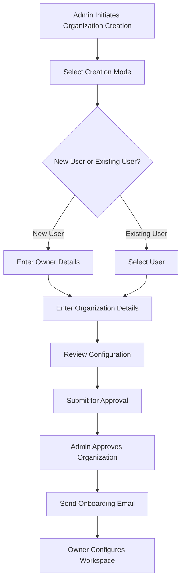
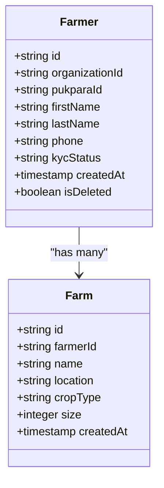
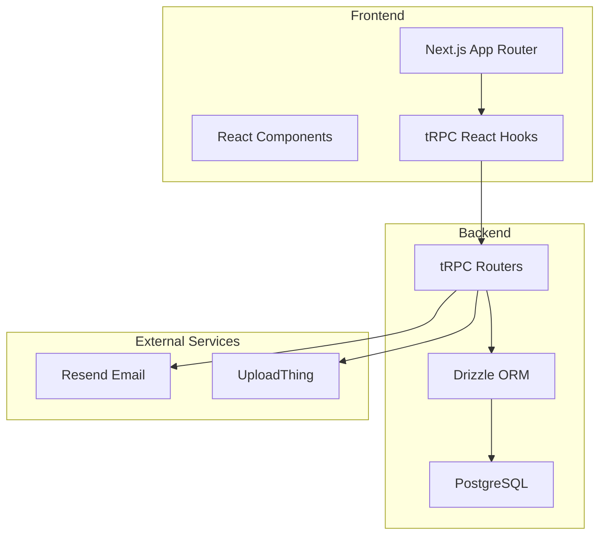
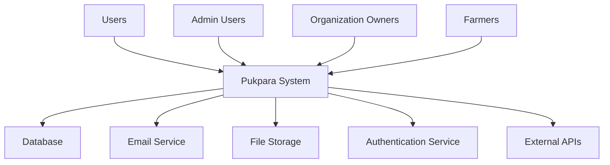

# System Overview

<cite>
**Referenced Files in This Document**   
- [organizations.ts](file://src/server/api/routers/organizations.ts)
- [schema.ts](file://src/server/db/schema.ts)
- [layout.tsx](file://src/app/(app)/layout.tsx)
- [layout.tsx](file://src/app/(admin)/admin/layout.tsx)
- [auth.ts](file://src/lib/auth.ts)
- [schema.ts](file://src/features/auth/schema.ts)
- [page.tsx](file://src/app/pending-approval/page.tsx)
- [review-step.tsx](file://src/features/admin/organizations/components/organization-create/review-step.tsx)
- [organization-table/data-table.tsx](file://src/features/admin/organizations/components/organization-table/data-table.tsx)
- [organization-directory-card.tsx](file://src/features/admin/organizations/components/organization-directory/organization-directory-card.tsx)
- [organization-approved-email.tsx](file://src/email/templates/organization-approved-email.tsx)
- [use-organization-list-controller.ts](file://src/features/admin/organizations/hooks/use-organization-list-controller.ts)
- [organization-create-page.tsx](file://src/features/admin/organizations/pages/organization-create-page.tsx)
- [create/page.tsx](file://src/app/(app)/farmers/create/page.tsx)
- [page.tsx](file://src/app/(app)/farmers/[farmerId]/page.tsx)
- [page.tsx](file://src/app/(admin)/admin/farmers/[farmerId]/page.tsx)
- [create/page.tsx](file://src/app/(app)/farmers/[farmerId]/farms/create/page.tsx)
- [page.tsx](file://src/app/(app)/farmers/[farmerId]/farms/page.tsx)
- [page.tsx](file://src/app/(app)/farmers/[farmerId]/farms/[farmId]/page.tsx)
</cite>

## Table of Contents
1. [Introduction](#introduction)
2. [Core Functionality](#core-functionality)
3. [User Roles and Access Control](#user-roles-and-access-control)
4. [Organization Lifecycle and Approval Workflow](#organization-lifecycle-and-approval-workflow)
5. [Farmer and Farm Management](#farmer-and-farm-management)
6. [Frontend-Backend Architecture](#frontend-backend-architecture)
7. [System Context Diagram](#system-context-diagram)
8. [Data Flow Overview](#data-flow-overview)

## Introduction

Pukpara is a unified digital operations workspace designed for agricultural cooperatives, Village Savings and Loan Associations (VSLAs), and farming organizations. Built with multi-tenancy at its core, Pukpara enables centralized administration while supporting isolated, branded environments for each tenant organization. The system streamlines critical agricultural operations including farmer and farm management, inventory control, marketplace transactions, and financial operations. Its architecture combines modern frontend technologies with a robust backend to deliver a scalable, secure, and user-friendly platform for stakeholders across the agricultural value chain.

**Section sources**
- [layout.tsx](file://src/app/(app)/layout.tsx)
- [layout.tsx](file://src/app/(admin)/admin/layout.tsx)

## Core Functionality

Pukpara provides a comprehensive suite of tools tailored to the operational needs of agricultural organizations:

- **Farmer & Farm Management**: Register and manage farmer profiles with personal details, contact information, and compliance status. Each farmer can be linked to multiple farms, with support for geo-data, crop types, and production history.
- **Inventory Control**: Track commodities, seed varieties, and warehouse stock levels across organizational units.
- **Marketplace Transactions**: Facilitate listings and purchase orders for agricultural goods, enabling transparent and efficient trading.
- **Financial Operations**: Support payment processing, billing, and financial tracking for cooperative transactions.

These features are accessible through role-specific dashboards, ensuring users only interact with relevant functionality.

**Section sources**
- [create/page.tsx](file://src/app/(app)/farmers/create/page.tsx)
- [page.tsx](file://src/app/(app)/farmers/[farmerId]/page.tsx)
- [create/page.tsx](file://src/app/(app)/farmers/[farmerId]/farms/create/page.tsx)
- [page.tsx](file://src/app/(app)/farmers/[farmerId]/farms/page.tsx)
- [page.tsx](file://src/app/(app)/farmers/[farmerId]/farms/[farmId]/page.tsx)

## User Roles and Access Control

Pukpara implements a granular role-based access control (RBAC) system with three primary user roles:

- **Admin**: Platform-level administrators with access to all tenant organizations. Admins can create, approve, suspend, or delete organizations and manage system-wide settings.
- **Organization Owner**: Tenant-level leaders with full administrative rights within their organization. Owners can manage members, configure settings, and oversee operations.
- **Farmer**: End-users who represent individual agricultural producers. Farmers can view their profiles, manage farms, and participate in marketplace activities.

Authentication and authorization are managed through a centralized system that enforces tenant isolation and role-specific permissions.

**Section sources**
- [auth.ts](file://src/lib/auth.ts)
- [schema.ts](file://src/features/auth/schema.ts)
- [org-permissions.ts](file://src/lib/org-permissions.ts)
- [admin-permissions.ts](file://src/lib/admin-permissions.ts)

## Organization Lifecycle and Approval Workflow

New organizations enter the system through a structured onboarding process that includes approval by platform administrators. The workflow consists of the following stages:

1. **Creation**: Admins initiate organization setup via a multi-step form, choosing between linking to an existing user or creating a new owner account.
2. **Review**: Configuration details including owner information and organization settings are presented for final verification.
3. **Approval**: Admins approve pending organizations through a confirmation interface, triggering activation and notification.
4. **Onboarding**: Upon approval, the organization owner receives an email with an onboarding link to configure their workspace.

The system supports bulk actions for efficient management of multiple organizations and maintains audit trails for all administrative operations.

**Diagram sources**
- [organization-create-page.tsx](file://src/features/admin/organizations/pages/organization-create-page.tsx)
- [review-step.tsx](file://src/features/admin/organizations/components/organization-create/review-step.tsx)
- [data-table.tsx](file://src/features/admin/organizations/components/organization-table/data-table.tsx)
- [organization-directory-card.tsx](file://src/features/admin/organizations/components/organization-directory/organization-directory-card.tsx)
- [organizations.ts](file://src/server/api/routers/organizations.ts)
- [organization-approved-email.tsx](file://src/email/templates/organization-approved-email.tsx)

**Section sources**
- [organization-create-page.tsx](file://src/features/admin/organizations/pages/organization-create-page.tsx)
- [review-step.tsx](file://src/features/admin/organizations/components/organization-create/review-step.tsx)
- [data-table.tsx](file://src/features/admin/organizations/components/organization-table/data-table.tsx)
- [organization-directory-card.tsx](file://src/features/admin/organizations/components/organization-directory/organization-directory-card.tsx)
- [organizations.ts](file://src/server/api/routers/organizations.ts)
- [page.tsx](file://src/app/pending-approval/page.tsx)

## Farmer and Farm Management

The farmer management module enables organizations to maintain comprehensive profiles of their members. Key data points include personal information, household size, identification documents, and KYC status. Farmers are linked to one or more farms, each with detailed agronomic data such as boundaries, crops, and production history.

Field officers use guided workflows to register farmers and farms, ensuring consistent data collection. The system supports document uploads and verification processes to maintain data integrity and compliance.

**Diagram sources**
- [schema.ts](file://src/server/db/schema.ts)
- [create/page.tsx](file://src/app/(app)/farmers/create/page.tsx)
- [page.tsx](file://src/app/(app)/farmers/[farmerId]/page.tsx)
- [create/page.tsx](file://src/app/(app)/farmers/[farmerId]/farms/create/page.tsx)

**Section sources**
- [schema.ts](file://src/server/db/schema.ts)
- [create/page.tsx](file://src/app/(app)/farmers/create/page.tsx)
- [page.tsx](file://src/app/(app)/farmers/[farmerId]/page.tsx)
- [page.tsx](file://src/app/(admin)/admin/farmers/[farmerId]/page.tsx)

## Frontend-Backend Architecture

Pukpara employs a modern full-stack architecture with clear separation between frontend and backend components:

- **Frontend**: Built with Next.js App Router, the frontend delivers a dynamic, responsive user interface. It uses React Server Components and client-side rendering where appropriate. The UI components are organized into reusable modules with consistent design patterns.
- **Backend**: The backend is structured around tRPC for type-safe API routing and Drizzle ORM for database interactions. This combination ensures end-to-end TypeScript type safety from database to UI.
- **API Layer**: RESTful endpoints handle authentication and file uploads, while tRPC routers manage application-specific operations with strong typing and validation.
- **Database**: PostgreSQL is used as the primary data store, with schema definitions managed through Drizzle ORM for type safety and migration support.

The architecture supports server-side rendering for improved performance and SEO, while leveraging client-side interactivity for complex user workflows.

**Diagram sources**
- [layout.tsx](file://src/app/(app)/layout.tsx)
- [trpc.ts](file://src/trpc/server.ts)
- [root.ts](file://src/server/api/routers/root.ts)
- [schema.ts](file://src/server/db/schema.ts)
- [uploadthing.ts](file://src/lib/uploadthing.ts)
- [resend.ts](file://src/server/email/resend.ts)

**Section sources**
- [layout.tsx](file://src/app/(app)/layout.tsx)
- [server.ts](file://src/trpc/server.ts)
- [root.ts](file://src/server/api/routers/root.ts)
- [schema.ts](file://src/server/db/schema.ts)

## System Context Diagram

The following diagram illustrates Pukpara's system context, showing its interactions with external entities and internal components:

**Diagram sources**
- [auth.ts](file://src/lib/auth.ts)
- [resend.ts](file://src/server/email/resend.ts)
- [uploadthing.ts](file://src/lib/uploadthing.ts)
- [schema.ts](file://src/server/db/schema.ts)

## Data Flow Overview

Pukpara's data flow follows a predictable pattern from user interaction to persistence:

1. User actions in the frontend trigger tRPC queries or mutations.
2. The tRPC server routes requests to appropriate handlers.
3. Handlers use Drizzle ORM to interact with the PostgreSQL database.
4. Business logic is applied, including permission checks and data validation.
5. Results are returned to the frontend and cached as needed.
6. Side effects (email notifications, file processing) are triggered asynchronously.

This flow ensures data consistency, security, and responsiveness across the application.

**Section sources**
- [organizations.ts](file://src/server/api/routers/organizations.ts)
- [trpc.ts](file://src/trpc/server.ts)
- [schema.ts](file://src/server/db/schema.ts)
- [auth.ts](file://src/lib/auth.ts)