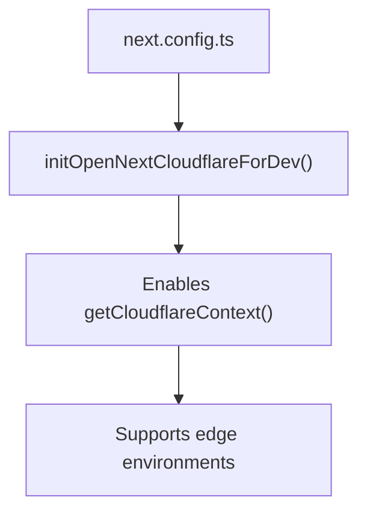
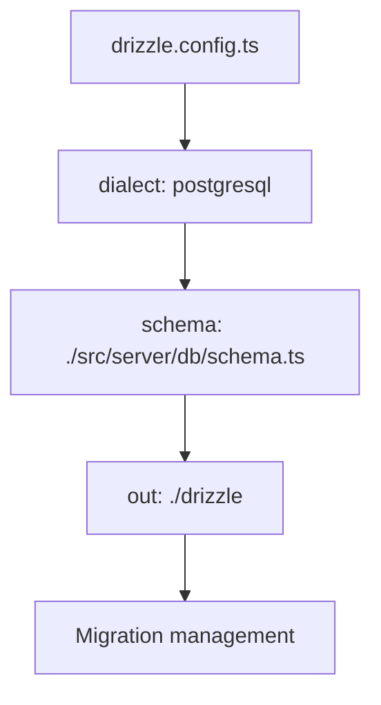
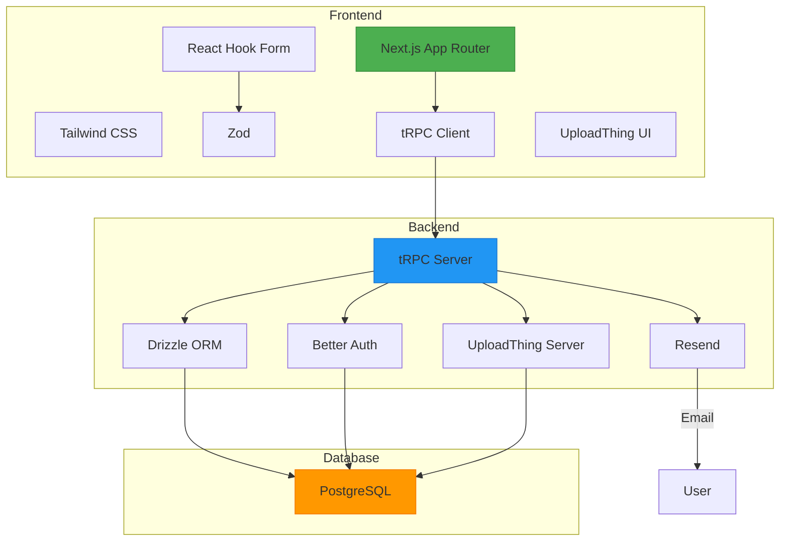

# Technology Stack

<cite>
**Referenced Files in This Document**   
- [next.config.ts](file://next.config.ts)
- [tsconfig.json](file://tsconfig.json)
- [drizzle.config.ts](file://drizzle.config.ts)
- [src/server/db/schema.ts](file://src/server/db/schema.ts)
- [src/server/db/index.ts](file://src/server/db/index.ts)
- [src/lib/auth.ts](file://src/lib/auth.ts)
- [src/lib/auth-client.ts](file://src/lib/auth-client.ts)
- [src/app/api/auth/[...all]/route.ts](file://src/app/api/auth/[...all]/route.ts)
- [src/app/api/trpc/[trpc]/route.ts](file://src/app/api/trpc/[trpc]/route.ts)
- [src/server/api/trpc.ts](file://src/server/api/trpc.ts)
- [src/app/api/uploadthing/core.ts](file://src/app/api/uploadthing/core.ts)
- [src/app/api/uploadthing/route.ts](file://src/app/api/uploadthing/route.ts)
- [src/lib/uploadthing.ts](file://src/lib/uploadthing.ts)
- [src/server/email/resend.ts](file://src/server/email/resend.ts)
- [src/features/auth/schema.ts](file://src/features/auth/schema.ts)
</cite>

## Table of Contents
1. [Core Frameworks](#core-frameworks)
2. [Supporting Libraries](#supporting-libraries)
3. [Configuration and Version Compatibility](#configuration-and-version-compatibility)
4. [Technology Integration and Workflow](#technology-integration-and-workflow)
5. [Architecture Diagram](#architecture-diagram)

## Core Frameworks

### Next.js (App Router)
Next.js serves as the foundational framework for the pukpara application, utilizing the App Router for modern routing and rendering. The App Router enables server-side rendering, nested layouts, and route handlers, providing a robust structure for both public and authenticated routes. The application leverages React Server Components and client-side interactivity through the "use client" directive where necessary.

The routing structure is organized into layout groups using parentheses (e.g., `(admin)`, `(app)`, `(auth)`), allowing for isolated routing and layout management across different user roles and authentication states. API routes are implemented under `src/app/api` for authentication, tRPC, and file uploads, ensuring clean separation of concerns.

**Section sources**
- [src/app/layout.tsx](file://src/app/layout.tsx)
- [src/app/api/auth/[...all]/route.ts](file://src/app/api/auth/[...all]/route.ts)
- [src/app/api/trpc/[trpc]/route.ts](file://src/app/api/trpc/[trpc]/route.ts)
- [src/app/api/uploadthing/route.ts](file://src/app/api/uploadthing/route.ts)

### tRPC for End-to-End Type-Safe APIs
tRPC is used to create end-to-end type-safe APIs, enabling seamless communication between the frontend and backend with full TypeScript inference. The tRPC router is initialized in `src/server/api/trpc.ts`, where the context is constructed with database access and authentication session data. Procedures are defined using `publicProcedure` and `protectedProcedure`, with middleware for timing and authentication enforcement.

The tRPC integration ensures that API endpoints are type-safe, eliminating the need for manual API documentation and reducing runtime errors. The use of `superjson` as a transformer allows for serialization of complex data types such as dates and BigInts across the network.

**Section sources**
- [src/server/api/trpc.ts](file://src/server/api/trpc.ts)
- [src/server/api/root.ts](file://src/server/api/root.ts)
- [src/trpc/server.ts](file://src/trpc/server.ts)
- [src/trpc/react.tsx](file://src/trpc/react.tsx)

### Drizzle ORM for PostgreSQL Database Interactions
Drizzle ORM provides a type-safe and intuitive interface for interacting with the PostgreSQL database. The schema is defined in `src/server/db/schema.ts`, where tables such as `user`, `organization`, `farmer`, and `farm` are declared with proper relationships and constraints. Drizzle's SQL-first approach ensures that database operations are predictable and maintainable.

The database connection is established using Neon's serverless driver, with Drizzle's neon-http adapter enabling compatibility with edge environments. This setup supports efficient querying and transaction handling while maintaining full TypeScript type inference from the schema.

**Section sources**
- [src/server/db/schema.ts](file://src/server/db/schema.ts)
- [src/server/db/index.ts](file://src/server/db/index.ts)
- [drizzle.config.ts](file://drizzle.config.ts)

### Better Auth for Authentication with Multi-Tenancy
Better Auth is the authentication solution powering user management, session handling, and multi-tenancy. It is configured in `src/lib/auth.ts` with support for email/password login, phone number verification, organization membership, and admin capabilities. The authentication system enforces admin approval for new signups and extends the user model with custom fields such as `districtId`, `address`, `kycStatus`, and `status`.

Multi-tenancy is implemented through organization-based data isolation, where each user belongs to one or more organizations, and data access is scoped accordingly. The `organizationClient` and `adminClient` plugins enable role-based access control and administrative operations.

**Section sources**
- [src/lib/auth.ts](file://src/lib/auth.ts)
- [src/lib/auth-client.ts](file://src/lib/auth-client.ts)
- [src/app/api/auth/[...all]/route.ts](file://src/app/api/auth/[...all]/route.ts)

### UploadThing for File Uploads
UploadThing handles file uploads with a secure and scalable architecture. The file router is defined in `src/app/api/uploadthing/core.ts`, where an `imageUploader` route is configured with a maximum file size of 4MB and a single file limit. Middleware ensures that only authenticated users can upload files, and metadata is attached to each upload for tracking.

The frontend components `UploadButton` and `UploadDropzone` are generated from the file router, providing a seamless user experience for image uploads across the application.

**Section sources**
- [src/app/api/uploadthing/core.ts](file://src/app/api/uploadthing/core.ts)
- [src/app/api/uploadthing/route.ts](file://src/app/api/uploadthing/route.ts)
- [src/lib/uploadthing.ts](file://src/lib/uploadthing.ts)

### Resend for Email Delivery
Resend is integrated for transactional email delivery, including password reset emails. The `sendPasswordResetEmail` function in `src/server/email/resend.ts` is invoked during the password recovery flow, sending a branded email with a secure reset link. This ensures reliable and trackable email communication with users.

**Section sources**
- [src/server/email/resend.ts](file://src/server/email/resend.ts)
- [src/lib/auth.ts](file://src/lib/auth.ts#L49-L52)

## Supporting Libraries

### Tailwind CSS for Styling
Tailwind CSS is used for utility-first styling, enabling rapid UI development with responsive design principles. The configuration is managed via `tailwind.config.ts` and `postcss.config.mjs`, integrating with Next.js for JIT compilation and optimized output.

### React Hook Form for Form Management
React Hook Form is employed for efficient form state management, validation, and submission handling. It is used in authentication forms such as sign-in, sign-up, and password reset, providing a smooth user experience with minimal re-renders.

### Zod for Schema Validation
Zod is used for runtime type checking and form validation. Validation schemas are defined in `src/features/auth/schema.ts` for sign-up, sign-in, and password reset flows. These schemas ensure data integrity and provide clear error messages to users.

**Section sources**
- [src/features/auth/schema.ts](file://src/features/auth/schema.ts)
- [src/features/auth/components/sign-in-form.tsx](file://src/features/auth/components/sign-in-form.tsx)
- [src/features/auth/components/sign-up/step-one-form.tsx](file://src/features/auth/components/sign-up/step-one-form.tsx)

## Configuration and Version Compatibility

### next.config.ts
The Next.js configuration is minimal, focusing on compatibility with Cloudflare Workers via the `@opennextjs/cloudflare` integration. This enables edge deployment and optimized performance.

**Section sources**
- [next.config.ts](file://next.config.ts)

### tsconfig.json
The TypeScript configuration ensures strict type checking, module resolution, and compatibility with modern JavaScript features. It supports paths mapping (e.g., `@/lib/auth`) for cleaner imports.

### drizzle.config.ts
Drizzle Kit is configured for PostgreSQL with the schema located at `./src/server/db/schema.ts`. Migrations are generated to the `./drizzle` directory, enabling version-controlled database schema evolution.

**Section sources**
- [drizzle.config.ts](file://drizzle.config.ts)
- [tsconfig.json](file://tsconfig.json)

## Technology Integration and Workflow

The technologies work together to provide a cohesive development experience:

1. **Authentication Flow**: Better Auth handles user sign-up and login, storing sessions in the database. Upon successful login, the user is redirected based on approval status.
2. **API Communication**: tRPC procedures are called from React components using type-safe hooks, with authentication context automatically injected.
3. **Data Persistence**: Drizzle ORM queries are executed within tRPC resolvers, ensuring data consistency and type safety.
4. **File Uploads**: UploadThing generates signed URLs and handles file storage, with metadata stored in the database via tRPC.
5. **Email Notifications**: Resend sends transactional emails triggered by authentication events.

This integration ensures type safety across the entire stack, reduces boilerplate, and enhances developer productivity.

## Architecture Diagram

**Diagram sources**
- [src/app/api/trpc/[trpc]/route.ts](file://src/app/api/trpc/[trpc]/route.ts)
- [src/server/api/trpc.ts](file://src/server/api/trpc.ts)
- [src/server/db/index.ts](file://src/server/db/index.ts)
- [src/lib/auth.ts](file://src/lib/auth.ts)
- [src/app/api/uploadthing/route.ts](file://src/app/api/uploadthing/route.ts)
- [src/server/email/resend.ts](file://src/server/email/resend.ts)